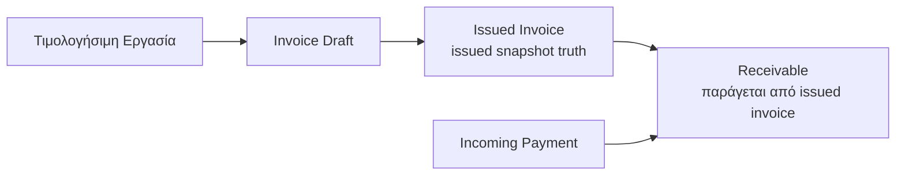
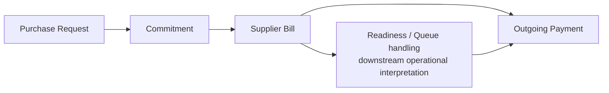
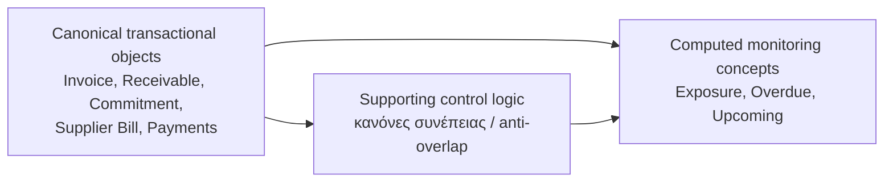

# Finance Domain Model & System Alignment v1

## 1. Σκοπός του εγγράφου
   
Σκοπός του παρόντος εγγράφου είναι να ορίσει κοινή επιχειρησιακή σημασία, ώστε όλα τα υποσυστήματα να βασίζονται στις ίδιες έννοιες και στους ίδιους κανόνες.
Ο ρόλος του είναι η ευθυγράμμιση του domain model: αντικείμενα, σχέσεις, κύκλος ζωής, καταστάσεις, ownership (πεδίο ευθύνης), όρια υποσυστημάτων και εξαρτήσεις monitoring.

---

## 2. Θέση του document στην ιεραρχία finance documentation

Η κανονιστική ιεραρχία είναι:

- **00 — Finance Canonical Brief**
- **00A — Finance Domain Model & System Alignment**
- **01 — Finance Module Map**
- **02+ — Module documents**

Το `00A — Finance Domain Model & System Alignment` είναι το **δεύτερο σημαντικότερο** έγγραφο μετά το Canonical Brief.  
Λειτουργεί ως σημασιολογική γέφυρα: μετατρέπει τις αρχές του `00` σε σαφές domain alignment που δεσμεύει το `01` και όλα τα module documents.

---

## 3. Canonical system view

Το Finance System v1 οργανώνεται σε τέσσερις βασικές ζώνες:

- **Revenue loop (κύκλος εσόδων)**: `Invoice -> Receivable -> Incoming Payment`
- **Spend loop (κύκλος δαπανών)**: `Purchase Request -> Commitment -> Supplier Bill -> Outgoing Payment`
- **Monitoring shell (κέλυφος παρακολούθησης)**: `Exposure`, `Overdue`, `Upcoming` ως υπολογιζόμενες (computed) έννοιες
- **Supporting control logic (υποστηρικτική λογική ελέγχου)**: κανόνες που διασφαλίζουν συνέπεια μεταξύ loops και monitoring

Η ανάγνωση του συστήματος είναι object-first και meaning-first: πρώτα τι σημαίνει κάθε αντικείμενο και μετά πώς προβάλλεται.  
Τα modules οφείλουν να ακολουθούν αυτή τη λογική.

### 3.1 Ενοποιημένο διάγραμμα Revenue loop (σημασιολογικό επίπεδο)

Το παρακάτω διάγραμμα ανήκει στο παρόν layer επειδή δείχνει canonical business objects και σημασιολογικές μεταβάσεις, όχι οθόνες ή UI routes.

Το διάγραμμα δείχνει την canonical revenue αλυσίδα σε object-first ανάγνωση.  
Δεν δείχνει UI flow και δεν αλλάζει ownership: το `Invoice` κατέχει document truth, το `Receivable` κατέχει claim progression.

Τι δείχνει:
- την canonical object progression
- το βασικό semantic boundary του loop

Τι δεν δείχνει:
- UI navigation
- module routing detail
- implementation/storage logic

### 3.2 Ενοποιημένο διάγραμμα Spend loop (σημασιολογικό επίπεδο)

Το παρακάτω διάγραμμα δείχνει canonical spend objects και τον κανόνα relief χωρίς να μετατρέπει το queue σε source object.

Το διάγραμμα απαντά στην ερώτηση "ποια είναι η canonical spend object αλυσίδα".  
Η readiness/queue λογική δηλώνεται ρητά ως downstream operational interpretation και όχι ως αντικατάσταση object ownership.

Τι δείχνει:
- την canonical object progression
- το βασικό semantic boundary του loop

Τι δεν δείχνει:
- UI navigation
- module routing detail
- implementation/storage logic

### 3.3 Ενοποιημένο διάγραμμα Monitoring / Control relation (σημασιολογική σχέση)

Το παρακάτω διάγραμμα αποτυπώνει τη σημασιολογική σχέση: canonical transactional objects τροφοδοτούν computed monitoring concepts και supporting control logic.

Τι δείχνει:
- πηγή αλήθειας στα transactional objects
- monitoring ως computed projection
- control logic ως supporting layer συνέπειας

Τι δεν δείχνει:
- module architecture
- UI navigation
- screen-level routing

---

## 4. Core business objects

| Object | Κανονιστικός ορισμός |
|---|---|
| **Invoice (Τιμολόγιο)** | Επιχειρησιακό έγγραφο χρέωσης στο revenue side. Με το `Issue` δημιουργεί κανονιστική οικονομική αλήθεια τιμών (`issued totals snapshot`). |
| **Receivable (Απαίτηση είσπραξης)** | Απαίτηση που προκύπτει από τα issued totals του Invoice και μειώνεται/εξοφλείται από Incoming Payments. |
| **Incoming Payment (Εισερχόμενη πληρωμή)** | Καταγεγραμμένο cash-in (εισροή χρημάτων) που καλύπτει Receivables. |
| **Purchase Request (Αίτημα αγοράς/δαπάνης)** | Εσωτερικό αίτημα πριν από τη δέσμευση ποσού. |
| **Commitment (Δέσμευση)** | Δέσμευση δαπάνης που εκφράζει αναμενόμενο outflow πριν ή κατά τη μετάβαση σε actual obligation/payment. |
| **Supplier Bill (Παραστατικό προμηθευτή)** | Πραγματική υποχρέωση προς προμηθευτή στο spend side. |
| **Outgoing Payment (Εξερχόμενη πληρωμή)** | Καταγεγραμμένο cash-out (εκροή χρημάτων) που καλύπτει υποχρεώσεις. |
| **Exposure (Έκθεση)** | Υπολογιζόμενη έννοια monitoring για τη συνολική οικονομική έκθεση. |
| **Overdue (Καθυστερημένα)** | Υπολογιζόμενη έννοια monitoring για ληξιπρόθεσμα ποσά. |
| **Upcoming (Επερχόμενα)** | Υπολογιζόμενη έννοια monitoring για επερχόμενες απαιτήσεις/υποχρεώσεις. |

---

## 5. Relationships μεταξύ business objects

Οι βασικές σχέσεις είναι:

- `Invoice -> Receivable`
- `Receivable <- Incoming Payment`
- `Purchase Request -> Commitment`
- `Supplier Bill may link to an existing Commitment`
- `Commitment may be relieved by linked Supplier Bill or Outgoing Payment`
- `Supplier Bill <- Outgoing Payment`

Επιπλέον:

- Τα `Exposure`, `Overdue`, `Upcoming` **δεν** είναι transactional source objects.
- Οι monitoring έννοιες προκύπτουν υπολογιστικά από τα canonical objects.
- Οι σχέσεις ορίζουν επιχειρησιακό νόημα, όχι τεχνική υλοποίηση.

---

## 6. Lifecycle ανά object

Ο κύκλος ζωής (lifecycle) περιγράφει επιχειρησιακή πρόοδο, όχι UI ροή.

- **Invoice**: Draft/Preview context -> Issue -> issued totals ως οικονομική αλήθεια
- **Receivable**: Δημιουργία από issued Invoice -> μερική/πλήρης κάλυψη από Incoming Payments
- **Incoming Payment**: Καταγραφή -> αντιστοίχιση σε Receivable
- **Purchase Request**: Αίτημα -> αποδοχή για δέσμευση
- **Commitment**: Δημιουργία δέσμευσης -> relief όταν υπάρξει linked actual object
- **Supplier Bill**: Καταγραφή υποχρέωσης -> κάλυψη με Outgoing Payment
- **Outgoing Payment**: Καταγραφή -> σύνδεση με Supplier Bill/Commitment context

Για monitoring:

- Τα **Exposure / Overdue / Upcoming** δεν έχουν ανεξάρτητο business lifecycle ως source objects.
- Ενημερώνονται υπολογιστικά όταν αλλάζουν τα canonical transactional objects.

Σημείωση:  
Τα παραδείγματα lifecycle του section αυτού ορίζουν επιχειρησιακή πρόοδο, όχι τελικό UI vocabulary για όλες τις οθόνες. Το vocabulary των module statuses πρέπει να μένει συμβατό με τον διαχωρισμό: `persisted domain status` / `operational signal` / `readiness state` / `UI-only temporary state`.

---

## 7. Status model ανά object

Το status model διαχωρίζεται ρητά σε τέσσερις κατηγορίες:

| Κατηγορία | Ρόλος |
|---|---|
| **Persisted domain status (μόνιμη κατάσταση πεδίου)** | Κατάσταση που ανήκει στο ίδιο το object και αποτελεί business truth. |
| **Operational signal (λειτουργικό σήμα)** | Ένδειξη λειτουργικής κατάστασης (π.χ. blocked, scheduled), όχι business state. |
| **Readiness state (κατάσταση ετοιμότητας)** | Ένδειξη ετοιμότητας για επόμενο βήμα, όχι αυτόνομο οικονομικό γεγονός. |
| **UI-only temporary state (προσωρινή UI κατάσταση)** | Προσωρινό UI context χωρίς κανονιστική οικονομική ισχύ. |

Κανόνας: status, signal, readiness και UI προσωρινότητα **δεν συγχέονται**.

---

## 8. Data ownership

Η ιδιοκτησία αλήθειας (data ownership) ορίζεται ως εξής:

- **Invoice / Receivable truth**  
  - Το `Invoice` κατέχει την αλήθεια των issued totals μετά το `Issue`.  
  - Το `Receivable` κατέχει την αλήθεια της απαίτησης που προκύπτει από αυτά τα totals.
- **Commitment truth**  
  - Το `Commitment` κατέχει την αλήθεια της δέσμευσης έως ότου εφαρμοστεί canonical relief.
- **Supplier Bill truth**  
  - Το `Supplier Bill` κατέχει την αλήθεια της πραγματικής υποχρέωσης προς προμηθευτή.
- **Payment truth**  
  - Τα `Incoming Payment` και `Outgoing Payment` κατέχουν την αλήθεια πραγματικής κίνησης χρημάτων.
- **Monitoring ownership**  
  - Τα `Exposure`, `Overdue`, `Upcoming` **δεν** κατέχουν primary business truth.  
  - Είναι υπολογιζόμενες όψεις πάνω στην κανονιστική transactional αλήθεια.

---

## 9. Module boundaries

Τα όρια modules ορίζονται με βάση ownership και δικαιώματα ανάγνωσης:

- Revenue-focused modules είναι owners του `Invoice` και του `Receivable` truth.
- Το `Incoming Payment` είναι owner truth του cash-in / settlement event.
- Revenue/Collections modules διαβάζουν το `Incoming Payment` ως settlement input για τον κύκλο ζωής του receivable.
- Spend-focused modules είναι owners των `Purchase Request`, `Commitment`, `Supplier Bill`, `Outgoing Payment`.
- Monitoring/Overview modules διαβάζουν canonical truths και παράγουν computed views (`Exposure`, `Overdue`, `Upcoming`) χωρίς να δημιουργούν source state.
- Κανένα module δεν εισάγει δικό του αντικρουόμενο ορισμό για object που δεν κατέχει.

---

## 10. Monitoring dependencies

Οι monitoring όψεις εξαρτώνται αυστηρά από canonical objects.

| Monitoring view | Εξαρτάται από | Σημείωση |
|---|---|---|
| **Exposure** | Receivable, Commitment, Supplier Bill, Payments context | Υπολογίζεται με κανόνες αποφυγής διπλομέτρησης. |
| **Overdue** | Χρονική κατάσταση απαιτήσεων/υποχρεώσεων | Είναι χρονική ένδειξη, όχι νέο transactional state. |
| **Upcoming** | Μελλοντική ωρίμανση απαιτήσεων/υποχρεώσεων | Είναι monitoring projection, όχι business object. |

Βασική αρχή: το monitoring layer δεν παράγει source-of-truth οικονομικά γεγονότα.

Canonical anti-overlap note:  
Monitoring views must not aggregate upstream and downstream financial objects as independent exposure if a canonical relief rule or allocation rule already links them. In particular, `Commitment`, `Supplier Bill`, and `Outgoing Payment` must not be shown as cumulative exposure layers when downstream linkage has already relieved upstream exposure.

---

## 11. Canonical semantic rules

### 11.1 Invoice Totals Alignment Rule (Critical)

**Canonical rule:**  
**Preview totals must become issued totals snapshot.**

**After Issue:**
- preview totals frozen
- issued totals canonical
- receivable derived from issued totals

**Preview cannot mutate issued totals.**

Ερμηνεία:  
Το preview δεν είναι απλό οπτικό βοήθημα. Στη στιγμή του `Issue`, παγώνει ως canonical issued totals snapshot. Από αυτό παράγεται το `Receivable`. Μεταγενέστερες αλλαγές σε preview ή draft context δεν επιτρέπεται να αλλάξουν issued totals ή receivable truth.

---

### 11.2 Issued Snapshot Non-Mutability Rule (v1 semantic minimum)

Μετά το `Issue`, η οικονομική αλήθεια του issued record δεν επιτρέπεται να εξαρτάται από μεταγενέστερες αλλαγές draft/preview context.  
Ακόμη και αν στο v1 δεν έχει οριστεί πλήρες τεχνικό immutable snapshot, το system meaning του issued record αντιμετωπίζεται ως non-mutable financial truth.

---

### 11.3 Commitment Relief Rule (v1 minimal) (Critical)

**Canonical rule:**  
**Commitment is relieved when:**
- **Linked supplier bill exists**  
or  
- **Linked outgoing payment exists**

Ερμηνεία:  
Ο κανόνας relief είναι κρίσιμος για τη σωστή παρακολούθηση exposure. Χωρίς αυτόν, το monitoring μπορεί να μετρά διπλά commitment και actual paid.

Παράδειγμα semantic bug:
- Committed = 1000
- Paid = 1000
- Χωρίς relief logic, το Overview μπορεί να δείξει exposure = 2000  
Αυτό είναι λάθος σημασιολογίας.

---

### 11.4 Monitoring Computation Rule

- Τα `Exposure`, `Overdue`, `Upcoming` είναι **computed monitoring concepts**.
- Δεν είναι transactional source-of-truth objects.
- Δεν δημιουργούν ανεξάρτητη επιχειρησιακή αλήθεια.

---

### 11.5 Monitoring Shell Non-Ownership Rule

- Το Monitoring shell δεν δημιουργεί source-of-truth transactional state.
- Το Monitoring υπολογίζει και προβάλλει με βάση canonical objects.

---

### 11.6 State-Type Separation Rule

- Lifecycle, domain status, operational signal, readiness state και UI temporary context παραμένουν διακριτά.
- Απαγορεύεται να συγχωνεύονται σε έναν γενικό όρο “status”.

---

### 11.7 Issue Semantic Boundary Rule

Στο v1, το `Issue` σημαίνει semantic transition (σημασιολογική μετάβαση) από preview/draft context σε canonical issued totals snapshot και δημιουργία linked receivable.  
Δεν σημαίνει από μόνο του compliance completion, fiscal transmission success, immutable legal document finalization ή accounting posting completion.

---

## 12. Known semantic risks / contradictions to prevent

Κύριοι κίνδυνοι που πρέπει να αποφεύγονται:

- Απόκλιση (drift) μεταξύ `Invoice preview totals` και `issued totals`
- Παραγωγή `Receivable` από λάθος totals
- Διπλομέτρηση commitment μαζί με actual Bill/Payment
- Σύγχυση μεταξύ `blocked`, `ready`, `scheduled`, `paid`
- Σύγχυση operational signal με business state
- Παραπλανητικό `Exposure` στο Overview λόγω μίξης transactional truth και monitoring projection

---

## 13. Alignment implications for downstream modules

Με βάση το παρόν έγγραφο:

- Το `01 — Finance Module Map` πρέπει να ακολουθεί αυτή τη σημασιολογία.
- Τα module documents δεν επιτρέπεται να εισάγουν αντικρουόμενες έννοιες για τα ίδια objects.
- Τα `Invoicing`, `Spend`, `Payments Queue`, `Overview` πρέπει να ευθυγραμμίζονται με:
  - `Invoice Totals Alignment Rule`
  - `Commitment Relief Rule (v1 minimal)`
  - `Monitoring non-ownership` και `State-Type Separation`

Έτσι διασφαλίζεται κοινή γλώσσα για Product, Engineering, QA και Architecture πριν από νέα features.

---

## 14. Open decisions που παραμένουν μετά το alignment

Ανοιχτά θέματα για επόμενες εκδόσεις (χωρίς να ακυρώνουν τους v1 κανόνες):

- Πιο προχωρημένη σημασιολογία commitment relief σε σύνθετα link scenarios
- Λεπτομέρειες partial allocation logic σε multi-document συσχετίσεις
- Μεγαλύτερο βάθος immutable snapshot semantics πέρα από totals
- Πιο αναλυτική decomposition των monitoring views χωρίς αλλοίωση canonical truth

Ρητή διευκρίνιση:  
Το **Invoice Totals Alignment Rule** και το **Commitment Relief Rule (v1 minimal)** είναι **κλειδωμένα** και **δεν** είναι open decisions.

---

## 15. Συμπέρασμα

Το `Finance Domain Model & System Alignment v1` αποτελεί τη βασική κανονιστική σημασιολογική βάση του Finance System, αμέσως μετά το Canonical Brief και πριν από το Module Map.  
Ορίζει καθαρά τα core objects, τις σχέσεις τους, τον κύκλο ζωής, την ιδιοκτησία αλήθειας, τις εξαρτήσεις monitoring και τους κρίσιμους semantic κανόνες που αποτρέπουν αντιφάσεις.

Με αυτό το alignment, το σύστημα αποκτά ενιαία επιχειρησιακή ερμηνεία και μειώνει semantic collisions μεταξύ modules.
