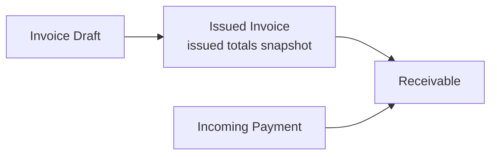
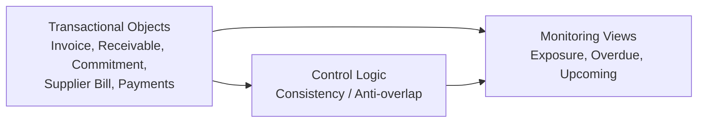

# Finance Domain Model & System Alignment v1

## 1. Σκοπός & Ιεραρχία

Το παρόν έγγραφο ορίζει την κοινή επιχειρησιακή σημασία των αντικειμένων του συστήματος. Αποτελεί τη γέφυρα μεταξύ των αρχών του Canonical Brief (00) και της υλοποίησης στα Modules (01, 02+).

**Κανόνας**: Οποιαδήποτε τεχνική υλοποίηση ή UI flow οφείλει να συμμορφώνεται με τους ορισμούς και τους κανόνες αυτού του μοντέλου.

---

## 2. Canonical System View

Το σύστημα διαρθρώνεται σε τέσσερις ζώνες, με λογική **Object-First**:

- **Revenue Loop**: Invoice \(\rightarrow\) Receivable \(\rightarrow\) Incoming Payment.
- **Spend Loop**: Purchase Request \(\rightarrow\) Commitment \(\rightarrow\) Supplier Bill \(\rightarrow\) Outgoing Payment.
- **Monitoring Shell**: Exposure, Overdue, Upcoming (Computed έννοιες).
- **Control Logic**: Κανόνες συνέπειας (π.χ. Anti-overlap) που εγγυώνται την ορθότητα της πληροφορίας.

---

## 3. Core Business Objects (Ορισμοί)

| Αντικείμενο | Επιχειρησιακή Σημασία | Truth Ownership |
|---|---|---|
| **Invoice** | Έγγραφο χρέωσης. Με το Issue παγώνει η οικονομική αλήθεια των συνόλων. | Document Truth |
| **Receivable** | Απαίτηση είσπραξης που παράγεται από το Issued Invoice. | Claim Progression |
| **Commitment** | Έγκριση δαπάνης που δεσμεύει προϋπολογισμό πριν το Bill. | Budgetary Truth |
| **Supplier Bill** | Πραγματική και εκκαθαρισμένη υποχρέωση προς προμηθευτή. | Liability Truth |
| **Payment (In/Out)** | Πραγματική ταμειακή κίνηση (Cash Flow event). | Cash Truth |
| **Monitoring Views** | Exposure, Overdue, Upcoming. Υπολογιζόμενες προβολές. | No Truth (Computed) |

---

## 4. Lifecycle & Status Model

Ο κύκλος ζωής περιγράφει την επιχειρησιακή πρόοδο, όχι το UI. Οι καταστάσεις διαχωρίζονται αυστηρά:

- **Domain Status**: Η μόνιμη επιχειρησιακή κατάσταση (π.χ. Issued, Paid).
- **Operational Signal**: Λειτουργικές ενδείξεις (π.χ. Blocked, Scheduled).
- **Readiness State**: Ετοιμότητα για το επόμενο βήμα (π.χ. Ready for Payment).

---

## 5. Θεμελιώδεις Κανονιστικοί Κανόνες (Rules)

### 5.1 Invoice Totals Alignment (Critical)

- Πριν το Issue: Τα Preview Totals είναι δυναμικά.
- Μετά το Issue: Τα Preview Totals μετατρέπονται σε Issued Totals Snapshot.

**Συνέπεια**: Το Receivable παράγεται αποκλειστικά από το Snapshot. Οποιαδήποτε μεταγενέστερη αλλαγή στο Draft context δεν επηρεάζει την εκδοθείσα αλήθεια.

### 5.2 Commitment Relief Rule (v1 Minimal)

Για την αποφυγή διπλομέτρησης στο Exposure:

- Ένα Commitment θεωρείται ότι έχει εκπληρωθεί (Relieved) όταν συνδεθεί με Supplier Bill ή Outgoing Payment.

Logic:

\[
Exposure = (Commitment - Relieved) + Unpaid\ Bills
\]

### 5.3 Monitoring Non-Ownership

- Το Monitoring Layer δεν δημιουργεί δεδομένα. Διαβάζει τα Transactional Objects και παράγει προβολές.
- Απαγορεύεται η χρήση των Exposure/Overdue ως πρωτογενή πεδία εισαγωγής δεδομένων.

### 5.4 State-Type Separation Rule (Critical)

Απαγορεύεται η σύγχυση μεταξύ:
- **Truth (Object truth):** τι ισχύει οικονομικά (π.χ. issued totals snapshot, cash movement).
- **Status (Domain status):** μόνιμη επιχειρησιακή πρόοδος (π.χ. Issued, Paid).
- **Readiness:** ετοιμότητα για επόμενο βήμα (π.χ. Ready for Payment / Blocked).
- **Signals (Monitoring):** computed ενδείξεις προτεραιότητας (π.χ. Exposure/Overdue/Upcoming).

Κανένα computed signal ή readiness δεν γίνεται “truth owner”.

### 5.5 Issue Semantic Boundary Rule (Critical)

Το `Issue` είναι το semantic όριο όπου το `Invoice` μεταβαίνει από preview/draft context σε **issued totals snapshot**.
- Το `Receivable` παράγεται **μόνο** από το issued snapshot.
- Μεταγενέστερες αλλαγές σε draft/preview ή UI flows δεν επιτρέπεται να αναδρομολογούν την issued truth.

---

## 6. Module Boundaries & Dependencies

- **Revenue Modules**: Ιδιοκτήτες των Invoice & Receivable.
- **Spend Modules**: Ιδιοκτήτες των Commitment & Supplier Bill.
- **Payments Module**: Ιδιοκτήτης της αλήθειας των Cash Movements.
- **Overview/Monitoring**: Διαβάζει από όλα τα παραπάνω, δεν τροποποιεί κανένα.

---

## 7. Διαχείριση Σημασιολογικών Κινδύνων

Προς αποφυγή "Semantic Collisions":

- **Anti-Overlap**: Διασφάλιση ότι μια δαπάνη δεν μετριέται ταυτόχρονα ως Commitment και ως Bill.
- **Issue Boundary**: Το Issue αποτελεί το όριο μεταξύ "πρόθεσης" και "οικονομικού γεγονότος".
- **State Separation**: Μηδενική ανοχή στη σύγχυση μεταξύ Status (τι είναι) και Signal (τι πρέπει να γίνει).

Known semantic risks / contradictions to prevent:
- **Monitoring-as-data risk**: Exposure/Overdue/Upcoming να αντιμετωπιστούν ως πεδία input αντί computed views.
- **Readiness-as-truth risk**: το Ready/Blocked να παρουσιαστεί ως “λογιστική αλήθεια” αντί ως gate για execution.
- **Draft retroactivity risk**: αλλαγές στο draft/preview να “ξαναγράφουν” issued totals.
- **Double-count exposure risk**: να μετρηθεί η ίδια δαπάνη ως Commitment και ως Unpaid Bill (χωρίς relief/linkage).

---

## 8. Συμπέρασμα

Το 00A καθιστά το Finance System ένα σύστημα προβλέψιμο. Με την εφαρμογή των κανόνων Totals Alignment και Commitment Relief, εξαλείφονται οι ασάφειες στην οικονομική εικόνα και τίθενται οι βάσεις για την τεχνική υλοποίηση (01 Module Map).

---

## Παράρτημα A — Canonical Diagrams 

### A1. Revenue Loop

### A2. Spend Loop

### A3. Monitoring / Control Relation

