# 01 — Finance Module Map

## 1. Document Purpose

Το παρόν έγγραφο αποτελεί τον κανονιστικό δομικό χάρτη του Finance Management & Monitoring System v1. Ορίζει την αρχιτεκτονική διάσπαση σε Modules, τους διακριτούς ρόλους τους και τις μεταξύ τους εξαρτήσεις.

Τι ορίζει: Ιδιοκτησία δεδομένων (Ownership), αρχιτεκτονική θέση, και ροή επιχειρησιακής πληροφορίας.
Τι ΔΕΝ ορίζει: UI/UX flows, API specs ή τεχνική υλοποίηση βάσεων δεδομένων.

---

## 2. Αρχιτεκτονική Δομή

Το σύστημα οργανώνεται σε 4 επίπεδα (layers):
- **Layer 1 — Monitoring Shell (Overview):** συνολική εποπτεία και δρομολόγηση.
- **Layer 2 — Revenue Chain:** διαχείριση εσόδων και απαιτήσεων.
- **Layer 3 — Spend Chain:** διαχείριση δαπανών και πληρωμών.
- **Layer 4 — Supporting Control Layer:** ερμηνεία, έλεγχος και διακυβέρνηση.

---

## 3. Top-Level Module Inventory

Το σύστημα απαρτίζεται από 7 βασικά modules. Κάθε module έχει συγκεκριμένο αρχιτεκτονικό τύπο και κύριο ρόλο.

| Module | Αρχιτεκτονικός Τύπος | Κύριος Ρόλος |
|---|---|---|
| `Overview` | Monitoring Shell | Συνοπτική εικόνα, σήματα προτεραιότητας (`Exposure`, `Overdue`) και routing. |
| `Invoicing` | Operational (Core) | Μετατροπή εργασίας σε issued invoice. Παραγωγή «αλήθειας» ποσών (snapshot). |
| `Receivables` | Operational (Follow-up) | Παρακολούθηση και είσπραξη απαιτήσεων μετά την τιμολόγηση. |
| `Purchase Requests / Commitments` | Operational (Upstream) | Αιτήματα δαπάνης και έγκριση δεσμεύσεων (commitments). |
| `Spend / Supplier Bills` | Operational (Readiness) | Διαχείριση υποχρεώσεων και σχηματισμός readiness σήματος πληρωμής. |
| `Payments Queue` | Execution Handoff | Εκτέλεση και δρομολόγηση πληρωμών (execution) βάσει readiness. |
| `Controls` | Supporting Layer | Παρακολούθηση Budget, Audit Trail, Employee Cost και επισήμανση αποκλίσεων. |

---

## 4. Λειτουργικές Αλυσίδες (Chains)

### 4.1 Revenue-side Chain (Κύκλος Εσόδων)

Η ροή ξεκινά από το `Invoicing` (έκδοση) και καταλήγει στο `Receivables` (είσπραξη).
- Το `Invoicing` κατέχει το **snapshot των ποσών** (issued invoice truth).
- Το `Receivables` κατέχει την **επιχειρησιακή κατάσταση** της απαίτησης (follow-up/collection).

### 4.2 Spend-side Chain (Κύκλος Δαπανών)

Η ροή ακολουθεί την αλληλουχία: Commitment \( \rightarrow \) Bill Readiness \( \rightarrow \) Execution.
- **Upstream:** `Purchase Requests / Commitments` (έγκριση/δέσμευση δαπάνης).
- **Midstream:** `Spend / Supplier Bills` (έλεγχος παραστατικού και «ξεκλείδωμα» πληρωμής).
- **Downstream:** `Payments Queue` (τελική εκτέλεση/δρομολόγηση).

---

## 5. Κανόνες Εξαρτήσεων (Dependency Rules)

Για τη διασφάλιση της ακεραιότητας ισχύουν οι εξής περιορισμοί:
- **Overview rule:** το `Overview` δεν παράγει πρωτογενή δεδομένα· αντλεί πληροφορία αποκλειστικά από operational modules και `Controls`.
- **Receivables rule:** το `Receivables` δεν νοείται ανεξάρτητα από issued invoice στο `Invoicing`.
- **Spend rule:** το `Payments Queue` δεν εκτελεί πληρωμή χωρίς readiness σήμα από `Spend / Supplier Bills`.
- **Controls rule:** το `Controls` δεν παρεμβαίνει στην εκτέλεση (execution)· παρακολουθεί και επισημαίνει αποκλίσεις.

---

## 6. System Relationship Map (Mermaid)

Το παρακάτω διάγραμμα είναι ο ενοποιημένος χάρτης σχέσεων του v1 (layers + βασικές εξαρτήσεις).  
Διαβάζεται ως αρχιτεκτονική modules/ownership, όχι ως UI navigation ή λεπτομερές workflow.

### Diagram A — Revenue-side chain

### Diagram B — Spend-side chain

### Diagram C — Monitoring / Control relation (module επίπεδο)

---

## 7. Module Inventory and Roles

### 7.1 Overview
- Συνοψίζει προτεραιότητες και δρομολογεί τον χρήστη. Δεν δημιουργεί transactional truth.

### 7.2 Invoicing
- Μετατρέπει `Billable Work` σε «εκδοθείσα αλήθεια» του παραστατικού.
- Τροφοδοτεί το `Receivables` με απαραίτητο context.

### 7.3 Receivables
- Οργανώνει την είσπραξη. Απαγορεύεται η χρήση του χωρίς upstream δεδομένα από το Invoicing.

### 7.4 Purchase Requests / Commitments
- Σημείο έναρξης και έγκρισης δαπάνης. Δημιουργεί την ορατότητα δεσμεύσεων (Commitment visibility).

### 7.5 Spend / Supplier Bills
- Διαχειρίζεται την υποχρέωση προς τον προμηθευτή. Παράγει το αποτέλεσμα Ready / Blocked για την πληρωμή.

### 7.6 Payments Queue
- Χώρος εκτέλεσης πληρωμών. Δεν σχηματίζει κριτήρια ετοιμότητας, απλώς τα εφαρμόζει.

### 7.7 Controls
- Παρέχει ορατότητα ελέγχου (Budget, Audit). Δεν κατέχει ownership της εκτέλεσης.

## 8. Dependency Matrix

| Module | Module Type | Upstream Dependencies | Downstream Effects | Should Not Be Mistaken For |
|---|---|---|---|---|
| `Overview` | Monitoring shell | Operational outputs + Controls outputs | Routing προς operational focus | Execution workspace |
| `Invoicing` | Operational workspace (Revenue core) | Billable Work context | Issued invoice context -> `Receivables` | Collections module ή accounting engine |
| `Receivables` | Operational follow-up workspace | `Invoicing` issued context | Follow-up outputs προς `Overview`/`Controls` | Issue/draft module ή payment registration engine |
| `Purchase Requests / Commitments` | Operational upstream workspace (Spend initiation/approval) | Spend initiation context | Approved/Committed context -> `Spend / Supplier Bills` | Payable execution module |
| `Spend / Supplier Bills` | Operational readiness workspace | `Purchase Requests / Commitments` | Ready/Blocked payable context -> `Payments Queue` | Final payment execution module |
| `Payments Queue` | Execution handoff workspace | `Spend / Supplier Bills` readiness | Payment outcomes προς `Controls`/`Overview` | Matching/readiness formation module |
| `Controls` | Supporting control layer | Inputs από όλα τα operational modules | Control visibility προς `Overview` | Operational core loop |

---

## 9. Boundary Notes

Το Finance System v1 είναι ένα δομημένο οικοσύστημα όπου η επιχειρησιακή κίνηση (Revenue/Spend) τροφοδοτεί συνεπαγωγικά τον έλεγχο (Controls) και την εποπτεία (Overview). Η σαφής διάκριση μεταξύ Creation (Invoicing / Commitments), Readiness (Spend / Supplier Bills) και Execution (Payments Queue) διατηρεί το σύστημα ελέγξιμο, ασφαλές και επεκτάσιμο.
