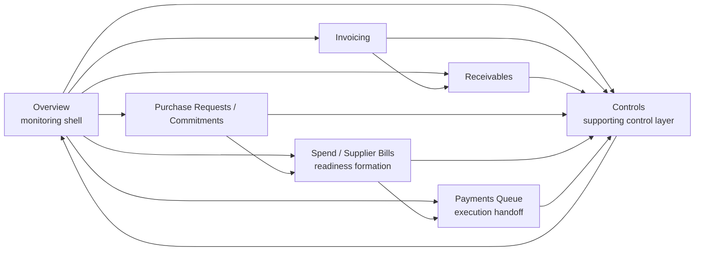
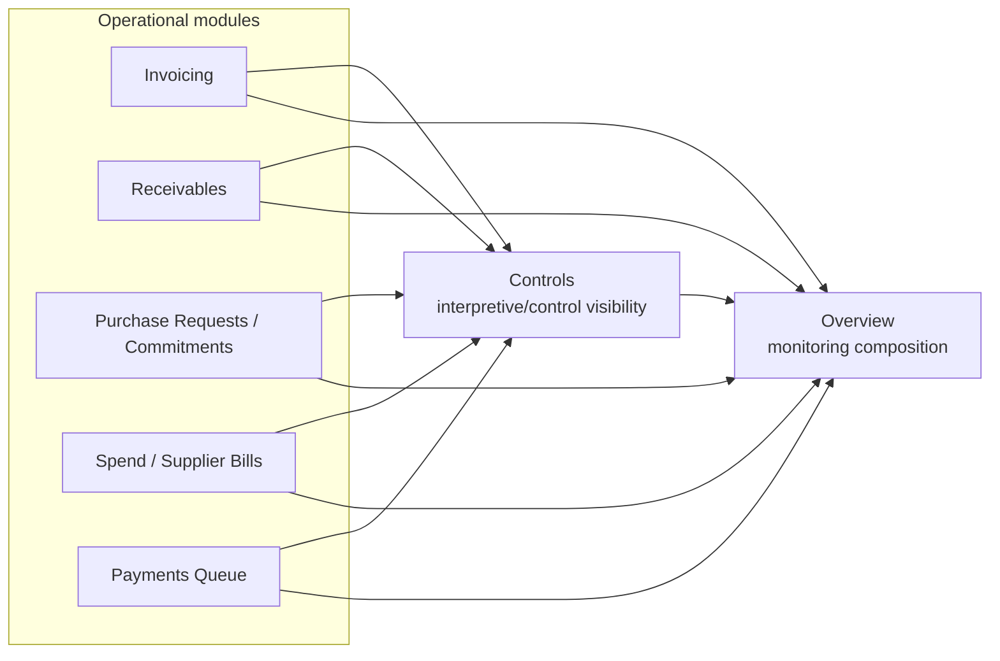
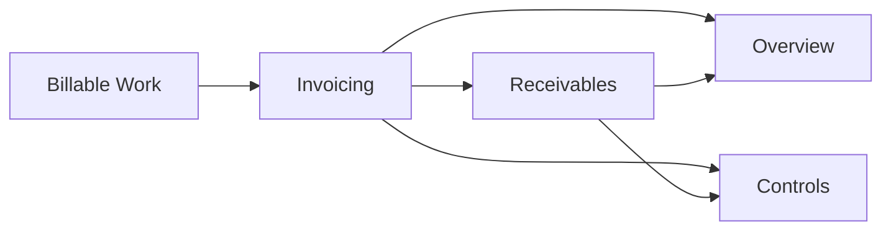
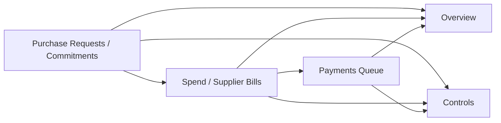
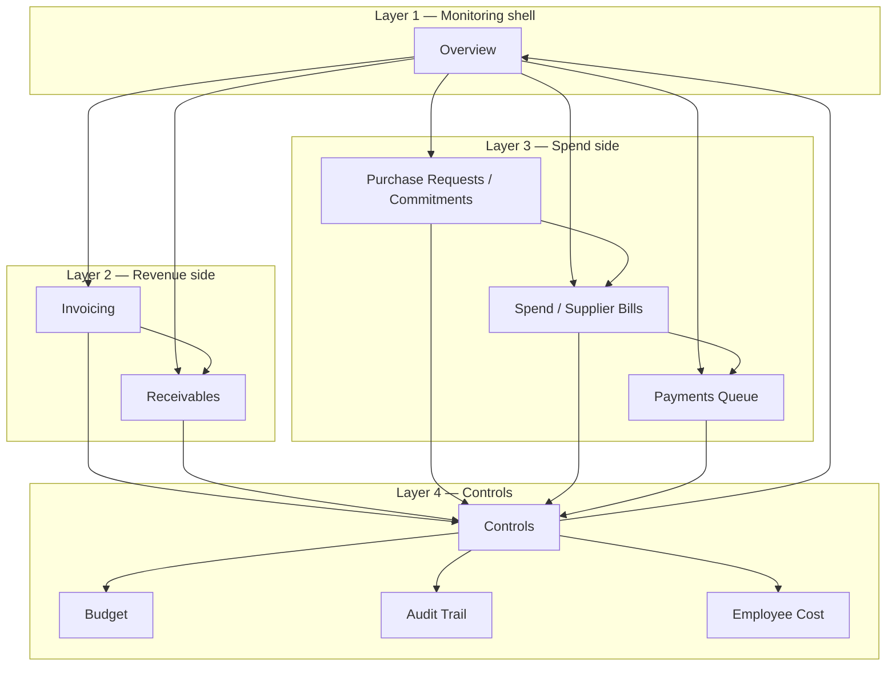

# 01 — Finance Module Map

## 1. Document Purpose

Το παρόν έγγραφο είναι ο canonical module-level δομικός χάρτης του Finance Management & Monitoring System v1.  
Αποτυπώνει τη συνολική αρχιτεκτονική διάσπαση του συστήματος σε top-level modules, τους ρόλους τους και τις βασικές σχέσεις τους.

Βασίζεται στο `00 — Finance Canonical Brief` και ευθυγραμμίζεται με το `00A — Finance Domain Model & System Alignment`.

Δεν είναι:
- implementation specification
- workflow βήμα-προς-βήμα specification
- UI Blueprint
- database/storage map
- API contract map

---

## 2. Architecture Position

Η αρχιτεκτονική του v1 οργανώνεται γύρω από:
- 1 monitoring shell
- 2 operational πλευρές (Revenue / Spend)
- 1 supporting control layer

Η παραπάνω οργάνωση αποτυπώνεται σε 7 top-level modules:
- `Overview`
- `Invoicing`
- `Receivables`
- `Purchase Requests / Commitments`
- `Spend / Supplier Bills`
- `Payments Queue`
- `Controls`

---

## 3. Structural Reading Rule

Το σύστημα διαβάζεται με τον εξής κανόνα:
- Το `Overview` συνοψίζει, επισημαίνει και δρομολογεί.
- Τα Revenue modules εκτελούν τον κύκλο Revenue.
- Τα Spend modules εκτελούν τον κύκλο Spend.
- Το `Controls` παρακολουθεί, ελέγχει και εξηγεί με supporting ρόλο.
- Κανένα supporting module δεν αντικαθιστά operational core loop.
- Κανένα downstream execution module δεν νοείται χωρίς upstream context.

---

## 4. Top-Level System Map

Το παρακάτω διάγραμμα είναι το ενοποιημένο top-level module map του v1.  
Διαβάζεται αποκλειστικά ως αρχιτεκτονική modules/ownership και όχι ως UI navigation ή screen workflow.

Το διάγραμμα δείχνει τη top-level δομή του συστήματος και τις κύριες αρχιτεκτονικές σχέσεις μεταξύ modules.  
Δεν αποτυπώνει λεπτομερές workflow, ούτε persistence model.

Τι δείχνει:
- `Overview` ως monitoring shell
- revenue chain: `Invoicing -> Receivables`
- spend chain: `Purchase Requests / Commitments -> Spend / Supplier Bills -> Payments Queue`
- `Controls` ως supporting control layer

Τι δεν δείχνει:
- route tree / screen transitions
- UI drilldowns
- implementation-level execution details

---

## 5. Module Inventory and Roles

### 5.1 Overview

#### Ρόλος
Το κεντρικό monitoring shell του συστήματος, που προσφέρει συνοπτική εικόνα, σήματα προτεραιότητας και δρομολόγηση προς operational modules.

#### Τι ανήκει εδώ
- συνοπτική εικόνα Revenue και Spend
- monitoring σήματα (`Exposure`, `Overdue`, `Upcoming`)
- routing προς κατάλληλα workspaces

#### Τι δεν ανήκει εδώ
- δημιουργία ή εκτέλεση operational ενεργειών
- issue/collection/payment execution
- ορισμός πρωτογενούς business state

#### Architectural type
Monitoring shell

#### Upstream dependencies
- `Invoicing`
- `Receivables`
- `Purchase Requests / Commitments`
- `Spend / Supplier Bills`
- `Payments Queue`
- `Controls`

#### Downstream impact
Κατευθύνει χρήστες προς τα κατάλληλα operational modules με βάση monitoring προτεραιότητες.

#### Canonical business concepts used
`Outstanding Receivables`, `Outstanding Payables`, `Committed Spend`, `Exposure`, `Overdue`, `Budget signal`

---

### 5.2 Invoicing

#### Ρόλος
Μετατρέπει `Billable Work` σε invoice context και σε issued invoice context.

#### Τι ανήκει εδώ
- `Invoice Draft` σύνθεση και issue μετάβαση
- δημιουργία issued invoice context
- upstream παραγωγή βάσης για `Receivables`

#### Τι δεν ανήκει εδώ
- collections follow-up ως ξεχωριστό downstream module
- bank/reconciliation engine
- accounting engine

#### Architectural type
Operational workspace (Revenue core)

#### Upstream dependencies
- `Billable Work` context

#### Downstream impact
Τροφοδοτεί το `Receivables` με issued invoice context και ανοικτές απαιτήσεις.

#### Canonical business concepts used
`Billable Work`, `Invoice Draft`, `Issued Invoice`, `Issue`, `Receivable context`

---

### 5.3 Receivables

#### Ρόλος
Downstream operational module για follow-up ανοικτών απαιτήσεων που προκύπτουν από issued invoice context.

#### Τι ανήκει εδώ
- παρακολούθηση open receivable context
- follow-up προτεραιοποίηση βάσει καθυστέρησης/ωρίμανσης
- operational είσπραξης συνέχεια

#### Τι δεν ανήκει εδώ
- draft/issue λειτουργίες τιμολόγησης
- πρωτογενής παραγωγή invoice context
- πλήρες bank/reconciliation engine

#### Architectural type
Operational follow-up workspace (Revenue downstream)

#### Upstream dependencies
- `Invoicing` (issued invoice context)

#### Downstream impact
Τροφοδοτεί monitoring και control με στοιχεία πορείας απαιτήσεων.

#### Canonical business concepts used
`Receivable`, `Collection Follow-up`, `Outstanding`, `Overdue`, `Expected payment context`

---

### 5.4 Purchase Requests / Commitments

#### Ρόλος
Upstream spend initiation / approval / commitment layer πριν από supplier obligation.

#### Τι ανήκει εδώ
- αίτημα δαπάνης
- approval context
- commitment visibility

#### Τι δεν ανήκει εδώ
- supplier bill investigation/readiness
- payment execution
- τελική payable διαχείριση

#### Architectural type
Operational upstream workspace (Spend initiation / approval)

#### Upstream dependencies
- επιχειρησιακή ανάγκη δαπάνης

#### Downstream impact
Τροφοδοτεί το `Spend / Supplier Bills` με approved/committed spend context, τροφοδοτεί το `Controls` (ιδίως το `Budget`) με commitment visibility και επηρεάζει monitoring σήματα μέσω `Overview`.

#### Canonical business concepts used
`Purchase Request`, `Commitment`

---

### 5.5 Spend / Supplier Bills

#### Ρόλος
Module supplier obligation και payable readiness, με mismatch handling πριν από payment execution.

#### Τι ανήκει εδώ
- supplier obligation context (`Supplier Bill`)
- linked/unlinked bill context
- matched/mismatch evaluation
- blocked/ready readiness κατάσταση για πληρωμή

#### Τι δεν ανήκει εδώ
- upstream request/approval creation
- τελική payment execution
- γενική αυτόνομη πηγή payables χωρίς upstream context

#### Architectural type
Operational readiness workspace (Spend downstream)

#### Upstream dependencies
- `Purchase Requests / Commitments`

#### Downstream impact
Τροφοδοτεί το `Payments Queue` με readiness αποτέλεσμα (`Ready` / `Blocked` context).

#### Canonical business concepts used
`Supplier Bill`, `Payable`, `Match / Mismatch`, `Ready for Payment`, `Blocked`, `Commitment linkage`

---

### 5.6 Payments Queue

#### Ρόλος
Downstream execution / handoff workspace για πληρωμές με βάση readiness context που έχει ήδη σχηματιστεί upstream.

#### Τι ανήκει εδώ
- εκτέλεση/δρομολόγηση πληρωμών
- διαχείριση ουράς `Ready` / `Blocked`
- handoff του payable context προς πληρωμή

#### Τι δεν ανήκει εδώ
- matching rule formation
- supplier-bill investigation
- upstream δημιουργία payable readiness

#### Architectural type
Execution handoff workspace (Spend execution downstream)

#### Upstream dependencies
- `Spend / Supplier Bills` readiness context

#### Downstream impact
Παράγει payment outcomes που επηρεάζουν monitoring και controls.

#### Canonical business concepts used
`Ready for Payment`, `Blocked`, `Scheduled`, `Executed / Paid`, `Outgoing Payment`, `Supplier Bill reference`

---

### 5.7 Controls

#### Ρόλος
Supporting control layer για παρακολούθηση, έλεγχο και ερμηνεία της οικονομικής λειτουργίας.

#### Τι ανήκει εδώ
- `Budget`
- `Audit Trail`
- `Employee Cost` visibility

#### Τι δεν ανήκει εδώ
- execution των core Revenue/Spend loops
- issue/collection/payment operational actions
- αντικατάσταση operational workspaces

#### Architectural type
Supporting control layer

#### Upstream dependencies
- outputs από `Invoicing`, `Receivables`, `Purchase Requests / Commitments`, `Spend / Supplier Bills`, `Payments Queue`

#### Downstream impact
Τροφοδοτεί το `Overview` με ερμηνεύσιμη control εικόνα και σήματα διακυβέρνησης.

#### Canonical business concepts used
`Budget`, `Audit Trail`, `Employee Cost`, `Exposure`, `Overdue`, `Upcoming`

---

## 6. Module Relationships

### 6.1 Revenue-side relationship

Η Revenue πλευρά οργανώνεται ως αλυσίδα `Billable Work -> Invoicing -> Receivables`.  
Το `Invoicing` δημιουργεί issued invoice context, και το `Receivables` λειτουργεί downstream ως follow-up module πάνω σε αυτή την αλήθεια.

### 6.2 Spend-side relationship

Η Spend πλευρά οργανώνεται ως αλυσίδα `Purchase Requests / Commitments -> Spend / Supplier Bills -> Payments Queue`.  
Το upstream module διαμορφώνει approved/committed πλαίσιο, το μεσαίο module παράγει supplier obligation/readiness, και το downstream module εκτελεί/handoff πληρωμές.

### 6.3 Cross-system relationship

Τα operational modules παράγουν επιχειρησιακή κίνηση.  
Το `Controls` συλλέγει και ερμηνεύει αυτή την κίνηση ως supporting control layer.  
Το `Overview` συγκεντρώνει monitoring εικόνα και δρομολογεί την προσοχή στα κατάλληλα modules.

### 6.4 Diagram C — Monitoring / Control relation (module επίπεδο)

Το παρακάτω διάγραμμα ανήκει στο `01` επειδή αποτυπώνει module-level σχέση μεταξύ operational modules, `Controls` και `Overview`, χωρίς UI navigation λεπτομέρεια.

Boundary note:
- `Controls` δεν είναι execution layer.
- `Overview` δεν δημιουργεί transactional truth.
- Το διάγραμμα δεν είναι screen drilldown map.

### Diagram A — Revenue-side chain

### Diagram B — Spend-side chain

---

## 7. Business Flow Between Modules

### 7.1 Revenue-side business flow

Η επιχειρησιακή κίνηση Revenue ξεκινά από `Billable Work`, οργανώνεται μέσω `Invoicing` σε issued invoice context και συνεχίζει στο `Receivables` για operational follow-up.  
Η ροή αυτή δίνει διακριτή μετάβαση από τιμολόγηση σε διαχείριση απαίτησης.

### 7.2 Spend-side business flow

Η επιχειρησιακή κίνηση Spend ξεκινά από `Purchase Requests / Commitments`, περνά στο `Spend / Supplier Bills` για supplier obligation και readiness, και συνεχίζει στο `Payments Queue` για execution/handoff.  
Έτσι ο κύκλος δαπάνης διατηρεί καθαρή ακολουθία upstream έγκρισης -> downstream πληρωμής.

### 7.3 Control and visibility flow

Τα operational outputs και από τις δύο πλευρές τροφοδοτούν το `Controls` για budget/audit/cost ερμηνεία.  
Το `Overview` συνθέτει monitoring εικόνα από operational και control σήματα και δρομολογεί την προσοχή εκεί όπου απαιτείται ενέργεια.

---

## 8. Dependency Rules

- **Overview dependency rule:** Το `Overview` δεν δημιουργεί operational business state. Μόνο συνοψίζει, επισημαίνει και δρομολογεί.
- **Invoicing dependency rule:** Το `Invoicing` είναι σημείο issue μετάβασης και δεν αντικαθιστά `Receivables` ή accounting engine.
- **Receivables dependency rule:** Το `Receivables` δεν νοείται ανεξάρτητα από issued invoice context.
- **Purchase Requests / Commitments dependency rule:** Το module είναι upstream approval/commitment layer και δεν παρακάμπτεται από downstream spend execution.
- **Spend / Supplier Bills dependency rule:** Το `Spend / Supplier Bills` δεν είναι self-originating payable module χωρίς upstream commitment/request context.
- **Payments Queue dependency rule:** Το `Payments Queue` δεν λειτουργεί εννοιολογικά χωρίς upstream readiness context και δεν είναι matching/investigation module.
- **Controls dependency rule:** Το `Controls` δεν αντικαθιστά execution modules. Παρακολουθεί, ελέγχει και εξηγεί.

---

## 9. Dependency Matrix

| Module | Module Type | Upstream Dependencies | Downstream Effects | Should Not Be Mistaken For |
|---|---|---|---|---|
| `Overview` | Monitoring shell | Operational outputs + Controls outputs | Routing προς operational focus | Execution workspace |
| `Invoicing` | Operational workspace (Revenue core) | Billable Work context | Issued invoice context -> `Receivables` | Collections module ή accounting engine |
| `Receivables` | Operational follow-up workspace | `Invoicing` issued context | Follow-up outputs προς `Overview`/`Controls` | Issue/draft module ή payment registration engine |
| `Purchase Requests / Commitments` | Operational upstream workspace (Spend initiation/approval) | Spend initiation context | Approved/Committed context -> `Spend / Supplier Bills` | Payable execution module |
| `Spend / Supplier Bills` | Operational readiness workspace | `Purchase Requests / Commitments` | Ready/Blocked payable context -> `Payments Queue` | Final payment execution module |
| `Payments Queue` | Execution handoff workspace | `Spend / Supplier Bills` readiness | Payment outcomes προς `Controls`/`Overview` | Matching/readiness formation module |
| `Controls` | Supporting control layer | Inputs από όλα τα operational modules | Control visibility προς `Overview` | Operational core loop |

---

## 10. Boundary Notes

Το παρόν Module Map δεν είναι:
- database entity map
- API dependency tree
- UI route tree
- screen blueprint
- detailed workflow spec

Το έγγραφο διαβάζεται μαζί με:
- `00 — Finance Canonical Brief`
- `00A — Finance Domain Model & System Alignment`
- UI Blueprint
- module briefs
- workflow docs

---

## 11. Final Architectural Statement

Το Finance Management & Monitoring System v1 έχει σαφή τελική module μορφή: ένα `Overview` ως monitoring shell, δύο operational chains (`Invoicing -> Receivables` και `Purchase Requests / Commitments -> Spend / Supplier Bills -> Payments Queue`) και ένα `Controls` supporting control layer (`Budget`, `Audit Trail`, `Employee Cost`). Αυτή η δομή αποτελεί τον canonical module χάρτη του v1 και το σταθερό σημείο αναφοράς για όλα τα downstream documents.

### Cross-system layered view

