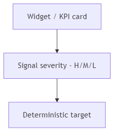

## 02 — Finance Overview Module (Ενότητα Επισκόπησης)

## 1. Σκοπός του Εγγράφου

Το παρόν έγγραφο ορίζει την Ενότητα Οικονομικής Επισκόπησης (Finance Overview) ως το κανονιστικό πρότυπο του συστήματος: τον ρόλο, τα όρια, τις εισροές δεδομένων, το συμβόλαιο αναλυτικής απεικόνισης (drilldown) και τα βασικά μοντέλα δεικτών (KPIs), ειδοποιήσεων και φίλτρων.

Δεν αποτελεί τεχνική προδιαγραφή υλοποίησης ή προσχέδιο διεπαφής (UI blueprint).

---

## 2. Ταυτότητα, Ρόλος και Όρια

Το Finance Overview Module αποτελεί το κέλυφος εποπτείας (monitoring shell) του συστήματος Finance v1.

Ρόλος: Συνοψίζει την πληροφορία, επισημαίνει τις προτεραιότητες και κατευθύνει τον χρήστη στις κατάλληλες ενότητες εκτέλεσης (καθορισμένη αναδρομή / deterministic drilldowns).

Όρια:
- Δεν αποτελεί χώρο εργασίας εκτέλεσης (execution workspace).
- Δεν δημιουργεί ούτε μεταβάλλει την πρωτογενή επιχειρησιακή αλήθεια (transactional truth).
- Δεν υποκαθιστά τους κανόνες ιδιοκτησίας δεδομένων ή τους σημασιολογικούς κανόνες που ορίζονται στα έγγραφα 00A και 01.

---

## 3. Σκοπός της Ενότητας (Επιχειρησιακή Ορατότητα)

Η ενότητα επιλύει το πρόβλημα του κατακερματισμού της πληροφορίας, παρέχοντας μια ενοποιημένη εικόνα προτεραιοποίησης.

Βασικά ερωτήματα που απαντά:
- Ποια είναι η τρέχουσα εικόνα Εσόδων (Revenue) και Δαπανών (Spend);
- Πού εντοπίζεται η μεγαλύτερη πίεση (ληξιπρόθεσμα, έκθεση, δεσμευμένα, αποκλίσεις);
- Ποια θέματα απαιτούν άμεση ενέργεια και σε ποια ενότητα;
- Ποια είναι η τάση των βασικών δεικτών απόδοσης (KPIs);

---

## 4. Κανονιστικοί Περιορισμοί (Αναφορές)

Η Επισκόπηση εφαρμόζει πιστά τους κανόνες του 00A:
- Μη-ιδιοκτησία Εποπτείας: Παρέχει υπολογιζόμενες προβολές (computed views), όχι πρωτογενή δεδομένα.
- Έννοιες Εποπτείας: Έκθεση (Exposure), Ληξιπρόθεσμα (Overdue), Επερχόμενα (Upcoming).
- Διαχωρισμός Καταστάσεων: Σαφής διάκριση μεταξύ κατάστασης (status), σήματος (signal) και ετοιμότητας (readiness).
- Αποφυγή Διπλομέτρησης (Anti-overlap): Εφαρμογή κανόνων εκτόνωσης δεσμεύσεων (commitment relief).

---

## 5. Εισροές και Εξαρτήσεις (Μόνο Ανάγνωση)

Η Επισκόπηση αντλεί δεδομένα από τις εξής ενότητες:
- Τιμολόγηση (Invoicing)
- Απαιτήσεις (Receivables)
- Αιτήματα Αγορών & Δεσμεύσεις (Purchase Requests / Commitments)
- Δαπάνες & Παραστατικά Προμηθευτών (Spend / Supplier Bills)
- Ουρά Πληρωμών (Payments Queue)
- Ελεγκτικοί Μηχανισμοί (Controls)

---

## 6. Μοντέλο Εποπτείας (Σύνθεση Πληροφορίας)

- Σύνοψη (Summary): Ενοποιημένη εικόνα Εσόδων και Δαπανών.
- Τάσεις (Trends): Χρονική μεταβολή δεικτών για την ανίχνευση βελτίωσης ή επιδείνωσης.
- Προβολή Έκθεσης (Exposure View): Συνολική οικονομική έκθεση με λογική αποφυγής διπλομέτρησης.
- Ειδοποιήσεις & Εξαιρέσεις (Alerts): Ανάδειξη κρίσιμων σημείων που απαιτούν παρέμβαση.
- Πλοήγηση & Δρομολόγηση: Μετατροπή των ενδείξεων σε άμεση καθοδήγηση προς τις λίστες εργασίας.

### Διαγράμματα (Αναφορά)

#### Σύνθεση Εποπτείας (monitoring composition)

#### Δρομολόγηση KPI προς Αναδρομές (KPI-to-drilldown routing)

#### Ροή Αλληλεπίδρασης (interaction flow)

#### Συμπεριφορά Ειδοποιήσεων και Αναδρομών (alerts → drilldowns)

#### Αναδρομές προς Δαπάνες (overview → spend flow)

#### Αναδρομές προς Ελέγχους (overview → controls flow)

---

## 7. Ταξινόμηση Widgets (Κατηγοριοποίηση)

- Widgets Συνοπτικών KPIs: Γενική κατάσταση υπολοίπων.
- Widgets Τάσεων: Εξέλιξη δεικτών στον χρόνο.
- Widgets Έκθεσης: Αποτύπωση οικονομικού ανοίγματος.
- Widgets Ειδοποιήσεων: Προτεραιοποιημένες εξαιρέσεις ανά βαθμό κρισιμότητας (severity).
- Widgets Λιστών Δράσης: Σημαντικότερα στοιχεία με δυνατότητα άμεσης αναδρομής (drilldown).
- Widgets Ελεγκτικής Ορατότητας: Στοιχεία από Προϋπολογισμό, Ιστορικό Ελέγχου και Κόστος Προσωπικού.

---

## 8. Κατάλογος Δεικτών & Σημάτων (KPI Catalog)

| Δείκτης / Σήμα | Πηγή Δεδομένων (Owner) | Τύπος | Στόχος Αναδρομής (Drilldown) |
|---|---|---|---|
| Ανείσπρακτες Απαιτήσεις | Απαιτήσεις | Σύνοψη | Είσπραξη / Απαιτήσεις |
| Ληξιπρόθεσμες Απαιτήσεις | Απαιτήσεις | Ειδοποίηση | Είσπραξη / Απαιτήσεις |
| Ροή Έκδοσης Τιμολογίων | Τιμολόγηση | Τάση | Λίστα Τιμολογίων |
| Δεσμευμένες Δαπάνες | Αιτήματα / Δεσμεύσεις | Σύνοψη / Έλεγχος | Λίστα Αιτημάτων Αγοράς |
| Εκκρεμείς Υποχρεώσεις | Δαπάνες / Παραστατικά | Σύνοψη | Λίστα Παραστατικών / Εξόδων |
| Έτοιμες vs Μπλοκαρισμένες Πληρωμές | Δαπάνες & Ουρά Πληρωμών | Ετοιμότητα | Ουρά Πληρωμών |
| Οικονομική Έκθεση (Exposure) | Ενοποίηση Εσόδων/Δαπανών | Υπολογιζόμενο | Αντίστοιχη Λίστα (Απαιτήσεις ή Δαπάνες) |
| Επερχόμενα (Upcoming) | Απαιτήσεις / Δαπάνες | Προβλεπτικό | Φιλτραρισμένη Λίστα (Χρονικός Ορίζοντας) |
| Πίεση Προϋπολογισμού | Ελεγκτικοί Μηχανισμοί | Σήμα Ελέγχου | Επισκόπηση Προϋπολογισμού |

---

## 9. Μοντέλο Φίλτρων (Καθολική Συνέπεια)

Υποχρεωτικά Καθολικά Φίλτρα: Χρονική περίοδος, Οργανωτικό πεδίο (Business Unit), Πλευρά παρακολούθησης (Έσοδα/Δαπάνες/Μικτό).

Δευτερεύοντα Φίλτρα: Βαθμός κρισιμότητας, Υπεύθυνος, Οικογένεια κατάστασης (status family).

Αρχές Φίλτρων: Ίδιο φίλτρο σημαίνει την ίδια επίδραση σε όλα τα widgets.

---

## 10. Μοντέλο Ειδοποιήσεων & Εξαιρέσεων

Ειδοποιήσεις Εσόδων: Πίεση ληξιπροθέσμων, υψηλό ανείσπρακτο υπόλοιπο χωρίς ενέργειες follow-up.

Ειδοποιήσεις Δαπανών: Συσσώρευση μπλοκαρισμένων πληρωμών, πίεση ληξιπρόθεσμων υποχρεώσεων, αποκλίσεις (mismatch) σε παραστατικά.

Επίπεδα Κρισιμότητας:
- Υψηλό: Απαιτεί άμεση επιχειρησιακή δράση.
- Μεσαίο: Απαιτεί προτεραιοποίηση στον τρέχοντα κύκλο.
- Χαμηλό: Απαιτεί απλή παρακολούθηση.

---

## 11. Αναδρομές & Δρομολόγηση (Drilldowns)

Η Επισκόπηση λειτουργεί ως σημείο εκκίνησης με το εξής πρότυπο:

Επισκόπηση $\rightarrow$ Λίστα Εργασίας $\rightarrow$ Λεπτομέρεια $\rightarrow$ Ενέργεια $\rightarrow$ Επιστροφή.

Βασικοί Προορισμοί:
- Λίστα Προσχεδίων Τιμολογίων
- Λίστα Εκδοθέντων Τιμολογίων
- Διαχείριση Απαιτήσεων (Collections)
- Λίστα Αιτημάτων Αγοράς
- Λίστα Παραστατικών Προμηθευτών / Εξόδων
- Ουρά Πληρωμών
- Προϋπολογισμός & Ιστορικό Ελέγχου

---

## 12. Τελική Διατύπωση Ενότητας

Η Ενότητα Οικονομικής Επισκόπησης αποτελεί το κανονιστικό κέλυφος εποπτείας του Finance v1. Συγκεντρώνει την υπολογιζόμενη εικόνα από τα Έσοδα, τις Δαπάνες και τους Ελεγκτικούς Μηχανισμούς, αναδεικνύει τις προτεραιότητες και δρομολογεί τον χρήστη με απόλυτη ακρίβεια στις ενότητες εκτέλεσης, χωρίς η ίδια να παράγει ή να κατέχει πρωτογενή επιχειρησιακή αλήθεια.
