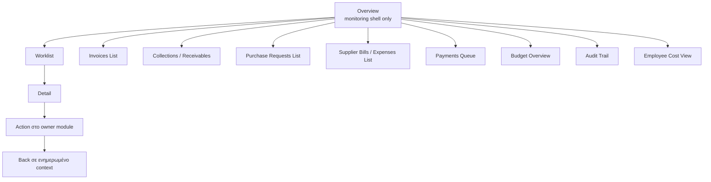

# 02 — Finance Overview Module

## 1. Σκοπός του εγγράφου

Το παρόν έγγραφο ορίζει το `Finance Overview Module` σε module-definition επίπεδο, ως canonical περιγραφή ρόλου, ορίων και εξαρτήσεων.

Ορίζει:
- τι είναι το module
- ποιο πρόβλημα λύνει σε επίπεδο συστήματος
- ποια πληροφορία συγκεντρώνει και πώς τη χρησιμοποιεί
- πώς συνδέεται με τα υπόλοιπα modules
- τι ανήκει και τι δεν ανήκει στον ρόλο του

Δεν είναι:
- implementation specification
- pixel-level UI spec
- route tree
- API/storage logic
- detailed screen blueprint

---

## 2. Θέση του εγγράφου στην ιεραρχία finance documentation

Το έγγραφο ανήκει στην ακόλουθη ιεραρχία:
- `00 — Finance Canonical Brief`
- `00A — Finance Domain Model & System Alignment`
- `01 — Finance Module Map`
- `02 — Finance Overview Module` (παρόν έγγραφο)

Το παρόν module document δεσμεύεται από τα `00`, `00A` και `01`.  
Δεν τα επαναορίζει, αλλά τα εξειδικεύει για το `Overview` module.

---

## 3. Ταυτότητα και ρόλος του module

Το `Finance Overview Module` είναι το monitoring shell του Finance Management & Monitoring System v1.

Ο ρόλος του είναι να:
- συνοψίζει τη συνολική οικονομική εικόνα
- επισημαίνει σημεία κινδύνου ή προτεραιότητας
- ιεραρχεί τι χρειάζεται άμεση επιχειρησιακή προσοχή
- δρομολογεί τον χρήστη στα κατάλληλα operational modules

Το `Overview` δεν είναι execution workspace.  
Δεν δημιουργεί source-of-truth transactional state.  
Δεν αντικαθιστά τα downstream modules (`Invoicing`, `Receivables`, `Purchase Requests / Commitments`, `Spend / Supplier Bills`, `Payments Queue`, `Controls`).

---

## 4. Σκοπός της οθόνης / του module

Το module λύνει πρόβλημα συνολικής ορατότητας και επιχειρησιακής προτεραιοποίησης.  
Χωρίς αυτό, η πληροφορία παραμένει κατακερματισμένη στα επιμέρους modules.

Βασικά ερωτήματα που απαντά:
- Πού βρίσκεται σήμερα η επιχειρησιακή εικόνα Revenue και Spend;
- Ποια σημεία έχουν τη μεγαλύτερη πίεση (overdue, exposure, blocked, variance);
- Ποια θέματα απαιτούν άμεση ενέργεια και σε ποιο module;
- Ποια τάση δείχνουν τα βασικά KPIs;

Το `Overview` δεν «εκτελεί» ενέργειες κύκλου ζωής.  
Λειτουργεί ως σημείο παρατήρησης, ιεράρχησης και drilldown.

---

## 5. Αρχές που διέπουν το Overview

### 5.1 Monitoring non-ownership
Το `Overview` δεν κατέχει transactional αλήθεια. Διαβάζει canonical objects από τα operational modules.

### 5.2 Computed monitoring
Έννοιες όπως `Exposure`, `Overdue`, `Upcoming` είναι computed monitoring concepts και όχι source objects.

### 5.3 State-type separation
Διαχωρίζονται ρητά:
- persisted domain status
- operational signal
- readiness state
- UI-only flag

Το module δεν συγχέει τις παραπάνω κατηγορίες.

### 5.4 Anti-overlap monitoring
Το monitoring του `Overview` αποφεύγει semantic overlap.  
Δεν επιτρέπεται διπλομέτρηση μεταξύ `Commitment`, `Supplier Bill` και `Outgoing Payment` όταν υπάρχει canonical linkage/relief λογική.

### 5.5 Deterministic drilldowns
Κάθε KPI, alert ή signal οδηγεί σε προκαθορισμένο και συνεπές drilldown target module/worklist.

---

## 6. Inputs, εξαρτήσεις και πηγές ανάγνωσης

Το `Overview` τροφοδοτείται από:
- `Invoicing`
- `Receivables`
- `Purchase Requests / Commitments`
- `Spend / Supplier Bills`
- `Payments Queue`
- `Controls`

Χρησιμοποιεί canonical επιχειρησιακές έννοιες από το σύστημα:
- `Invoice`
- `Receivable`
- `Purchase Request`
- `Commitment`
- `Supplier Bill`
- `Outgoing Payment`
- `Exposure`
- `Overdue`
- `Upcoming`

Στο επίπεδο module definition, το `Overview` διαβάζει αποτελέσματα και σήματα από τα παραπάνω modules, χωρίς να αλλάζει την πρωτογενή τους σημασία.

---

## 7. Monitoring model του Overview

### 7.1 Summary layer
Συνοψίζει βασική εικόνα Revenue και Spend σε ένα ενιαίο monitoring πλαίσιο.

### 7.2 Trend layer
Δείχνει μεταβολή βασικών δεικτών στον χρόνο ώστε να είναι ορατή η κατεύθυνση (βελτίωση/επιδείνωση).

### 7.3 Exposure layer
Ενοποιεί εικόνα έκθεσης από canonical inputs, με anti-overlap λογική.

### 7.4 Alert / exception layer
Αναδεικνύει ανωμαλίες, πιέσεις και εξαιρέσεις που χρειάζονται άμεση διαχείριση.

### 7.5 Navigation layer
Μετατρέπει τα παραπάνω σε καθοδηγούμενη δρομολόγηση προς τα σωστά worklists/details.

---

## 8. Widget taxonomy

### 8.1 Summary KPI widgets
Widgets συνοπτικής εικόνας για κατάσταση Revenue/Spend και βασικά υπόλοιπα.

### 8.2 Trend widgets
Widgets που δείχνουν εξέλιξη KPIs στον χρόνο για έγκαιρη ανίχνευση μεταβολών.

### 8.3 Exposure widgets
Widgets που αποτυπώνουν έκθεση, με σαφή διάκριση computed monitoring από transactional truth.

### 8.4 Alert / exception widgets
Widgets που εμφανίζουν prioritized εξαιρέσεις με σαφές severity.

### 8.5 Action-oriented list widgets
Widgets λίστας που δίνουν τα πιο κρίσιμα items και οδηγούν σε drilldown worklists.

### 8.6 Control visibility widgets
Widgets που φέρνουν ορατότητα από `Budget`, `Audit Trail`, `Employee Cost`.

---

## 9. KPI / metric model

### 9.1 Revenue-side KPIs

#### KPI: Outstanding Receivables
- Τι μετρά: συνολικό ανοικτό ποσό απαιτήσεων.
- Γιατί ανήκει στο `Overview`: είναι βασικό revenue pressure signal.
- Από τι τροφοδοτείται: `Receivables` με upstream σχέση προς issued invoice context.
- Τύπος metric: summary monitoring metric.
- Default drilldown target: `Collections / Receivables`.

#### KPI: Overdue Receivables
- Τι μετρά: ληξιπρόθεσμο μέρος των απαιτήσεων.
- Γιατί ανήκει στο `Overview`: δείχνει άμεσο κίνδυνο είσπραξης.
- Από τι τροφοδοτείται: `Receivables`.
- Τύπος metric: alert-oriented monitoring metric.
- Default drilldown target: `Collections / Receivables`.

#### KPI: Issued Invoice Throughput (period view)
- Τι μετρά: όγκο issued invoice context ανά περίοδο.
- Γιατί ανήκει στο `Overview`: δίνει συνολική επιχειρησιακή παραγωγή στο revenue side.
- Από τι τροφοδοτείται: `Invoicing`.
- Τύπος metric: trend metric.
- Default drilldown target: `Invoices List`.

### 9.2 Spend-side KPIs

#### KPI: Committed Spend
- Τι μετρά: εγκεκριμένη/δεσμευμένη δαπάνη πριν το downstream payable completion.
- Γιατί ανήκει στο `Overview`: δείχνει upstream spend pressure.
- Από τι τροφοδοτείται: `Purchase Requests / Commitments`.
- Τύπος metric: summary + control-relevant metric.
- Default drilldown target: `Purchase Requests List`.

#### KPI: Outstanding Payables
- Τι μετρά: ανοικτές υποχρεώσεις προς πληρωμή.
- Γιατί ανήκει στο `Overview`: δείχνει τρέχουσα πίεση πληρωμών.
- Από τι τροφοδοτείται: `Spend / Supplier Bills`.
- Τύπος metric: summary monitoring metric.
- Default drilldown target: `Supplier Bills / Expenses List`.

#### KPI: Ready vs Blocked Payables
- Τι μετρά: κατανομή readiness της payable ουράς.
- Γιατί ανήκει στο `Overview`: αναδεικνύει execution bottlenecks.
- Από τι τροφοδοτείται: `Spend / Supplier Bills`, `Payments Queue`.
- Τύπος metric: readiness metric.
- Default drilldown target: `Payments Queue`.

### 9.3 Cross-cutting / control KPIs

#### KPI: Exposure
- Τι μετρά: συνολική έκθεση με computed monitoring λογική.
- Γιατί ανήκει στο `Overview`: είναι κύριος ενοποιητικός δείκτης παρακολούθησης.
- Από τι τροφοδοτείται: Revenue και Spend outputs με canonical anti-overlap κανόνες.
- Τύπος metric: computed cross-system metric.
- Default drilldown target: primary target ανά exposure subtype (`Collections / Receivables` για revenue exposure, `Supplier Bills / Expenses List` για spend exposure).

#### KPI: Upcoming Obligations / Upcoming Receivables
- Τι μετρά: επερχόμενα ποσά που ωριμάζουν σύντομα και απαιτούν προληπτική παρακολούθηση.
- Γιατί ανήκει στο `Overview`: επιτρέπει έγκαιρη προτεραιοποίηση πριν δημιουργηθεί overdue pressure.
- Από τι τροφοδοτείται: `Receivables`, `Spend / Supplier Bills`, `Payments Queue` όπου εφαρμόζεται.
- Τύπος metric: forward-looking monitoring metric.
- Default drilldown target: αντίστοιχο operational worklist με pre-filtered upcoming horizon.

#### KPI: Budget Pressure Signal
- Τι μετρά: ένταση πίεσης budget σε σχέση με commitments/actuals.
- Γιατί ανήκει στο `Overview`: ενώνει monitoring και control σε επίπεδο προτεραιοποίησης.
- Από τι τροφοδοτείται: `Controls` (`Budget`) με inputs από operational modules.
- Τύπος metric: control signal metric.
- Default drilldown target: `Budget Overview`.

#### KPI: Audit Attention Signal
- Τι μετρά: ανάγκη ελέγχου/διερεύνησης γεγονότων.
- Γιατί ανήκει στο `Overview`: δίνει άμεσο governance visibility χωρίς να γίνεται audit workspace.
- Από τι τροφοδοτείται: `Controls` (`Audit Trail`).
- Τύπος metric: exception/control metric.
- Default drilldown target: `Audit Trail`.

Σημείωση:  
Το παρόν section ορίζει metric semantics σε module επίπεδο. Δεν κλειδώνει πρόωρα formulas όπου υπάρχουν unresolved downstream semantics.

---

## 10. Filters model

### 10.1 Required global filters
- χρονική περίοδος (period)
- οργανωτικό scope (π.χ. business unit / entity όπου υποστηρίζεται)
- πλευρά παρακολούθησης (`Revenue`, `Spend`, `Cross-system`)

### 10.2 Acceptable secondary filters
- severity
- ownership / responsible context
- status family (χωρίς σύγχυση status/signal/readiness)
- segment tags όπου υπάρχουν canonical labels

### 10.3 Filter principles
- ίδια φίλτρα σημαίνουν ίδιο πράγμα σε όλα τα widgets
- τα φίλτρα επηρεάζουν visualization και drilldown με συνεπή τρόπο
- το filter model δεν δημιουργεί νέα business state

---

## 11. Alerts / exception model

### 11.1 Revenue alerts
- overdue pressure σε receivables
- υψηλό outstanding χωρίς αντίστοιχη πρόοδο follow-up

### 11.2 Spend alerts
- blocked payable clusters
- due/overdue payable pressure
- mismatch concentration σε supplier obligations

### 11.3 Control alerts
- budget pressure/breach signals
- audit attention signals

### 11.4 Severity levels
- `High`: απαιτεί άμεση επιχειρησιακή ενέργεια
- `Medium`: απαιτεί προτεραιοποίηση εντός κύκλου εργασίας
- `Low`: απαιτεί παρακολούθηση

### 11.5 Business-level trigger logic
Οι ειδοποιήσεις βασίζονται σε επιχειρησιακά σήματα και όχι σε UI-only flags.  
Τα trigger criteria ορίζονται ως business-level κανόνες και όχι ως implementation λεπτομέρειες στο παρόν έγγραφο.

### 11.6 Alert ownership
Το `Overview` δείχνει και ιεραρχεί alerts.  
Η επίλυση ανήκει στα αντίστοιχα operational ή control modules.

---

## 12. Drilldowns

### 12.1 Revenue drilldowns
- από draft backlog / stale draft / reservation pressure signals -> `Invoice Drafts List`
- από issued/throughput KPI -> `Invoices List`
- από outstanding/overdue KPI -> `Collections / Receivables`

### 12.2 Spend drilldowns
- από commitment signals -> `Purchase Requests List`
- από payable/mismatch signals -> `Supplier Bills / Expenses List`
- από readiness/execution signals -> `Payments Queue`

### 12.3 Control drilldowns
- από budget signals -> `Budget Overview`
- από audit signals -> `Audit Trail`
- από cost visibility signals -> `Employee Cost View`

### 12.4 Drilldown behavior rules
- deterministic target ανά signal/KPI
- χωρίς αμφισημία routing
- χωρίς bypass του κατάλληλου operational module

---

## 13. Navigation role του Overview

Το `Overview` λειτουργεί με το canonical μοτίβο:

`Overview -> Worklist -> Detail -> Action -> Back`

Συνδέεται με:
- `Invoice Drafts List`
- `Invoices List`
- `Collections / Receivables`
- `Purchase Requests List`
- `Supplier Bills / Expenses List`
- `Payments Queue`
- `Budget Overview`
- `Audit Trail`
- `Employee Cost View`

Ο ρόλος του είναι να ξεκινά και να καθοδηγεί τη διαδρομή, όχι να την εκτελεί πλήρως μέσα στο ίδιο module.

### 13.1 Ενοποιημένο navigation / drilldown flow

Το παρακάτω διάγραμμα ανήκει στο `Overview Module` γιατί αποτυπώνει deterministic routing από monitoring shell προς owner worklists/details.

Τι δείχνει:
- το canonical μοτίβο `Overview -> Worklist -> Detail -> Action -> Back`
- deterministic drilldowns σε συγκεκριμένα downstream targets

Τι δεν δείχνει:
- ελεύθερο site-map navigation
- αυθαίρετα cross-links μεταξύ μη owner modules
- execution ownership μέσα στο `Overview`

---

## 14. Τι ανήκει και τι δεν ανήκει στο Overview Module

### 14.1 In-scope
- ενοποιημένη monitoring εικόνα
- KPI, trend και exposure αποτύπωση
- alerts/exceptions ιεράρχηση
- deterministic drilldowns
- control visibility

### 14.2 Out-of-scope
- issue, collection execution, matching, payment execution
- owner transactional state management
- detailed UI blueprint περιγραφή
- route tree, API contracts, storage schema

---

## 15. Σχέση με το Finance Overview Dashboard του UI Blueprint

Το UI Blueprint είναι δευτερεύουσα πηγή για screen intent, widget παραδείγματα, navigation cues και drilldown patterns.

Το παρόν module document είναι canonical guardrail:
- για να διασφαλίζει σωστό ρόλο του `Overview`
- για να αποφεύγεται drift προς execution λογική
- για να παραμένει συνεπές το module με `00`, `00A`, `01`

---

## 16. Open questions / stabilization notes

- σταθεροποίηση ονομασιών ορισμένων metrics σε διατμηματικό επίπεδο
- ακριβέστερη decomposition του `Exposure` σε επιμέρους views
- alert thresholds ανά severity
- scope preview panels σε detail drilldowns
- επιτρεπόμενες inline actions στο `Overview` χωρίς παραβίαση monitoring-shell ρόλου

Σημείωση:  
Τα παραπάνω είναι σημεία σταθεροποίησης και όχι κλειδωμένες implementation αποφάσεις.

---

## 17. Τελική διατύπωση module statement

Το `Finance Overview Module` είναι το canonical monitoring shell του Finance Management & Monitoring System v1: συγκεντρώνει computed εικόνα από Revenue, Spend και Controls, επισημαίνει προτεραιότητες, και δρομολογεί με deterministic drilldowns προς τα κατάλληλα execution modules, χωρίς να κατέχει ή να παράγει transactional business truth.

