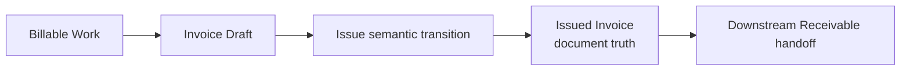

# 03 — Invoice Module

## 1. Σκοπός του εγγράφου

Το παρόν έγγραφο ορίζει το `Invoice Module` σε module-definition επίπεδο, ως canonical περιγραφή ρόλου, ορίων, semantics και εξαρτήσεων.

Ορίζει:
- τον ρόλο του module στο σύστημα
- τα core business concepts του
- τα lifecycle και status boundaries
- τους canonical κανόνες issue και totals
- τις σχέσεις του με τα υπόλοιπα modules

Δεν είναι:
- implementation specification
- pixel-level UI spec
- route tree
- API/storage logic
- detailed screen blueprint

---

## 2. Θέση του εγγράφου στην ιεραρχία finance documentation

Το παρόν document δεσμεύεται από:
- `00 — Finance Canonical Brief`
- `00A — Finance Domain Model & System Alignment`
- `01 — Finance Module Map`

Και εξειδικεύει τα παραπάνω για το `Invoicing` module, με συνέπεια προς το συνολικό documentation set του v1.

---

## 3. Ταυτότητα και ρόλος του module

Το `Invoice Module` είναι το canonical revenue-core module που μετατρέπει billable work σε issued invoice truth.

Ο ρόλος του είναι να καλύπτει τον operational κύκλο:
`Billable Work -> Invoice Draft -> Issue transition -> Issued Invoice -> downstream receivable handoff`.

Το module είναι ξεχωριστό γιατί:
- κατέχει την αλήθεια του invoice document στο σημείο issue
- σταθεροποιεί τη μετάβαση draft/preview -> issued truth
- δίνει καθαρό downstream receivable handoff

Δεν ταυτίζεται με:
- `Receivables` (collections follow-up)
- `Overview` (monitoring shell)
- accounting engine
- bank/reconciliation engine

---

## 4. Σκοπός του module μέσα στο Finance System

Η θέση του module μέσα στη Revenue chain είναι:

`Billable Work -> Invoice Draft -> Issued Invoice -> Receivable -> Incoming Payment`

Upstream:
- billable input context που μπορεί να τιμολογηθεί

Downstream:
- downstream receivable context για follow-up και είσπραξη

Ο ρόλος του invoicing ολοκληρώνεται στο semantic handoff:
`Issued Invoice + downstream receivable context`.  
Η collection/payment progression συνεχίζει εκτός module.

---

## 5. Αρχές που διέπουν το Invoice Module

### 5.1 Invoice truth ownership
Το `Invoicing` κατέχει την αλήθεια του issued invoice snapshot.

### 5.2 Draft vs issued separation
Το draft/preview context δεν είναι issued truth και δεν το υποκαθιστά.

### 5.3 Issue semantic boundary
Το `Issue` είναι semantic transition.  
Δεν αποτελεί από μόνο του proof πλήρους compliance completion, fiscal transmission success ή accounting posting completion.

### 5.4 Totals alignment
Ισχύει locked canonical rule:
`Preview totals must become issued totals snapshot`.

Μετά το `Issue`:
- preview totals frozen
- issued totals canonical
- receivable derived from issued totals

### 5.5 State-type separation
Διαχωρίζονται ρητά:
- persisted domain status
- operational signal
- readiness state
- UI-only temporary state

### 5.6 Downstream boundary discipline
Το invoice document lifecycle δεν απορροφά collection/payment progression.

---

## 6. Inputs, dependencies και πηγές module truth

### Upstream input
- `Billable Work` context ως πηγή draft composition

### Downstream impact
- παραγωγή `Issued Invoice` truth
- linked `Receivable` context για downstream follow-up

### Σχέση με Controls
- read-only/supporting relation για audit/control visibility
- χωρίς μεταφορά ownership invoice truth στα control surfaces

### Transmission / fiscal dimension
- αντιμετωπίζεται ως ξεχωριστή dimension όταν υπάρχει
- δεν επαναορίζει τον core semantic ορισμό του `Issue`

---

## 7. Core business concepts του module

### `Billable Work`
Upstream τιμολογήσιμο context που τροφοδοτεί το draft.

### `Invoice Draft`
Επεξεργάσιμο προ-issue context του document.

### `Draft Line`
Γραμμή draft (source-derived ή custom) που συμμετέχει στη σύνθεση και στα preview totals.

### `Preview`
Προ-issue document representation για review και readiness.

### `Issue`
Η canonical μετάβαση από draft/preview σε issued invoice truth.

### `Issued Invoice`
Το canonical document truth του module μετά το issue.

### `Issued totals snapshot`
Το παγωμένο οικονομικό snapshot που παράγεται στο issue.

### `Receivable context`
Downstream operational claim που παράγεται από issued totals.

### `Transmission / fiscal context`
Ξεχωριστή λειτουργική διάσταση, χωρίς αλλαγή του core invoice truth ownership.

### `Audit / notes / supporting context`
Υποστηρικτική ιχνηλασιμότητα και λειτουργικό context, όχι source-of-truth replacement.

---

## 8. Module surfaces / operational surfaces

### `Invoice Drafts List`
- **Ρόλος:** worklist για draft backlog, συνέχεια και καθαρισμό.
- **Primary question:** ποια drafts χρειάζονται άμεση επεξεργασία.
- **Primary action:** άνοιγμα draft για compose/review.
- **Θέση στο flow:** entry point του draft lifecycle.

### `Invoice Draft Builder`
- **Ρόλος:** κύρια operational επιφάνεια σύνθεσης draft.
- **Primary question:** τι εκδίδεται και με ποια οικονομική/document μορφή.
- **Primary action:** compose, edit, save, review, issue.
- **Θέση στο flow:** core execution surface πριν το issue.

### `Invoices List`
- **Ρόλος:** worklist issued invoice records.
- **Primary question:** ποια issued invoices χρειάζονται review ή navigation toward downstream receivable follow-up.
- **Primary action:** drilldown σε detail.
- **Θέση στο flow:** post-issue operational visibility.

### `Invoice Detail View`
- **Ρόλος:** single-record canonical issued context.
- **Primary question:** ποια είναι η τρέχουσα κατάσταση του συγκεκριμένου issued invoice.
- **Primary action:** review, contextual handoff.
- **Θέση στο flow:** τελικό invoicing σημείο πριν το `Receivables`.

---

## 9. Core flows του Invoice Module

Το παρακάτω local diagram μπαίνει εδώ για να δείξει το module-context του `Invoicing` χωρίς να επαναλαμβάνει full system architecture.

Τι δείχνει: τη local canonical ακολουθία του `Invoicing` μέχρι το downstream handoff.  
Τι δεν δείχνει: collections ownership ή payment lifecycle ως invoice document statuses.

### 9.1 Draft discovery / continuation
Εντοπισμός draft backlog και επαναφορά σε ενεργό draft context.

### 9.2 Draft composition from billable work
Μετατροπή `Billable Work` σε draft lines με controlled επιλογή.

### 9.3 Draft line composition
Οργάνωση source-derived και custom lines σε ενιαίο draft.

### 9.4 Header completion
Συμπλήρωση document-level πεδίων για semantic πληρότητα.

### 9.5 Save draft
Ρητή αποθήκευση της προόδου πριν από readiness/issue.

### 9.6 Review / readiness
Έλεγχος αν το draft καλύπτει canonical readiness προϋποθέσεις.

### 9.7 Issue draft
Μετάβαση σε issued snapshot truth με linked receivable δημιουργία.

### 9.8 Issued invoice review
Post-issue έλεγχος του canonical record χωρίς εξάρτηση από μεταγενέστερο draft mutation.

### 9.9 Handoff προς receivable context
Μεταφορά του οικονομικού αποτελέσματος στο downstream receivable flow.

Κρίσιμη αποσαφήνιση:  
Το invoicing module ολοκληρώνεται semantic-wise στο issued invoice + linked receivable handoff.

---

## 10. Entity model και ownership

Κύριες οντότητες:
- `InvoiceDraft`
- `DraftLine`
- `Invoice`
- `BillableWorkItem`
- linked `Receivable` context
- `Audit / Notes / Timeline` context

Διαχωρισμός ownership:
- `InvoiceDraft` / `DraftLine`: draft composition truth
- `Invoice`: issued document truth
- `BillableWorkItem`: upstream source context
- `Receivable` context: downstream derived claim
- `Audit/Notes/Timeline`: supporting traceability

Τυπολογία semantic ρόλου:
- **source-of-truth:** issued `Invoice`
- **preview-only:** draft preview context
- **derived:** receivable derivation από issued totals
- **placeholder/future-facing:** transmission/compliance-like context όπου δεν υπάρχει πλήρης v1 closure

---

## 11. Canonical invoice lifecycle

### 11.1 Draft context
Το invoice βρίσκεται σε editable, pre-issue κατάσταση.

### 11.2 Issue transition
Το draft μεταβαίνει σε issued state με οικονομικό snapshot και linked receivable creation.

### 11.3 Issued invoice state
Το document λειτουργεί ως canonical issued truth του module.

### 11.4 Controlled correction / void / cancel / credit semantics
Παραμένει controlled area για v1 με future/open επέκταση όπου δεν έχει κλειδώσει πλήρης policy.

Σημαντικό boundary:
- document lifecycle (`Draft`, `Issued`) δεν συγχέεται με receivable/payment progression (`Paid`, `Partially Paid`, `Overdue`).

---

## 12. Status model

### 12.1 Persisted document statuses
Καταστάσεις που ανήκουν στο document lifecycle.

### 12.2 Operational signals
Σήματα προτεραιότητας ή λειτουργικής παρακολούθησης.

### 12.3 Readiness states
Καταστάσεις ετοιμότητας πριν το issue transition.

### 12.4 UI-only flags
Προσωρινά flags που δεν παράγουν business truth.

### 12.5 v1 vocabulary
- **Persisted document statuses:** `Draft`, `Issued`
- **Readiness states:** `Ready for Issue`, `Not Ready`
- **Operational signals:** `Needs Review`, `Stale` (όπου εφαρμόζεται)
- **UI-only flags:** `Unsaved Changes`, `Preview Mode`, `Inline Validation Error`

Απαγορεύεται η σύγχυση invoice document status με collection/payment status.

Ρητή boundary note:  
Τα `Paid`, `Partially Paid`, `Open`, `Overdue` και συναφή collection/payment outcomes δεν αποτελούν canonical document statuses του `Invoice`. Ανήκουν στο downstream receivable/payment context και δεν πρέπει να συγχέονται με το document lifecycle του invoicing module.

---

## 13. Header fields και line fields

### 13.1 Header field families
- customer/billing identity context
- document reference/identification context
- issue/date/terms context
- business notes/reference context
- transmission/compliance-like context (όπου υπάρχει)

### 13.2 Line field families
- source linkage προς `Billable Work`
- description/quantity/unit price/discount context
- tax/classification context
- custom line extension context

### 13.3 Required semantic minimum for issue
Τα ελάχιστα field groups που διασφαλίζουν:
- σαφή issued totals derivation
- έγκυρο issue transition
- ασφαλή linked receivable creation

### 13.4 Optional / supporting / future-facing field groups
Πεδία που ενισχύουν λειτουργικότητα ή μελλοντική συμβατότητα, χωρίς να μεταβάλλουν τον core semantic ορισμό issue/issued truth.

---

## 14. Actions και permissions

Actions ανά stage/state:
- create
- edit
- save
- discard
- review
- issue
- open detail
- duplicate
- preview / export / send (όπου είναι relevant)
- void/cancel/credit (future or controlled area)

Κατηγοριοποίηση:

### Allowed actions
Ενέργειες που ανήκουν κανονικά στο draft/issued lifecycle του module.

### Gated actions
Ενέργειες με readiness/permission προϋποθέσεις (ιδίως `Issue`).

### Forbidden / future actions
Ενέργειες που υπερβαίνουν το v1 semantic boundary ή παραμένουν controlled/open area.

---

## 15. Validations και issue-readiness rules

### 15.1 Field-level validations
Έλεγχοι εγκυρότητας και βασικής πληρότητας στα document fields.

### 15.2 Line-level validations
Έλεγχοι συνέπειας line δεδομένων και τιμολογήσιμης ορθότητας.

### 15.3 Document-level validations
Έλεγχοι συνολικής συνοχής draft πριν το issue.

### 15.4 Transition-level validations πριν το issue
Κανόνες που πρέπει να ισχύουν για να επιτραπεί η μετάβαση σε issued truth.

Διάκριση επιπέδων:
- **UI check:** έλεγχος αλληλεπίδρασης/παρουσίασης
- **canonical readiness rule:** έλεγχος που καθορίζει semantic εγκυρότητα issue transition

### 15.5 Canonical semantic minimum before Issue
- ύπαρξη τουλάχιστον μίας έγκυρης `DraftLine` με σαφή line origin
- συνεπές document totals αποτέλεσμα
- επαρκές billing / customer identity context
- επαρκές issue/date/terms context
- απουσία blocking validation errors που θα έκαναν ambiguous τα issued totals ή το receivable derivation

---

## 16. Financial semantics και totals model

### 16.1 Line net / tax / gross semantics
Οι line υπολογισμοί διαμορφώνουν το οικονομικό αποτέλεσμα του draft preview.

### 16.2 Document totals semantics
Το module διαχωρίζει αυστηρά preview totals από issued totals.

### 16.3 Preview totals vs issued totals
Locked canonical rule:
`Preview totals must become issued totals snapshot`.

Μετά το `Issue`:
- preview totals frozen
- issued totals canonical
- receivable derived from issued totals

### 16.4 Issued Snapshot Non-Mutability Rule
Μετά το issue, η οικονομική αλήθεια του issued invoice δεν επιτρέπεται να εξαρτάται από μεταγενέστερες αλλαγές draft/preview context.

### 16.5 Current v1 semantic contradictions
Το τρέχον invoicing material δείχνει γνωστές semantic αντιφάσεις που επηρεάζουν τη σταθερότητα του module:
- UI preview με VAT-inclusive / gross-oriented εικόνα, ενώ το issued `Invoice.total` λειτουργεί σήμερα ως net-only.
- Receivable outstanding που κληρονομεί issued total semantics και άρα επηρεάζεται από το παραπάνω mismatch.
- Minimal issued invoice record χωρίς πλήρες persisted header/lines snapshot.
- Transmission status ως placeholder signal χωρίς πλήρες state machine.
- Ασυνέχεια μεταξύ draft numbering context και issued numbering context.

Οι παραπάνω αντιφάσεις δεν αλλάζουν τους canonical rules του module. Αντιθέτως, αποτελούν v1 stabilization targets που πρέπει να λυθούν ώστε το module να ευθυγραμμιστεί πλήρως με το canonical finance model.

### 16.6 Γιατί το section είναι κρίσιμο
Χωρίς σταθερό totals model προκύπτουν semantic συγκρούσεις στον downstream κύκλο και παραπλανητική εικόνα συστήματος.

---

## 17. Dependencies και σχέσεις με άλλα modules

### Σχέση με `Overview`
- το invoicing παρέχει operational outputs
- το overview παρακολουθεί/δρομολογεί, δεν επαναορίζει invoice truth

### Σχέση με `Receivables`
- το invoicing δημιουργεί και παραδίδει downstream receivable handoff
- το receivables αναλαμβάνει την operational παρακολούθηση και progression της απαίτησης μετά το issue

### Σχέση με `Controls`
- το invoicing τροφοδοτεί control visibility (ιδίως audit context)
- τα controls δεν γίνονται owner του invoice document lifecycle

### Σχέση με transmission/fiscal dimension
- αντιμετωπίζεται ως ξεχωριστό context
- δεν ακυρώνει τον canonical ορισμό του issue transition

Boundary logic:
- **τι δίνει downstream:** issued invoice truth + downstream receivable handoff
- **τι διαβάζει upstream:** billable work input
- **τι δεν επαναορίζεται αλλού:** invoice issue semantics και issued totals truth

Boundary clarification:  
Το `Invoice Module` δημιουργεί το issued invoice truth και παράγει το downstream receivable handoff. Το `Receivables` module αναλαμβάνει την operational παρακολούθηση και progression της απαίτησης μετά το issue.

---

## 18. Τι ανήκει και τι δεν ανήκει στο Invoice Module

### In-scope
- draft creation/composition/editing
- issue transition
- issued invoice truth ownership
- invoice detail truth
- downstream receivable handoff

### Out-of-scope
- collections execution
- monitoring ownership (`Overview`)
- full accounting posting engine
- bank/reconciliation truth
- πλήρης compliance/fiscal completion ως default v1 υπόσχεση

---

## 19. Current v1 limitations / known gaps

Known limitations:
- πιθανό mismatch preview totals vs issued totals
- minimal issued record / missing full snapshot risk
- line model incompleteness σε edge περιπτώσεις
- numbering linkage ambiguity μεταξύ draft και issued context
- transmission placeholder semantics
- incomplete readiness enforcement σε ορισμένες ροές
- persistence maturity questions
- ασαφή downstream payment/collection semantics separation σε συγκεκριμένα σημεία

Τα παραπάνω καταγράφονται ως limitations και όχι ως implementation chatter.

---

## 20. v1 stabilization direction

Προτεραιότητες σταθεροποίησης:
1. canonical invoice lifecycle
2. issued snapshot semantics
3. totals alignment
4. issue-readiness rules
5. boundaries με `Receivables`
6. minimum required entity/field completeness

Κατεύθυνση:
- σταθερό και σαφές draft->issue->issued μοντέλο
- πλήρης εφαρμογή locked totals/snapshot rules
- αυστηρός διαχωρισμός invoice lifecycle από collection/payment lifecycle

---

## 21. Open questions / stabilization notes

Πραγματικά unresolved items:
- βάθος immutable issued snapshot πέρα από totals
- τελική policy για numbering linkage
- πλήρης transmission lifecycle policy ως v1/vNext απόφαση
- controlled policy για void/cancel/credit
- λεπτομέρειες line model σε ειδικά σενάρια

Δεν είναι open:
- `Issue` semantic transition
- `Preview totals must become issued totals snapshot`
- `Issued Snapshot Non-Mutability Rule`
- receivable derivation από issued totals

---

## 22. Τελική διατύπωση module statement

Το `Invoice Module` είναι το canonical revenue-core module του Finance Management & Monitoring System v1: μετασχηματίζει `Billable Work` σε issued invoice truth μέσω ελεγχόμενου draft->issue transition, κλειδώνει τα preview totals σε canonical issued totals snapshot με non-mutability μετά το issue, και παραδίδει σαφές downstream receivable context, χωρίς να συγχέεται με monitoring ownership, collections execution ή accounting/compliance completion.

