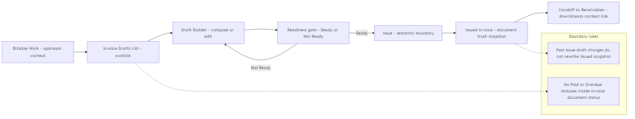
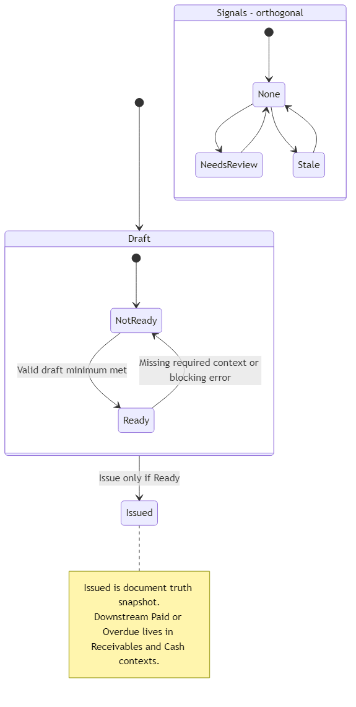

## 03 — Invoice Module (Ενότητα Τιμολόγησης)

## 1. Σκοπός του Εγγράφου

Το παρόν έγγραφο ορίζει την Ενότητα Τιμολόγησης (Invoice Module) σε επίπεδο κανονιστικού προτύπου: τον ρόλο, τα όρια, την ιδιοκτησία της πληροφορίας (owned truth), τις επιφάνειες εργασίας, τον τοπικό κύκλο ζωής, την πύλη ελέγχου έκδοσης (issue-readiness gate) και τις παραδόσεις (handoffs) προς άλλες ενότητες.

Δεν αποτελεί σημασιολογικό νόμο (αυτό ορίζεται στο 00A) ούτε προσχέδιο διεπαφής (UI blueprint).

---

## 2. Ρόλος και Όρια

Το Invoice Module είναι η κεντρική ενότητα εσόδων που μετατρέπει την Τιμολογήσιμη Εργασία (Billable Work) σε επίσημη αλήθεια εγγράφου (issued invoice document truth) και εξασφαλίζει την καθαρή παράδοση προς τις Απαιτήσεις (Receivables).

Όρια (Τι ΔΕΝ είναι):
- Δεν είναι η ενότητα Απαιτήσεων (παρακολούθηση είσπραξης / progression).
- Δεν είναι η Επισκόπηση (Overview) (κέλυφος εποπτείας).
- Δεν είναι λογιστική μηχανή, μηχανή συμμόρφωσης ή τραπεζική πηγή αλήθειας.

Σημείωση: Η «Έκδοση» (Issue) αποτελεί όριο σημασιολογικής μετάβασης (κατά το 00A) και δεν αποτελεί τεκμήριο πλήρους λογιστικής, φορολογικής ή κανονιστικής ολοκλήρωσης.

---

## 3. Βασικές Επιχειρησιακές Έννοιες (Σύνοψη)

- Τιμολογήσιμη Εργασία (Billable Work): Τα δεδομένα εισόδου προς τιμολόγηση.
- Προσχέδιο Τιμολογίου (Invoice Draft) & Γραμμές Προσχεδίου: Η επεξεργάσιμη σύνθεση πριν την έκδοση.
- Έκδοση (Issue): Η μετάβαση που «κλειδώνει» το στιγμιότυπο έκδοσης (snapshot), σύμφωνα με τους κανόνες του 00A.
- Εκδοθέν Τιμολόγιο (Issued Invoice): Το επίσημο ιστορικό αρχείο της ενότητας (document truth).
- Παράδοση (Handoff): Το παραγόμενο πλαίσιο Απαίτησης (Receivable context) (ιδιοκτησία: Receivables).
- Διαβίβαση / Φορολογικό Πλαίσιο (Transmission): Υποστηρικτική διάσταση που δεν αλλοιώνει την εκδοθείσα αλήθεια.

---

## 4. Επιφάνειες Λειτουργίας (Operational Surfaces)

- Λίστα Προσχεδίων: Χώρος εργασίας για τη διαχείριση του backlog των προσχεδίων.
- Εργαλείο Σύνθεσης (Draft Builder): Σύνθεση, προεπισκόπηση και ελεγχόμενη (gated) Έκδοση.
- Λίστα Τιμολογίων: Ορατότητα των εκδοθέντων παραστατικών (post-issue).
- Προβολή Λεπτομερειών Τιμολογίου: Επίσημο περιεχόμενο και σύνδεσμοι παράδοσης (προς τις Απαιτήσεις).

---

## 5. Τοπική Ροή Ενότητας (Core Flow)

Η ροή ακολουθεί την εξής ακολουθία:

Εντοπισμός/Συνέχιση Προσχεδίου $\rightarrow$ Σύνθεση $\rightarrow$ Αποθήκευση/Ανασκόπηση.

Έκδοση (Issue) (μέσω πύλης ελέγχου) $\rightarrow$ Δημιουργία εκδοθέντος αρχείου + Παράδοση downstream.

Ανασκόπηση μετά την Έκδοση: Ανάγνωση του επίσημου αρχείου (χωρίς εξάρτηση από μετέπειτα αλλαγές σε προσχέδια).

### Διαγράμματα (Αναφορά)

#### Διάγραμμα λειτουργικής ροής (semantic boundary στο Issue)

#### Διάγραμμα καταστάσεων (document status, readiness, signals)

---

## 6. Ιδιοκτησία και Παραδοτέα (Module Ownership)

Ιδιοκτησία Αλήθειας (εντός ενότητας):
- Invoice Draft / Draft Line: Η αλήθεια της σύνθεσης πριν την έκδοση.
- Invoice (Issued): Η αλήθεια του εγγράφου μετά την Έκδοση.

Πλαίσια Ανάγνωσης (Read-only):
- Billable Work Item: Πλαίσιο πηγής δεδομένων.
- Receivable Context: Η απαίτηση είσπραξης (ιδιοκτησία: Receivables).

Παραδοτέα (Outputs):
- Επίσημο αρχείο τιμολογίου (Issued snapshot).
- Καθορισμένη παράδοση (Handoff) προς τις Απαιτήσεις με μοναδικά αναγνωριστικά.

---

## 7. Τοπικοί Κανόνες Ενότητας

Η ενότητα εφαρμόζει τους κανόνες του 00A (όριο έκδοσης, ευθυγράμμιση συνόλων). Σε επίπεδο ενότητας, αυτό σημαίνει:
- Διαχωρισμός Προσχεδίου/Εκδοθέντος: Μετά την έκδοση, το επίσημο αρχείο δεν μεταβάλλεται από μετέπειτα προσχέδια.
- Όχι Καταστάσεις Είσπραξης στο Τιμολόγιο: Οι ενδείξεις Εξοφλημένο, Ληξιπρόθεσμο, κ.λπ., δεν είναι καταστάσεις του εγγράφου· ανήκουν στις Απαιτήσεις και στο ταμειακό πλαίσιο.
- Η Διαβίβαση είναι Ορθογώνια: Τα σήματα φορολογικής διαβίβασης δεν επαναορίζουν την Έκδοση ούτε την εκδοθείσα αλήθεια.

---

## 8. Λεξιλόγιο Καταστάσεων (Status Vocabulary)

Μόνιμες Καταστάσεις Εγγράφου: Προσχέδιο (Draft), Εκδοθέν (Issued).

Καταστάσεις Ετοιμότητας (Pre-issue): Έτοιμο προς Έκδοση, Μη Έτοιμο.

Λειτουργικά Σήματα: Απαιτεί Ανασκόπηση, Στάσιμο (Stale).

Ενδείξεις Διεπαφής (UI-only): Μη αποθηκευμένες αλλαγές, Λειτουργία Προεπισκόπησης.

---

## 9. Πύλη Ελέγχου Έκδοσης (Issue-readiness Gate)

Ελάχιστα κριτήρια για να επιτραπεί η Έκδοση:
- Τουλάχιστον μία έγκυρη γραμμή (Draft Line) με σαφή προέλευση.
- Συνεπές αποτέλεσμα συνόλων (Preview) για τη δημιουργία καθαρού Snapshot.
- Πλήρη στοιχεία ταυτότητας πελάτη/χρέωσης.
- Πλήρη στοιχεία ημερομηνίας και όρων πληρωμής.
- Απουσία σφαλμάτων επικύρωσης (validation errors) που καθιστούν ασαφή την αλήθεια του εγγράφου.

---

## 10. Σχέσεις και Παραδόσεις (Handoffs)

- Με τις Απαιτήσεις (Receivables): Η Τιμολόγηση παραδίδει την εκδοθείσα αλήθεια. Οι Απαιτήσεις αναλαμβάνουν την πορεία είσπραξης.
- Με την Επισκόπηση (Overview): Η Επισκόπηση παρακολουθεί και δρομολογεί, χωρίς να επαναορίζει την αλήθεια του τιμολογίου.
- Με τους Ελεγκτικούς Μηχανισμούς (Controls): Ορατότητα ανάγνωσης (audit), χωρίς ιδιοκτησία.

---

## 11. Περιορισμοί v1 και Σημειώσεις Σταθεροποίησης

- Πιθανές αποκλίσεις μεταξύ συνόλων προεπισκόπησης και τελικών συνόλων σε ορισμένες αναπαραστάσεις.
- Κίνδυνος ελλιπούς στιγμιότυπου (Snapshot) πέραν των συνόλων (totals).
- Ασάφεια στη σύνδεση αρίθμησης μεταξύ προσχεδίου και εκδοθέντος.
- Η κατάσταση διαβίβασης λειτουργεί ως προσωρινό σήμα (placeholder) χωρίς πλήρες lifecycle.

---

## 12. Τελική Διατύπωση Ενότητας

Το Invoice Module αποτελεί την κεντρική ενότητα εσόδων του συστήματος Finance v1: συνθέτει το Προσχέδιο Τιμολογίου από την Τιμολογήσιμη Εργασία, εφαρμόζει μια ελεγχόμενη Έκδοση για την παραγωγή της επίσημης αλήθειας του εγγράφου και εκτελεί την καθορισμένη παράδοση προς τις Απαιτήσεις, χωρίς να απορροφά τη διαχείριση των εισπράξεων ή να μετατρέπεται σε λογιστική επιφάνεια.

