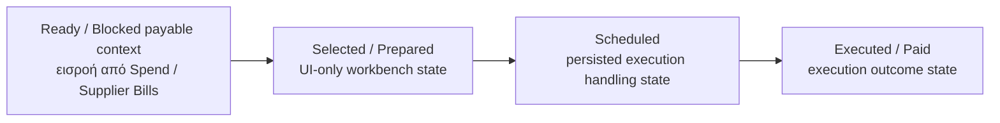

# 04 — Payments Queue Module

## 1. Σκοπός του εγγράφου

Το παρόν έγγραφο ορίζει το `Payments Queue Module` σε module-definition επίπεδο, ως canonical περιγραφή ρόλου, ορίων, semantics και εξαρτήσεων.

Ορίζει:
- τον ρόλο του module στο σύστημα
- τι ακριβώς εισέρχεται στην ουρά
- πώς νοείται η payment readiness
- ποια state families ισχύουν
- πώς οργανώνονται priority, filters και actions
- πώς σχετίζεται με τα `Spend / Supplier Bills`, `Purchase Requests / Commitments`, `Overview` και τα υπόλοιπα modules

Δεν είναι:
- implementation specification
- pixel-level UI spec
- route tree
- API/storage logic
- πλήρης τραπεζική ή reconciliation προδιαγραφή

---

## 2. Θέση του εγγράφου στην ιεραρχία finance documentation

Το παρόν document δεσμεύεται από:
- `00 — Finance Canonical Brief`
- `00A — Finance Domain Model & System Alignment`
- `01 — Finance Module Map`

Και εξειδικεύει τα παραπάνω για το `Payments Queue` module, με συνέπεια προς το συνολικό documentation set του v1.

---

## 3. Ταυτότητα και ρόλος του module

Το `Payments Queue Module` είναι το canonical downstream spend-execution module του συστήματος.

Ο ρόλος του είναι να καλύπτει τον operational κύκλο:

`Purchase Request -> Commitment -> Supplier Bill -> Payment Readiness -> Paid Cash Out`

και ειδικότερα το τελευταίο κομμάτι της αλυσίδας:

`Ready / Blocked payable context -> queue triage -> scheduling / execution handoff -> executed paid outcome`

Το module είναι ξεχωριστό γιατί:
- δεν σχηματίζει το readiness από το μηδέν
- δεν κάνει upstream mismatch investigation ως primary purpose
- δεν αντικαθιστά το `Spend / Supplier Bills`
- δεν είναι γενικό bank/reconciliation engine
- δεν είναι accounting ledger

Με απλά λόγια:  
Το `Spend / Supplier Bills` απαντά «αν αυτή η υποχρέωση είναι έτοιμη ή μπλοκαρισμένη και γιατί», ενώ το `Payments Queue` απαντά «ποιες έτοιμες υποχρεώσεις θα κινηθούν τώρα προς πληρωμή και ποιες μπλοκαρισμένες χρειάζονται επιστροφή για επίλυση».

---

## 4. Σκοπός του module μέσα στο Finance System

Η θέση του module μέσα στη spend chain είναι:

`Purchase Request -> Commitment -> Supplier Bill -> Outgoing Payment`

Στο UI / operational model αυτό εκφράζεται ως:

`Spend / Supplier Bills -> Payments Queue -> Paid Cash Out visibility`

Upstream:
- `Purchase Requests / Commitments`
- `Spend / Supplier Bills`

Downstream:
- payment execution outcome
- ενημέρωση monitoring και control surfaces
- cash-out visibility στο `Overview`, στο `Budget` και στο `Audit Trail`

Ο ρόλος του module ολοκληρώνεται στο semantic handoff:

`Selected / Scheduled / Executed payment handling outcome`

και όχι στην πλήρη τραπεζική επιβεβαίωση ή στο accounting posting completion.  
Στο v1, η καταχώρηση πληρωμής είναι manual και το σύστημα δεν πρέπει να υπονοεί αυτόματη τραπεζική αλήθεια.

---

## 5. Αρχές που διέπουν το Payments Queue Module

### 5.1 Downstream execution discipline
Το `Payments Queue` είναι downstream execution / handoff workspace. Δεν είναι module δημιουργίας readiness, ούτε module investigation/matching.

### 5.2 Upstream readiness dependency
Το module νοείται μόνο πάνω σε readiness context που έχει ήδη σχηματιστεί upstream από το `Spend / Supplier Bills`. Χωρίς upstream readiness context, το queue χάνει τη σημασία του.

### 5.3 State-type separation
Διαχωρίζονται ρητά:
- persisted execution status
- operational signal
- readiness signal
- UI-only temporary state

Το `Selected` ή `Prepared` δεν πρέπει να παρουσιάζεται σαν να είναι business-complete payment status.

### 5.4 Monitoring non-ownership
Το module δεν είναι monitoring shell. Το `Overview` διαβάζει αποτελέσματα από το queue, αλλά δεν κατέχει την transactional αλήθεια. Το queue επίσης δεν επαναορίζει objects που ανήκουν αλλού.

### 5.5 Manual payment registration in v1
Στο v1, η καταχώρηση πληρωμών γίνεται manual. Άρα η έννοια `Executed / Paid` πρέπει να βασίζεται σε payment execution records και όχι σε implied banking completion.

### 5.6 No semantic inflation
Το queue δεν πρέπει να μετατραπεί σε «ό,τι έχει σχέση με πληρωμές».  
Αν γίνει αυτό, θα συγχέει blocked readiness, scheduling, execution, reconciliation, accounting και generic treasury notes σε μία οθόνη χωρίς καθαρά όρια.

---

## 6. Τι εισέρχεται στην ουρά

Στην ουρά εισέρχονται payable items που προκύπτουν από το spend side και έχουν ήδη αποκτήσει operational νόημα ως προς την πληρωμή.

Στο v1, το φυσικό entry object είναι το `Supplier Bill` ή γενικότερα payable context που έχει περάσει από το `Spend / Supplier Bills` module και φέρει readiness αποτέλεσμα (`Ready` ή `Blocked`).

### 6.1 Included queue items
Στην ουρά ανήκουν:
- supplier bills που είναι `Ready for Payment`
- supplier bills που είναι `Blocked`, αλλά πρέπει να είναι ορατά για triage και επιστροφή στην επίλυση
- due soon payables
- overdue payables

### 6.2 Explicit blocked-by-default cases
Unlinked supplier bills είναι ορατά ως warning και είναι blocked-by-default για πληρωμή στο v1. Αυτό είναι locked fallback rule.

### 6.3 What does not enter the queue
Δεν εισέρχονται ως primary queue objects:
- customer invoices του revenue side
- purchase requests
- commitments ως execution rows
- generic unmatched finance notes
- general bank transactions ως source objects του queue

Άρα το queue είναι payables execution queue, όχι γενική οθόνη “payments”.

---

## 7. Payment readiness

Η payment readiness δεν σχηματίζεται στο queue. Το queue τη διαβάζει, τη δείχνει, την ιεραρχεί και ενεργεί πάνω της.

### 7.1 Canonical readiness meaning
`Ready for Payment` σημαίνει ότι το payable context έχει περάσει τους απαιτούμενους upstream ελέγχους και μπορεί να προχωρήσει σε payment handling.  
`Blocked` σημαίνει ότι υπάρχουν unresolved mismatches ή missing controls που εμποδίζουν τη μετάβαση αυτή.

### 7.2 Minimum readiness drivers
Με βάση το υφιστάμενο workflow, readiness εξαρτάται από:
- linkage με approved request όπου απαιτείται
- match / mismatch κατάσταση
- attachments
- due date
- approvals / required controls

### 7.3 Required readiness output in the queue
Το queue δεν αρκεί να δείχνει μόνο `Ready` ή `Blocked`. Πρέπει να δείχνει και reason visibility:
- γιατί είναι blocked
- ποιο είναι το επόμενο βήμα
- αν πρέπει να ανοίξει το bill detail για resolve

---

## 8. State model του module

Το κρίσιμο σημείο είναι να μη βαφτίζονται όλα ως “status”.

### 8.1 Persisted execution statuses
Για το payment handling vocabulary του v1, τα ουσιώδη persisted execution statuses είναι:
- `Scheduled`
- `Executed / Paid`

### 8.2 Operational signals
Signals που μπορεί να εμφανίζονται στην ουρά:
- `Ready for Payment`
- `Blocked`
- `Due Soon`
- `Overdue`
- `Warning`
- `Mismatch`

### 8.3 UI-only temporary states
UI-only workbench states:
- `Selected for batch`
- `Prepared`

Αυτά δεν πρέπει να συγχέονται με persisted lifecycle.

### 8.4 Canonical progression
Η προτεινόμενη canonical progression του queue είναι:

`Blocked or Ready -> Selected / Prepared -> Scheduled -> Executed / Paid`

με ρητή διευκρίνιση ότι:
- το `Blocked` δεν είναι executed state
- το `Prepared` δεν είναι persisted paid state
- το `Scheduled` δεν είναι `Paid`
- το `Executed / Paid` δεν πρέπει να συναχθεί από απλή επιλογή row ή από ύπαρξη batch μόνο

Το παρακάτω local diagram τοποθετείται εδώ γιατί αποτυπώνει queue progression στο σωστό abstraction level του module.

Τι δείχνει:
- το queue εκτελεί πάνω σε readiness context που έχει ήδη σχηματιστεί upstream
- `Selected / Prepared` είναι UI-only
- `Scheduled` δεν ισοδυναμεί με `Paid`

Τι δεν δείχνει:
- readiness formation μέσα στο queue
- matching/investigation ownership στο queue

---

## 9. Priority model

Το υπάρχον canonical material κλειδώνει segmentation και due-context, αλλά δεν έχει ακόμη πλήρως διατυπωμένο formal priority scoring model.  
Άρα στο v1 ορίζεται καθαρή priority policy, χωρίς να παρουσιάζεται ως τελική formula engine.

### 9.1 Proposed v1 priority reading
Προτείνεται το queue να ιεραρχεί items με αυτή τη λογική:
- `Overdue`
- `Due Soon`
- `Ready`
- `Blocked` που χρειάζονται resolve
- future / non-urgent payables

### 9.2 Proposed secondary priority factors
Δευτερεύουσα ιεράρχηση μπορεί να γίνεται με:
- due date ascending
- overdue severity
- amount descending
- grouping by supplier για batch efficiency

### 9.3 Important limit
Το priority στο queue πρέπει να είναι operational triage, όχι hidden finance policy engine.

---

## 10. Filters model

Το UI Blueprint δίνει τον βασικό κορμό φίλτρων για το queue. Αυτά πρέπει να παραμείνουν core, γιατί εξυπηρετούν άμεσα το triage και το execution handoff.

### 10.1 Required core filters
- segment (`Ready`, `Blocked`, `Due Soon`, `Overdue`)
- supplier
- due date range
- amount range
- category / department / project
- linked request exists (yes/no)
- blocked reason type

### 10.2 Filter behavior principles
Τα φίλτρα πρέπει:
- να είναι multi-select όπου έχει νόημα
- να εμφανίζονται ως active chips
- να υποστηρίζουν clear all
- να μην χάνουν selection context αθόρυβα όταν αλλάζουν

### 10.3 Why these filters matter
Τα φίλτρα αυτά απαντούν στις βασικές operational ερωτήσεις:
- τι μπορώ να πληρώσω τώρα
- τι είναι overdue
- τι είναι blocked και γιατί
- πού μπορώ να κάνω batch by supplier

---

## 11. Actions του module

Το queue είναι action-oriented worklist, αλλά όχι γενικός mutation surface που επιλύει τα πάντα.

### 11.1 Row actions
Βασικές row actions:
- open bill detail
- resolve blocking issue (jump to source detail)
- add to batch selection

### 11.2 Batch actions
Βασικές batch actions:
- create payment batch / handoff
- mark as scheduled for payment
- export batch list

### 11.3 Execution action
Η primary action του screen είναι selection σε ready items και transition προς execute / handoff μέσω batch action surface.

### 11.4 Dangerous fake actions to avoid
Το queue δεν πρέπει να υπονοεί από μόνο του:
- auto-match
- auto-reconciliation
- bank-confirmed payment completion
- silent status rewrite από simple checkbox selection

---

## 12. Relation με Spend / Supplier Bills

Η σχέση του `Payments Queue` με το `Spend / Supplier Bills` είναι άμεση, structural και non-optional.

Το `Spend / Supplier Bills`:
- κρατά το supplier obligation context
- κάνει linked/unlinked evaluation
- σχηματίζει matched/mismatch εικόνα
- αποδίδει `Ready` ή `Blocked` readiness outcome

Το `Payments Queue`:
- διαβάζει αυτό το readiness outcome
- οργανώνει το triage σε queue μορφή
- επιτρέπει scheduling / execution handoff
- παράγει payment outcomes που επιστρέφουν προς monitoring / controls

Boundary sentence:  
Το `Spend / Supplier Bills` σχηματίζει payable readiness. Το `Payments Queue` εκτελεί πάνω σε αυτήν.

---

## 13. Relation με Purchase Requests / Commitments

Η σχέση με το `Purchase Requests / Commitments` είναι upstream και έμμεση, όχι primary operational ownership.

Το request/commitment layer:
- εκφράζει την ανάγκη
- δίνει approval / commitment context
- τροφοδοτεί downstream το spend side

Το `Payments Queue` δεν λειτουργεί ως εναλλακτικό approval module.  
Αν item είναι blocked λόγω upstream context, η σωστή ενέργεια είναι επιστροφή στο source detail.

---

## 14. Relation με Invoices

Canonical ορολογία:
- `Invoice` ανήκει στο revenue side
- `Supplier Bill` ανήκει στο spend side
- `Outgoing Payment` καλύπτει supplier obligations
- `Incoming Payment` καλύπτει receivables

Άρα το `Payments Queue` δεν έχει άμεση operational σχέση με customer invoices.  
Η άμεση σχέση του είναι με supplier-side payable objects.

Cross-system σχέση με revenue invoices υπάρχει μόνο στο monitoring επίπεδο:
- cash movement visibility
- overall exposure
- dashboard KPIs και control views

Για αποφυγή semantic μπέρδεματος:
- `Invoice` = revenue-side document
- `Supplier Bill` = spend-side obligation

---

## 15. Relation με Overview και Controls

Το `Overview` παρακολουθεί signals όπως `Outstanding Payables`, `Ready vs Blocked Payables` και κάνει drilldown προς `Payments Queue`, αλλά δεν εκτελεί payment actions.

Το `Controls` διαβάζει outcomes από το queue για:
- budget actual paid context
- audit traceability
- cross-module visibility

Άρα:
- το queue είναι execution module
- το overview είναι monitoring shell
- το controls layer είναι supporting interpretation layer

---

## 16. Canonical v1 vocabulary

### 16.1 Queue segments
- `Ready for Payment`
- `Blocked`
- `Due Soon`
- `Overdue`

### 16.2 Execution states
- `Selected / Prepared` (UI-only)
- `Scheduled`
- `Executed / Paid`

### 16.3 Reason / blocker language
- `Mismatch`
- `Missing attachment`
- `Missing due date`
- `Missing approval / required controls`
- `Unlinked supplier bill`

---

## 17. Current v1 limitations / known open decisions

Κρίσιμα σημεία που παραμένουν open για σταθεροποίηση:
- αν το `Scheduled` είναι μόνο queue state ή αποκτά ανεξάρτητο business object
- πώς ακριβώς καταγράφεται το `Execute` σε επίπεδο payment record
- αν υπάρχει ρητό payment batch object ή μόνο grouped selection/handoff
- ποια είναι η πλήρης πολιτική για partial / multi-allocation στο spend side
- αν θα υπάρξει αργότερα `Confirmed / Reconciled` state ή το v1 σταματά στο `Executed / Paid`

Τα παραπάνω παραμένουν open decisions και δεν πρέπει να καλύπτονται με ασαφή labels.

---

## 18. Final canonical statement

Το `Payments Queue Module` είναι το downstream execution / handoff workspace του spend side.  
Λαμβάνει payable context από το `Spend / Supplier Bills`, προβάλλει readiness και blockers, οργανώνει την ουρά σε `Ready`, `Blocked`, `Due Soon` και `Overdue` segments, υποστηρίζει selection, scheduling και execution handoff, και παράγει payment outcomes που ενημερώνουν το monitoring και control layer. Δεν είναι module matching, δεν είναι upstream readiness engine, δεν είναι generic bank/reconciliation system, και δεν έχει άμεση operational σχέση με customer invoices του revenue side.

