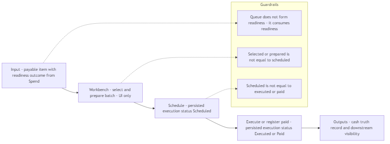
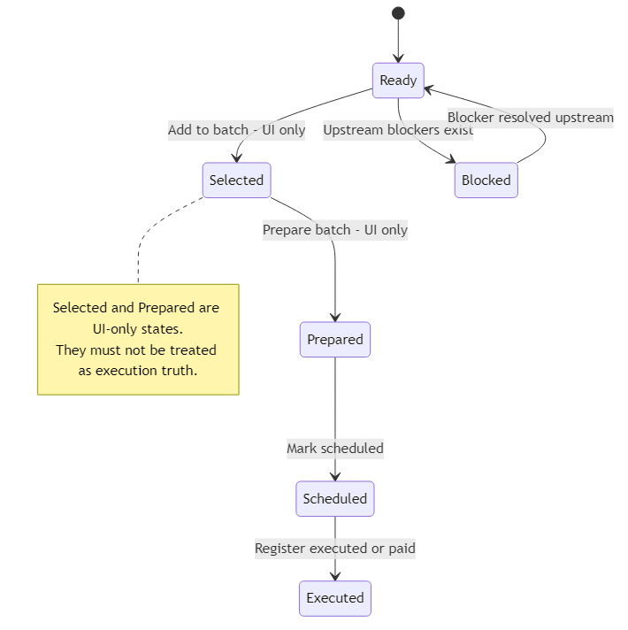

## 04 — Payments Queue Module (Ενότητα Ουράς Πληρωμών)

## 1. Σκοπός του εγγράφου

Το παρόν έγγραφο ορίζει την Ενότητα Ουράς Πληρωμών (Payments Queue Module) σε επίπεδο κανονιστικού προτύπου: αντικείμενα εισόδου, εξάρτηση ετοιμότητας, λεξιλόγιο εκτέλεσης (μόνο για τη διεπαφή vs μόνιμα δεδομένα), προτεραιότητα/φίλτρα/ενέργειες σε επίπεδο ενότητας, παραδόσεις (handoffs) και περιορισμούς της έκδοσης v1.

Δεν αποτελεί σημασιολογικό νόμο (00A), ούτε χάρτη ενοτήτων (01), ούτε προσχέδιο διεπαφής (UI blueprint), ούτε προδιαγραφή τραπεζικής συμφιλίωσης (reconciliation).

---

## 2. Ρόλος και όρια

Το Payments Queue Module είναι ο χώρος εργασίας για την εκτέλεση δαπανών / παράδοση (handoff) στο τέλος της αλυσίδας (downstream).

Κύρια αποστολή:
- Διαβάζει το πλαίσιο πληρωτέων Ready/Blocked (Έτοιμο/Μπλοκαρισμένο) από την ενότητα Spend / Supplier Bills.
- Οργανώνει τη διαλογή (triage) και την προτεραιοποίηση της ουράς.
- Υποστηρίζει τη ροή: επιλογή $\rightarrow$ προγραμματισμός $\rightarrow$ χειροκίνητη καταχώριση εκτέλεσης (v1).
- Παράγει αποτελέσματα εκτέλεσης που τροφοδοτούν την ορατότητα προς την Επισκόπηση (Overview) και τους Ελεγκτικούς Μηχανισμούς (Controls).

Όρια (Τι ΔΕΝ είναι):
- Δεν διαμορφώνει την ετοιμότητα (αυτό γίνεται upstream στο Spend / Supplier Bills).
- Δεν είναι ενότητα διερεύνησης αποκλίσεων (mismatch investigation).
- Δεν είναι προδιαγραφή τραπεζικής συμφιλίωσης ή γενική μηχανή πληρωμών.
- Η επιλογή μόνο στη διεπαφή (UI-only selection) δεν αποτελεί αλήθεια του κύκλου ζωής της πληρωμής.

---

## 3. Αντικείμενα εισόδου στην ουρά (Entry Objects)

Πρωτογενής είσοδος:
- Πλαίσιο πληρωτέων από τις Δαπάνες / Παραστατικά Προμηθευτών με ένδειξη ετοιμότητας (Ready for Payment / Blocked) και αιτίες μπλοκαρίσματος.

Τμήματα ουράς (Segments):
- Έτοιμα προς Πληρωμή (Ready for Payment)
- Μπλοκαρισμένα (Blocked) (ορατά για διαλογή / επιστροφή προς επίλυση)
- Λήγουν Σύντομα (Due Soon)
- Ληξιπρόθεσμα (Overdue)

Τι ΔΕΝ εισέρχεται στην ουρά:
- Τιμολόγια εσόδων (revenue-side invoices).
- Αιτήματα αγοράς/Δεσμεύσεις ως γραμμές εκτέλεσης.
- Τραπεζικές συναλλαγές ως πρωτογενή αντικείμενα (source objects).

---

## 4. Εξάρτηση ετοιμότητας (Readiness Dependency)

Η ουρά δεν διαμορφώνει την ετοιμότητα. Απαιτεί:
- Κατάσταση ετοιμότητας (Ready/Blocked).
- Ορατότητα της αιτίας μπλοκαρίσματος.
- Δρομολόγηση προς τη λεπτομέρεια της πηγής για επίλυση (όχι «διόρθωση εντός της ουράς»).

---

## 5. Μοντέλο καταστάσεων εκτέλεσης (Execution State Model)

Μόνιμες καταστάσεις εκτέλεσης (v1 - Persisted)
- Προγραμματισμένο (Scheduled)
- Εκτελέστηκε / Πληρώθηκε (Executed / Paid) (χειροκίνητη καταχώριση στην έκδοση v1)

Προσωρινές καταστάσεις πάγκου εργασίας (UI-only)
- Επιλεγμένο για ομαδική επεξεργασία (Selected for batch)
- Προετοιμασμένο (Prepared)

Κανονιστική εξέλιξη:

Έτοιμο/Μπλοκαρισμένο -> Επιλεγμένο/Προετοιμασμένο (UI-only) -> Προγραμματισμένο -> Εκτελέστηκε/Πληρώθηκε

Ρητές διακρίσεις:
- Επιλεγμένο/Προετοιμασμένο $\neq$ Προγραμματισμένο
- Προγραμματισμένο $\neq$ Εκτελέστηκε / Πληρώθηκε
- Η κατάσταση Εκτελέστηκε / Πληρώθηκε δεν προκύπτει αυτόματα από την ύπαρξη μιας επιλογής ή μιας ομάδας (batch).

### Module diagrams (functionality + state transitions)

#### Διάγραμμα λειτουργικής ροής - workbench, scheduling, execution

#### Διάγραμμα καταστάσεων - readiness input vs execution truth

---

## 6. Μοντέλο προτεραιότητας (Module-level)

Η προτεραιότητα στην έκδοση v1 αφορά την επιχειρησιακή διαλογή (operational triage) και όχι μια κρυφή μηχανή κανόνων.

Προεπιλεγμένη ανάγνωση:
- Ληξιπρόθεσμα (Overdue)
- Λήγουν Σύντομα (Due Soon)
- Έτοιμα (Ready)
- Μπλοκαρισμένα (Blocked) που απαιτούν επίλυση

Δευτερεύοντες παράγοντες (προαιρετικά):
- Ημερομηνία λήξης (αύξουσα).
- Σοβαρότητα καθυστέρησης (overdue severity).
- Ποσό (φθίνουσα).
- Ομαδοποίηση ανά προμηθευτή για αποτελεσματικότητα.

---

## 7. Φίλτρα (Module-level)

- Τμήμα ουράς (Ready, Blocked, Due Soon, Overdue).
- Προμηθευτής.
- Εύρος ημερομηνίας λήξης.
- Εύρος ποσού.
- Κατηγορία / Τμήμα / Έργο.
- Ύπαρξη συνδεδεμένου αιτήματος (ναι/όχι).
- Τύπος αιτίας μπλοκαρίσματος.

---

## 8. Ενέργειες (Module-level)

Ενέργειες γραμμής:
- Άνοιγμα λεπτομερειών παραστατικού (επίλυση blockers upstream).
- Προσθήκη/Αφαίρεση από την ομαδική επιλογή (UI-only).

Ομαδικές ενέργειες (Batch):
- Δημιουργία ομαδικής παράδοσης (handoff batch).
- Σήμανση ως Προγραμματισμένο (Scheduled).
- Καταχώριση ως Εκτελέστηκε / Πληρώθηκε (Executed / Paid) (χειροκίνητα, v1).

Απαγορευμένες επιπτώσεις:
- Διαμόρφωση ετοιμότητας εντός της ουράς.
- Επιβεβαίωση ολοκλήρωσης μέσω τράπεζας (τραπεζική συμφιλίωση).
- Σιωπηρή αλλαγή κατάστασης μόνο μέσω επιλογής checkbox.

---

## 9. Σχέσεις και παραδόσεις (Handoffs)

- Με τις **Δαπάνες / Παραστατικά Προμηθευτών**: Ετοιμότητα + blockers από upstream, προγραμματισμός/εκτέλεση στην ουρά.
- Με τα **Αιτήματα / Δεσμεύσεις**: Έμμεσο πλαίσιο πηγής, δεν αποτελεί ενότητα έγκρισης.
- Με την **Επισκόπηση (Overview)**: Στόχος αναδρομής (drilldown) για την πίεση εκτέλεσης δαπανών.
- Με τους **Ελεγκτικούς Μηχανισμούς (Controls)**: Εισροές για δυνατότητα ελέγχου (auditability) και ορατότητα πληρωμών.

---

## 10. Κανονιστικό λεξιλόγιο v1 (Ουρά)

Τμήματα Ουράς:
- Έτοιμα προς Πληρωμή, Μπλοκαρισμένα, Λήγουν Σύντομα, Ληξιπρόθεσμα.

Καταστάσεις Εκτέλεσης:
- UI-only: Επιλεγμένο / Προετοιμασμένο.
- Μόνιμες: Προγραμματισμένο, Εκτελέστηκε / Πληρώθηκε.

Γλώσσα Μπλοκαρίσματος (Παραδείγματα):
- Απόκλιση (Mismatch)
- Ελλιπές επισυναπτόμενο
- Ελλιπής ημερομηνία λήξης
- Εκκρεμεί έγκριση / απαιτούμενοι έλεγχοι
- Μη συνδεδεμένο παραστατικό προμηθευτή

---

## 11. Περιορισμοί v1 / Ανοιχτές αποφάσεις

- Αν το Προγραμματισμένο παραμένει μόνο κατάσταση της ουράς ή αποκτά ανεξάρτητο επιχειρησιακό αντικείμενο.
- Πώς ακριβώς καταγράφεται η «Εκτέλεση» σε επίπεδο εγγραφής πληρωμής.
- Αν θα υπάρξει επίσημο αντικείμενο «Ομαδικής Πληρωμής» (Payment Batch) ή μόνο ομαδοποιημένη επιλογή.
- Η πλήρης πολιτική για μερικές πληρωμές (partial payments) ή πολλαπλές κατανομές στις δαπάνες.
- Αν η έκδοση v1 θα περιλαμβάνει κατάσταση Επιβεβαιωμένο / Συμφωνημένο (Confirmed / Reconciled).

---

## 12. Τελική κανονιστική δήλωση

Το Payments Queue Module είναι ο χώρος εργασίας εκτέλεσης και παράδοσης της πλευράς των δαπανών. Λαμβάνει το πλαίσιο πληρωτέων από τις Δαπάνες / Παραστατικά Προμηθευτών, προβάλλει την ετοιμότητα και τα μπλοκαρίσματα, οργανώνει την ουρά σε τμήματα Έτοιμα, Μπλοκαρισμένα, Λήγουν Σύντομα και Ληξιπρόθεσμα, υποστηρίζει την επιλογή, τον προγραμματισμό και την παράδοση εκτέλεσης, και παράγει αποτελέσματα πληρωμών που ενημερώνουν τα επίπεδα εποπτείας και ελέγχου. Δεν είναι ενότητα συμφωνίας (matching), δεν είναι μηχανή παραγωγής ετοιμότητας, δεν είναι γενικό σύστημα τραπεζικής συμφιλίωσης και δεν έχει καμία άμεση λειτουργική σχέση με τα τιμολόγια πελατών της πλευράς των εσόδων.

