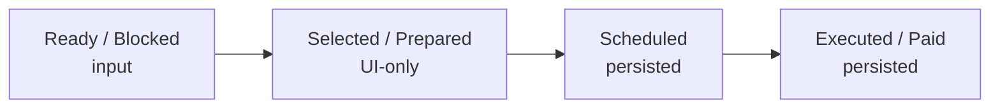

# 04 — Payments Queue Module

## 1. Σκοπός του εγγράφου

Το παρόν έγγραφο ορίζει το `Payments Queue Module` σε επίπεδο module canon: entry objects, readiness dependency, execution vocabulary (UI-only vs persisted), priority/filters/actions σε module επίπεδο, handoffs και v1 limits.
Δεν αποτελεί semantic-law (`00A`), ούτε module map (`01`), ούτε UI blueprint, ούτε bank/reconciliation spec.

---

## 2. Ρόλος και boundaries

Το `Payments Queue Module` είναι το downstream spend execution / handoff workspace.

Κύρια δουλειά:
- διαβάζει `Ready/Blocked` payable context από `Spend / Supplier Bills`,
- οργανώνει queue triage και priority,
- υποστηρίζει selection → scheduling → manual execution registration (v1),
- παράγει execution outcomes που τροφοδοτούν visibility προς `Overview`/`Controls`.

Boundaries (τι δεν είναι):
- Δεν σχηματίζει readiness (αυτό γίνεται upstream στο `Spend / Supplier Bills`).
- Δεν είναι upstream mismatch investigation module.
- Δεν είναι bank reconciliation spec ή generic payment engine.
- UI-only selection δεν είναι payment lifecycle truth.

---

## 3. Τι εισέρχεται στην ουρά (entry objects)

Primary entry:
- payable context από `Spend / Supplier Bills` με readiness (`Ready for Payment` / `Blocked`) + blocked reasons.

Queue segments:
- `Ready for Payment`
- `Blocked` (visible for triage / return-to-resolve)
- `Due Soon`
- `Overdue`

Not primary queue objects:
- revenue-side invoices
- purchase requests/commitments ως execution rows
- bank transactions ως source objects

---

## 4. Readiness dependency (queue reads, upstream forms)

Το queue δεν σχηματίζει readiness. Απαιτεί:
- readiness (`Ready`/`Blocked`)
- blocked reason visibility
- δρομολόγηση προς source detail για resolve (όχι “fix inside queue”).

---

## 5. Execution state model (anti-drift)

**Persisted execution statuses (v1)**
- `Scheduled`
- `Executed / Paid` *(manual registration in v1)*

**UI-only workbench states**
- `Selected for batch`
- `Prepared`

Canonical progression:
`Ready/Blocked -> Selected/Prepared (UI-only) -> Scheduled -> Executed/Paid`

Ρητές διακρίσεις:
- `Selected/Prepared` ≠ `Scheduled`
- `Scheduled` ≠ `Executed / Paid`
- `Executed / Paid` δεν συνάγεται από selection/batch ύπαρξη

---

## 6. Priority model (module-level)

Το v1 priority είναι operational triage (όχι hidden policy engine).

Default reading:
- `Overdue`
- `Due Soon`
- `Ready`
- `Blocked` που χρειάζονται resolve

Secondary factors (optional):
- due date ascending
- overdue severity
- amount descending
- grouping by supplier για batch efficiency

---

## 7. Filters (module-level)

Τα screen contract details ανήκουν στο UI Blueprint. Εδώ ορίζεται το module-level φίλτρο-σκοπός:
- segment (`Ready`, `Blocked`, `Due Soon`, `Overdue`)
- supplier
- due date range
- amount range
- category/department/project
- linked request exists (yes/no)
- blocked reason type

---

## 8. Actions (module-level)

Row actions:
- open bill detail (resolve blockers upstream)
- add/remove batch selection (UI-only)

Batch actions:
- create handoff batch
- mark as `Scheduled`
- register `Executed / Paid` (manual, v1)

Forbidden implications:
- readiness formation inside queue
- bank-confirmed completion
- silent status rewrite from checkbox selection

---

## 9. Relations / handoffs

- Με `Spend / Supplier Bills`: readiness + blockers upstream, queue schedules/executes.
- Με `Purchase Requests / Commitments`: έμμεσο upstream context, όχι approval module.
- Με `Overview`: drilldown target για spend execution pressure.
- Με `Controls`: auditability + “paid” visibility inputs.

---

## 10. Canonical v1 vocabulary (queue)

Queue segments:
- `Ready for Payment`, `Blocked`, `Due Soon`, `Overdue`

Execution states:
- UI-only: `Selected / Prepared`
- persisted: `Scheduled`, `Executed / Paid`

Blocker language (examples):
- `Mismatch`
- `Missing attachment`
- `Missing due date`
- `Missing approval / required controls`
- `Unlinked supplier bill`

---

## 11. Current v1 limitations / known open decisions

Κρίσιμα σημεία που παραμένουν open για σταθεροποίηση:
- αν το `Scheduled` είναι μόνο queue state ή αποκτά ανεξάρτητο business object
- πώς ακριβώς καταγράφεται το `Execute` σε επίπεδο payment record
- αν υπάρχει ρητό payment batch object ή μόνο grouped selection/handoff
- ποια είναι η πλήρης πολιτική για partial / multi-allocation στο spend side
- αν θα υπάρξει αργότερα `Confirmed / Reconciled` state ή το v1 σταματά στο `Executed / Paid`

Τα παραπάνω παραμένουν open decisions και δεν πρέπει να καλύπτονται με ασαφή labels.

---

## 12. Final canonical statement

Το `Payments Queue Module` είναι το downstream execution / handoff workspace του spend side.  
Λαμβάνει payable context από το `Spend / Supplier Bills`, προβάλλει readiness και blockers, οργανώνει την ουρά σε `Ready`, `Blocked`, `Due Soon` και `Overdue` segments, υποστηρίζει selection, scheduling και execution handoff, και παράγει payment outcomes που ενημερώνουν το monitoring και control layer. Δεν είναι module matching, δεν είναι upstream readiness engine, δεν είναι generic bank/reconciliation system, και δεν έχει άμεση operational σχέση με customer invoices του revenue side.

