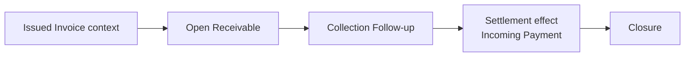

# 05 — Receivables / Collections Module

## 1. Σκοπός του εγγράφου

Το παρόν έγγραφο ορίζει το `Receivables / Collections Module` σε επίπεδο module canon: ρόλο, boundaries, follow-up model, overdue/aging prioritization, collection context (notes/owner/next action/reminders), status vocabulary και handoffs.
Δεν αποτελεί semantic-law (αυτό ορίζεται στο `00A`) ούτε UI blueprint.

---

## 2. Ρόλος και boundaries

Το `Receivables / Collections Module` είναι το revenue-downstream **worklist-first** follow-up module μετά το `Issue`.

Κύρια δουλειά:
- οργανώνει την καθημερινή εργασία είσπραξης πάνω σε open receivables (prioritization με βάση overdue/aging/outstanding),
- κρατά traceable collection context (owner, notes, next action, reminders),
- παρακολουθεί settlement effect ώστε να ενημερώνεται το outstanding και το closure.

Boundaries (τι δεν είναι):
- Δεν είναι `Invoicing` (δεν κατέχει invoice document truth).
- Δεν είναι payment registration engine ή bank/reconciliation truth.
- Δεν είναι `Overview` (monitoring shell).
- Δεν είναι CRM playbook· κρατά module-local follow-up canon, όχι πλήρη “collections methodology”.

---

## 3. Canonical constraints που εφαρμόζει (ως references)

Το module εφαρμόζει (χωρίς να τα επαναορίζει) τους canonical κανόνες του `00A`:
- **Downstream non-ownership of invoice truth**: το invoice truth ανήκει στο `Invoicing`.
- **Receivable derivation από issued truth**: η βάση της απαίτησης προκύπτει από issued snapshot.
- **Outstanding changes only by settlement**: notes/workflow δεν αλλάζουν financial truth.
- **Overdue is computed**: signal, όχι manually asserted state.
- **State-family separation**: receivable status / workflow state / signals / UI-only state δεν συγχωνεύονται.

---

## 4. Inputs και outputs (read-only + follow-up)

Inputs:
- Από `Invoicing`: issued invoice context (issued totals snapshot, issue/due date, customer identity, references).
- Από settlement/cash-in context: applied incoming payment effects (όπου υπάρχουν) που επηρεάζουν outstanding/closure.
- Από χρήστη (operational): owner, notes, next action, expected payment context, reminder/escalation events.

Outputs:
- Worklist prioritization + follow-up context (operational truth).
- Receivable progression visibility (open/partial/collected/closed) **βάσει settlement effect**.
- Signals προς `Overview` (outstanding/overdue/aging/pressure) και auditability προς `Controls`.

---

## 5. Core concepts (capsule)

- `Receivable`: downstream claim που παράγεται από issued invoice truth.
- `Outstanding Amount`: το ανοικτό ποσό τώρα (μειώνεται μόνο από applied settlement).
- `Due Date` → `Overdue` (computed) → `Aging Bucket` (computed grouping).
- Collection context: `Owner`, `Next Action`, `Expected Payment Date` (operational expectation), `Notes`, `Reminder Events`, `Escalation`.

---

## 6. Module surfaces (όχι UI spec)

- `Collections / Receivables View`: primary worklist για follow-up.
- `Receivable Context Panel / Row Context`: quick triage/update χωρίς deep navigation.
- `Invoice Detail View` (adjacent): deep inspection surface· το worklist παραμένει primary.

---

## 7. Core flow (local)

Flow capsule:
- Δημιουργία receivable από issued invoice context.
- Worklist visibility + overdue/aging prioritization.
- Follow-up updates (owner/notes/next action/reminders/escalation) χωρίς αλλαγή financial truth.
- Settlement effect μειώνει outstanding → partial/collected → closure.

---

## 8. Module-local rules (anti-drift protections)

Κρατούν το module “collections follow-up” και όχι “invoice rewrite” ή “pseudo-cash engine”:

- **Receivables does not own invoice truth**: δεν επιτρέπεται αλλαγή της βάσης απαίτησης μέσω draft/preview ή workflow flags.
- **Outstanding rule (module view)**: outstanding αλλάζει μόνο από settlement input / applied incoming payments.
- **Notes/reminders are not settlement**: reminder/contact/note δεν συνεπάγεται paid/collected state.
- **Expected Payment Date is not Due Date**: δεν ακυρώνει overdue και δεν γίνεται primary overdue date semantics.
- **Overdue / aging are computed**: δεν υπάρχουν “manual overdue” toggles ως financial truth.
- **Worklist-first**: το primary surface είναι follow-up worklist, όχι “invoice list”.

---

## 9. Lifecycle & status vocabulary (module-specific)

Το module εκθέτει μόνο module-local vocabulary, συμβατό με το state-family separation του `00A`.

**Persisted receivable statuses (financial progression)**
- `Open`
- `Partially Collected`
- `Collected`
- `Closed`

**Collection workflow states (operational)**
- `No Follow-up Yet`
- `Follow-up Active`
- `Awaiting Reply`
- `Expected Payment Logged`
- `Escalated`
- `Suspended by Dispute` *(controlled / optional area)*
- `Resolved`

**Operational signals (computed/derived)**
- `Not Due`
- `Due Soon`
- `Overdue`
- `High-Risk Overdue`
- `No Recent Follow-up`
- `Expected Date Missed`

**Readiness / escalation states**
- `Ready for Reminder`
- `Ready for Escalation`
- `Monitoring Only`

**UI-only flags (examples)**
- `Selected for Bulk Action`
- `Pinned High-Risk`
- `Inline Validation Error`
- `Quick Note Draft`

Απαγορεύεται η σύγχυση:
- receivable status με invoice document status,
- workflow state με settlement,
- overdue signal με persisted financial state.

---

## 10. Overdue & aging model (module-level)

Minimal overdue rule:
- overdue όταν `due date < today` και `outstanding > 0`.

Default aging buckets (v1):
- `Not Due`, `1–15`, `16–30`, `31–60`, `60+`

Worklist prioritization (capsule):
- μεγαλύτερο overdue age,
- μεγαλύτερο outstanding,
- stale/no follow-up,
- missed expected payment.

---

## 11. Collection tracking & reminder model (module-level)

Minimum follow-up context per receivable:
- owner
- last note/contact
- next action
- expected payment date
- workflow state
- reminder/contact history summary

Reminder ladder (v1 default, policy-controlled):
- `Courtesy Reminder` *(optional, pre-due)*
- `Due Reminder`
- `Early Overdue Reminder`
- `Active Collection Reminder`
- `Escalation Reminder`

Reminder boundary:
- reminder history αυξάνει visibility, δεν υποκαθιστά settlement truth.

---

## 12. Relations / handoffs με άλλα modules

- Με `Invoicing`: read issued invoice context, non-ownership of invoice truth.
- Με settlement/cash-in context: applied effects μειώνουν outstanding/οδηγούν closure.
- Με `Overview`: τροφοδοτεί monitoring signals, χωρίς να γίνεται monitoring layer.
- Με `Controls`: audit/traceability visibility.

---

## 13. In-scope / Out-of-scope (capsule)

In-scope:
- open receivable visibility + worklist prioritization
- overdue/aging computed signals
- owner/notes/next action/expected payment context
- reminders/escalation (follow-up), όχι settlement
- settlement-driven outstanding & closure visibility

Out-of-scope:
- invoice drafting/issue
- mutation of issued invoice truth/totals
- mark-as-paid χωρίς settlement input
- bank reconciliation / accounting engine ownership

---

## 14. v1 limitations / stabilization notes (non-canonical)

Stabilization targets:
- καθαρή ευθυγράμμιση `issued totals → receivable base amount → outstanding`
- αυστηρός διαχωρισμός financial status από workflow status σε όλα τα surfaces
- σταθεροποίηση vocabulary για owner/next action/expected payment
- reminder ladder & escalation thresholds (policy)
- partial collection visibility (worklist vs detail)
- controlled handling για dispute/suspension/non-standard closure
- ευθυγράμμιση dashboard metrics με worklist semantics

---

## 15. Open questions / controlled decisions

- αν το `Expected Payment` vocabulary θα είναι ελεύθερο ή ελεγχόμενο
- αν το `Promise to Pay` θα είναι ξεχωριστό workflow concept ή μέρος note/expected context
- αν το `Dispute` θα είναι subflow ή controlled flag στο v1
- ποιο threshold ενεργοποιεί `High-Risk Overdue`
- ποια bulk reminder/escalation actions επιτρέπονται στο πρώτο operational release

---

## 16. Τελική διατύπωση module statement

Το `Receivables / Collections Module` είναι το canonical revenue-downstream worklist-first follow-up module του Finance Management & Monitoring System v1: παραλαμβάνει issued invoice context, οργανώνει τις ανοικτές απαιτήσεις ως actionable worklist με βάση outstanding/due/overdue/aging, διαχειρίζεται collection context (owner/notes/next action/reminders/escalation) χωρίς να αλλάζει financial truth, και ενημερώνει outstanding/closure μόνο μέσω settlement effect, χωρίς να κατέχει invoice truth ή cash truth.
