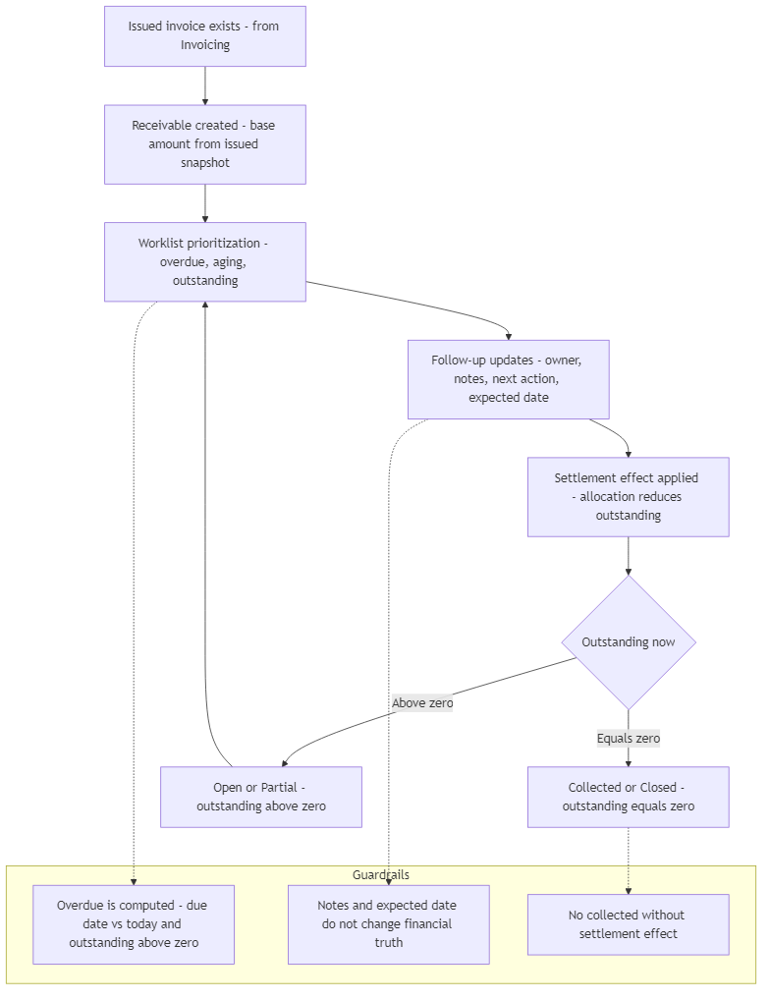
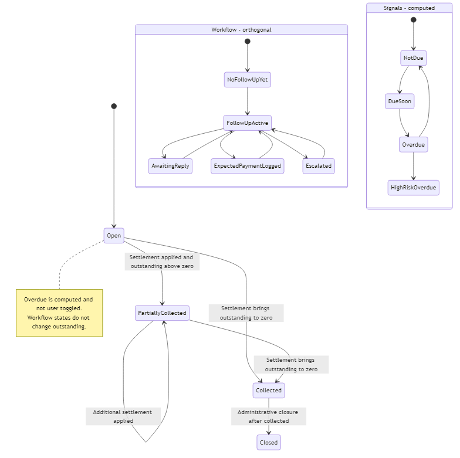

## 05 — Receivables / Collections Module (Ενότητα Απαιτήσεων)

## 1. Σκοπός του εγγράφου

Το παρόν έγγραφο ορίζει την Ενότητα Απαιτήσεων & Εισπράξεων (Receivables / Collections) σε επίπεδο κανονιστικού προτύπου: ρόλο, όρια, μοντέλο παρακολούθησης (follow-up), προτεραιοποίηση ληξιπροθέσμων (overdue/aging), πλαίσιο είσπραξης (σημειώσεις/υπεύθυνος/επόμενη ενέργεια/υπενθυμίσεις), λεξιλόγιο καταστάσεων και παραδόσεις (handoffs).

Δεν αποτελεί σημασιολογικό νόμο (00A) ούτε προσχέδιο διεπαφής (UI blueprint).

---

## 2. Ρόλος και όρια

Το Receivables / Collections Module είναι η ενότητα που έπεται της τιμολόγησης (revenue-downstream) και λειτουργεί με βάση τη λίστα εργασίας (worklist-first) για την παρακολούθηση των εισπράξεων μετά την «Έκδοση» (Issue).

Κύρια αποστολή:
- Οργανώνει την καθημερινή εργασία είσπραξης πάνω στις ανοικτές απαιτήσεις (προτεραιοποίηση βάσει καθυστέρησης/παλαίωσης/υπολοίπου).
- Διατηρεί ανιχνεύσιμο πλαίσιο είσπραξης (υπεύθυνος, σημειώσεις, επόμενη ενέργεια, υπενθυμίσεις).
- Παρακολουθεί την επίδραση των εξοφλήσεων (settlement effect) ώστε να ενημερώνεται το ανείσπρακτο υπόλοιπο (outstanding) και το κλείσιμο της απαίτησης.

Όρια (Τι ΔΕΝ είναι):
- Δεν είναι η ενότητα Τιμολόγησης (Invoicing) (δεν κατέχει την αλήθεια του εγγράφου).
- Δεν είναι μηχανή καταχώρισης πληρωμών ή τραπεζική πηγή αλήθειας (reconciliation).
- Δεν είναι η Επισκόπηση (Overview) (κέλυφος εποπτείας).
- Δεν είναι CRM playbook· διατηρεί τοπικό κανονιστικό πλαίσιο παρακολούθησης, όχι πλήρη «μεθοδολογία εισπράξεων».

---

## 3. Κανονιστικοί περιορισμοί (Αναφορές)

Η ενότητα εφαρμόζει πιστά τους κανόνες του 00A:
- Μη-ιδιοκτησία της αλήθειας του τιμολογίου: Η αλήθεια ανήκει στην Τιμολόγηση.
- Παραγωγή απαίτησης από την εκδοθείσα αλήθεια: Η βάση της απαίτησης προκύπτει από το «στιγμιότυπο έκδοσης» (issued snapshot).
- Μεταβολή υπολοίπου μόνο μέσω εξόφλησης: Σημειώσεις και ροές εργασίας δεν αλλάζουν την οικονομική αλήθεια.
- Το Ληξιπρόθεσμο (Overdue) είναι υπολογιζόμενο: Αποτελεί σήμα (signal), όχι χειροκίνητα ορισμένη κατάσταση.
- Διαχωρισμός οικογενειών κατάστασης: Οι καταστάσεις απαίτησης, οι ροές εργασίας και τα σήματα δεν συγχέονται.

---

## 4. Εισροές και εκροές (Ανάγνωση + Παρακολούθηση)

Εισροές:
- Από Τιμολόγηση: Πλαίσιο εκδοθέντος τιμολογίου (σύνολα, ημερομηνία έκδοσης/λήξης, ταυτότητα πελάτη).
- Από Εξόφληση (Settlement/Cash-in): Εφαρμοσμένες εισερχόμενες πληρωμές που επηρεάζουν το υπόλοιπο.
- Από Χρήστη (Operational): Υπεύθυνος, σημειώσεις, επόμενη ενέργεια, αναμενόμενη πληρωμή, υπενθυμίσεις.

Εκροές:
- Προτεραιοποίηση λίστας εργασίας + πλαίσιο παρακολούθησης (επιχειρησιακή αλήθεια).
- Ορατότητα εξέλιξης απαίτησης (ανοικτή/μερική/εισπραχθείσα/κλειστή) βάσει εξόφλησης.
- Σήματα προς την Επισκόπηση (υπόλοιπο/καθυστέρηση/πίεση) και δυνατότητα ελέγχου (auditability) προς τους Ελεγκτικούς Μηχανισμούς.

---

## 5. Βασικές έννοιες (Σύνοψη)

- Απαίτηση (Receivable): Η αξίωση είσπραξης που παράγεται από το εκδοθέν τιμολόγιο.
- Ανείσπρακτο Υπόλοιπο (Outstanding Amount): Το τρέχον ανοικτό ποσό (μειώνεται μόνο από εφαρμοσμένη εξόφληση).
- Ημερομηνία Λήξης $\rightarrow$ Ληξιπρόθεσμο (Overdue) (υπολογιζόμενο) $\rightarrow$ Ζώνη Παλαίωσης (Aging Bucket) (υπολογιζόμενη ομαδοποίηση).
- Πλαίσιο Είσπραξης: Υπεύθυνος, Επόμενη Ενέργεια, Αναμενόμενη Ημερομηνία Πληρωμής, Σημειώσεις, Συμβάντα Υπενθύμισης, Κλιμάκωση (Escalation).

---

## 6. Επιφάνειες Ενότητας (Module Surfaces)

- Προβολή Απαιτήσεων / Εισπράξεων: Πρωτογενής λίστα εργασίας για το follow-up.
- Πλαίσιο Απαίτησης / Γραμμής (Context Panel): Γρήγορη διαλογή και ενημέρωση χωρίς βαθιά πλοήγηση.
- Λεπτομέρεια Τιμολογίου (Adjacent): Επιφάνεια βαθιάς επιθεώρησης· η λίστα εργασίας παραμένει το κύριο σημείο εστίασης.

---

## 7. Τοπική Ροή Ενότητας (Core Flow)

Δημιουργία απαίτησης από το εκδοθέν τιμολόγιο.
Ορατότητα στη λίστα εργασίας + προτεραιοποίηση βάσει καθυστέρησης/παλαίωσης.
Ενημερώσεις παρακολούθησης (σημειώσεις/υπενθυμίσεις) χωρίς αλλαγή της οικονομικής αλήθειας.
Η επίδραση της εξόφλησης μειώνει το υπόλοιπο $\rightarrow$ μερική/πλήρης είσπραξη $\rightarrow$ κλείσιμο.

### Module diagrams (functionality + state transitions)

#### Διάγραμμα λειτουργικής ροής - worklist, follow-up, settlement

#### Διάγραμμα καταστάσεων - financial progression, workflow, signals

---

## 8. Τοπικοί κανόνες προστασίας (Anti-drift)

- Η ενότητα δεν κατέχει την αλήθεια του τιμολογίου: Δεν επιτρέπεται αλλαγή της βάσης της απαίτησης μέσω προσχεδίων ή workflow flags.
- Κανόνας Υπολοίπου: Το ανείσπρακτο ποσό αλλάζει μόνο από εισροή εξόφλησης / εφαρμοσμένες πληρωμές.
- Σημειώσεις/Υπενθυμίσεις $\neq$ Εξόφληση: Μια επικοινωνία ή υπενθύμιση δεν συνεπάγεται κατάσταση «εξοφλήθηκε».
- Αναμενόμενη Ημερομηνία Πληρωμής $\neq$ Ημερομηνία Λήξης: Δεν ακυρώνει το ληξιπρόθεσμο σήμα.
- Ληξιπρόθεσμα & Παλαίωση: Είναι υπολογιζόμενα μεγέθη (computed), όχι χειροκίνητες ρυθμίσεις.

---

## 9. Λεξιλόγιο κύκλου ζωής & καταστάσεων

Μόνιμες καταστάσεις απαίτησης (Οικονομική εξέλιξη)
- Ανοικτή (Open)
- Μερικώς Εισπραχθείσα (Partially Collected)
- Εισπραχθείσα (Collected)
- Κλειστή (Closed)

Καταστάσεις ροής εργασίας είσπραξης (Επιχειρησιακές)
- Χωρίς Ενέργεια (No Follow-up Yet)
- Ενεργή Παρακολούθηση (Follow-up Active)
- Αναμονή Απάντησης (Awaiting Reply)
- Καταχωρημένη Αναμενόμενη Πληρωμή
- Σε Κλιμάκωση (Escalated)
- Σε Αμφισβήτηση (Suspended by Dispute) (ελεγχόμενη περιοχή)
- Επιλύθηκε (Resolved)

Λειτουργικά σήματα (Υπολογιζόμενα)
- Εκτός Λήξης (Not Due)
- Λήγει Σύντομα (Due Soon)
- Ληξιπρόθεσμο (Overdue)
- Υψηλού Κινδύνου (High-Risk Overdue)
- Στάσιμη Παρακολούθηση (No Recent Follow-up)

---

## 10. Μοντέλο Ληξιπροθέσμων & Παλαίωσης

Κανόνας Ληξιπροθέσμου: Όταν ημερομηνία λήξης < σήμερα και υπόλοιπο > 0.

Ζώνες Παλαίωσης (Aging Buckets v1):
- Εκτός Λήξης, 1–15, 16–30, 31–60, 60+ ημέρες.

Προτεραιοποίηση Λίστας: Μεγαλύτερη καθυστέρηση, μεγαλύτερο ποσό, στάσιμη παρακολούθηση, αστοχία αναμενόμενης πληρωμής.

---

## 11. Μοντέλο Υπενθυμίσεων (v1)

Ελάχιστο πλαίσιο: Υπεύθυνος, τελευταία σημείωση/επαφή, επόμενη ενέργεια, αναμενόμενη ημερομηνία, ιστορικό υπενθυμίσεων.

Κλίμακα Υπενθυμίσεων (Ladder):
- Υπενθύμιση Ευγενείας (προαιρετική)
- Υπενθύμιση Λήξης
- Πρώτη Υπενθύμιση Καθυστέρησης
- Ενεργή Διεκδίκηση
- Υπενθύμιση Κλιμάκωσης

---

## 12. Σχέσεις με άλλες ενότητες

Με Τιμολόγηση: Ανάγνωση πλαισίου εκδοθέντος τιμολογίου, μη-ιδιοκτησία της αλήθειας του εγγράφου.

Με Εξόφληση: Τα εφαρμοσμένα αποτελέσματα μειώνουν το υπόλοιπο και οδηγούν στο κλείσιμο.

Με Επισκόπηση: Τροφοδοτεί σήματα εποπτείας (monitoring signals).

Με Ελεγκτικούς Μηχανισμούς: Ορατότητα ιστορικού και ανιχνευσιμότητα (audit).

---

## 13. Περιορισμοί v1 / Σημειώσεις Σταθεροποίησης

- Αυστηρή ευθυγράμμιση: Εκδοθέντα Σύνολα → Βάση Απαίτησης → Ανείσπρακτο Υπόλοιπο.
- Καθαρός διαχωρισμός οικονομικής κατάστασης από την κατάσταση ροής εργασίας.
- Σταθεροποίηση του λεξιλογίου για τον «Υπεύθυνο» και την «Αναμενόμενη Πληρωμή».
- Καθορισμός των ορίων κλιμάκωσης (escalation thresholds).

---

## 14. Τελική κανονιστική δήλωση

Το Receivables / Collections Module είναι η κεντρική ενότητα παρακολούθησης των εσόδων του συστήματος Finance v1: παραλαμβάνει το πλαίσιο του εκδοθέντος τιμολογίου, οργανώνει τις ανοικτές απαιτήσεις ως λειτουργική λίστα εργασίας βάσει υπολοίπου και παλαίωσης, διαχειρίζεται το πλαίσιο είσπραξης (υπεύθυνος/σημειώσεις/υπενθυμίσεις) χωρίς να αλλοιώνει την οικονομική αλήθεια, και ενημερώνει το υπόλοιπο και το κλείσιμο αποκλειστικά μέσω των αποτελεσμάτων εξόφλησης, χωρίς να κατέχει την αλήθεια του τιμολογίου ή του ταμείου.
