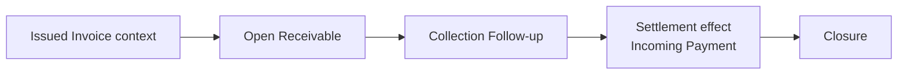

# 05 — Receivables / Collections Module

## 1. Σκοπός του εγγράφου

Το παρόν έγγραφο ορίζει το `Receivables / Collections Module` σε module-definition επίπεδο, ως canonical περιγραφή ρόλου, ορίων, semantics και εξαρτήσεων.

Ορίζει:
- τον ρόλο του module στο σύστημα
- τη σχέση του με το `Invoicing` και το `Incoming Payment` context
- τα core business concepts του receivable follow-up
- τους canonical κανόνες δημιουργίας receivable, outstanding, overdue και closure
- το διαχωρισμό financial truth, collection workflow και monitoring signal
- τις σχέσεις του με τα υπόλοιπα modules

Δεν είναι:
- implementation specification
- pixel-level UI spec
- route tree
- API/storage logic
- detailed screen blueprint

---

## 2. Θέση του εγγράφου στην ιεραρχία finance documentation

Το παρόν document δεσμεύεται από:
- `00 — Finance Canonical Brief`
- `00A — Finance Domain Model & System Alignment`
- `01 — Finance Module Map`

Και εξειδικεύει τα παραπάνω για το `Receivables / Collections` module, με συνέπεια προς το συνολικό documentation set του v1.

---

## 3. Ταυτότητα και ρόλος του module

Το `Receivables / Collections Module` είναι το canonical revenue-downstream operational follow-up module που αναλαμβάνει την επιχειρησιακή παρακολούθηση των απαιτήσεων μετά το `Issue`.

Ο ρόλος του είναι να καλύπτει τον operational κύκλο:
`Issued Invoice -> Open Receivable -> Collection Follow-up -> Settlement visibility -> Closure`.

Το module είναι ξεχωριστό γιατί:
- δεν δημιουργεί invoice truth, αλλά παραλαμβάνει issued invoice context
- οργανώνει την καθημερινή εργασία follow-up πάνω σε ανοικτές απαιτήσεις
- μετατρέπει overdue / aging / owner / next action σε πραγματικό worklist
- κρατά καθαρό διαχωρισμό ανάμεσα σε financial claim, collection workflow και payment settlement input

Δεν ταυτίζεται με:
- `Invoicing` (issue / invoice document truth)
- `Overview` (monitoring shell)
- payment registration engine
- bank / reconciliation engine
- accounting engine

---

## 4. Σκοπός του module μέσα στο Finance System

Η θέση του module μέσα στη Revenue chain είναι:

`Billable Work -> Invoice Draft -> Issued Invoice -> Receivable -> Incoming Payment`

Upstream:
- issued invoice context από το `Invoicing`
- canonical issued totals snapshot που δίνει τη βάση της απαίτησης

Downstream / adjacent:
- incoming payment / settlement input που μειώνει ή κλείνει την απαίτηση
- monitoring και control visibility προς `Overview` και `Controls`

Ο ρόλος του module είναι να κάνει operationally visible:
- ποιες απαιτήσεις είναι ανοικτές
- ποιες είναι overdue ή high-risk
- ποιος είναι owner του follow-up
- ποιο είναι το επόμενο collection step
- ποια απαίτηση πλησιάζει σε closure και ποια χρειάζεται escalation

Το module δεν είναι απλώς “λίστα invoices”.
Είναι follow-up workspace για open receivables με overdue-driven prioritization.

---

## 5. Αρχές που διέπουν το Receivables / Collections Module

### 5.1 Downstream non-ownership of invoice truth
Το `Receivables` δεν κατέχει την αλήθεια του invoice document.  
Η issued invoice truth παραμένει στο `Invoicing`.

### 5.2 Receivable derivation from issued truth
Το `Receivable` προκύπτει από το issued invoice context και από τα canonical issued totals.  
Το module δεν επιτρέπεται να επαναορίζει το ποσό της απαίτησης με βάση draft ή preview context.

### 5.3 Collection workflow is not financial truth replacement
Το collection follow-up είναι operational layer.  
Notes, owner, next action, expected payment date, reminder level και escalation context δεν αντικαθιστούν το financial truth της απαίτησης.

### 5.4 Outstanding derives from settlement, not from notes
Το `Outstanding` μειώνεται μόνο από settlement input (`Incoming Payment` / receipt allocation context) και όχι από collection activity, reminder sending ή χειροκίνητα workflow flags.

### 5.5 Overdue is computed, not manually asserted
Το `Overdue` είναι computed signal με βάση due date και outstanding amount.  
Δεν αποτελεί ανεξάρτητο source-of-truth object ούτε manually editable financial state.

### 5.6 Worklist-first collections
Η collections εργασία οργανώνεται ως κεντρικό worklist με overdue-driven prioritization, owner visibility και next-step context.  
Δεν συγχέεται με τη γενική invoice list.

### 5.7 State-type separation
Διαχωρίζονται ρητά:
- persisted receivable status
- collection workflow state
- operational signal
- readiness / escalation state
- UI-only temporary state

### 5.8 Reminder activity is follow-up, not settlement
Η αποστολή reminder ή η καταγραφή επικοινωνίας είναι follow-up event.  
Δεν αλλάζει από μόνη της την οικονομική κατάσταση της απαίτησης.

---

## 6. Inputs, dependencies και πηγές module truth

### Upstream input
- `Issued Invoice` context από το `Invoicing`
- issued totals snapshot ως βάση της απαίτησης
- issue date, due date, customer / billing identity και document reference context

### Settlement input
- `Incoming Payment` / receipt allocation context όπου υπάρχει διαθέσιμο
- payment effect πάνω στο outstanding amount και στο closure state του receivable

### Operational collection input
- owner assignment
- collection notes
- expected payment context
- reminder events
- next action / follow-up scheduling
- escalation / dispute context όπου υποστηρίζεται

### Downstream impact
- τροφοδοτεί το `Overview` με outstanding / overdue / aging / collection pressure signals
- τροφοδοτεί τα `Controls` με auditability και follow-up context
- καθορίζει την operational εικόνα είσπραξης στο revenue side

### Σχέση με το `Invoice Detail`
Το module χρησιμοποιεί το `Invoice Detail` ως single-record review context για deeper inspection.  
Το `Collections` worklist παραμένει η primary follow-up surface.

---

## 7. Core business concepts του module

### `Receivable`
Η επιχειρησιακή απαίτηση που προκύπτει από issued invoice truth και παραμένει ανοικτή μέχρι να καλυφθεί πλήρως ή να κλείσει με controlled τρόπο.

### `Outstanding Amount`
Το ανοικτό ποσό της απαίτησης σε μια συγκεκριμένη στιγμή.

### `Collected Amount`
Το ποσό που έχει ήδη καλυφθεί μέσω settlement input.

### `Due Date`
Η ημερομηνία που χρησιμοποιείται για operational maturity και overdue computation.

### `Overdue`
Computed signal που δείχνει ότι due date έχει παρέλθει ενώ outstanding amount παραμένει θετικό.

### `Aging Bucket`
Ομαδοποίηση απαιτήσεων με βάση πόσες ημέρες έχουν περάσει από το due date.

### `Collection Follow-up`
Η οργανωμένη επιχειρησιακή εργασία παρακολούθησης απαίτησης μετά το issue.

### `Collection Owner`
Ο υπεύθυνος της επόμενης follow-up ενέργειας για το receivable.

### `Next Action`
Το επόμενο operational βήμα follow-up (π.χ. call, email, review, escalate).

### `Expected Payment Date`
Η ημερομηνία που δηλώνει την επιχειρησιακή προσδοκία είσπραξης.  
Δεν αντικαθιστά το due date ούτε ακυρώνει το overdue signal.

### `Collection Note`
Operational traceability element που καταγράφει επικοινωνία, συμπέρασμα ή επόμενο βήμα.

### `Reminder Event`
Καταγεγραμμένη follow-up ενέργεια υπενθύμισης με χρόνο, actor, κανάλι και αποτέλεσμα.

### `Escalation Context`
Operational ένδειξη ότι το receivable χρειάζεται ένταση follow-up ή μεταφορά σε ανώτερο επίπεδο διαχείρισης.

---

## 8. Module surfaces / operational surfaces

### `Collections / Receivables View`
- **Ρόλος:** primary follow-up worklist για ανοικτές απαιτήσεις.
- **Primary question:** ποια receivables χρειάζονται άμεση follow-up ενέργεια και ποιο είναι το επόμενο βήμα για το καθένα.
- **Primary action:** άνοιγμα receivable context και ενημέρωση note / owner / next action / expected payment context.
- **Θέση στο flow:** κύρια execution surface του module.

### `Receivable Context Panel / Row Context`
- **Ρόλος:** quick triage context μέσα από worklist ή side panel.
- **Primary question:** ποιο είναι το τελευταίο follow-up, ποιος είναι owner και ποιο είναι το risk level.
- **Primary action:** quick note / assign / set expected payment date / open invoice detail.
- **Θέση στο flow:** fast review surface χωρίς deep navigation.

### `Invoice Detail View` (adjacent deep-review surface)
- **Ρόλος:** single-record inspection surface για πλήρες receivable context.
- **Primary question:** ποια είναι η πλήρης κατάσταση του συγκεκριμένου issued invoice / receivable.
- **Primary action:** deeper review και contextual handoff πίσω στο collections workflow.
- **Θέση στο flow:** supporting detail surface, όχι primary collection worklist.

---

## 9. Core flows του Receivables / Collections Module

Το παρακάτω local diagram προστίθεται εδώ για να αποτυπώσει τη downstream receivable progression του module, χωρίς να συγχέει invoice lifecycle με collection/payment progression.

Τι δείχνει: `Issued Invoice -> Open Receivable -> Follow-up -> Settlement -> Closure`.  
Τι δεν δείχνει: μεταβολή invoice document truth από collection notes/workflow markers.

### 9.1 Receivable creation from issued invoice
Μετά το `Issue`, δημιουργείται linked receivable context πάνω στο issued invoice truth.

### 9.2 Open receivable visibility
Το ανοικτό receivable γίνεται ορατό στο `Collections / Receivables` worklist και στο `Invoice Detail` context.

### 9.3 Overdue and aging prioritization
Το module οργανώνει τις απαιτήσεις με βάση due date, days overdue, aging bucket και outstanding amount.

### 9.4 Collection follow-up execution
Ο χρήστης προσθέτει ή ενημερώνει owner, note, next action, expected payment context και reminder activity.

### 9.5 Reminder and contact progression
Η follow-up εργασία μπορεί να περάσει από reminder / contact / awaiting response / escalation progression χωρίς να αλλοιώνει το financial truth της απαίτησης.

### 9.6 Settlement update and balance reduction
Settlement input μειώνει το outstanding amount και ενημερώνει την κατάσταση της απαίτησης ως partially collected ή collected.

### 9.7 Closure or escalation
Το receivable είτε κλείνει όταν outstanding = 0 είτε συνεχίζει σε intensified follow-up / escalation αν παραμένει overdue.

---

## 10. Entity model και ownership

Κύριες οντότητες / contexts:
- `Receivable`
- `ReceivableBalance` / outstanding-derived context
- `CollectionContext`
- `CollectionNote`
- `ReminderEvent`
- `ExpectedPaymentContext`
- linked `Incoming Payment` / settlement context
- `Audit / Timeline` context

Διαχωρισμός ownership:
- `Invoice`: issued document truth (upstream owner)
- `Receivable`: operational claim truth για το ανοικτό ποσό που ακολουθεί το issued invoice
- `Incoming Payment`: settlement truth για cash-in effect
- `CollectionContext`: operational follow-up truth
- `Audit / Timeline`: supporting traceability

Τυπολογία semantic ρόλου:
- **source-of-truth:** `Receivable` για την απαίτηση ως ανοικτό claim, με βάση upstream issued totals και downstream settlement input
- **derived:** overdue, aging, outstanding visual grouping
- **operational:** owner, next action, expected date, reminder level, note trail
- **placeholder / future-facing:** dispute / promise / advanced dunning policy όπου δεν έχει κλειδώσει πλήρης v1 closure

---

## 11. Canonical rules του module

### 11.1 Receivable creation rule
`Receivable` δημιουργείται από issued invoice context μετά το `Issue`.  
Δεν δημιουργείται από draft, preview ή ανεπίσημο UI state.

### 11.2 Outstanding derivation rule
`Outstanding Amount = Issued Receivable Amount - Applied Incoming Payments`.

Collection notes, reminders και operational flags δεν αλλάζουν το outstanding.

### 11.3 Overdue rule
Ένα receivable θεωρείται overdue όταν:
- `due date < today`
- `outstanding amount > 0`

Το overdue είναι computed operational signal.

### 11.4 Aging rule
Τα aging buckets υπολογίζονται με βάση το `due date` έναντι του `today`.  
Η ένταξη bucket δεν αλλάζει το financial truth· αλλάζει μόνο την operational προτεραιοποίηση.

### 11.5 Expected payment date rule
Το `Expected Payment Date` είναι operational expectation field.  
Δεν αντικαθιστά το due date, δεν ακυρώνει το overdue, και δεν πρέπει να χρησιμοποιείται ως primary date semantics για dashboard overdue computation.

### 11.6 Reminder non-settlement rule
Reminder sent / contact made / note added δεν σημαίνει payment received.  
Το module δεν πρέπει να εμφανίζει collected / paid state χωρίς settlement effect.

### 11.7 Closure rule
Receivable closure συμβαίνει όταν το outstanding amount φτάσει στο μηδέν ή όταν εφαρμοστεί controlled closure policy που έχει οριστεί ρητά.  
Η απλή διακοπή follow-up δεν κλείνει την απαίτηση.

### 11.8 Collection context non-ownership rule
Το collection workflow εξηγεί και οργανώνει την πορεία είσπραξης.  
Δεν επιτρέπεται να επαναορίζει invoice totals, receivable base amount ή cash truth.

---

## 12. Canonical receivable lifecycle

### 12.1 Receivable created
Η απαίτηση γεννιέται από το issued invoice context.

### 12.2 Open receivable
Το receivable είναι ανοικτό και εμφανίζεται ως collectible exposure.

### 12.3 Partially collected receivable
Μέρος της απαίτησης έχει καλυφθεί, αλλά outstanding παραμένει.

### 12.4 Fully collected receivable
Το outstanding έχει μηδενιστεί μέσω settlement input.

### 12.5 Closed receivable
Η απαίτηση έχει κλείσει operationally με βάση πλήρη είσπραξη ή controlled closure policy.

Σημαντικό boundary:
- το receivable lifecycle δεν συγχέεται με το collection workflow progression
- το collection workflow μπορεί να αλλάζει χωρίς να αλλάζει το financial closure state

---

## 13. Status model

### 13.1 Persisted receivable statuses
Καταστάσεις που ανήκουν στην οικονομική πρόοδο της απαίτησης.

### 13.2 Collection workflow states
Καταστάσεις που ανήκουν στην operational εργασία follow-up.

### 13.3 Operational signals
Σήματα προτεραιότητας / πίεσης πάνω στην απαίτηση.

### 13.4 Readiness / escalation states
Καταστάσεις ετοιμότητας για reminder ή escalation.

### 13.5 UI-only flags
Προσωρινά flags selection / focus / workbench.

### 13.6 v1 vocabulary

**Persisted receivable statuses**
- `Open`
- `Partially Collected`
- `Collected`
- `Closed`

**Collection workflow states**
- `No Follow-up Yet`
- `Follow-up Active`
- `Awaiting Reply`
- `Expected Payment Logged`
- `Escalated`
- `Suspended by Dispute` *(controlled / optional area)*
- `Resolved`

**Operational signals**
- `Not Due`
- `Due Soon`
- `Overdue`
- `High-Risk Overdue`
- `No Recent Follow-up`
- `Expected Date Missed`

**Readiness / escalation states**
- `Ready for Reminder`
- `Ready for Escalation`
- `Monitoring Only`

**UI-only flags**
- `Selected for Bulk Action`
- `Pinned High-Risk`
- `Inline Validation Error`
- `Quick Note Draft`

Απαγορεύεται η σύγχυση:
- receivable status με invoice document status
- collection workflow state με payment settlement
- overdue signal με persisted financial state

---

## 14. Overdue logic και aging model

### 14.1 Date semantics
Για operational receivables view, το `today` είναι το default as-of point για overdue και aging.

### 14.2 Minimal overdue rule
Ένα receivable είναι overdue μόνο όταν due date έχει περάσει και outstanding παραμένει θετικό.

### 14.3 Due-soon signal
`Due Soon` είναι forward-looking operational signal πριν από το overdue threshold.

### 14.4 v1 default aging buckets
- `Not Due`
- `1–15`
- `16–30`
- `31–60`
- `60+`

### 14.5 Prioritization rule
Το worklist prioritization πρέπει να δίνει έμφαση σε:
- μεγαλύτερο overdue age
- μεγαλύτερο outstanding amount
- missing / stale follow-up context
- missed expected payment context

### 14.6 High-risk overdue
Το `High-Risk Overdue` είναι strengthened operational signal πάνω σε ώριμο overdue bucket ή σε συνδυασμό overdue + αδύναμο follow-up context.

---

## 15. Collection tracking model

### 15.1 Minimum collection context per receivable
Κάθε receivable που ακολουθείται operationally πρέπει να μπορεί να εκθέτει τουλάχιστον:
- collection owner
- last note / last contact date
- next action
- expected payment date
- current workflow state
- reminder / contact history summary

### 15.2 Notes model
Τα collection notes λειτουργούν ως traceability και next-step memory.  
Πρέπει να έχουν actor, timestamp και σαφή περιγραφή του αποτελέσματος ή του επόμενου βήματος.

### 15.3 Owner model
Το follow-up owner ανήκει στο collection workflow context και όχι στο invoice truth.

### 15.4 Next action model
Το `Next Action` είναι operational field που κάνει το receivable actionable χωρίς να απαιτείται πλήρες άνοιγμα detail.

### 15.5 Expected payment context
Το `Expected Payment Date` και η σχετική σημείωση δηλώνουν προσδοκία ή commitment πελάτη σε επίπεδο follow-up.  
Δεν πρέπει να ερμηνεύονται ως πραγματική είσπραξη.

### 15.6 Escalation context
Όταν follow-up cadence, overdue age ή business importance το απαιτούν, το receivable μεταφέρεται σε escalated handling με ρητή operational σήμανση.

---

## 16. Reminder model

### 16.1 Ρόλος reminder layer
Το reminder layer οργανώνει τυποποιημένη follow-up πρόοδο και κάνει visible το πότε και πώς έγινε η τελευταία υπενθύμιση.

### 16.2 v1 reminder ladder
Προτεινόμενη v1 default progression:
- `Courtesy Reminder` *(optional, before due)*
- `Due Reminder`
- `Early Overdue Reminder`
- `Active Collection Reminder`
- `Escalation Reminder`

### 16.3 Reminder event fields
Κάθε reminder event καλό είναι να κρατά:
- actor / source
- date-time
- channel
- template / type
- outcome
- linked next action

### 16.4 Reminder boundary rule
Η ύπαρξη reminder history αυξάνει την operational ορατότητα, αλλά δεν υποκαθιστά note history, owner context ή settlement truth.

---

## 17. Actions και permissions

### 17.1 Allowed actions
Ενέργειες που ανήκουν κανονικά στο collection follow-up lifecycle:
- open receivable context
- add collection note
- assign / reassign owner
- update next action
- set / update expected payment date
- send / log reminder
- open invoice detail
- mark for escalation
- clear / resolve operational follow-up state

### 17.2 Gated actions
Ενέργειες που θέλουν policy / permission gating:
- bulk reminder dispatch
- escalation to management layer
- dispute / suspension handling
- controlled closure actions

### 17.3 Forbidden or out-of-bound actions
Ενέργειες που δεν πρέπει να θεωρούνται εγγενές μέρος του module χωρίς ρητή απόφαση:
- invoice issue / void / re-issue
- mutation of issued invoice totals
- bank reconciliation ownership
- automatic cash truth creation από note/reminder action
- silent mark-as-paid χωρίς settlement input

---

## 18. Dependencies και σχέσεις με άλλα modules

### Σχέση με `Invoicing`
- το `Receivables` διαβάζει issued invoice context
- δεν επαναορίζει invoice document truth
- χρησιμοποιεί το `Invoice Detail` ως deeper review surface

### Σχέση με `Overview`
- το module τροφοδοτεί το overview με outstanding, overdue, aging και collection pressure signals
- το `Overview` παρακολουθεί και δρομολογεί, δεν εκτελεί collections

### Σχέση με `Controls`
- το module παρέχει audit / traceability / follow-up visibility
- τα `Controls` δεν γίνονται owner του receivable progression

### Σχέση με `Incoming Payment` context
- το settlement input επηρεάζει το outstanding και το closure
- το `Receivables` δεν πρέπει να συγχέεται με payment registration engine, ακόμη κι αν σε v1 υπάρχουν προσωρινά manual touchpoints

Boundary logic:
- **τι δίνει downstream:** collection follow-up outputs, overdue signals, owner / next-step visibility
- **τι διαβάζει upstream:** issued invoice context
- **τι διαβάζει adjacently:** incoming payment / settlement effect
- **τι δεν επαναορίζεται εδώ:** invoice issue semantics, issued totals truth, payment cash truth

---

## 19. Τι ανήκει και τι δεν ανήκει στο Receivables / Collections Module

### In-scope
- open receivable visibility
- overdue / aging prioritization
- collection follow-up workspace
- owner / next action / expected payment context
- notes / reminder history / escalation context
- settlement-driven outstanding visibility
- closure visibility μετά από είσπραξη

### Out-of-scope
- invoice drafting / issue transition
- canonical ownership of invoice document truth
- payment registration engine ως primary owner
- bank reconciliation engine
- monitoring-shell ownership
- accounting engine

---

## 20. Current v1 limitations / stabilization targets

Known stabilization targets:
- ακριβής εναρμόνιση `issued totals -> receivable base amount -> outstanding`
- καθαρός διαχωρισμός receivable financial status από collection workflow status
- σταθεροποίηση owner / next action / expected payment date vocabulary
- πολιτική reminder levels και escalation thresholds
- partial collection semantics και visibility σε worklists / detail
- controlled handling για dispute / suspension / non-standard closure states
- ευθυγράμμιση dashboard overdue / outstanding metrics με το collections worklist

Οι παραπάνω αστάθειες δεν αλλάζουν τον canonical ρόλο του module.  
Αντιθέτως, αποτελούν τα βασικά σημεία σταθεροποίησης για να μη γίνει το Receivables module μισό CRM, μισό invoice list και μισό λογιστικό φάντασμα. Ναι, τρία μισά· αυτό ακριβώς είναι το πρόβλημα όταν δεν μπουν όρια.

---

## 21. Open questions / controlled decisions

Σημεία που μπορούν να παραμείνουν controlled/open χωρίς να ακυρώνεται ο v1 semantic πυρήνας:
- αν το `Expected Payment` θα έχει ελεύθερη ή ελεγχόμενη vocabulary
- αν το `Promise to Pay` θα εμφανίζεται ως ξεχωριστό workflow concept ή μέσα στο note / expected payment context
- αν το `Dispute` θα είναι πλήρες subflow ή controlled operational flag στο v1
- ποιο threshold ενεργοποιεί `High-Risk Overdue`
- ποια bulk reminder / escalation actions επιτρέπονται στο πρώτο operational release

Σημείωση:
Τα παραπάνω είναι σημεία policy stabilization και όχι λόγος να θολώσει το βασικό boundary του module.

---

## 22. Τελική διατύπωση module statement

Το `Receivables / Collections Module` είναι το canonical revenue-downstream operational follow-up module του Finance Management & Monitoring System v1: παραλαμβάνει issued invoice context, δημιουργεί και οργανώνει την απαίτηση ως open receivable, ιεραρχεί την εργασία follow-up με βάση outstanding, due date και overdue pressure, και παρακολουθεί την πορεία προς settlement και closure χωρίς να κατέχει ή να επαναορίζει invoice truth ή payment cash truth.
