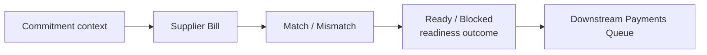

# 06 — Spend / Supplier Bills Module

## 1. Σκοπός του εγγράφου

Το παρόν έγγραφο ορίζει το `Spend / Supplier Bills Module` σε module-definition επίπεδο, ως canonical περιγραφή ρόλου, ορίων, semantics και εξαρτήσεων.

Ορίζει:
- τον ρόλο του module στο σύστημα
- τα core business concepts του supplier-obligation flow
- τα lifecycle και status boundaries του `Supplier Bill`
- τους canonical κανόνες linkage, `Match / Mismatch` και payment readiness
- τις σχέσεις του module με τα υπόλοιπα finance modules

Δεν είναι:
- implementation specification
- pixel-level UI spec
- route tree
- API / storage logic
- detailed screen blueprint

---

## 2. Θέση του εγγράφου στην ιεραρχία finance documentation

Το παρόν document δεσμεύεται από:
- `00 — Finance Canonical Brief`
- `00A — Finance Domain Model & System Alignment`
- `01 — Finance Module Map`

Και εξειδικεύει τα παραπάνω για το `Spend / Supplier Bills` module, με συνέπεια προς το συνολικό documentation set του v1.

---

## 3. Ταυτότητα και ρόλος του module

Το `Spend / Supplier Bills Module` είναι το canonical spend-side operational readiness module του συστήματος.

Ο ρόλος του είναι να καλύπτει το τμήμα της spend chain που ξεκινά αφού έχει ήδη διαμορφωθεί upstream request / approval / commitment context και σταματά πριν από το downstream payment execution handoff.

Σε canonical μορφή, η θέση του είναι:

`Purchase Request -> Commitment -> Supplier Bill -> Ready / Blocked payable context -> Payments Queue`

Το module είναι ξεχωριστό γιατί:
- κατέχει το supplier-obligation context στο spend side
- οργανώνει το `Supplier Bill` ως πραγματική υποχρέωση προς προμηθευτή
- αποδίδει linked / unlinked και matched / mismatch evaluation
- σχηματίζει readiness outcome (`Ready for Payment` ή `Blocked`) πριν από την execution layer συνέχεια

Δεν ταυτίζεται με:
- `Purchase Requests / Commitments` (upstream initiation / approval / commitment layer)
- `Payments Queue` (downstream execution / handoff workspace)
- `Overview` (monitoring shell)
- generic treasury screen
- bank / reconciliation engine
- accounting ledger

---

## 4. Σκοπός του module μέσα στο Finance System

Η canonical spend chain του v1 είναι:

`Purchase Request -> Commitment -> Supplier Bill -> Outgoing Payment`

Μέσα σε αυτήν τη συνολική αλυσίδα, το παρόν module καλύπτει το supplier obligation και payable readiness τμήμα.

Upstream:
- παραλαμβάνει approved / committed spend context από το `Purchase Requests / Commitments`

Core object:
- οργανώνει το `Supplier Bill` ως spend-side payable truth

Downstream:
- αποδίδει readiness αποτέλεσμα προς το `Payments Queue`
- παραδίδει payable context για scheduling / execution handoff

Cross-system impact:
- τροφοδοτεί το `Overview` με `Outstanding Payables`, `Overdue Payables` και spend-side pressure signals
- τροφοδοτεί τα `Controls` με traceability, audit context και budget-relevant linkage visibility

Ο ρόλος του module ολοκληρώνεται στο semantic handoff:  
`Supplier Bill + readiness outcome + downstream queue eligibility`.

Η scheduling / execution progression συνεχίζει εκτός του παρόντος module.

---

## 5. Αρχές που διέπουν το Spend / Supplier Bills Module

### 5.1 Supplier bill truth ownership
Το `Spend / Supplier Bills` κατέχει την αλήθεια του `Supplier Bill` ως πραγματικής υποχρέωσης προς προμηθευτή. Δεν επαναορίζει upstream request / commitment truth και δεν υποκαθιστά downstream payment truth.

### 5.2 Upstream dependency on approved / committed context
Το module δεν είναι self-originating payable module χωρίς upstream context. Η canonical module διάσπαση του v1 το τοποθετεί downstream από το `Purchase Requests / Commitments`.

### 5.3 Readiness before execution
Το module σχηματίζει payable readiness, αλλά δεν εκτελεί την πληρωμή. Η execution layer ξεκινά στο `Payments Queue`.

### 5.4 Match / mismatch as first-class meaning
Η linked / unlinked κατάσταση και το matched / mismatch evaluation δεν είναι οπτικά βοηθήματα. Είναι core operational dimensions, γιατί επηρεάζουν άμεσα τη readiness και την exception visibility.

### 5.5 Commitment linkage and relief discipline
Η σχέση του `Supplier Bill` με το upstream `Commitment` παραμένει ρητή.  
Το canonical domain model ορίζει ότι το `Commitment` μπορεί να ανακουφίζεται από linked `Supplier Bill` ή linked `Outgoing Payment`, και το monitoring δεν πρέπει να μετρά upstream/downstream spend objects ως αθροιστικά ανεξάρτητα exposure layers όταν έχει ήδη εφαρμοστεί linkage.

### 5.6 State-type separation
Διαχωρίζονται ρητά:
- persisted bill status
- match state
- readiness state
- operational signal
- UI-only temporary state

Το module δεν επιτρέπεται να τα συγχέει σε έναν γενικό και θολό “status”.

### 5.7 Monitoring non-ownership
Το `Overview` και τα control surfaces διαβάζουν outputs του module, αλλά δεν κατέχουν την primary transactional αλήθεια του `Supplier Bill`.

---

## 6. Inputs, dependencies και πηγές module truth

### Upstream input
- `Purchase Request` context
- `Commitment` context
- approval / supplier / budget / attachments context που έχει ήδη διαμορφωθεί upstream

### Core obligation input
- supplier-side payable document context που καταγράφεται ως `Supplier Bill`
- supplier identity
- bill reference
- invoice date
- due date
- amount
- category / department / project context όπου εφαρμόζεται

### Downstream output
- `Ready for Payment` ή `Blocked` readiness outcome
- payable context προς `Payments Queue`
- explicit blocked-reason visibility για queue triage και επιστροφή στην επίλυση

### Monitoring / control impact
- `Outstanding Payables`
- `Overdue Payables`
- spend-side exposure visibility
- audit trail context
- budget interpretation / commitment relief visibility

---

## 7. Core business concepts του module

### Supplier Bill
Η πραγματική υποχρέωση προς προμηθευτή στο spend side. Είναι το βασικό payable object του module.

### Payable
Το operational context που εκφράζει ανοικτή υποχρέωση πληρωμής πάνω σε supplier-side bill object.

### Linked Bill
Supplier bill που συνδέεται με upstream approved request / commitment context.

### Unlinked Bill
Supplier bill χωρίς canonical upstream linkage. Στο v1 είναι ορατό, αλλά blocked-by-default για πληρωμή.

### Match
Κατάσταση στην οποία το supplier bill συμφωνεί επαρκώς με το upstream context.

### Mismatch
Κατάσταση με διαφορές ή ελλείψεις που επηρεάζουν τη readiness, όπως amount mismatch, missing attachment, missing due date ή missing approval / required controls.

### Payment Readiness
Αποτέλεσμα upstream αξιολόγησης που καθορίζει αν το payable context μπορεί να περάσει στο payment handling.

### Blocked Reason
Ο συγκεκριμένος λόγος που εμποδίζει τη readiness, με explicit reason visibility.

### Open Payable Amount
Το ανοικτό ποσό υποχρέωσης του supplier bill σε δεδομένη στιγμή.

### Overdue Payable
Computed signal που δείχνει ότι due date έχει περάσει ενώ η υποχρέωση παραμένει ανοικτή.

### Outgoing Payment Linkage
Η downstream σύνδεση του supplier bill με cash-out effect. Η payment truth ανήκει στο `Outgoing Payment` context.

### Attachment / Evidence Context
Το supporting evidence layer που χρησιμοποιείται ως required control ή resolve input όπου η policy το απαιτεί.

---

## 8. Module surfaces / operational surfaces

### Supplier Bills / Expenses List
- **Ρόλος:** primary spend-side worklist για open payables, due pressure, readiness, match state και exception visibility.
- **Primary question:** ποιες supplier bills είναι έτοιμες για πληρωμή και ποιες είναι blocked και γιατί.
- **Primary action:** άνοιγμα bill detail για resolve του readiness blocker ή handoff προς `Payments Queue` όταν readiness=`Ready`.

### Supplier Bill Detail View
- **Ρόλος:** single-record resolution surface για linkage, discrepancy, readiness, payment-context visibility και auditability.
- **Primary question:** τι ακριβώς προκαλεί το mismatch ή το blocked state και ποιο action το λύνει.
- **Primary action:** resolve mismatch / controls / completeness και downstream handoff όταν η bill γίνει ready.

Σημαντική boundary note:  
Οι παραπάνω surfaces ανήκουν στο obligation/readiness layer. Η queue segmentation, η batch selection, το `Scheduled` και το `Executed / Paid` παραμένουν downstream concerns του `Payments Queue`.

---

## 9. Core flows του module

Το παρακάτω local diagram τοποθετείται εδώ γιατί δείχνει το readiness context του module χωρίς να μεταφέρει execution ownership από το `Payments Queue`.

Τι δείχνει:
- το `Spend / Supplier Bills` σχηματίζει readiness
- το `Payments Queue` είναι downstream execution handoff

Τι δεν δείχνει:
- το queue ως source payable truth
- collapse μεταξύ persisted bill status, readiness, operational signals, UI-only states

### 9.1 Supplier bill intake / registration
Η supplier obligation καταγράφεται ως `Supplier Bill` και αποκτά operational ορατότητα ως payable item.

### 9.2 Linkage to upstream request / commitment
Το bill ελέγχεται ως προς τη σύνδεσή του με approved / committed spend context.

### 9.3 Match / mismatch evaluation
Το module εξετάζει αν το bill συμφωνεί με το upstream context ως προς amount, category, supplier ή άλλα policy-relevant dimensions.

### 9.4 Required-controls and completeness check
Έλεγχος για due date, attachments, approvals / required controls και λοιπά απαραίτητα στοιχεία readiness.

### 9.5 Readiness formation
Το αποτέλεσμα είναι `Ready for Payment` ή `Blocked`, μαζί με explicit reason visibility.

### 9.6 Downstream payment handoff
Το ready payable context περνά στο `Payments Queue`, ενώ τα blocked items παραμένουν ορατά για triage και επιστροφή στην επίλυση.

### 9.7 Payment effect visibility and closure context
Όταν υπάρχει downstream payment execution record, το module αντανακλά payment outcome visibility πάνω στο supplier bill context, χωρίς ownership execution truth.

---

## 10. Entity model και ownership

Κύριες οντότητες / contexts:
- `Supplier Bill`
- payable context
- commitment linkage context
- `Match / Mismatch` context
- payment readiness context
- linked `Outgoing Payment` visibility
- attachment / evidence context
- `Audit / Notes / Timeline` context

Διαχωρισμός ownership:
- `Purchase Request / Commitment`: upstream initiation/approval truth
- `Supplier Bill`: supplier obligation truth
- `Outgoing Payment`: cash-out truth
- readiness context: operational gating layer για payment handling
- `Audit / Notes / Timeline`: supporting traceability

Τυπολογία semantic ρόλου:
- **source-of-truth:** `Supplier Bill`
- **derived / operational:** `Match`, `Mismatch`, `Ready`, `Blocked`, overdue signal
- **downstream-driven visibility:** payment execution outcome
- **supporting:** notes, attachments, timeline, blocked reason explanation

---

## 11. Canonical rules του module

### 11.1 Supplier bill creation rule
Το `Supplier Bill` είναι η πραγματική supplier-side obligation του spend loop. Δεν είναι purchase request, δεν είναι commitment και δεν είναι payment execution row.

### 11.2 Linkage rule
Το `Supplier Bill` μπορεί να συνδέεται με υπάρχον `Commitment` / approved request context.

### 11.3 Unlinked blocked-by-default rule
Στο v1, unlinked supplier bills είναι ορατά ως warning αλλά blocked-by-default για πληρωμή.

### 11.4 Readiness derivation rule
Η readiness δεν δηλώνεται αυθαίρετα στο queue. Παράγεται upstream από το `Spend / Supplier Bills`.

### 11.5 Open payable derivation rule
Στο τρέχον v1 fallback semantics, open payable amount προκύπτει από document total μείον allocated payment effect. Το πλήρες spend-side policy για partial / multi-allocation παραμένει controlled open area.

### 11.6 Overdue payable rule
Ένα payable είναι overdue όταν:
- `due date < today`
- `open payable amount > 0`

Το overdue είναι computed operational signal και όχι νέο transactional object.

### 11.7 Commitment relief rule
Το `Commitment` θεωρείται relieved όταν υπάρχει linked `Supplier Bill` ή linked `Outgoing Payment`.

### 11.8 Bill context non-ownership of execution truth
Το `Spend / Supplier Bills` μπορεί να προβάλλει payment status visibility, αλλά δεν κατέχει execution truth.

---

## 12. Canonical supplier bill lifecycle

### 12.1 Bill recorded
Το supplier bill καταγράφεται ως πραγματική υποχρέωση προς προμηθευτή.

### 12.2 Bill linked / evaluated
Το bill αποκτά ή δεν αποκτά upstream linkage και περνά από `Match / Mismatch` evaluation.

### 12.3 Readiness resolved
Το bill σταθεροποιείται σε readiness επίπεδο ως `Ready for Payment` ή `Blocked`.

### 12.4 Downstream queue handoff
Το ready bill περνά στο queue ως payable context για scheduling / execution handoff.

### 12.5 Payment outcome visibility
Με downstream payment execution, το bill αποκτά payment outcome visibility ως open / paid και, μόνο αν η τελική v1 policy το στηρίξει ρητά, ως partially paid.

Σημαντικό boundary:  
Το lifecycle του `Supplier Bill` δεν πρέπει να συγχέεται με το queue lifecycle (`Selected / Prepared`, `Scheduled`, `Executed / Paid`).

---

## 13. Status model

### 13.1 Persisted bill statuses
Καταστάσεις που ανήκουν στο supplier bill ως payable object.

### 13.2 Match states
Καταστάσεις που εκφράζουν τη σχέση του bill με το upstream approved / committed context.

### 13.3 Readiness states
Καταστάσεις ετοιμότητας πριν από το downstream payment handling.

### 13.4 Operational signals
Σήματα πίεσης, ωρίμανσης και εξαίρεσης.

### 13.5 UI-only temporary states
Προσωρινά UI states selection / focus / inline validation.

### 13.6 v1 vocabulary

**Persisted bill statuses**
- `Recorded`
- `Open`
- `Paid`
- `Closed`
- `Partially Paid` (controlled / policy-dependent area στο v1)

**Match states**
- `Linked`
- `Unlinked`
- `Matched`
- `Mismatch`

**Readiness states**
- `Ready for Payment`
- `Blocked`

**Operational signals**
- `Due Soon`
- `Overdue`
- `Missing Attachment`
- `Missing Due Date`
- `Missing Approval / Required Controls`
- `Warning`

**UI-only flags**
- `Selected`
- `Expanded`
- `Inline Validation Error`
- `Resolve View Active`

Απαγορεύεται η σύγχυση:
- bill status με readiness state
- readiness state με queue execution state
- overdue signal με persisted financial status
- linked / matched information με blocked reason

---

## 14. Bill fields και supporting field families

### 14.1 Bill header field families
- supplier identity context
- bill reference / identification context
- invoice date / due date / currency context
- amount / open payable / payment status context
- category / department / project context

### 14.2 Linkage and control field families
- linked request / commitment reference
- match status
- blocked reason
- readiness outcome
- approvals / required controls context

### 14.3 Evidence and traceability families
- attachment indicator
- internal notes / comments
- audit / timeline context
- payment-history visibility όπου είναι διαθέσιμη

### 14.4 Semantic minimum for readiness evaluation
Για να επιτρέπεται semantic evaluation της readiness, πρέπει να είναι ορατά τουλάχιστον:
- supplier
- bill reference
- amount
- due date
- linkage / no-linkage visibility
- required controls / evidence visibility
- explicit blocked reason όπου η bill δεν είναι ready

---

## 15. Actions και permissions

### Allowed actions
Ενέργειες που ανήκουν φυσικά στο obligation / readiness layer:
- record supplier bill
- open detail
- view linked purchase request
- attach document / evidence
- add internal note
- resolve mismatch inputs
- handoff to `Payments Queue` όταν readiness=`Ready` και η policy το επιτρέπει

### Gated actions
Ενέργειες που προϋποθέτουν policy ή readiness:
- explicit move to payments queue
- mark ready / request resolution μόνο εφόσον δεν παρακάμπτονται οι canonical readiness checks
- create linked supplier bill από request detail, όπου αυτό αποφασιστεί product/architect-wise

### Forbidden / out-of-bound actions
Το module δεν πρέπει να υπονοεί:
- payment execution
- bank-confirmed completion
- upstream approval ownership
- auto-match / auto-reconciliation ως βασική λειτουργία
- hidden state rewrite μέσω selection logic

---

## 16. Validations και readiness rules

### 16.1 Field-level validations
Έλεγχοι εγκυρότητας supplier, bill reference, amount, invoice date και due date.

### 16.2 Linkage-level validations
Έλεγχοι για ύπαρξη και ορθότητα σύνδεσης με approved request / commitment context όπου απαιτείται.

### 16.3 Match-level validations
Έλεγχοι συμφωνίας bill με upstream context ως προς amount, category, supplier ή άλλα policy-relevant dimensions.

### 16.4 Evidence / controls validations
Έλεγχοι για required attachment, required controls και approval completeness.

### 16.5 Canonical readiness minimum before queue handoff
Για να αποκτήσει ένα supplier bill readiness=`Ready for Payment`, το module πρέπει να εκθέτει τουλάχιστον:
- σαφή supplier bill identity
- amount και due date
- linkage / exception visibility
- απουσία unresolved blocking mismatch
- required controls / attachments / approvals όπου απαιτούνται από policy

Αν κάποιο από τα παραπάνω λείπει, το αποτέλεσμα παραμένει `Blocked` με explicit reason visibility.

---

## 17. Financial semantics και monitoring interaction

### 17.1 Open payables
Τα `Outstanding Payables` στο monitoring layer στηρίζονται σε open payable ποσό supplier bills.

### 17.2 Overdue payables
Τα `Overdue Payables` είναι point-in-time computed signal με βάση due date έναντι today και open payable amount.

### 17.3 Exposure anti-overlap
Το spend monitoring δεν πρέπει να εμφανίζει `Commitment`, `Supplier Bill` και `Outgoing Payment` ως σωρευτικά independent exposure layers όταν υπάρχει canonical linkage / relief.

### 17.4 Queue-facing semantics
Το primary next-step dimension του module είναι το readiness (`Ready / Blocked`) και όχι το execution status.

---

## 18. Σχέσεις με τα υπόλοιπα modules

### 18.1 Relation με Purchase Requests / Commitments
Το request/commitment layer εκφράζει την ανάγκη, δίνει approval/commitment context και τροφοδοτεί downstream το spend side. Το `Spend / Supplier Bills` δεν το αντικαθιστά.

### 18.2 Relation με Payments Queue
Η σχέση είναι structural και non-optional:  
Το `Spend / Supplier Bills` σχηματίζει payable readiness. Το `Payments Queue` εκτελεί πάνω σε αυτήν.

### 18.3 Relation με Overview
Το `Overview` διαβάζει outputs του module για `Outstanding Payables`, `Overdue Payables`, readiness distribution και spend-side pressure, αλλά δεν εκτελεί actions και δεν κατέχει bill truth.

### 18.4 Relation με Controls
Το module τροφοδοτεί τα `Controls` με spend-side traceability, audit context και budget-relevant linkage information.

### 18.5 Relation με Revenue-side Invoices
Canonical ορολογία:
- `Invoice` ανήκει στο revenue side
- `Supplier Bill` ανήκει στο spend side
- `Outgoing Payment` καλύπτει supplier obligations

Άρα το `Spend / Supplier Bills` δεν συγχέεται με customer invoice logic ή collections logic.

---

## 19. Final canonical statement

Το `Spend / Supplier Bills Module` είναι το canonical spend-side operational readiness module του Finance Management & Monitoring System v1. Παραλαμβάνει upstream approved / committed spend context, οργανώνει το `Supplier Bill` ως πραγματική supplier obligation, εκθέτει linked / unlinked και matched / mismatch evaluation, σχηματίζει `Ready for Payment` ή `Blocked` readiness αποτέλεσμα, και παραδίδει downstream payable context στο `Payments Queue`. Δεν είναι request/approval module, δεν είναι final payment execution module, δεν είναι generic payments screen, και δεν λειτουργεί ως ανεξάρτητη πηγή payables χωρίς upstream spend context.