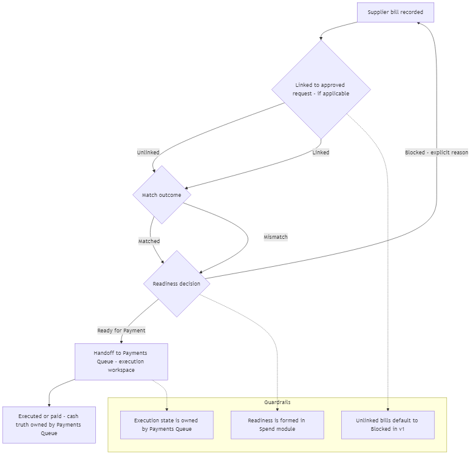
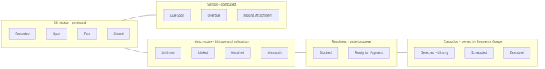

## 07 — Spend / Supplier Bills Module (Ενότητα Δαπανών)

## 1. Σκοπός του εγγράφου

Το παρόν έγγραφο ορίζει την Ενότητα Δαπανών & Παραστατικών Προμηθευτών (Spend / Supplier Bills) σε επίπεδο κανονιστικού προτύπου: την ιδιοκτησία της αλήθειας (Supplier Bill), τη σύνδεση/συμφωνία (linkage/match), τη διαμόρφωση ετοιμότητας (Ready/Blocked), το λεξιλόγιο καταστάσεων και την παράδοση (handoff) προς την Ουρά Πληρωμών (Payments Queue).

Δεν αποτελεί σημασιολογικό νόμο (00A), ούτε χάρτη ενοτήτων (01), ούτε προσχέδιο διεπαφής (UI blueprint).

---

## 2. Ρόλος και όρια

Το Spend / Supplier Bills Module είναι η ενότητα της πλευράς των δαπανών που κατέχει την αλήθεια της υποχρέωσης προς τον προμηθευτή (Supplier Bill) και διαμορφώνει την ετοιμότητα πληρωμής (payable readiness) πριν από την εκτέλεση.

Κύρια αποστολή:
- Καταγράφει και εκφράζει το παραστατικό προμηθευτή ως την επίσημη πληρωτέα αλήθεια.
- Αξιολογεί τη σύνδεση (Linked / Unlinked) και τη συμφωνία (Matched / Mismatch).
- Παράγει το αποτέλεσμα ετοιμότητας (Έτοιμο προς Πληρωμή / Μπλοκαρισμένο) με ρητή αιτιολογία.
- Παραδίδει το πλαίσιο πληρωτέων στην Ουρά Πληρωμών (παράδοση προς εκτέλεση).

Όρια (Τι ΔΕΝ είναι):
- Δεν είναι η ενότητα έναρξης/έγκρισης δαπάνης (Αιτήματα Αγοράς / Δεσμεύσεις).
- Δεν είναι η Ουρά Πληρωμών (δεν κάνει προγραμματισμό ή εκτέλεση, δεν παράγει ταμειακή αλήθεια).
- Δεν είναι μηχανή διαχείρισης διαθεσίμων, τραπεζικών συναλλαγών ή συμφιλίωσης (reconciliation).

---

## 3. Κανονιστικοί περιορισμοί (Αναφορές)

Η ενότητα εφαρμόζει τους κανόνες του 00A:
- Διαχωρισμός ετοιμότητας και εκτέλεσης: Η ετοιμότητα διαμορφώνεται εδώ, η εκτέλεση στην Ουρά Πληρωμών.
- Διαχωρισμός οικογενειών κατάστασης: Η μόνιμη κατάσταση παραστατικού, η κατάσταση συμφωνίας, η ετοιμότητα και τα σήματα δεν συγχωνεύονται.
- Αποφυγή διπλομέτρησης (Anti-overlap): Όπου υπάρχει σύνδεση (linkage), η οικονομική έκθεση (exposure) δεν προσμετράται διπλά.

---

## 4. Εισροές και εκροές (Module-level)

Εισροές:
- Πλαίσιο από τα Αιτήματα Αγοράς / Δεσμεύσεις (εγκεκριμένη/δεσμευμένη αναφορά).
- Δεδομένα παραστατικού (ταυτότητα προμηθευτή, αναφορά παραστατικού, ημερομηνίες έκδοσης/λήξης, ποσό, κατηγοριοποίηση).
- Αποδεικτικά στοιχεία/έλεγχοι (evidence/controls) βάσει πολιτικής.

Εκροές:
- Αλήθεια παραστατικού προμηθευτή + αξιολόγηση σύνδεσης/συμφωνίας.
- Αποτέλεσμα ετοιμότητας (Ready for Payment / Blocked) με ρητή αιτία μπλοκαρίσματος.
- Παράδοση πλαισίου πληρωτέων προς την Ουρά Πληρωμών.
- Ορατότητα προς την Επισκόπηση και τους Ελεγκτικούς Μηχανισμούς (σήματα/ανιχνευσιμότητα).

---

## 5. Βασικές έννοιες (Σύνοψη)

- Supplier Bill: Η αλήθεια της υποχρέωσης προς τον προμηθευτή.
- Σύνδεση (Linkage): Συνδεδεμένο / Μη συνδεδεμένο (προς το αρχικό αίτημα/δέσμευση).
- Συμφωνία (Match): Σε συμφωνία / Σε απόκλιση (διαφορές που επηρεάζουν την ετοιμότητα).
- Ετοιμότητα (Readiness): Έτοιμο προς Πληρωμή / Μπλοκαρισμένο + Αιτία.
- Ανοικτό Πληρωτέο Ποσό (Open Amount) & Ληξιπρόθεσμο (Overdue) (υπολογιζόμενο σήμα).

Κανόνας v1: Τα μη συνδεδεμένα παραστατικά είναι ορατά αλλά μπλοκαρισμένα από προεπιλογή (blocked-by-default) για πληρωμή.

---

## 6. Επιφάνειες Λειτουργίας (Operational Surfaces)

- Λίστα Παραστατικών / Εξόδων: Πρωτογενής λίστα εργασίας για ανοικτά πληρωτέα, ετοιμότητα και εξαιρέσεις.
- Προβολή Λεπτομερειών Παραστατικού: Επιφάνεια επίλυσης για σύνδεση/αποκλίσεις/ελέγχους ώστε να αρθεί το «Μπλοκαρισμένο».

---

## 7. Τοπική Ροή Ενότητας (Core Flow)

Εισαγωγή/Καταχώριση Παραστατικού Προμηθευτή.
Αξιολόγηση Σύνδεσης και Συμφωνίας (Match/Mismatch).
Διαμόρφωση Ετοιμότητας (Ready/Blocked + Αιτία).
Παράδοση στην Ουρά Πληρωμών για προγραμματισμό/εκτέλεση.

### Module diagrams (functionality + state transitions)

#### Διάγραμμα λειτουργικής ροής - linkage, match, readiness, handoff

#### Διάγραμμα οικογενειών καταστάσεων - status vs match vs readiness vs execution vs signals

---

## 8. Τοπικοί κανόνες προστασίας (Anti-drift)

- Η διαμόρφωση ετοιμότητας κατοικεί εδώ: Η ετοιμότητα δεν «εφευρίσκεται» στην Ουρά Πληρωμών.
- Στάση πριν την εκτέλεση: Η ενότητα δεν εκτελεί πληρωμές και δεν κατέχει την ταμειακή αλήθεια (cash-out truth).
- Μη συνδεδεμένα = Μπλοκαρισμένα (v1): Παραμένουν Blocked μέχρι να αποκτήσουν κανονιστική σύνδεση ή επίλυση.
- Ρητή αιτία μπλοκαρίσματος: Κάθε μπλοκαρισμένο στοιχείο πρέπει να δείχνει τον λόγο (για διαλογή/επίλυση).
- Όχι σύμπτυξη καταστάσεων: Η κατάσταση παραστατικού $\neq$ κατάσταση συμφωνίας $\neq$ ετοιμότητα $\neq$ σήματα.

---

## 9. Λεξιλόγιο κύκλου ζωής & καταστάσεων

Μόνιμες καταστάσεις παραστατικού (Persisted)
- Καταχωρημένο (Recorded)
- Ανοικτό (Open)
- Πληρώθηκε (Paid)
- Κλειστό (Closed)
- Μερικώς Πληρωμένο (Partially Paid) (υπό έλεγχο στην v1)

Καταστάσεις Συμφωνίας (Match States)
- Συνδεδεμένο (Linked) / Μη συνδεδεμένο (Unlinked)
- Σε συμφωνία (Matched) / Σε απόκλιση (Mismatch)

Καταστάσεις Ετοιμότητας (Readiness States)
- Έτοιμο προς Πληρωμή (Ready for Payment)
- Μπλοκαρισμένο (Blocked)

Λειτουργικά σήματα (Ενδεικτικά)
- Λήγει Σύντομα, Ληξιπρόθεσμο, Ελλιπές Παραστατικό, Εκκρεμεί Έγκριση.

---

## 10. Πύλη Ελέγχου Ετοιμότητας (Handoff Gate)

Για να θεωρηθεί ένα παραστατικό Ready for Payment, πρέπει να διαθέτει:
- Σαφή ταυτότητα παραστατικού και προμηθευτή.
- Ποσό και ημερομηνία λήξης.
- Ορατότητα σύνδεσης/συμφωνίας.
- Απουσία ανεπίλυτων αποκλίσεων (blocking mismatches).
- Απαιτούμενες εγκρίσεις ή αποδεικτικά στοιχεία βάσει πολιτικής.

---

## 11. Σχέσεις και παραδόσεις (Handoffs)

Με Αιτήματα / Δεσμεύσεις: Upstream πλαίσιο για σύνδεση/ελέγχους.

Με Ουρά Πληρωμών: Παράδοση πλαισίου ετοιμότητας· η ουρά εκτελεί, δεν διαμορφώνει ετοιμότητα.

Με Επισκόπηση / Ελεγκτικούς Μηχανισμούς: Ορατότητα, σήματα και ανιχνευσιμότητα.

---

## 12. Περιορισμοί v1 / Ανοιχτές αποφάσεις

Πολιτική για μερικές πληρωμές ή πολλαπλές κατανομές σε ανοικτά ποσά.

Πολιτική για «μη συνδεδεμένα αλλά επιτρεπτά προς πληρωμή» παραστατικά.

Όρια και έλεγχοι που ενεργοποιούν τις αιτίες μπλοκαρίσματος.

---

## 13. Τελική κανονιστική δήλωση

Το Spend / Supplier Bills Module είναι η κεντρική ενότητα επιχειρησιακής ετοιμότητας δαπανών του συστήματος Finance v1. Παραλαμβάνει το πλαίσιο εγκεκριμένων/δεσμευμένων δαπανών, οργανώνει το Παραστατικό Προμηθευτή ως πραγματική υποχρέωση, αξιολογεί τη σύνδεση και τη συμφωνία, διαμορφώνει το αποτέλεσμα ετοιμότητας (Ready for Payment ή Blocked) και παραδίδει το πλαίσιο στην Ουρά Πληρωμών. Δεν είναι ενότητα αιτημάτων/εγκρίσεων, δεν είναι η τελική ενότητα εκτέλεσης πληρωμών και δεν λειτουργεί ως ανεξάρτητη πηγή πληρωτέων χωρίς upstream πλαίσιο δαπάνης.