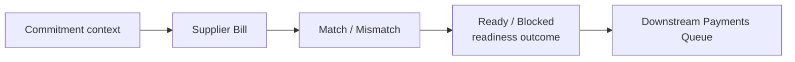

# 07 — Spend / Supplier Bills Module

## 1. Σκοπός του εγγράφου

Το παρόν έγγραφο ορίζει το `Spend / Supplier Bills Module` σε επίπεδο module canon: owned truth (`Supplier Bill`), linkage/match/mismatch, readiness formation (`Ready/Blocked`), status vocabulary και handoff προς `Payments Queue`.
Δεν αποτελεί semantic-law (αυτό ορίζεται στο `00A`), ούτε module map (`01`), ούτε UI blueprint.

---

## 2. Ρόλος και boundaries

Το `Spend / Supplier Bills Module` είναι το spend-side module που κατέχει **supplier obligation truth** (`Supplier Bill`) και σχηματίζει **payable readiness** πριν από payment execution.

Κύρια δουλειά:
- καταγράφει/εκφράζει `Supplier Bill` ως payable truth,
- αξιολογεί linkage (linked/unlinked) και match (matched/mismatch),
- παράγει readiness (`Ready for Payment` / `Blocked`) με explicit reason,
- παραδίδει ready/blocked payable context στο `Payments Queue` (execution handoff).

Boundaries (τι δεν είναι):
- Δεν είναι upstream initiation/approval (`Purchase Requests / Commitments`).
- Δεν είναι `Payments Queue` (δεν κάνει scheduling/execution, δεν παράγει cash truth).
- Δεν είναι treasury/banking/reconciliation engine.

---

## 3. Canonical constraints που εφαρμόζει (ως references)

Το module εφαρμόζει (χωρίς να τα επαναορίζει) τους canonical κανόνες του `00A`:
- **Readiness vs execution separation**: readiness σχηματίζεται εδώ, execution στο `Payments Queue`.
- **State-family separation**: persisted bill status / match state / readiness state / operational signals / UI-only state δεν συγχωνεύονται.
- **Commitment relief / anti-overlap**: όπου υπάρχει linkage, το exposure δεν διπλομετράται (κανόνας στο `00A`).

---

## 4. Inputs και outputs (module-level)

Inputs:
- Upstream context από `Purchase Requests / Commitments` (approved/committed reference όπου υπάρχει).
- Supplier-side bill data (supplier identity, bill reference, invoice/due dates, amount, categorization).
- Supporting evidence/controls όπου απαιτείται από policy.

Outputs:
- `Supplier Bill` truth + linkage/match evaluation.
- Readiness outcome (`Ready for Payment` / `Blocked`) με explicit blocked reason.
- Payable context handoff προς `Payments Queue` (ready/blocked view).
- Visibility προς `Overview`/`Controls` (signals/traceability), χωρίς αλλαγή ownership.

---

## 5. Core concepts (capsule)

- `Supplier Bill`: supplier obligation truth (spend side).
- Linkage: `Linked` / `Unlinked` (προς upstream context).
- Match: `Matched` / `Mismatch` (διαφορές/ελλείψεις που επηρεάζουν readiness).
- Readiness: `Ready for Payment` / `Blocked` + `Blocked Reason`.
- `Open Payable Amount` (open amount) + `Overdue` (computed signal).

v1 rule: **Unlinked bills είναι ορατά αλλά blocked-by-default** για πληρωμή.

---

## 6. Module surfaces (όχι UI spec)

- `Supplier Bills / Expenses List`: primary worklist για open payables, readiness, match state και exceptions.
- `Supplier Bill Detail View`: resolution surface για linkage/mismatch/controls ώστε να αρθεί το `Blocked`.

---

## 7. Core flow (local)

Flow capsule:
- Intake/registration `Supplier Bill`.
- Linkage + match/mismatch evaluation.
- Readiness formation (`Ready`/`Blocked` + reason).
- Handoff προς `Payments Queue` για execution/scheduling (χωρίς execution ownership).

---

## 8. Module-local rules (anti-drift protections)

- **Readiness formation lives here**: readiness δεν “εφευρίσκεται” στο `Payments Queue`.
- **Stop before execution**: το module δεν εκτελεί πληρωμές, δεν κατέχει cash-out truth.
- **Unlinked blocked-by-default (v1)**: unlinked bills είναι visible αλλά `Blocked` μέχρι να αποκτήσουν canonical linkage/resolve.
- **Explicit blocked reason**: κάθε `Blocked` έχει reason visibility (για triage/resolve).
- **No status collapse**: bill status ≠ match state ≠ readiness ≠ signals ≠ UI-only flags.

---

## 9. Lifecycle & status vocabulary (module-specific)

Το module εκθέτει μόνο module-local vocabulary, συμβατό με το state-family separation του `00A`.

**Persisted bill statuses**
- `Recorded`
- `Open`
- `Paid`
- `Closed`
- `Partially Paid` *(controlled / policy-dependent area στο v1)*

**Match states**
- `Linked`
- `Unlinked`
- `Matched`
- `Mismatch`

**Readiness states**
- `Ready for Payment`
- `Blocked`

**Operational signals (examples)**
- `Due Soon`
- `Overdue`
- `Missing Attachment`
- `Missing Due Date`
- `Missing Approval / Required Controls`
- `Warning`

**UI-only flags (examples)**
- `Selected`
- `Expanded`
- `Inline Validation Error`
- `Resolve View Active`

Απαγορεύεται η σύγχυση:
- bill status με readiness state,
- readiness με queue execution state,
- overdue signal με persisted status,
- linked/match info με blocked reason.

---

## 10. Readiness minimum (queue handoff gate)

Για να αποκτήσει ένα bill readiness=`Ready for Payment` (και να είναι eligible για handoff στο `Payments Queue`), πρέπει να είναι ορατά τουλάχιστον:
- σαφή supplier bill identity
- amount και due date
- linkage/match/exception visibility
- απουσία unresolved blocking mismatch
- required controls/evidence/approvals όπου απαιτούνται από policy

Αν κάτι λείπει: `Blocked` με explicit reason visibility.

---

## 11. Relations / handoffs

- Με `Purchase Requests / Commitments`: upstream context για linkage/controls· δεν αντικαθίσταται.
- Με `Payments Queue`: handoff ready/blocked payable context· το queue εκτελεί, δεν σχηματίζει readiness.
- Με `Overview`/`Controls`: visibility/signals/traceability, χωρίς ownership.

---

## 12. v1 limitations / controlled decisions (non-canonical)

- policy για partial/multi-allocation σε open payable amount
- policy για “unlinked αλλά επιτρεπτό να πληρωθεί” (στο v1 default: blocked-by-default)
- thresholds/controls που ενεργοποιούν blocked reasons (policy-owned)

---

## 13. Final canonical statement

Το `Spend / Supplier Bills Module` είναι το canonical spend-side operational readiness module του Finance Management & Monitoring System v1. Παραλαμβάνει upstream approved / committed spend context, οργανώνει το `Supplier Bill` ως πραγματική supplier obligation, εκθέτει linked / unlinked και matched / mismatch evaluation, σχηματίζει `Ready for Payment` ή `Blocked` readiness αποτέλεσμα, και παραδίδει downstream payable context στο `Payments Queue`. Δεν είναι request/approval module, δεν είναι final payment execution module, δεν είναι generic payments screen, και δεν λειτουργεί ως ανεξάρτητη πηγή payables χωρίς upstream spend context.