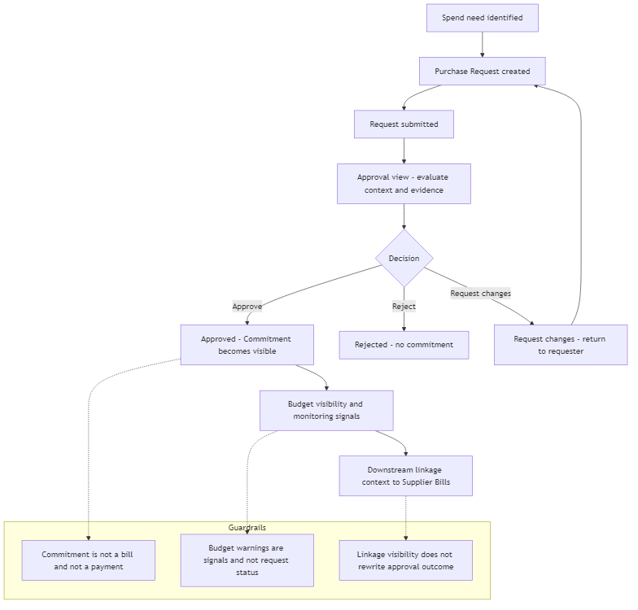
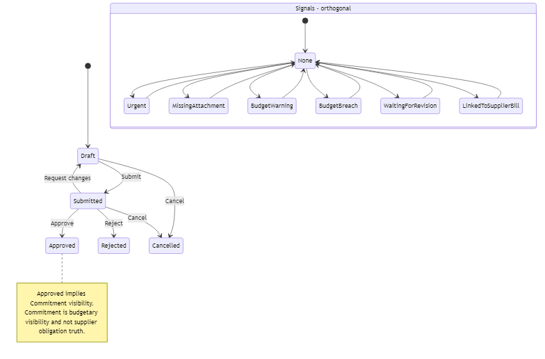

## 07 — Purchase Requests / Commitments Module (Ενότητα Αιτημάτων Αγοράς)

## 1. Σκοπός του εγγράφου

Το παρόν έγγραφο ορίζει την Ενότητα Αιτημάτων Αγοράς & Δεσμεύσεων (Purchase Requests / Commitments) σε επίπεδο κανονιστικού προτύπου: ρόλο/όρια, βασικές έννοιες (αίτημα/έγκριση/δέσμευση), τοπικό κύκλο ζωής, λεξιλόγιο καταστάσεων, πύλη ετοιμότητας έγκρισης, ορατότητα δεσμεύσεων προς τους Ελεγκτικούς Μηχανισμούς (Controls) και παράδοση (handoff) προς τις Δαπάνες / Παραστατικά Προμηθευτών.

Δεν αποτελεί σημασιολογικό νόμο (00A), ούτε χάρτη ενοτήτων (01), ούτε προσχέδιο διεπαφής (UI blueprint).

---

## 2. Ρόλος και όρια έναρξης δαπάνης (Upstream)

Η ενότητα καλύπτει το αρχικό επίπεδο έναρξης και έγκρισης δαπανών: από την καταγραφή της ανάγκης έως την έκδοση απόφασης που δημιουργεί ορατότητα δέσμευσης (commitment visibility), πριν από οποιαδήποτε υποχρέωση προς προμηθευτή.

Αλήθεια Ενότητας (Module Truth):
- Οργανώνει το Αίτημα Αγοράς (Purchase Request) και την Απόφαση Έγκρισης.
- Δημιουργεί τη Δέσμευση (Commitment) ως διακριτή έννοια μετά την έγκριση.
- Παράγει πλαίσιο σύνδεσης (linkage context) προς τις Δαπάνες / Παραστατικά Προμηθευτών.

Όρια (Τι ΔΕΝ είναι):
- Δεν είναι η ενότητα Δαπανών / Παραστατικών (υποχρέωση προμηθευτή + ετοιμότητα).
- Δεν είναι η Ουρά Πληρωμών (εκτέλεση).
- Δεν είναι η ενότητα Ελέγχου/Budget· τροφοδοτεί με δεδομένα, δεν «αποφασίζει» το μοντέλο ελέγχου.
- Δεν εκτελεί πληρωμές και δεν κατέχει την αλήθεια των πληρωτέων (payable truth).

---

## 3. Κανονιστικοί περιορισμοί (Αναφορές)

Η ενότητα εφαρμόζει τους κανόνες των 00A/01:
- Η Δέσμευση ως ξεχωριστή έννοια: Δεν είναι παραστατικό, δεν είναι πληρωμή.
- Πειθαρχία αποφυγής διπλομέτρησης (Anti-overlap): Εφαρμογή κανόνων εκτόνωσης δέσμευσης (commitment relief).
- Διαχωρισμός οικογενειών κατάστασης: Κατάσταση, αποτέλεσμα, σήματα και UI-only flags δεν συγχωνεύονται.

---

## 4. Βασικές έννοιες (Σύνοψη)

Αίτημα Αγοράς (Purchase Request): Τεκμηριωμένο αρχικό αίτημα δαπάνης.

Πλαίσιο Έγκρισης (Approval Context): Εγκρίνων, αιτιολογία, σχόλια, απαιτούμενα αποδεικτικά.

Απόφαση Έγκρισης: Έγκριση (Approve), Απόρριψη (Reject), Αίτημα Αλλαγών (Request Changes).

Δέσμευση (Commitment): Εγκεκριμένο ποσό (προϋπολογιστική αλήθεια) πριν το παραστατικό προμηθευτή.

Ορατότητα Δέσμευσης: Παρουσία στους Ελεγκτικούς Μηχανισμούς και στην Επισκόπηση.

Πλαίσιο Σύνδεσης (Linkage Context): Γέφυρα προς τις Δαπάνες για μελλοντική αντιστοίχιση.

---

## 5. Εισροές και εκροές (Module-level)

Εισροές:
Ανάγκη δαπάνης + πλαίσιο αιτούντος/τμήματος/κέντρου κόστους.
Ποσό/Νόμισμα + κατηγορία/λόγος/επείγον.
Στοιχεία προμηθευτή (όπου υπάρχουν ή απαιτούνται).
Επισυνάψεις/Αποδεικτικά.

Εκροές:
Αποτέλεσμα έγκρισης + ιχνηλασιμότητα.
Ορατότητα δέσμευσης προς Προϋπολογισμό (Budget) και Επισκόπηση.
Πλαίσιο σύνδεσης (handoff) προς τις Δαπάνες / Παραστατικά Προμηθευτών.

---

## 6. Επιφάνειες Λειτουργίας (Operational Surfaces)

Λίστα Αιτημάτων Αγοράς: Χώρος εργασίας για διαλογή (triage) και πίεση εγκρίσεων.

Προβολή Λεπτομερειών / Έγκρισης: Επιφάνεια λήψης απόφασης (Approve/Reject/Request Changes).

---

## 7. Τοπική Ροή Ενότητας (Core Flow)

Καταγραφή αιτήματος $\rightarrow$ Ανασκόπηση $\rightarrow$ Αποτέλεσμα απόφασης.

Έγκριση $\rightarrow$ Ορατότητα δέσμευσης + Επιλεξιμότητα σύνδεσης downstream.

Απόρριψη / Αίτημα Αλλαγών $\rightarrow$ Καμία ενεργή δέσμευση, αλλά ιχνηλάσιμο αποτέλεσμα.

Ελεγχόμενη αναθεώρηση/ακύρωση (δεν «ξαναγράφει» την αλήθεια που έχει ήδη παραδοθεί downstream).

### Module diagrams (functionality + state transitions)

#### Διάγραμμα λειτουργικής ροής - request, approval, commitment visibility

#### Διάγραμμα καταστάσεων - request statuses και orthogonal signals

---

## 8. Λεξιλόγιο κύκλου ζωής & καταστάσεων

Μόνιμες καταστάσεις αιτήματος (Persisted)
Προσχέδιο (Draft)
Υποβλήθηκε (Submitted)
Εγκρίθηκε (Approved)
Απορρίφθηκε (Rejected)
Ακυρώθηκε (Cancelled)

Αποτελέσματα Έγκρισης (Outcomes)
Έγκριση, Απόρριψη, Αίτημα Αλλαγών.

Σημασιολογία Δέσμευσης (Commitment)
Εγκρίθηκε $\Rightarrow$ Δεσμεύτηκε (η εσωτερική σημασία για την ενότητα).

Λειτουργικά σήματα (Ενδεικτικά)
Επείγον, Ελλιπές Επισυναπτόμενο, Προειδοποίηση Προϋπολογισμού, Υπέρβαση Προϋπολογισμού, Συνδεδεμένο με Παραστατικό.

---

## 9. Πύλη Ετοιμότητας Έγκρισης (Approval Readiness Gate)

Για να δοθεί Έγκριση (και άρα ορατότητα δέσμευσης), πρέπει να υπάρχουν:
Σαφής ταυτότητα αιτήματος και αιτούντος.
Ποσό και λόγος/κατηγορία δαπάνης.
Επαρκής τεκμηρίωση.
Απαιτούμενα αποδεικτικά βάσει πολιτικής.
Ιχνηλάσιμος χρήστης που λαμβάνει την απόφαση.
Απουσία ασαφειών που θα καθιστούσαν τη δέσμευση αμφίβολη.

---

## 10. Σχέσεις και παραδόσεις (Handoffs)

Προς Δαπάνες / Παραστατικά Προμηθευτών: Παρέχει το εγκεκριμένο πλαίσιο και την αναφορά σύνδεσης. Δεν δημιουργεί υποχρέωση προμηθευτή.

Προς Ελεγκτικούς Μηχανισμούς (Budget): Παρέχει ορατότητα δεσμεύσεων και ιχνηλασιμότητα εγκρίσεων.

Προς Επισκόπηση (Overview): Παρέχει δεδομένα δεσμευμένων δαπανών και πίεση εκκρεμοτήτων.

Προς Ουρά Πληρωμών: Καμία άμεση σχέση (επηρεάζει έμμεσα μέσω των παραστατικών).

---

## 11. Περιορισμοί v1 / Ανοιχτές αποφάσεις

Όρια έγκρισης βάσει ρόλων (thresholds).

Πολιτική υποχρεωτικών επισυναπτόμενων.

Υποχρέωση ύπαρξης προμηθευτή πριν την έγκριση (policy-dependent).

Διαδικασία ακύρωσης/αναθεώρησης μετά την έγκριση.

Παρακολούθηση (SLA) για αιτήματα που εγκρίθηκαν αλλά δεν έχουν συνδεθεί ακόμα με παραστατικό.

---

## 12. Τελική κανονιστική δήλωση

Το Purchase Requests / Commitments Module είναι η κεντρική upstream ενότητα έναρξης και έγκρισης δαπανών του συστήματος Finance v1: καταγράφει το Αίτημα Αγοράς, εκδίδει την απόφαση έγκρισης ή απόρριψης, δημιουργεί Ορατότητα Δέσμευσης κατά την έγκριση, τροφοδοτεί τους Ελεγκτικούς Μηχανισμούς και την Επισκόπηση με δεσμευμένα ποσά, και παραδίδει το πλαίσιο σύνδεσης προς τις Δαπάνες, χωρίς να κατέχει την αλήθεια της υποχρέωσης προμηθευτή ή να εκτελεί πληρωμές.
