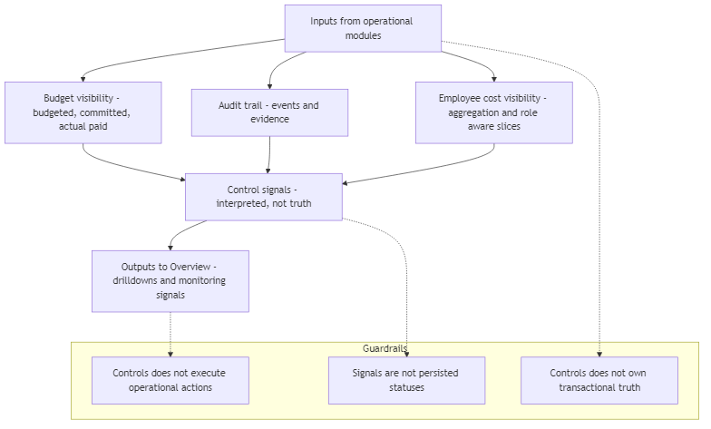
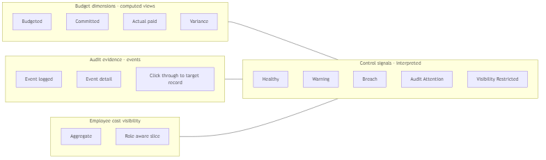

## 08 — Controls Module (Ενότητα Ελεγκτικών Μηχανισμών)

## 1. Σκοπός του εγγράφου

Το παρόν έγγραφο ορίζει την Ενότητα Ελεγκτικών Μηχανισμών (Controls Module) σε επίπεδο κανονιστικού προτύπου: ρόλο/όρια, πεδία ελέγχου (Προϋπολογισμός, Ιστορικό Ελέγχου, Ορατότητα Κόστους Προσωπικού), σήματα ελέγχου και σχέσεις με την Επισκόπηση και τις λειτουργικές ενότητες.

Δεν αποτελεί σημασιολογικό νόμο (00A), ούτε χάρτη ενοτήτων (01), ούτε προσχέδιο διεπαφής (UI blueprint), ούτε προδιαγραφή λογιστικής/φορολογικής μηχανής.

---

## 2. Ρόλος και όρια

Το Controls Module είναι το κανονιστικό υποστηρικτικό επίπεδο ελέγχου (supporting control layer) του συστήματος Finance v1.

Ρόλος:
- Ερμηνεύει και εκθέτει πληροφορίες σχετικές με τον έλεγχο, βασιζόμενο στα δεδομένα (outputs) των λειτουργικών ενοτήτων, χωρίς να εκτελεί δράσεις.

Όρια (Τι ΔΕΝ είναι):
- Δεν εκτελεί ενέργειες στους κύκλους Εσόδων/Δαπανών (έκδοση, είσπραξη, εγκρίσεις, εκτέλεση πληρωμών).
- Δεν αντικαθιστά τους λειτουργικούς χώρους εργασίας (operational workspaces).
- Δεν είναι το κέλυφος εποπτείας (Επισκόπηση / Overview)· παρέχει ορατότητα και αναδρομές ελέγχου, όχι τη δομή δρομολόγησης του χρήστη.
- Δεν δημιουργεί πρωτογενή επιχειρησιακή αλήθεια (transactional truth) και δεν επαναορίζει τη σημασία των αντικειμένων (δεσμεύεται από το 00A).

---

## 3. Βασικά Πεδία της Ενότητας (Core Domains)

Το Controls Module αποτελείται από τρεις κανονιστικές περιοχές ελέγχου:

### 3.1 Προϋπολογισμός (Budget Visibility)

Ορατότητα Προϋπολογισθέντων vs Δεσμευμένων vs Πραγματικών Πληρωμών, αποκλίσεις/υπόλοιπα και σήματα πίεσης ή υπέρβασης. Δεν αποτελεί εργαλείο εκτέλεσης δαπανών.

### 3.2 Ιστορικό Ελέγχου (Audit Trail / Evidence)

Δυνατότητα ελέγχου και ανιχνευσιμότητας (auditability/traceability) για γεγονότα μεταξύ ενοτήτων (ενέργειες, αλλαγές, εγκρίσεις, επισυνάψεις, καταχωρίσεις πληρωμών). Δεν αποτελεί λειτουργικό φάκελο εισερχομένων.

### 3.3 Ορατότητα Κόστους Προσωπικού (Employee Cost Visibility)

Ορατότητα στο κόστος εργασίας με περιορισμούς ρόλων και κανονιστικό οργανωτικό πεδίο (scope). Δεν αποτελεί ενότητα μισθοδοσίας ή εκτέλεσης HR.

Κανονιστικό οργανωτικό πεδίο (ανά μονάδα):
- Επιχειρησιακή μονάδα (business unit), τμήμα, ομάδα, νομική οντότητα.

---

## 4. Εισροές και Εκροές (Μόνο Ανάγνωση)

Εισροές (από λειτουργικά δεδομένα):
- Δεδομένα από: Τιμολόγηση, Απαιτήσεις, Αιτήματα Αγοράς / Δεσμεύσεις, Δαπάνες, Ουρά Πληρωμών.
- Εγκρίσεις, χρήστες, χρονισμός και ιστορικό γεγονότων.
- Εισροές κόστους και κατανομής (allocation).

Εκροές:
- Ορατότητα ελέγχου και αναδρομές (drilldowns) προς την Επισκόπηση.
- Προβολές τεκμηρίωσης και ιστορικού (audit/evidence).
- Αναλύσεις προϋπολογισμού και κόστους (με επίγνωση ρόλων πρόσβασης).

Σημείωση Ιδιοκτησίας:
- Δεν κατέχει την αλήθεια των τιμολογίων, απαιτήσεων, δεσμεύσεων ή πληρωμών· κατέχει το πλαίσιο ελέγχου και τα ερμηνευμένα σήματα.

---

## 5. Βασικές Έννοιες Ενότητας (Capsule)

- Πλαίσιο Προϋπολογισμού (BudgetContext): Απόκλιση (Variance) & Σήματα (Healthy / Warning / Breach).
- Γεγονός Ελέγχου (AuditEvent): Ιστορικό ενεργειών (searchable/traceable).
- Πλαίσιο Κόστους Προσωπικού: Περιορισμοί ορατότητας βάσει ρόλου (role-aware).
- Σήμα Ελέγχου (Control Signal): Ερμηνευμένη ένδειξη (όχι νέο επιχειρησιακό αντικείμενο).

---

## 6. Επιφάνειες Ενότητας (Module Surfaces)

- Επισκόπηση Προϋπολογισμού: Ορατότητα ελέγχου και αναδρομές (όχι εκτέλεση).
- Ιστορικό Ελέγχου / Καταγραφή Δραστηριότητας: Τεκμηρίωση, διερεύνηση και άμεση μετάβαση (click-through) στο αντικείμενο.
- Προβολή Κόστους Προσωπικού: Ανάλυση κόστους με περιορισμένη ορατότητα βάσει ρόλου.

---

## 7. Ροές Ορατότητας Ελέγχου (High-level)

Προϋπολογισμός: Σύγκριση ποσών $\rightarrow$ εντοπισμός πίεσης $\rightarrow$ αναδρομή στις αιτίες.

Ιστορικό: Αναζήτηση γεγονότων $\rightarrow$ λεπτομέρειες $\rightarrow$ μετάβαση στην αρχική εγγραφή.

Κόστος Προσωπικού: Συγκέντρωση δεδομένων $\rightarrow$ φιλτράρισμα βάσει ρόλου $\rightarrow$ αναλυτική απεικόνιση.

Ελεγκτικοί Μηχανισμοί $\rightarrow$ Επισκόπηση: Παροχή σημάτων ελέγχου και προορισμών αναδρομής.

### Module diagrams (functionality + signals)

#### Διάγραμμα λειτουργικής ροής - inputs, control views, outputs προς Overview

#### Διάγραμμα οικογενειών - budget views, audit evidence, cost visibility, control signals

---

## 8. Τοπικοί Κανόνες Ενότητας (Compact)

- Μη-εκτέλεση: Δεν εκτελεί ενέργειες του κύκλου ζωής των λειτουργικών ενοτήτων.
- Μη-ιδιοκτησία: Δεν δημιουργεί ούτε επαναορίζει την επιχειρησιακή αλήθεια.
- Διαχωρισμός Προϋπολογισμού: Τα προϋπολογισθέντα, τα δεσμευμένα και οι πληρωμές δεν συγχωνεύονται σε ένα γενικό "έξοδο".
- Ελάχιστη Τεκμηρίωση Ελέγχου: Χρήστης, ενέργεια, ενότητα πηγής, εγγραφή στόχος, χρονική σήμανση (πριν/μετά όπου διατίθεται).
- Άμεση Μετάβαση (Click-through): Τα γεγονότα ελέγχου οδηγούν στην εγγραφή-στόχο.
- Σήματα $\neq$ Καταστάσεις: Τα σήματα ελέγχου είναι ερμηνείες, όχι μόνιμες καταστάσεις κύκλου ζωής.

---

## 9. Σήματα & Καταστάσεις Διεπαφής (Module-level)

Σήματα Ελέγχου (Ενδεικτικά):
- Υγιές (Healthy), Προειδοποίηση (Warning), Υπέρβαση (Breach).
- Απαιτείται Προσοχή Ελέγχου (Audit Attention).
- Περιορισμένη Ορατότητα (Visibility Restricted).
- Ελλιπή Δεδομένα Κατανομής.

Καταστάσεις Διεπαφής (UI-only):
- Επιλεγμένο γεγονός, ανεπτυγμένη γραμμή, ενεργή αναδρομή.

---

## 10. Σχέσεις και Παραδόσεις (Handoffs)

Με την Επισκόπηση (Overview): Η Επισκόπηση λαμβάνει σήματα και προορισμούς αναδρομής, αλλά δεν γίνεται ιδιοκτήτης των επιφανειών ελέγχου.

Με την Τιμολόγηση: Η Τιμολόγηση παρέχει δεδομένα και πλαίσιο ανιχνευσιμότητας.

Με τις Απαιτήσεις: Παροχή ορατότητας εισπράξεων και ιστορικού παρακολούθησης (follow-up).

Με τα Αιτήματα / Δεσμεύσεις: Παροχή δεδομένων δεσμεύσεων και γεγονότων έγκρισης για τον προϋπολογισμό.

Με τις Δαπάνες / Παραστατικά: Παροχή στοιχείων ανιχνευσιμότητας δαπανών και ορατότητας συνδέσεων (linkage).

Με την Ουρά Πληρωμών: Παροχή αποτελεσμάτων πληρωμών για την ενημέρωση των «Πραγματικών Πληρωμών» στον προϋπολογισμό.

---

## 11. Περιορισμοί v1 / Σημειώσεις Σταθεροποίησης

Προϋπολογισμός: Στην έκδοση v1 λειτουργεί ως επίπεδο ορατότητας (visibility layer). Δεν πρέπει να παρουσιάζεται ως πλήρης μηχανή σχεδιασμού ή πρόβλεψης (forecasting).

Ιστορικό Ελέγχου: Απαιτείται συνεπής καταγραφή γεγονότων σε όλες τις ενότητες (stabilization target).

Κόστος Προσωπικού: Εξαρτάται από τη διαθεσιμότητα των δεδομένων κατανομής. Όπου τα δεδομένα είναι ελλιπή, η διεπαφή πρέπει να το δείχνει σαφώς ως περιορισμό ορατότητας και όχι ως ψευδο-ακρίβεια.

---

## 12. Τελική Κανονιστική Δήλωση

Το Controls Module είναι το κανονιστικό υποστηρικτικό επίπεδο ελέγχου του συστήματος Finance v1 και οργανώνεται γύρω από τρεις βασικούς άξονες: Προϋπολογισμός, Ιστορικό Ελέγχου και Ορατότητα Κόστους Προσωπικού. Ο ρόλος του είναι να παρέχει ορατότητα ελέγχου, ανιχνευσιμότητα και γνώση κόστους, χωρίς να υποκαθιστά τις λειτουργικές ενότητες εκτέλεσης. Δεν είναι κέλυφος εποπτείας, δεν είναι επίπεδο λειτουργικής εκτέλεσης και δεν κατέχει πρωτογενή επιχειρησιακή αλήθεια. Παρέχει τη λογική υποστήριξης και τις επιφάνειες αναδρομής που τροφοδοτούν την Επισκόπηση και υποστηρίζουν τη χρήση του συστήματος από τη διοίκηση και τους ελεγκτές.
