## 10 — Invoicing Functional Specification (v1)

## 1. Σκοπός εγγράφου
Το παρόν έγγραφο μεταφράζει το module canon της Τιμολόγησης σε λειτουργική/έτοιμη προς αποδοχή (acceptance-ready) συμπεριφορά: ροές, επιφάνειες, καταστάσεις, επικυρώσεις (validations), εξαιρέσεις και κριτήρια αποδοχής.

Τι είναι:
- Λειτουργική προδιαγραφή για υλοποίηση και QA.
- Συλλογή στοχευμένων διαγραμμάτων ροής.

Τι δεν είναι:
- Νέος κανονιστικός νόμος (αυτά ορίζονται στα 00 και 00A).
- UI Blueprint (τα συμβόλαια οθονών/πεδίων ζουν στο UI authority).
- Σχεδιασμός Backend/API/Βάσης Δεδομένων.

---

## 2. Θέση στην ιεραρχία τεκμηρίωσης
Εξαρτάται από / Συμμορφώνεται με:

- 00A - Finance Domain Model: Όριο Έκδοσης (Issue), ευθυγράμμιση συνόλων, αμετάβλητο snapshot, διαχωρισμός τύπων κατάστασης.
- 03 - Invoice Module: Module canon.
- 09 - Open Questions (OQ): Σταθεροποίηση βάθους snapshot, σύνδεση αρίθμησης draft-issued, πολιτική μερικών κατανομών.

---

## 3. Λειτουργικός ρόλος της ενότητας
Ρόλος εκτέλεσης:
- Συνθέτει το Προσχέδιο Τιμολογίου (Invoice Draft) από υποψήφιες προς τιμολόγηση εργασίες, με πρόληψη διπλοεγγραφών και πύλη ελέγχου ετοιμότητας.
- Εκτελεί την ελεγχόμενη Έκδοση (Issue) ώστε να παραχθεί η εκδοθείσα αλήθεια (issued invoice document truth).
- Παραδίδει ντετερμινιστικό handoff προς τις Απαιτήσεις (Receivables).

Ρητά όρια:
- Δεν ενσωματώνει την πρόοδο πληρωμών ως κατάσταση εγγράφου τιμολογίου (το "Εξοφλήθηκε" δεν είναι status τιμολογίου, είναι status απαίτησης).
- Δεν «διορθώνει» αναδρομικά την αλήθεια της απαίτησης (receivable truth) χωρίς παραγωγή νέας εκδοθείσας αλήθειας.

---

## 4. Επιφάνειες Ενότητας (Module Surfaces)
### 4.1 Λίστα Προσχεδίων (Invoice Drafts List)
Σκοπός: Επιχειρησιακή ουρά προσχεδίων για συνέχιση, αναθεώρηση ή καθαρισμό.

Κύρια ερώτηση: Ποια προσχέδια εκκρεμούν, είναι στάσιμα ή χρειάζονται έλεγχο;

### 4.2 Κατασκευαστής Προσχεδίου (Invoice Draft Builder)
Σκοπός: Σύνθεση προσχεδίου από τιμολογήσιμη ύλη με καθαρή επιλογή και ανασκόπηση συνόλων πριν την έκδοση.

Κύρια ερώτηση: Ποιες εγγραφές περιλαμβάνονται και τι δείχνουν τα σύνολα/δείκτες πριν την οριστικοποίηση;

### 4.3 Λίστα Τιμολογίων (Invoices List)
Σκοπός: Λίστα εκδοθέντων τιμολογίων/απαιτήσεων για αναζήτηση, φιλτράρισμα και triage.

Κύρια ερώτηση: Ποια τιμολόγια/απαιτήσεις ταιριάζουν στα κριτήρια και χρειάζονται follow-up;

### 4.4 Προβολή Λεπτομερειών Τιμολογίου (Invoice Detail View)
Σκοπός: Πλήρης εικόνα εκδοθέντος τιμολογίου/απαίτησης (ποσά, πληρωμές, πλαίσιο είσπραξης, φορολογική κατάσταση).

Κύρια ερώτηση: Τι ισχύει για το υπόλοιπο/ληξιπρόθεσμο και ποια είναι η επόμενη ενέργεια είσπραξης;

---

## 5. Βασικές Ροές Χρηστών (User Flows)
Ανακάλυψη Προσχεδίου → Συνέχιση: Ο χρήστης εντοπίζει ένα στάσιμο προσχέδιο στη λίστα, το προεπισκοπεί και το ανοίγει στον Builder.

Σύνθεση → Έκδοση: Στον Builder, ο χρήστης επιλέγει εργασίες. Το σύστημα εμποδίζει τη διπλή τιμολόγηση. Μόλις η ετοιμότητα γίνει Ready for Issue, εκτελείται η Έκδοση.

Triage → Είσπραξη: Ο χρήστης εντοπίζει ένα ληξιπρόθεσμο τιμολόγιο στη λίστα, ανοίγει τις Λεπτομέρειες και μεταβαίνει στο Collections flow για ενέργειες follow-up.

---

## 6. Μοντέλο Καταστάσεων (State Model)
Εφαρμόζεται ο αυστηρός διαχωρισμός οικογενειών κατάστασης:

- Persisted Document Statuses: Draft (Προσχέδιο), Issued (Εκδοθέν).
- Readiness States (προ-έκδοσης): Ready for Issue (Έτοιμο), Not Ready (Μη έτοιμο).
- Operational Signals: Needs Review (Χρειάζεται έλεγχο), Stale (Στάσιμο), Reserved-lines (Δεσμευμένες γραμμές).
- UI-only Flags: Unsaved changes, Validation error.

Κανόνας: Τα αποτελέσματα των απαιτήσεων/πληρωμών (Paid, Overdue, Partially Collected) δεν είναι καταστάσεις εγγράφου τιμολογίου.

Διάγραμμα Γ — Οικογένειες Καταστάσεων (State family)

---

## 7. Επικυρώσεις (Validations)
### 7.1 Field-level
Απαιτούμενη ταυτότητα (Πελάτης + Έργο/Σύμβαση) πριν η ετοιμότητα γίνει Ready.

Απαιτούμενες ημερομηνίες/όροι για την προεπισκόπηση ημερομηνίας λήξης.

### 7.2 Row/line-level (Επίπεδο Γραμμής)
Blocking: Απαγόρευση προσθήκης εγγραφής που είναι ήδη τιμολογημένη (Already invoiced) ή δεσμευμένη σε άλλο προσχέδιο (Reserved in another draft).

### 7.3 Document-level (Επίπεδο Εγγράφου)
Προσχέδιο με μηδενικές γραμμές: Εξαίρεση ("Empty draft") + σύσταση για απόρριψη.

Προεπισκόπηση συνόλων: Πρέπει να είναι υπολογίσιμα χωρίς ασάφεια (gate condition).

---

## 8. Ειδικές Καταστάσεις & Εξαιρέσεις
Κενή Λίστα Προσχεδίων: Εμφάνιση empty state + CTA "Δημιουργία νέου προσχεδίου".

Υπέρβαση Χρόνου Δέσμευσης: Banner προειδοποίησης αν ένα προσχέδιο δεσμεύει εργασίες για πολύ μεγάλο διάστημα χωρίς να εκδοθεί.

Μη πλήρης κατανομή πληρωμής: Στις λεπτομέρειες τιμολογίου, εμφάνιση προειδοποιητικού banner αν υπάρχει πληρωμή που δεν έχει κατανεμηθεί πλήρως, δείχνοντας το "Αδιάθετο υπόλοιπο".

---

## 9. Κριτήρια Αποδοχής (Acceptance Criteria)
Happy Paths:
- Το προσχέδιο μπορεί να ανακτηθεί από τη λίστα και να επεξεργαστεί στον Builder.
- Ο Builder εμποδίζει την προσθήκη ήδη τιμολογημένων εργασιών.
- Η Έκδοση παράγει Issued Invoice (document truth) και δρομολογεί τον χρήστη στην προβολή εκδοθέντων, με αυτόματο handoff στις Απαιτήσεις.

Blocked Paths:
- Η Έκδοση εμποδίζεται αν η ετοιμότητα είναι Not Ready.
- Η προσπάθεια προσθήκης μη διαθέσιμης εγγραφής μπλοκάρεται με εξήγηση.

Έλεγχοι Ακεραιότητας:
- Μετά την έκδοση, οποιαδήποτε αλλαγή στο προσχέδιο δεν επηρεάζει το snapshot των συνόλων του εκδοθέντος τιμολογίου (per 00A).
- Η φορολογική/διαβιβαστική κατάσταση (fiscal/transmission) εμφανίζεται ως ανεξάρτητο σήμα και δεν αλλάζει την "αλήθεια" του εγγράφου.

Διάγραμμα Δ — Έλεγχος Ακεραιότητας (Integrity)

---

## 10. Εκτός Πεδίου (Out of Scope)
- Η εκτέλεση του follow-up είσπραξης (ανήκει στο Receivables / Collections).
- Η εκτέλεση πληρωμών (ανήκει στο Payments Queue).
- Η λογιστική συμφωνία τραπεζών (bank reconciliation) και οι λογιστικές εγγραφές (postings).

---

## Πακέτο Διαγραμμάτων Ροής
### Διάγραμμα Α — Λειτουργική Ροή (Functional Flow)

### Διάγραμμα Β — Ροή Αλληλεπίδρασης Οθονών

