# 11 — Receivables / Collections Functional Specification (v1)

## 1. Σκοπός εγγράφου

Το παρόν έγγραφο ορίζει τη λειτουργική συμπεριφορά της ενότητας Απαιτήσεων & Εισπράξεων (Receivables / Collections) προς υλοποίηση: ροές λίστας εργασίας (worklist), συμπεριφορά επιφανειών, οικογένειες καταστάσεων, επικυρώσεις, διαχείριση εξαιρέσεων και κριτήρια αποδοχής.

Τι δεν είναι:
- Νέος ορισμός κανονιστικών κανόνων (αυτά ορίζονται στα 00/00A).
- Προδιαγραφή τιμολόγησης (αυτή ζει στα 10 + 03).
- Προδιαγραφή εκτέλεσης πληρωμών (αυτή ζει στην Ουρά Πληρωμών).
- Εγχειρίδιο στρατηγικής CRM για εισπράξεις.

---

## 2. Θέση στην ιεραρχία τεκμηρίωσης

Εξαρτάται από / Συμμορφώνεται με:

- 00A - Domain Model: Κανόνας παραγωγής απαίτησης, διαχωρισμός τύπων κατάστασης.
- 03 - Invoice Module / 10 - Invoicing Spec: Εισροές εκδοθείσας αλήθειας (issued truth).
- 05 - Receivables Module: Module canon.
- 09 - Open Questions: Σταθεροποίηση λεξιλογίου αναμενόμενης πληρωμής, ορίων ληξιπροθέσμου υψηλού κινδύνου και πολιτικής μερικών κατανομών.

---

## 3. Λειτουργικός ρόλος της ενότητας

Ρόλος εκτέλεσης (Worklist-first):

- Παρέχει την καθημερινή λίστα εργασίας εισπράξεων βάσει ληξιπροθέσμων, ηλικίας χρέους (aging), υπολοίπου και πλαισίου παρακολούθησης (follow-up).
- Επιτρέπει ενημερώσεις στο λειτουργικό πλαίσιο παρακολούθησης (υπεύθυνος, σημειώσεις, επόμενη ενέργεια, αναμενόμενη ημερομηνία πληρωμής) χωρίς να αλλοιώνει την οικονομική αλήθεια.
- Αντανακλά τα αποτελέσματα των εξοφλήσεων (κατανομή εισερχόμενων πληρωμών) ώστε να ενημερώνεται το υπόλοιπο και το κλείσιμο της απαίτησης.

Ρητά όρια:

- Δεν κατέχει την αλήθεια του εγγράφου τιμολογίου (ιδιοκτήτης: Invoicing).
- Δεν παράγει "εξόφληση" μέσω σημειώσεων ή υποσχέσεων πληρωμής.
- Δεν είναι μηχανή καταχώρισης πληρωμών (η αυθεντία καταχώρισης βρίσκεται αλλού).

---

## 4. Επιφάνειες Ενότητας (Module Surfaces)

### 4.1 Προβολή Εισπράξεων / Απαιτήσεων (Κύρια Λίστα Εργασίας)

Σκοπός: Οργάνωση της εργασίας είσπραξης βάσει aging/ληξιπροθέσμου και ρυθμού παρακολούθησης.

Κύρια ερώτηση: Ποιες απαιτήσεις πρέπει να αντιμετωπιστούν κατά προτεραιότητα;

Κύρια ενέργεια: Προσθήκη σημείωσης / Ενημέρωση πεδίων παρακολούθησης.

### 4.2 Συρτάρι Απαίτησης / Πλαίσιο Πληροφοριών (Receivable Drawer)

Σκοπός: Γρήγορη διαλογή (triage) και ελάχιστες ενημερώσεις χωρίς πλήρη πλοήγηση.

Κύρια ενέργεια: Προσθήκη σημείωσης, ορισμός αναμενόμενης ημερομηνίας, ανάθεση υπευθύνου.

---

## 5. Βασικές Ροές Χρηστών (User Flows)

- Διαλογή Λίστας → Γρήγορη Ενημέρωση: Ο χρήστης φιλτράρει τη λίστα βάσει ποσού ή καθυστέρησης, ανοίγει το συρτάρι, καταγράφει μια σημείωση και ορίζει μια αναμενόμενη ημερομηνία πληρωμής.
- Εμβάθυνση σε Λεπτομέρειες: Όταν υπάρχει ασάφεια, ο χρήστης μεταβαίνει στην "Προβολή Λεπτομερειών Τιμολογίου" για να δει αναλυτικά τις γραμμές εργασίας και τις κατανομές πληρωμών.
- Ενημέρωση Υπολοίπου μέσω Εξόφλησης: Μόλις γίνει κατανομή πληρωμής upstream, το υπόλοιπο της απαίτησης ενημερώνεται αυτόματα. Αν το υπόλοιπο μηδενιστεί, η απαίτηση μεταβαίνει στην κατάσταση Collected/Closed.

---

## 6. Μοντέλο Καταστάσεων (State Model)

Εφαρμόζεται ο αυστηρός διαχωρισμός οικογενειών κατάστασης:

- Οικονομική Πρόοδος (Financial Progression): Open, Partially Collected, Collected, Closed.
- Ροή Εργασίας Είσπραξης (Workflow): No Follow-up Yet, Follow-up Active, Expected Payment Logged, Escalated, Suspended by Dispute.
- Υπολογιζόμενα Σήματα (Operational Signals): Not Due, Due Soon, Overdue, High-Risk Overdue, Expected Date Missed.

Κανόνας: Η ροή εργασίας (π.χ. "Αναμονή απάντησης") και η οικονομική αλήθεια (π.χ. "Ανοιχτό υπόλοιπο") είναι διαφορετικές οικογένειες και δεν συγχωνεύονται.

---

## 7. Επικυρώσεις (Validations)

- Σημειώσεις: Το κείμενο της σημείωσης δεν μπορεί να είναι κενό κατά την αποθήκευση.
- Αναμενόμενη Ημερομηνία: Πρέπει να είναι έγκυρη ημερομηνία (δεν μπορεί να είναι προγενέστερη της έκδοσης).
- Μετάβαση σε "Εισπράχθηκε": Απαγορεύεται οποιαδήποτε χειροκίνητη μετάβαση σε Collected/Closed χωρίς το αποτέλεσμα της εξόφλησης (settlement effect) να μηδενίζει το υπόλοιπο.
- Προειδοποιήσεις: Εμφάνιση προειδοποίησης αν η αναμενόμενη ημερομηνία πληρωμής έχει παρέλθει.

---

## 8. Ειδικές Καταστάσεις & Εξαιρέσεις

- Κενή Λίστα Επιλογής: Εμφάνιση empty state.
- Ασάφεια Κατανομής: Εμφάνιση ειδικού σήματος (badge) αν υπάρχει πληρωμή που δεν έχει κατανεμηθεί πλήρως, με προτροπή για έλεγχο στις λεπτομέρειες (per OQ §6.3).
- Ληξιπρόθεσμο Υψηλού Κινδύνου: Ειδική οπτική σήμανση βάσει ορίων που έχουν οριστεί στη φάση σταθεροποίησης.

---

## 9. Κριτήρια Αποδοχής (Acceptance Criteria)

Επιτυχείς Διαδρομές (Happy Paths):

- Η λίστα εργασίας δείχνει σωστά τις απαιτήσεις με την ηλικία χρέους και επιτρέπει γρήγορη καταχώριση σημειώσεων.
- Το συρτάρι επιτρέπει ενημερώσεις υπευθύνου και αναμενόμενης ημερομηνίας χωρίς να αλλάζει το οικονομικό υπόλοιπο.

Απαγορευμένες Διαδρομές (Blocked Paths):

- Η προσπάθεια σήμανσης μιας απαίτησης ως "Εξοφλημένης" χωρίς πραγματική κατανομή πληρωμής μπλοκάρεται.
- Ο χρήστης δεν μπορεί να αλλάξει χειροκίνητα την κατάσταση "Ληξιπρόθεσμο" (υπολογίζεται αυτόματα).

Έλεγχοι Ακεραιότητας:

- Η αναμενόμενη ημερομηνία πληρωμής δεν επηρεάζει την ημερομηνία λήξης ή τον υπολογισμό των ημερών καθυστέρησης.
- Οι σημειώσεις και οι υπενθυμίσεις δεν προκαλούν ποτέ κατάσταση "Εξοφλήθηκε".

---

## 10. Εκτός Πεδίου (Out of Scope)

- Η σύνθεση και έκδοση τιμολογίων (ανήκει στην Τιμολόγηση).
- Η εκτέλεση και ο προγραμματισμός πληρωμών (ανήκει στην Ουρά Πληρωμών).
- Ο ορισμός τελικής πολιτικής κλιμάκωσης υπενθυμίσεων πέραν του βασικού v1 fallback.

---

## Πακέτο Διαγραμμάτων Ροής (Receivables)

### Διάγραμμα Α — Λειτουργική Ροή Απαιτήσεων

### Διάγραμμα Β — Ροή Αλληλεπίδρασης Οθονών Εισπράξεων

