# 12 — Purchase Requests / Commitments Functional Specification (v1)

## 1. Document purpose

Το παρόν έγγραφο ορίζει implementation-ready λειτουργική συμπεριφορά για το module `Purchase Requests / Commitments`: request intake, review, approval decision, commitment visibility, και handoff context προς `Spend / Supplier Bills`.

Τι δεν είναι:
- Canonical domain model / semantic law (`00A`).
- Budget policy authority (αυτό εκτίθεται από `Controls`, εδώ μόνο feeding/visibility).
- Supplier obligation/readiness spec (`Spend / Supplier Bills`).
- Payment execution spec (`Payments Queue`).

---

## 2. Position in documentation hierarchy

Depends on / must obey:
- `00 - Finance Canonical Brief.md`
- `00A - Finance Domain Model & System Alignment v1.md` (commitment as distinct concept, state-type separation, anti-overlap discipline)
- `01-finance-module-map.md`
- `06 — Purchase Requests / Commitments Module` (`docs/07 - Purchase Requests - Commitments.md`)
- `FINANCE_UI_BLUEPRINT.md` (Purchase Requests List + Detail/Approval view behavior)

Stabilization constraints:
  Άρα τα policy decisions κρατιούνται ως **controlled-open** με explicit safe fallbacks και παραπομπή στο UI Blueprint decision table (π.χ. “Purchase request approvals — Not locked”).

---

## 3. Functional role of the module

Execution role:
- Συγκεντρώνει spend intent ως `Purchase Request`.
- Εκτελεί completeness/review και αποδίδει `Approval Decision` (`Approve` / `Reject` / `Request changes`).
- Με `Approve` δημιουργεί **commitment visibility** (distinct concept) και downstream linkage context προς `Spend / Supplier Bills`.

Boundary:
- Δεν δημιουργεί supplier obligation truth.
- Δεν σχηματίζει payable readiness.
- Δεν εκτελεί payments.

---

## 4. Module surfaces

### 4.1 `Purchase Requests List`
- **Purpose**: triage/worklist requests μέχρι να εγκριθούν/απορριφθούν και να συνδεθούν downstream.
- **Primary question**: ποια requests απαιτούν απόφαση/προτεραιοποίηση (status/urgency/budget signal);
- **Primary action**: open detail/approval view.
- **Entry points**: `Overview` drilldowns (Committed Spend) ή navigation από `Budget Overview`.
- **Exit points**: `Purchase Request Detail / Approval View`.

### 4.2 `Purchase Request Detail / Approval View`
- **Purpose**: τεκμηριωμένη απόφαση έγκρισης/απόρριψης με budget/attachments/supplier context.
- **Primary question**: είναι approve-ready ή απαιτεί changes / reject;
- **Primary action**: Approve / Reject / Request changes.
- **Entry points**: from list.
- **Exit points**: back to list (updated status) ή προς `Supplier Bill Detail View` όταν υπάρχει linkage.

---

## 5. Core user flows

### 5.1 Triage → open detail → approve / reject / request changes
1. User ανοίγει `Purchase Requests List`.
2. Εντοπίζει submitted/urgent/budget-warning items.
3. Open request detail.
4. Review request summary + budget context + attachments.
5. Εκτελεί decision (Approve/Reject/Request changes) με confirmation modal.
6. Επιστρέφει στη list με ενημερωμένο status.

### 5.2 Approved request → commitment visibility → downstream linkage context
1. Με `Approve`, request αποκτά commitment meaning/visibility.
2. Το module εκθέτει downstream linkage context προς `Spend / Supplier Bills` (για match/link later).
3. Αν/όταν υπάρξει linked supplier bill, το module δείχνει “linked supplier bill exists” indicator (visibility only).

---

## 6. Detailed functional behavior by surface

### 6.1 `Purchase Requests List`
- **Visible fields (must)**: requester, department, supplier, category, estimated amount, submitted date, approver, status, urgency, attachment indicator, budget signal badge, linked supplier bill indicator.
- **Filters**: status (multi), requester, department, supplier, category, urgency, submitted date range, has attachment, linked supplier bill exists.
- **Sorting**: submitted date desc (default), urgency, estimated amount, status.
- **Row actions**:
  - Open detail
  - Quick approve/reject (controlled-open: only if policy allows from list)
  - Request changes / add comment (UI action; backend/policy decision)
- **Bulk actions**: export, reassign approver (if permitted).
- **Side panel**: request summary + approval status/approver + attachments preview + CTA “Open full detail”.
- **Forbidden actions**:
  - Any action that creates supplier bill obligation from this list without controlled policy decision.

### 6.2 `Purchase Request Detail / Approval View`
- **Visible fields (must)**:
  - request reference + status + urgency
  - request summary (requester, department, supplier, category, estimated amount, desired date)
  - description & justification
  - attachments list + preview
  - budget context (availability/remaining/committed/impact indicator as visibility)
  - approval history (actor/time/outcome)
  - link to resulting supplier bill (when exists)
- **Actions**:
  - Approve / Reject / Request changes (+ reason)
  - Add comment
  - Download attachment
  - Create linked supplier bill (controlled-open; explicitly marked as ARCHITECT DECISION in Blueprint)
- **Gated actions**:
  - Approval actions require confirmation modal with summary (amount, supplier, budget impact).
- **Exception handling**:
  - Approved request exceeds available budget: blocking banner + escalation path (controlled-open policy).
  - Missing attachment: warning or blocking based on policy.
  - Rejected request: read-only state with reason prominent.

---

## 7. State model in functional terms (state-type separation)

Persisted request statuses:
- `Draft`
- `Submitted`
- `Approved`
- `Rejected`
- `Cancelled`

Approval outcomes (decision events):
- `Approve`
- `Reject`
- `Request Changes`

Commitment meaning:
- `Approved` ⇒ commitment visibility is true (budgetary/visibility concept).

Operational signals:
- `Urgent`
- `Missing Attachment`
- `Budget Warning`
- `Budget Breach`
- `Waiting for Revision`
- `Linked to Supplier Bill`
- `No Linked Supplier Bill Yet`

UI-only flags:
- `Selected`
- `Expanded`
- `Inline Validation Error`
- `Approval Panel Active`

Diagram C — Request status family diagram:

Τι δείχνει:
- τη βασική persisted status progression.
Τι δεν δείχνει:
- supplier bill statuses/readiness ή payment execution.

---

## 8. Validations

### 8.1 Field-level
- Required identity fields (requester, department).
- Estimated amount must be present and valid.
- Supplier field requirement is policy-controlled (may be warning vs blocking).

### 8.2 Document-level
- Missing attachments: warning or blocking per policy.
- Missing justification: blocking for approval if policy requires.

### 8.3 Transition-level
- `Approve` blocked if request is incomplete (missing required fields/attachments) or if budget breach requires escalation path.
- `Reject` requires reason/comment (per Blueprint: mandatory comment on reject/escalation).

### 8.4 Blocking vs warning
- Blocking: approve with missing required evidence, approve with unresolved blocking budget breach.
- Warning: missing optional attachment, budget warning.

---

## 9. Empty / warning / exception states

List:
- No requests
- Filter yields none
- Attachment missing badge visible when required by policy

Detail:
- Over budget: blocking banner + escalation path
- Missing attachment: warning/blocking based on policy
- Rejected: read-only + reason

---

## 10. Open items carried from stabilization (controlled-open)

Σημείωση: δεν υπάρχει ακόμη explicit OQ subsection στο `09` για αυτό το module. Τα παρακάτω κρατιούνται controlled-open με safe fallbacks και explicit labeling.

- **Approval permissions model** (UI Blueprint decision table: “Purchase request approvals — Not locked”)
  - Fallback: approver field is visible; allowed actions gated by permissions; no silent “approve”.
- **Quick approve/reject from list**
  - Fallback: default is “open detail to decide” unless explicitly enabled by policy.
- **Attachment mandatory policy**
  - Fallback: missing attachment shows warning badge; approval blocks only if policy flags it as required.
- **Create linked supplier bill from approval view**
  - Fallback: show link when bill exists; creation action remains controlled-open/off by default.
- **Budget breach escalation path**
  - Fallback: blocking banner on approve; requires explicit override path (not defined here).

Implementation implication:
- Το spec δεν invents roles/thresholds. Όλα τα approval actions είναι gated, με explicit fallback behavior.

---

## 11. Acceptance criteria

Happy paths:
- Submitted request appears in list with required fields and can be opened.
- Approver can approve with confirmation; status updates to Approved.
- Approved request shows commitment visibility and downstream linkage context (even if no bill yet).

Blocked paths:
- Approve blocked when required attachments/justification missing (per policy).
- Reject requires reason/comment.
- Approve blocked on budget breach unless escalation/override path exists.

Edge cases / consistency checks:
- “Linked supplier bill exists” indicator is visibility-only; does not change request status semantics.
- Request changes returns the request to Draft (or equivalent editable state) without creating commitment.

Forbidden transitions:
- No creation of supplier obligation truth inside this module by default.
- No readiness or payment execution statuses are introduced here.

---

## 12. Out of scope

- Supplier bill intake, match/mismatch, readiness formation (`Spend / Supplier Bills`).
- Payment queue execution (Payments Queue).
- Final budget governance/versioning decisions (Controls policy).

---

## Diagram pack (Purchase Requests / Commitments)

### Diagram A — Request intake / approval flow

### Diagram B — Commitment formation flow

### Diagram D — Handoff to Spend / Supplier Bills

Τι δείχνει:
- ότι το module δίνει context/linkage, όχι supplier obligation truth.
Τι δεν δείχνει:
- match/mismatch/readiness logic (owner: `Spend / Supplier Bills`).

