# 13 — Spend / Supplier Bills Functional Specification (v1)

## 1. Document purpose

Το παρόν έγγραφο ορίζει implementation-ready λειτουργική συμπεριφορά για το `Spend / Supplier Bills` module: supplier bill intake, linkage/match/mismatch resolution, readiness formation (`Ready/Blocked` + reason), και handoff προς `Payments Queue`.

Τι δεν είναι:
- Payments execution spec (owner: `Payments Queue`).
- Purchase approvals spec (owner: `Purchase Requests / Commitments`).
- Treasury/banking/reconciliation spec.

--- 
## 3. Functional role of the module

Execution role:
- Κατέχει `Supplier Bill` ως supplier-side obligation truth.
- Ελέγχει linkage προς upstream approved context (requests/commitments) και match/mismatch.
- Σχηματίζει readiness outcome (`Ready for Payment` / `Blocked`) με explicit reason.
- Παρέχει actionable resolution surface για να αρθεί το blocked (attachments, due date, mismatch resolution, required controls).

Boundary:
- Δεν κάνει scheduling/execution (no queue semantics rewrite).
- Δεν παράγει cash-out truth.

---

## 4. Module surfaces

### 4.1 `Supplier Bills / Expenses List`
- **Purpose**: primary worklist για open payables, readiness, match state και exceptions.
- **Primary question**: ποια bills είναι ready και ποια blocked (και γιατί);
- **Primary action**: open detail για resolution.
- **Entry points**: `Overview` payables drilldowns, navigation από `Purchase Request Detail`, return από bill detail.
- **Exit points**: `Supplier Bill Detail View`.

### 4.2 `Supplier Bill Detail View`
- **Purpose**: πλήρης εικόνα obligation + mismatch + readiness + attachments + audit.
- **Primary question**: τι προκαλεί block/mismatch και ποιο action ξεμπλοκάρει την πληρωμή;
- **Primary action**: resolve blockers και (όπου επιτρέπεται) “Send to payments queue”.
- **Entry points**: from list.
- **Exit points**: `Payments Queue` (μόνο όταν ready) ή back to list.

---

## 5. Core user flows

### 5.1 Triage blocked vs ready
1. User ανοίγει `Supplier Bills / Expenses List`.
2. Χρησιμοποιεί quick exception filters (“Blocked”, “Missing attachment”, “Mismatch amount”).
3. Ανοίγει bill detail για να δει reason και resolution steps.

### 5.2 Resolve mismatch / missing requirements → become Ready
1. Στο `Supplier Bill Detail View`, user βλέπει linked request (αν υπάρχει) και discrepancy panel.
2. Προσθέτει/επιβεβαιώνει required items (due date, attachment, required controls) ή ζητά escalation.
3. Readiness αλλάζει σε `Ready for Payment` μόνο όταν το readiness minimum καλύπτεται.

### 5.3 Handoff to Payments Queue (execution handoff)
1. Όταν readiness=Ready, user μπορεί να κάνει CTA “Send to payments queue” (policy permitting).
2. Το queue παραλαμβάνει ready/blocked context· δεν σχηματίζει readiness.

---

## 6. Detailed functional behavior by surface

### 6.1 `Supplier Bills / Expenses List`
- **Visible fields (must)**: supplier, bill reference, invoice date, due date, amount, category, linked request, match status, payment readiness, payment status, open payable amount, days to due / overdue days, readiness reason (if blocked), attachment indicator.
- **Filters**: supplier, category, due date range, invoice date range, payment status, payment readiness (ready/blocked), match status (matched/mismatch/unlinked), linked request yes/no, missing attachment yes/no.
- **Sorting / grouping**: default due date asc then blocked first; group by supplier / readiness / due bucket.
- **Row actions**:
  - Open detail
  - View linked purchase request
  - Add internal note
  - “Send to payments queue” (only if readiness=ready, policy permitting)
- **Bulk actions**:
  - export
  - assign payment batch tag (UI-only tagging)
  - bulk move to payments queue (ready items only; backend decision)
- **Side panel**: header + status chips; amount+due; match status+reason; linked request summary; readiness reason + CTA “Resolve”; CTA “Open full detail”.
- **Forbidden actions**:
  - Change readiness to Ready without resolving required minimum.
  - Treat unlinked as harmless (v1: blocked-by-default).

### 6.2 `Supplier Bill Detail View`
- **Visible fields (must)**:
  - supplier identity, bill ref, billed amount + due, status chips (bill/match/readiness/payment)
  - linked request details (requester, approved amount, approver)
  - discrepancy details (what differs)
  - readiness reason if blocked
  - payment history entries (date, amount, reference)
  - attachments list with preview/download
  - timeline of changes
- **Actions**:
  - add note
  - attach document
  - resolve mismatch/request resolution (policy-dependent)
  - open linked request
  - send to payments queue (when ready)
- **Exception handling**:
  - missing attachment: warning or blocking based on policy
  - mismatch amount: blocking banner + escalation route
  - open payable missing due date: critical warning + requires due date action

---

## 7. State model in functional terms (no status collapse)

Persisted bill statuses:
- `Recorded`
- `Open`
- `Partially Paid` (controlled-open; depends on allocation policy)
- `Paid`
- `Closed`

Match/linkage states:
- Linkage: `Linked` / `Unlinked`
- Match: `Matched` / `Mismatch`

Readiness states:
- `Ready for Payment`
- `Blocked` (+ `Blocked Reason`)

Operational signals:
- `Due Soon`
- `Overdue`
- `Missing Attachment`
- `Missing Due Date`
- `Missing Approval / Required Controls`

UI-only flags:
- `Selected`
- `Expanded`
- `Inline Validation Error`
- `Resolve View Active`

Diagram C — Bill status family vs readiness state:

Τι δείχνει:
- ότι readiness είναι gate, όχι bill lifecycle.
Τι δεν δείχνει:
- queue execution statuses (Selected/Scheduled/Executed).

---

## 8. Validations

### 8.1 Field-level
- Supplier identity required.
- Amount required and valid.
- Due date required for readiness (blocking if missing at “ready” attempt).
- Attachment required if policy flags it as mandatory (blocking).

### 8.2 Match/linkage validations
- If linked request exists: show approved amount vs billed amount.
- If mismatch: mark `Blocked` with explicit reason.
- If unlinked: v1 default is `Blocked` (visible warning + blocked-by-default).

### 8.3 Transition-level (readiness)
- Transition to `Ready for Payment` is blocked unless readiness minimum is satisfied.

### 8.4 Blocking vs warning
- Blocking: missing due date for readiness, mismatch amount unresolved, missing mandatory attachment.
- Warning: due soon, overdue, non-mandatory missing attachment.

---

## 9. Empty / warning / exception states

List:
- No bills in period
- Blocked-only view: show count + common reasons + guidance to resolve

Detail:
- Missing attachment (warn/block)
- Mismatch amount (block + escalation)
- Missing due date (critical)

---

## 10. Open items carried from stabilization

### 10.1 OQ §7.3 — Spend/Supplier bills controlled-open
- Blocked reason taxonomy: exact categories and mapping to actions.
- Readiness minimum: full semantic minimum (beyond the current list) before queue handoff.
- Rendering consistency: linked/unlinked/mismatch/reasons across list/detail/queue/overview.
- Partial/multi-allocation policy: effect on open payable amount and partial paid state.

Current fallbacks (locked/required):
- Unlinked is visible warning and blocked-by-default in v1.
- Readiness is formed here; queue reads it.

### 10.2 OQ §6.3 — Allocation policy
Fallback for open payable amount rendering:
- open = total - allocated amount (until multi-allocation policy is stabilized)
- show warnings for unallocated remainder

---

## 11. Acceptance criteria

Happy paths:
- Bill appears in list with readiness and explicit reason if blocked.
- Resolving blockers in detail can transition readiness to Ready.
- Ready bill can be handed off to Payments Queue via explicit CTA.

Blocked paths:
- Unlinked bills are blocked-by-default.
- Mismatch amount blocks readiness until resolved/escalated.
- Missing due date blocks readiness.

Edge cases / consistency checks:
- Match state, readiness state, and payment status are shown as separate chips; no merging into generic status.
- Queue selection/scheduling does not back-propagate as readiness formation.

Forbidden transitions:
- No “ready” without explicit readiness minimum satisfaction.
- No execution statuses (“Scheduled/Executed”) shown here as bill statuses.

---

## 12. Out of scope

- Payment execution workbench states (Selected/Scheduled/Executed) and execution recording (Payments Queue).
- Upstream approval policy and requester flows (Purchase Requests / Commitments).
- Banking integration / reconciliation.

---

## Diagram pack (Spend / Supplier Bills)

### Diagram A — Supplier bill intake and readiness flow

### Diagram B — Match / mismatch / linkage diagram

### Diagram D — Downstream handoff to Payments Queue

