# 14 — Payments Queue Functional Specification (v1)

## 1. Document purpose

Το παρόν έγγραφο ορίζει implementation-ready λειτουργική συμπεριφορά για το `Payments Queue` module: queue triage, workbench selection, scheduling, και manual execution registration στο v1, με σαφή διάκριση readiness vs execution και UI-only vs persisted states.

Τι δεν είναι:
- Readiness/matching spec (owner: `Spend / Supplier Bills`).
- Banking/reconciliation spec.
- Generic payment engine redesign.

---

## 2. Position in documentation hierarchy

Depends on / must obey:
- `00 - Finance Canonical Brief.md`
- `00A - Finance Domain Model & System Alignment v1.md` (state-type separation; readiness vs truth non-ownership principles)
- `01-finance-module-map.md`
- `04 - Payments Queue Module.md` (module canon)
- `13 - Spend - Supplier Bills Functional Specification.md` (upstream readiness + blocked reasons)
- `FINANCE_UI_BLUEPRINT.md` (`7.11 Payments Queue` screen contract)

Stabilization constraints (controlled-open):
- `09 - Open Questions - Stabilization.md`:
  - OQ §7.4 Payments Queue Module (Scheduled object vs queue state; Execute record semantics; payment batch object; stop point v1; allocation policy coupling)
  - OQ §6.4 Readiness vs execution boundary rendering
  - OQ §6.3 Allocation policy (spend-side; affects paid/outstanding rendering)

---

## 3. Functional role of the module

Execution role:
- Διαβάζει `Ready/Blocked` payable context από `Spend / Supplier Bills`.
- Οργανώνει segments (`Ready`, `Blocked`, `Due Soon`, `Overdue`) και priority triage.
- Υποστηρίζει:
  - UI-only selection/preparation for batch
  - persisted scheduling
  - manual execution registration (v1)

Boundary:
- Δεν σχηματίζει readiness.
- Δεν “διορθώνει” mismatch/blocked reasons μέσα στο queue (routes back to bill detail).
- Checkbox selection δεν αλλάζει payable lifecycle truth.

---

## 4. Module surfaces

### 4.1 `Payments Queue` (workbench)
- **Purpose**: execution/handoff worklist για πληρωμές, με καθαρή διάκριση ready vs blocked.
- **Primary question**: ποια items εκτελούνται τώρα και ποια blockers πρέπει να λυθούν πρώτα;
- **Primary action**: select ready items for execution/handoff.
- **Entry points**: from `Supplier Bill Detail View` CTA, from `Overview` overdue payables drilldowns.
- **Exit points**: to `Supplier Bill Detail View` (resolve), or remain in queue with updated status.

### 4.2 `Queue row detail panel` (side panel)
- **Purpose**: summary + why blocked + quick links to resolve, without changing readiness.
- **Exit points**: open full bill detail.

---

## 5. Core user flows

### 5.1 Ready triage → select/prep batch (UI-only)
1. User ανοίγει queue segment `Ready for payment`.
2. Sort/group by supplier (optional).
3. Select items → they become `Selected/Prepared` (UI-only).
4. Export batch list / create handoff batch (if supported).

### 5.2 Schedule selected items (persisted scheduling)
1. User marks selected items as `Scheduled` (persisted).
2. UI clearly shows `Scheduled ≠ Executed/Paid`.

### 5.3 Execute (manual registration, v1)
1. User registers execution outcome (`Executed / Paid`) through explicit action.
2. Resulting paid/executed outcome feeds monitoring/control visibility.

### 5.4 Blocked triage → resolve upstream
1. User opens segment `Blocked / mismatch`.
2. Opens row detail; sees blocked reason + “next step”.
3. Click “Open bill detail” to resolve in `Spend / Supplier Bills`.

---

## 6. Detailed functional behavior by surface

### 6.1 `Payments Queue` (screen)
- **Segments**: Ready / Blocked / Due soon / Overdue.
- **Visible fields (suggested columns)**:
  - supplier
  - bill reference
  - due date
  - amount
  - readiness status + blocked reason
  - linked request reference (if exists)
  - category/department/project tags
  - payment status
  - next step label (e.g. “Add attachment”, “Resolve mismatch”)
- **Filters**:
  - segment
  - supplier
  - due date range
  - amount range
  - category/department/project
  - linked request exists yes/no
  - blocked reason type (missing attachment / mismatch / no due date)
- **Sorting / grouping**:
  - Ready: due date asc then amount desc
  - Blocked: severity first then due date
  - Group by supplier (batch efficiency)
- **Row actions**:
  - open bill detail
  - resolve blocking issue (jump)
  - add/remove batch selection (UI-only)
- **Bulk actions** (UI-level; backend decided):
  - create payment batch / handoff
  - mark as scheduled (scheduled ≠ executed)
  - export batch list
- **Forbidden actions**:
  - resolve readiness in queue
  - imply paid/executed from selection alone
  - “bank confirmed” language without decision

### 6.2 Side panel
- bill summary + readiness reason
- attachments quick view
- linked request quick view
- CTA: open full detail

---

## 7. State model in functional terms (no mixing)

Input readiness (upstream-owned):
- `Ready for Payment`
- `Blocked` (+ reason)

UI-only workbench states:
- `Selected / Prepared`

Persisted execution statuses (v1):
- `Scheduled`
- `Executed / Paid` (manual registration)

Rule:
- Selected/Prepared ≠ Scheduled ≠ Executed/Paid.

Diagram B — Queue progression / state family:

Τι δείχνει:
- την progression λογική χωρίς semantic inflation.
Τι δεν δείχνει:
- match/readiness formation (upstream).

---

## 8. Validations

### 8.1 Selection-level (UI)
- Only items with readiness=`Ready` can be selected for batch by default (blocked items are triage-only).

### 8.2 Transition-level
- `Scheduled` allowed only for readiness=`Ready`.
- `Executed/Paid` allowed only via explicit manual action, never inferred.

### 8.3 Blocking vs warning
- Blocking: attempt to schedule blocked items; attempt to execute without schedule if policy requires schedule step (controlled-open).
- Warning: overdue items without selection; blocked items with missing due date.

---

## 9. Empty / warning / exception states

- No ready items: empty state + link to blocked + counts by reason.
- No data in filter range.
- Blocked/mismatch spikes: show exception strip guidance, not “silent drop”.

---

## 10. Open items carried from stabilization

### 10.1 OQ §7.4 — Queue execution semantics
- Is `Scheduled` only queue state or independent business object?
- How is “Execute” recorded (payment record semantics)?
- Is there a payment batch object or only grouped selection/handoff?
- Does v1 stop at `Executed/Paid` or include `Confirmed/Reconciled` later?

Fallback applied:
- Treat `Selected/Prepared` as UI-only workbench state.
- Treat `Scheduled` as persisted execution planning state (not paid).
- Treat `Executed/Paid` as explicit manual registration outcome in v1.
- Do not imply banking confirmation.

### 10.2 OQ §6.4 — Readiness vs execution rendering
Fallback applied:
- UI language and visual hierarchy must separate readiness (Ready/Blocked) from execution (Scheduled/Executed).

---

## 11. Acceptance criteria

Happy paths:
- Ready items can be selected and scheduled.
- Scheduled items can be manually registered as executed/paid.
- Post-execution, the queue shows updated execution status without rewriting readiness logic.

Blocked paths:
- Blocked items cannot be scheduled/executed; user is routed to bill detail to resolve.
- Selection alone does not change execution status.

Edge cases / consistency checks:
- UI always distinguishes selection vs scheduled vs executed with separate chips/columns.
- “Paid” is never implied from checkbox selection or batch existence.

Forbidden transitions:
- Queue must not create readiness or override blocked reason.
- Queue must not show itself as matching/investigation module.

---

## 12. Out of scope

- Readiness formation and mismatch resolution (Spend / Supplier Bills).
- Defining final banking confirmation/reconciliation lifecycle.
- Upstream approvals / commitments.

---

## Diagram pack (Payments Queue)

### Diagram A — Queue triage and execution flow

### Diagram C — Selection vs scheduling vs executed outcome (anti-fake-completion)

### Diagram D — Queue screen interaction diagram

