# 15 — Controls Functional Specification (v1)

## 1. Document purpose

Το παρόν έγγραφο ορίζει implementation-ready λειτουργική συμπεριφορά για το `Controls` module: `Budget Overview`, `Audit Trail`, `Employee Cost View`, με role-aware visibility, drilldowns και acceptance criteria.

Τι δεν είναι:
- Execution layer (δεν εγκρίνει/δεν εκτελεί/δεν “διορθώνει” operational truth).
- Canonical semantic law (`00A`) ή UI Blueprint rewrite.
- Accounting ledger / tax engine.

---

## 2. Position in documentation hierarchy

Depends on / must obey:
- `00 - Finance Canonical Brief.md`
- `00A - Finance Domain Model & System Alignment v1.md` (state-type separation; non-ownership)
- `01-finance-module-map.md`
- `08 - Controls Module.md` (module canon)
- `FINANCE_UI_BLUEPRINT.md` (7.12 Budget, 7.13 Audit, 7.14 Employee Cost)

Stabilization constraints (controlled-open + locked fallbacks):
- `09 - Open Questions - Stabilization.md`:
  - OQ §7.6 Controls Layer (budget versions editability, inclusion open payables in budget, employee cost redaction, audit depth)
  - `§8 UI fallback rules`: budget versions remain read-only; employee cost for non-privileged roles = aggregates only.

---

## 3. Functional role of the module

Execution role:
- Παρέχει interpreted/control-relevant visibility πάνω σε outputs των operational modules.
- Παρέχει drilldowns προς operational worklists/details (χωρίς να τα αντικαθιστά).

Boundaries:
- Δεν αλλάζει transactional truth.
- Δεν εκτελεί lifecycle actions (issue/approve/match/pay).
- Δεν “κλείνει” unresolved operational semantics με hidden overrides.

---

## 4. Module surfaces

### 4.1 `Budget Overview`
- **Purpose**: visibility budgeted vs committed vs actual paid + variance/breach signals.
- **Primary question**: πού υπάρχει απόκλιση και ποια dimensions οδηγούν variance/breach;
- **Primary action**: click breakdown row → drilldown panel.
- **Entry points**: `Overview` drilldowns (Committed Spend/variance).
- **Exit points**: `Purchase Requests List` (commitments), `Supplier Bills / Expenses List` / `Payments Queue` (actual paid context where supported).

### 4.2 `Audit Trail / Activity Log`
- **Purpose**: traceability/evidence: who did what, when, where, and what changed.
- **Primary question**: ποια events σχετίζονται με record/module και ποιο πριν/μετά;
- **Primary action**: click log entry → event detail + click-through to target record.
- **Entry points**: navigation from monitoring shell or modules.
- **Exit points**: target record detail (invoice/bill/request/payment/budget event).

### 4.3 `Employee Cost View`
- **Purpose**: labor cost visibility + role-based restrictions + operational insight.
- **Primary question**: πού συγκεντρώνεται κόστος και ποια signals δείχνουν visibility risk;
- **Primary action**: open drilldown (allocations/projects/trend).
- **Entry points**: `Overview` employee cost drilldowns or navigation.
- **Exit points**: drilldown panel inside screen.

---

## 5. Core user flows

### 5.1 Budget variance → drilldown → operational worklists
1. User ανοίγει `Budget Overview` και επιλέγει version + period.
2. Βλέπει breakdown table και variance/breach signals.
3. Click row → drilldown panel με top drivers + CTAs προς operational lists (commitments / bills / queue).

### 5.2 Audit investigation → click-through
1. User φιλτράρει audit events (module/actor/date/type).
2. Επιλέγει event → βλέπει detail (before/after where relevant).
3. Click target record → μεταβαίνει στο owner module detail.

### 5.3 Employee cost insight with redaction
1. User επιλέγει period + grouping.
2. Αν role περιορισμένο: βλέπει aggregates-only + “visibility restricted” banner.
3. Ανοίγει drilldown για allocation/trend όπου διαθέσιμο.

---

## 6. Detailed functional behavior by surface

### 6.1 `Budget Overview`
- **Must-visible fields**:
  - header with version selector + period selector
  - breakdown columns: budgeted, committed, actual paid, variance, remaining available
  - optional open payable column is controlled-open (OQ §7.6)
  - breach/warning indicators
- **Filters**: version, period, dimension type (category/department/project), selection, show only breach/warning.
- **Sorting**: variance severity, remaining, budgeted size.
- **Actions**: click row → drilldown panel; export view; export selected rows.
- **Drilldown panel**:
  - summary numbers
  - top drivers list
  - list of commitments (linked purchase requests/approved commitments)
  - list of actual paid items (linked payments/supplier bills)
  - CTAs to `Purchase Requests List` and `Supplier Bills List`
- **Forbidden actions**:
  - editing budgets in v1 unless explicitly unlocked (locked fallback: read-only versions).

### 6.2 `Audit Trail / Activity Log`
- **Must-visible fields**: timestamp, actor, action, target record (type+ref), source module, important before/after emphasis where relevant.
- **Filters**: module, actor, date range, record type, action type, target reference search.
- **Sorting/grouping**: newest first; optional thread view by target record.
- **Actions**: open target record; copy event; export filtered events (if allowed).
- **Exception states**: no events; permissions restricted.
- **Forbidden actions**:
  - executing operational actions inside audit trail (audit is evidence, not inbox).

### 6.3 `Employee Cost View`
- **Must-visible fields**: employee/team name (or anonymized), total labor cost, billable vs non-billable split, project allocation insight, margin-relevant signals, visibility restriction indicators.
- **Filters**: period, team/department, billable focus, project, visibility mode.
- **Sorting/grouping**: sort by total cost desc, billable ratio, team; group by team.
- **Actions**: open drilldown; export (if permitted).
- **Exception states**: no data; restricted view shows aggregates with explanation.
- **Locked fallback**: for non-privileged roles, show aggregates-only (09 §7.6 + §8).

---

## 7. State model in functional terms (signals vs statuses)

Controls does not own operational statuses. It exposes:
- **Control signals**: `Healthy` / `Warning` / `Breach`, `Audit Attention`, `Visibility Restricted`, `Missing Allocation Data`, `High Non-Billable Share`.
- **UI-only states**: selected event, expanded row, active drilldown, filtered view.

Rule: signals are interpreted views; they do not mutate transactional truth.

---

## 8. Validations

Budget:
- version selector validity (must select existing version)
- period selector validity

Audit:
- export permission gating

Employee cost:
- visibility restriction enforcement (no leakage of rates to non-privileged roles)

---

## 9. Empty / warning / exception states

Budget:
- no budget version configured → empty state (controlled-open “Add version”)
- no data for period → baseline explanation

Audit:
- no events for range
- permissions restricted

Employee cost:
- no cost data
- restricted view banner

---

## 10. Open items carried from stabilization

OQ §7.6 Controls Layer:
- budget versions editability (v1 fallback: read-only)
- inclusion of open payables in budget views (controlled-open)
- employee cost redaction policy (v1 fallback: aggregates-only for non-privileged)
- audit depth (before/after availability + export scope)

Implementation implications:
- Controls must not “invent” missing operational truth; it must label limitations explicitly.

---

## 11. Acceptance criteria

Happy paths:
- Budget breakdown drilldown routes deterministically to commitment/bills lists.
- Audit events click-through always opens target record.
- Employee cost view respects redaction and still provides aggregate insight.

Blocked paths:
- No budget edits in v1 unless explicitly enabled.
- No export for restricted roles.
- No cost-rate visibility for non-privileged roles.

Semantic consistency checks:
- Controls does not expose hidden “fix” actions for operational blockers.
- Budgeted/committed/actual are visually separated (no “spent” collapse).

Forbidden transitions:
- Controls cannot change operational statuses or totals.

---

## 12. Out of scope

- Operational execution actions (issue/collect/approve/match/pay).
- Bank reconciliation and accounting ledger.
- Finalizing controlled-open budget/editability policy.

---

## Diagram pack (Controls)

### Diagram A — Controls functional relation diagram

### Diagram B — Budget / Audit / Cost scope split

### Diagram C — Control visibility flow (drilldown)

