# 16 — Overview Functional Specification (v1)

## 1. Document purpose

Το παρόν έγγραφο ορίζει implementation-ready λειτουργική συμπεριφορά για το `Overview` ως monitoring shell: dashboard composition, widget behavior, alerts, filters, side-panel previews, deterministic drilldowns και acceptance criteria.

Τι δεν είναι:
- Execution workspace (δεν εκτελεί issue/approval/match/payment).
- Source-of-truth document για metric formulas/derivations (ορίζονται/περιορίζονται από `00A` + stabilization).
- Free-navigation UI map.

---

## 2. Position in documentation hierarchy

Depends on / must obey:
- `00 - Finance Canonical Brief.md`
- `00A - Finance Domain Model & System Alignment v1.md` (monitoring non-ownership, state-type separation, anti-overlap discipline)
- `01-finance-module-map.md`
- `02 - Finance Overview Module.md` (module canon: KPI catalog + drilldown contract)
- `FINANCE_UI_BLUEPRINT.md` (`7.1 Finance Overview Dashboard`)

Stabilization constraints (controlled-open + fallbacks):
- `09 - Open Questions - Stabilization.md`:
  - OQ §7.5 Overview / Metrics / Dashboard Layer (as-of semantics; deterministic fallback when definitions pending; Committed Spend decomposition; Budget Utilization clarification; KPI→drilldown mapping)
  - `§8 UI fallback rules for unresolved decisions` (locked safe fallbacks for paid/outstanding/overdue, etc.)

---

## 3. Functional role of the module

Execution role:
- Συνθέτει monitoring εικόνα από owner modules (Revenue, Spend, Controls).
- Επισημαίνει προτεραιότητες (alerts/exceptions) και δρομολογεί τον χρήστη στο σωστό owner worklist/detail.

Explicit boundary:
- Δεν δημιουργεί transactional truth.
- Δεν αλλάζει operational statuses.
- Δεν “κλείνει” pending metric definitions· τα προβάλλει με safe fallback και explicit labeling.

---

## 4. Module surfaces

### 4.1 `Finance Overview Dashboard`
- **Purpose**: ενιαία monitoring εικόνα για issued/collected/owed/committed/paid + exposure σε overdue/risk.
- **Primary question**: τι απαιτεί άμεση προσοχή στο revenue/spend exposure για την επιλεγμένη περίοδο;
- **Primary action**: click KPI card / shortcut → drilldown target list.
- **Entry points**: `Finance Core Home Menu` tile “Επισκόπηση”.
- **Exit points**: `Invoices List`, `Collections / Receivables`, `Supplier Bills / Expenses List`, `Payments Queue`, `Budget Overview` (και λοιπά deterministic targets).

### 4.2 Dashboard side panel previews (top lists)
- **Purpose**: quick preview ενός record (invoice ή supplier bill) από top lists χωρίς να αλλάζει ownership.
- **Exit points**: “Open full detail” στο owner module.

---

## 5. Core user flows

### 5.1 Monitor → drilldown
1. User επιλέγει date range + global filters.
2. Βλέπει KPI strip + exposure snapshots + overdue focus panel.
3. Click KPI card ή drilldown shortcut.
4. Μεταφέρεται σε owner list με pre-applied filters.

### 5.2 Triage from top lists → preview → open detail
1. Από overdue focus panel/top list, user clicks an item.
2. Ανοίγει side panel preview (read-only + allowed quick actions όπου επιτρέπεται, π.χ. add note για receivables).
3. Click “Open full detail” → owner module detail.

---

## 6. Detailed functional behavior by surface

### 6.1 `Finance Overview Dashboard`
- **Layout (must)**:
  - top bar: date range switcher + global filters + reset
  - KPI strip: 8–12 KPI cards (labels defined; tooltips)
  - trends row: 2–3 charts
  - receivables snapshot (aging buckets)
  - payables snapshot (aging buckets)
  - budget & commitments snapshot
  - overdue focus panel + top 10 items
  - drilldown shortcuts row
- **Must-visible fields**:
  - KPI labels clarity (e.g., “Gross Invoiced” ≠ “Collected”)
  - amounts + period context
  - counts (# overdue)
  - aging distributions
  - breakdown tags (client/supplier/department/project/category)
  - drilldown hints (“Click to view …”)
- **Filters**:
  - date range: month/quarter/YTD/last-YTD/custom
  - client, supplier, department, project, category
- **Actions**:
  - click KPI card → list drilldown
  - click aging bucket → collections/payables view filtered
  - click top item → opens detail panel
- **Bulk actions**: none on dashboard.
- **Forbidden actions**:
  - no execution actions that mutate owner truth (no issue/approve/match/pay).

### 6.2 Side panel preview
- **Invoice/supplier bill preview fields**: reference + status chips; amounts; due/issue dates; owner/follow-up where applicable.
- **Allowed actions**: “Open full detail”; “Add note” only where the owner module allows it (never change financial truth).

---

## 7. State model in functional terms (UI discipline)

The dashboard may show multiple state categories at once, but must not merge them:
- Persisted domain statuses (e.g. invoice Draft/Issued; bill Recorded/Open)
- Operational signals (Overdue/Due soon)
- Readiness states (Ready/Blocked)
- Execution statuses (Scheduled/Executed/Paid)
- UI-only flags (chips, highlighted row, active panel)

Controlled-open risk: readiness/execution labels must not appear as a single “status” family (ties to OQ §7.5 + §6.4).

---

## 8. Validations

- Filter validity (date ranges; multi-select values)
- Drilldown determinism: every KPI card must map to exactly one target + prefilters (no ambiguous routing).

---

## 9. Empty / warning / exception states

- No data in date range → informative empty + suggested actions.
- Filter yields zero → show active filter chips + “Clear filters”.
- Data unavailable → banner + retry.

---

## 10. Open items carried from stabilization

### 10.1 OQ §7.5 — Overview/metrics stabilization
- As-of semantics for point-in-time dashboard metrics.
- Rendering unresolved metric definitions with deterministic fallback.
- Committed Spend decomposition without anti-double-count bugs.
- Budget Utilization clarification (versioning/editability/open payable inclusion).
- KPI → drilldown target → source family consistency.

Fallback rule (locked in `09 §8`):
- open/outstanding = document total - allocated payments
- overdue = due date vs today
- paid derives from payment execution records (not from selection/scheduling)
- when definition pending, UI uses safest operational interpretation and makes it explicit

---

## 11. Acceptance criteria

Happy paths:
- KPI cards drill down deterministically to the correct owner list with pre-filters.
- Aging bucket clicks route to the correct worklist bucket.
- Side panel previews open and route to full detail without changing truth.

Blocked paths:
- Dashboard does not allow execution actions that mutate owner state.
- Pending metric definitions are labeled as such; no silent “final” meaning.

Semantic consistency checks:
- No merge of readiness/execution/overdue into one “status” chip family.
- Exposure/overdue/upcoming are shown as computed signals, not editable fields.

---

## 12. Out of scope

- Defining final formulas/thresholds where stabilization says controlled-open.
- Implementing operational actions inside the Overview.
- Building an all-system mega journey diagram.

---

## Diagram pack (Overview)

### Diagram A — KPI-to-drilldown functional routing

### Diagram B — Overview monitoring composition diagram

### Diagram C — Widget / alert / drilldown behavior diagram

### Diagram D — Overview interaction flow

