# Finance — Πακέτο Πρότασης Υλοποίησης (Send Pack) (v1)

## 1) Executive framing (διάβασέ το πρώτο)

### Τι είναι αυτό το pack
Αυτό είναι ένα **proposal pack για alignment υλοποίησης**: συγκεντρώνει την canonical λειτουργική πρόθεση και τα πιο “load‑bearing” διαγράμματα και περιλαμβάνει **τρέχοντα screenshots UI ως οπτικές άγκυρες**.

### Τι είναι locked vs controlled-open
- **Locked**: όρια/ownership modules, discipline “Overview ως monitoring shell”, λειτουργικό scope ανά module, deterministic drilldowns.
- **Controlled-open**: οποιαδήποτε semantics/ορισμοί metrics, thresholds, labels ή συμπεριφορές που έχουν δηλωθεί ρητά ως open στο stabilization (`09 - Open Questions - Stabilization`).

### Τι ΔΕΝ είναι αυτό
- **Δεν είναι final UI polish/approval pack**
- **Δεν είναι final source of truth για το “πώς πρέπει να μοιάζει το UI”**
- **Δεν αντικαθιστά τα canonical functional specs**

### Κανόνας labeling για screenshots (κρίσιμο)
Όλα τα screenshots σε αυτό το pack παρουσιάζονται αυστηρά ως ένα από τα παρακάτω:
- **Existing UI references / current visual direction**
- **Indicative screen references aligned to current functional model**
- **Current screenshots used as visual anchors for the proposed module behavior**

Η canonical αλήθεια ορίζεται από το functional spine (επόμενη ενότητα). Τα screenshots είναι **illustrative**, μπορεί να εξελιχθούν, και δεν πρέπει να χρησιμοποιούνται για να “υπερισχύσουν” των specs.

---

## 2) Canonical + functional spine (must obey)

### Canonical guardrails
- `00 - Finance Canonical Brief`
- `00A - Finance Domain Model & System Alignment v1`
- `01-finance-module-map`
- `09 - Open Questions - Stabilization`

### Functional specifications (10–16)
- `10 - Invoicing Functional Specification`
- `11 - Receivables - Collections Functional Specification`
- `12 - Purchase Requests - Commitments Functional Specification`
- `13 - Spend - Supplier Bills Functional Specification`
- `14 - Payments Queue Functional Specification`
- `15 - Controls Functional Specification`
- `16 - Overview Functional Specification`

### Supporting module canon (overview-specific)
- `02 - Finance Overview Module`

---

## 3) Υποσύνολο διαγραμμάτων (μόνο load-bearing)

### Top-level system / architecture
- `01-finance-module-map` (περιέχει τον top-level χάρτη σχέσεων + chain diagrams)
- `finance-management-product-architecture-dark.svg` (executive architecture visual)

#### System relationship map (εικόνα)
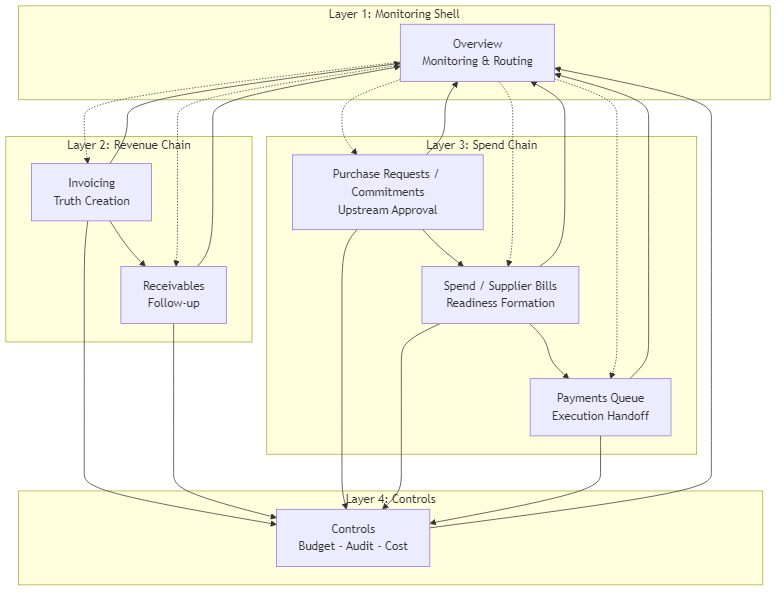

### Revenue loop
- `diagrams/revenue-draft` (supporting revenue-side flow)
- `diagrams/revenue-draft_composition` (supporting revenue composition view)

#### Revenue-side chain (εικόνα)
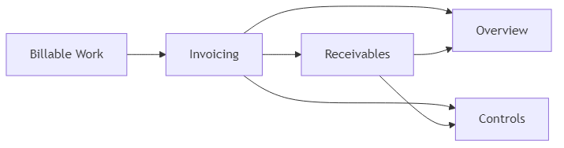

### Spend loop
- Primary reference: Spend chain diagram στο `01-finance-module-map`
- Optional (αν χρειαστεί): `diagrams/all_flows_from_master` (μόνο subset· απέφυγε να στείλεις “full dump” αν δεν είναι αναγκαίο)

#### Spend-side chain (εικόνα)
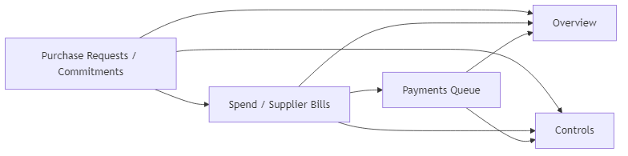

### Monitoring/control relation + Overview drilldown flow
- `diagrams/overview-control`
- `diagrams/overview-spend`
- `16 - Overview Functional Specification` (Diagram pack: routing + composition + interaction flow)

#### Monitoring / Control relation (εικόνα)
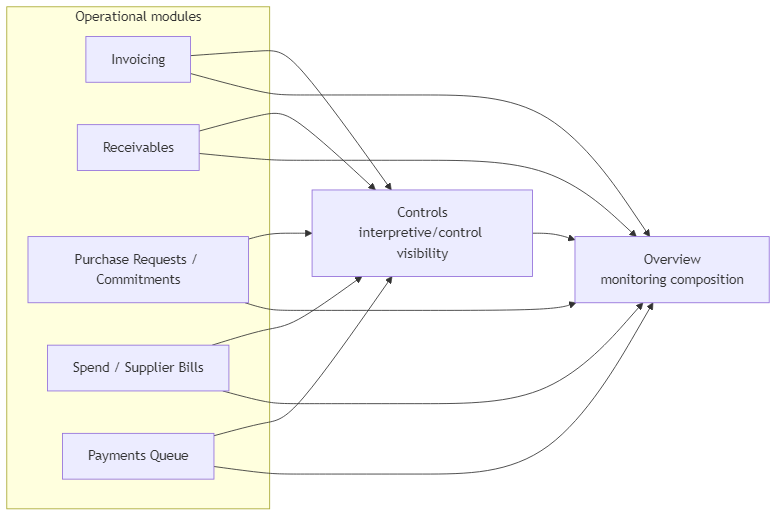

#### Overview — routing / composition / behavior / interaction (εικόνες)
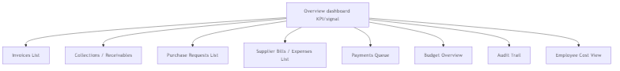

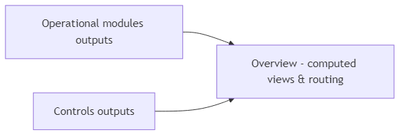

#### Overview → Controls / Spend drilldown flows (εικόνες)
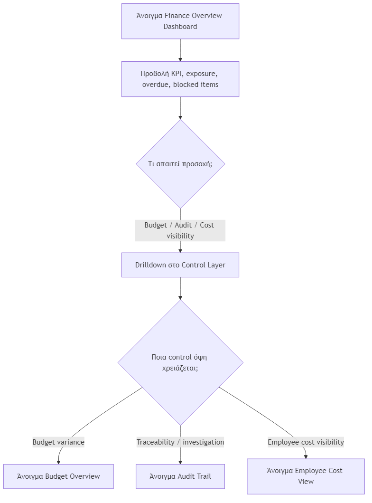

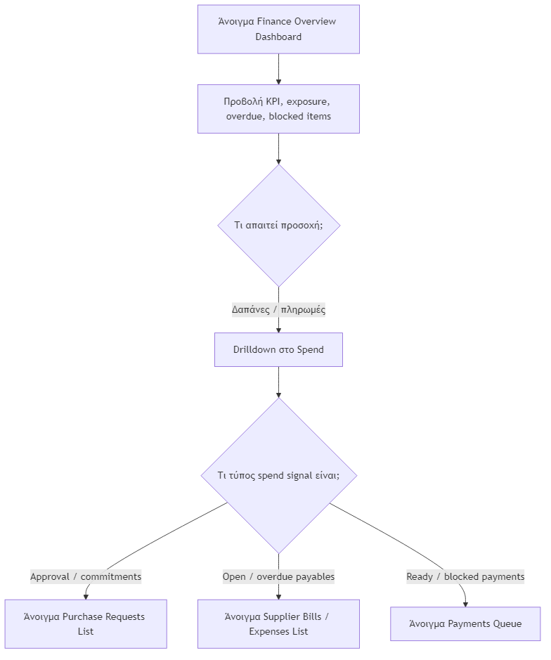

> Σημείωση: σκόπιμα **δεν** είναι “full diagram dump”. Στο pack πρέπει να μπαίνουν μόνο τα “load-bearing” διαγράμματα.

---

## 4) Appendix screenshots / οπτικές αναφορές (μη-canonical)

Πηγή: `FINANCE_UI_BLUEPRINT` → “Screenshot-by-Screenshot Walkthrough”.

### SS-01 — Finance Core Home Menu
- **Label**: Existing UI reference / current visual direction
- **Intended module role**: Entry shell προς τα Finance surfaces (tiles routing προς modules)
- **Notes**: Indicative· naming/layout των tiles μπορεί να εξελιχθεί

### SS-01b — Finance Core Home Menu (updated reference)
- **Label**: Existing UI reference / current visual direction
- **Intended module role**: Entry shell προς τα Finance surfaces (tiles routing προς modules)
- **Notes**: Νεότερο screenshot reference· indicative, όχι final UI truth

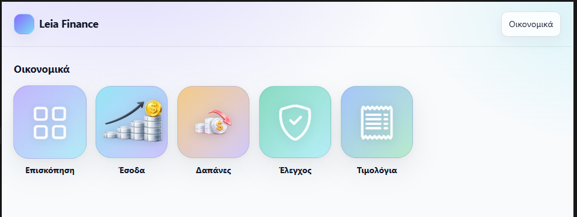

### SS-02 — Finance Overview Dashboard
- **Label**: Current screenshot used as a visual anchor for proposed module behavior
- **Intended module role**: Monitoring shell (composition + routing), όχι execution
- **Notes**: Οποιαδήποτε KPI semantics/thresholds παραμένουν controlled-open per stabilization· το visual composition μπορεί να εξελιχθεί

### SS-02b — Finance Overview Dashboard (updated reference)
- **Label**: Current screenshot used as a visual anchor for proposed module behavior
- **Intended module role**: Monitoring shell (composition + routing), όχι execution
- **Notes**: Νεότερο screenshot reference· semantics παραμένουν canonical στα specs, όχι στο screenshot

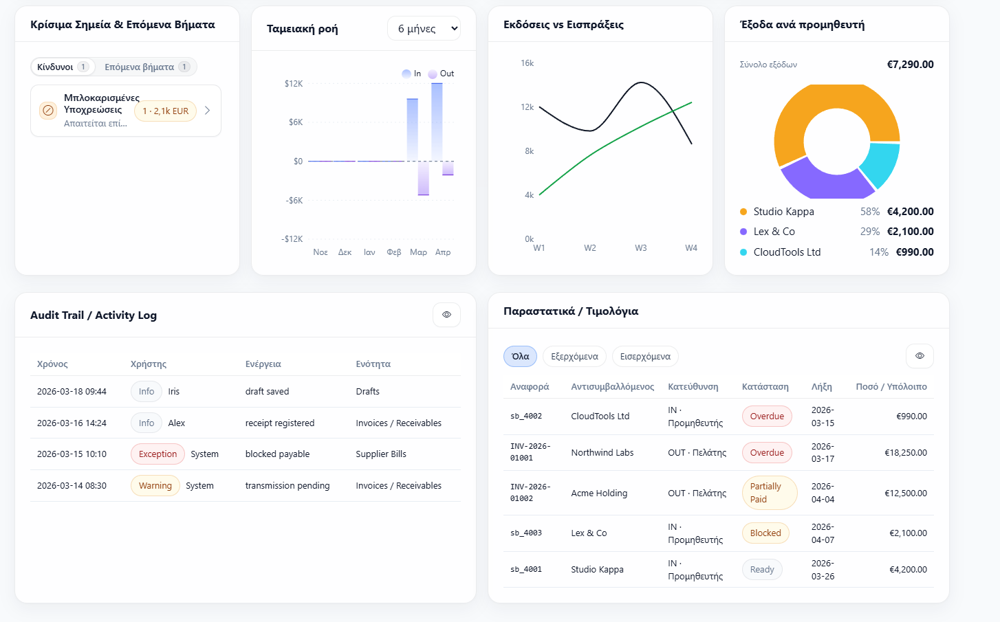

### SS-03 — Invoice Drafts List
- **Label**: Indicative screen reference aligned to current functional model
- **Intended module role**: Invoicing triage (draft creation pipeline)
- **Notes**: Columns/actions της λίστας μπορεί να αλλάξουν χωρίς να αλλάξει το functional contract

### SS-04 — Invoice Draft Builder
- **Label**: Indicative screen reference aligned to current functional model
- **Intended module role**: Draft assembly (pre-issue)
- **Notes**: Layout/components του builder είναι illustrative· το spec ορίζει τη συμπεριφορά

### SS-04b — Invoice Draft / New Invoice (header)
- **Label**: Indicative screen reference aligned to current functional model
- **Intended module role**: Draft assembly (pre-issue) — header/identity + key context
- **Notes**: Νεότερο screenshot reference· fields/layout μπορεί να αλλάξουν χωρίς αλλαγή στο functional contract

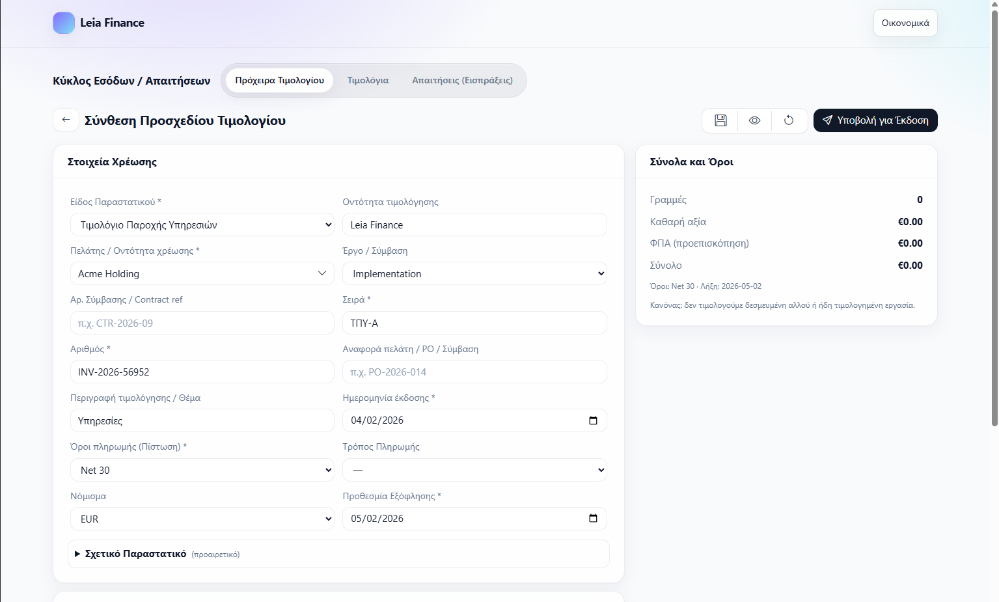

### SS-04c — Invoice Draft / New Invoice (add work item)
- **Label**: Indicative screen reference aligned to current functional model
- **Intended module role**: Draft assembly (pre-issue) — προσθήκη billable work / work item
- **Notes**: Indicative UI· οι κανόνες συμπεριφοράς/validations ορίζονται από το spec

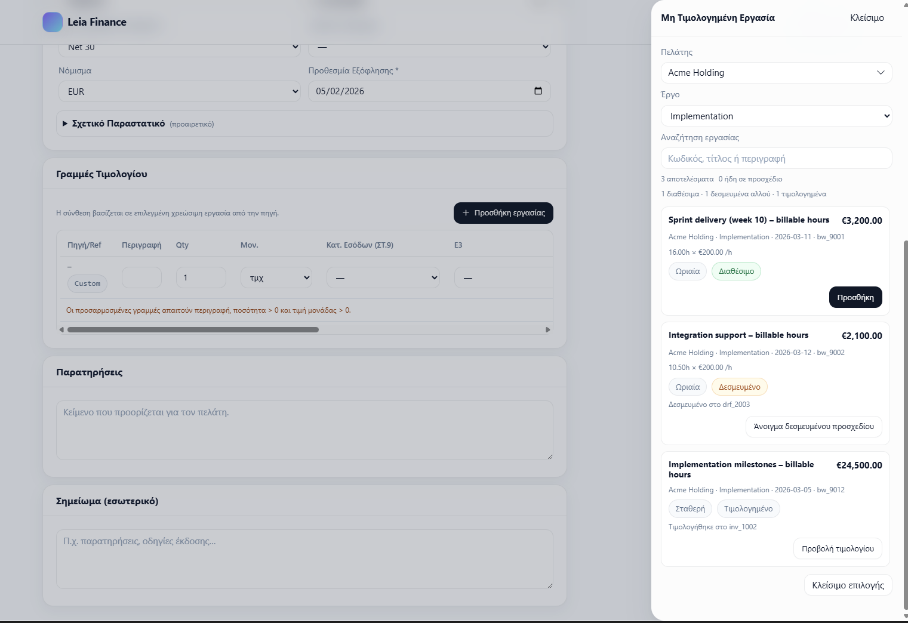

### SS-04d — Invoice Draft / New Invoice (preview)
- **Label**: Indicative screen reference aligned to current functional model
- **Intended module role**: Draft assembly (pre-issue) — preview πριν το issue
- **Notes**: Preview layout indicative· το “truth” και η συμπεριφορά ορίζονται από το functional spec

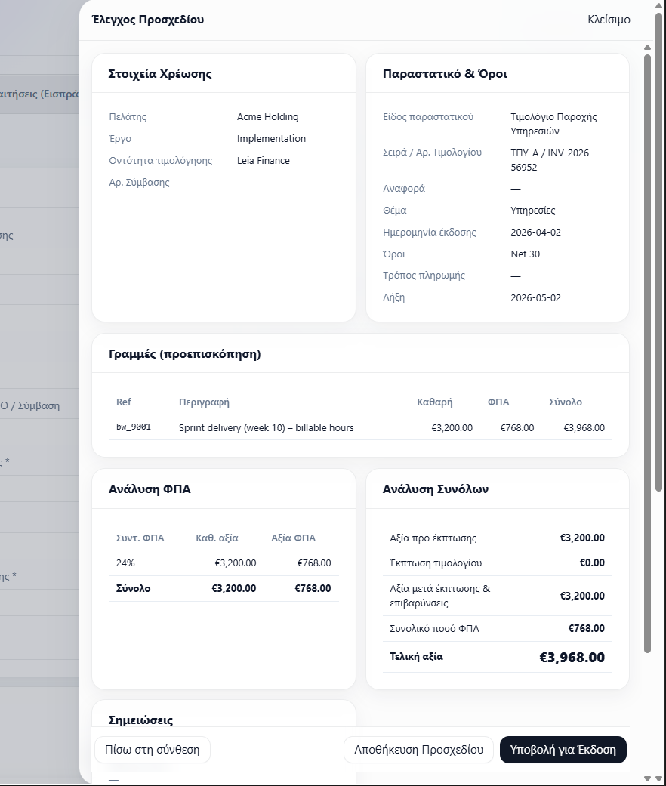

### SS-05 — Invoices List
- **Label**: Existing UI reference / current visual direction
- **Intended module role**: Issued invoice worklist (owner: Invoicing)
- **Notes**: Filters/status chips είναι illustrative· μη τα αντιμετωπίζεις ως canonical semantics

### SS-06 — Invoice Detail View (Drawer / Full)
- **Label**: Existing UI reference / current visual direction
- **Intended module role**: Invoice read/detail surface (owner: Invoicing)
- **Notes**: Drawer vs full layout είναι indicative· το “truth” ορίζεται από το functional spec

### SS-07 — Collections / Receivables View (+ drawer)
- **Label**: Current screenshots used as visual anchors for proposed module behavior
- **Intended module role**: Receivables follow-up (owner: Receivables)· operational triage και collection workflow
- **Notes**: Το “follow-up state” είναι διακριτό από το issued truth· το UI μπορεί να εξελιχθεί

### SS-08 — Purchase Requests List
- **Label**: Indicative screen reference aligned to current functional model
- **Intended module role**: Commitments upstream worklist
- **Notes**: Το approval UX μπορεί να εξελιχθεί· οι commitment semantics παραμένουν canonical στα specs

### SS-09 — Purchase Request Detail / Approval View
- **Label**: Existing UI reference / current visual direction
- **Intended module role**: Commitment review/approval detail
- **Notes**: Fields/layout είναι indicative· οι approval rules ορίζονται στο functional spec

### SS-10 — Supplier Bills / Expenses List
- **Label**: Current screenshot used as a visual anchor for proposed module behavior
- **Intended module role**: Spend readiness formation worklist (owner: Spend/Supplier Bills)
- **Notes**: “Ready/Blocked” πρέπει να παραμείνει διακριτό από execution statuses (βλ. Overview/discipline)

### SS-11 — Supplier Bill Detail View
- **Label**: Existing UI reference / current visual direction
- **Intended module role**: Spend detail· readiness decision surface
- **Notes**: Layout είναι indicative· το readiness logic είναι canonical στο functional spec

### SS-12 — Payments Queue (+ execute batch)
- **Label**: Current screenshots used as visual anchors for proposed module behavior
- **Intended module role**: Execution handoff workspace (owner: Payments Queue)
- **Notes**: Το execution UX μπορεί να εξελιχθεί· δεν πρέπει να “ρουφήξει” readiness ownership

### SS-13 — Budget Overview
- **Label**: Existing UI reference / current visual direction
- **Intended module role**: Controls visibility surface (budget monitoring)
- **Notes**: Budget semantics μπορεί να είναι controlled-open· μη θεωρείς το visualization ως canonical

### SS-14 — Audit Trail / Activity Log (+ detail)
- **Label**: Existing UI reference / current visual direction
- **Intended module role**: Controls/audit visibility (traceability)
- **Notes**: Log schema και filters μπορεί να εξελιχθούν· το audit intent παραμένει canonical

### SS-15 — Employee Cost View
- **Label**: Existing UI reference / current visual direction
- **Intended module role**: Controls visibility (cost monitoring)
- **Notes**: Indicative· metric definitions μπορεί να είναι controlled-open

