# Finance Management & Monitoring System v1  
## UI Blueprint and Product Presentation Report

## 1. Document Purpose
Το παρόν έγγραφο ορίζει ένα **presentation-ready UI Blueprint** για το **Finance Management & Monitoring System v1**: οθόνες, ροές χρήστη, δομή σελίδων, ορατά δεδομένα, φίλτρα, actions, widgets και operational exception states.

## 1A. How to Read This Document
Το Blueprint περιγράφει **πώς συμπεριφέρεται η διεπαφή** (screens/contracts).  
Η canonical επιχειρησιακή σημασία/ownership/rules ορίζονται στα `00/00A/01` και στα module docs (`02+`).

### Authority (UI contract)
- Αν κάτι εδώ συγκρούεται με `00A` (semantic law), κερδίζει το `00A`.
- Αν κάτι εδώ συγκρούεται με `01` (module architecture/dependencies), κερδίζει το `01`.
- Αυτό το έγγραφο δεν “εφευρίσκει” νέες επιχειρησιακές συμπεριφορές· κλειδώνει μόνο UI-safe defaults όπου χρειάζεται για consistency.

### UI-safe v1 defaults (locked unless revised)
- **Manual payment registration (v1)**: η UI δεν υπονοεί bank-confirmed truth.
- **Paid/Executed visibility**: προκύπτει μόνο από payment execution records (όχι από selection/batch).
- **Unlinked supplier bills**: visible αλλά blocked-by-default για πληρωμή (v1).
- **Employee cost visibility**: non-privileged roles βλέπουν aggregate-only μέχρι να κλειδώσουν permissions.
- **KPI date semantics (UI)**: cash→payment date, invoicing→issue date, commitments→approval date, overdue/aging→due date vs today.

## 6. Global UI Rules
Οι παρακάτω κανόνες εφαρμόζονται σε όλες τις οθόνες και πρέπει να υλοποιηθούν ως κοινά UI patterns/components.

### 6.1 Screen Text & Actionability Checklist
Για κάθε screen section πρέπει να μπορείς να απαντήσεις ξεκάθαρα στα παρακάτω.

1. **Τι έφερε τον χρήστη εδώ;**
   - Αν δεν μπορείς να το πεις σε μία πρόταση, η οθόνη είναι θολή.

2. **Ποιο είναι το ένα βασικό action;**
   - Αν η οθόνη φαίνεται να έχει 4 ισότιμα primary actions, χρειάζεται καθάρισμα.

3. **Τι κάνει inline και τι απαιτεί detail page;**
   - Τα data tables πρέπει να υποστηρίζουν εύρεση, σύγκριση, row actions και μετάβαση σε detail.
   - Αν ένα table προσπαθεί να κάνει και full editing και triage και audit review, γίνεται “λάσπη”.

4. **Πού πάει ο χρήστης μετά;**
   - Κάθε KPI, alert, row action και tab πρέπει να έχει ξεκάθαρο προορισμό με ισχυρό information scent.
   - Οι generic labels και τα ασαφή tabs αυξάνουν το cognitive load.

5. **Επιστροφή με συνέπεια κατάστασης**
   - Μετά από ενέργεια (π.χ. `Register Receipt`, `Register Payment`, `Approve/Reject`, `Create/link`), η επιστροφή πρέπει να είναι σε “ενημερωμένη λίστα” ή side panel state που αντανακλά άμεσα το νέο status/priority.

### 6.2 Global UI Rules

- **Status chips (unified)**: Κάθε domain (invoice, collection, request, supplier bill, payment, budget signal) εμφανίζει status chip με σταθερό χρώμα/ένταση. Τα chips δεν είναι διακοσμητικά: οδηγούν φίλτρα, επιτρέπουν quick filtering και επηρεάζουν visual priority.
- **Amount formatting**: Όλα τα ποσά εμφανίζονται σε νόμισμα (default EUR), με consistent formatting (χιλιάδες, δύο δεκαδικά), και σαφή labeling: “Total”, “Paid”, “Outstanding”, “Committed”, “Budgeted”, “Actual Paid”.
- **Overdue highlighting**: Οτιδήποτε overdue (receivable ή payable) λαμβάνει έντονη οπτική σήμανση: κόκκινο status + “days overdue” + pinning/priority στις λίστες. Το overdue δεν πρέπει να κρύβεται σε tooltip.
- **Mismatch / warning banners**: Όταν υπάρχει mismatch (π.χ. supplier bill ≠ approved request), ή “blocked for payment”, ή “external fiscal/transmission issue”, εμφανίζεται banner στην κορυφή detail views και badge στις λίστες.
- **Audit visibility principles**: Κάθε detail view έχει “Timeline / Activity” block που δείχνει κρίσιμες αλλαγές: status transitions, amount changes, due date changes, approvals, attachments added/removed, payment registrations. Όπου είναι διαθέσιμο, πριν/μετά εμφανίζεται με emphasis.
- **Filters behavior**: Τα φίλτρα είναι multi-select όπου έχει νόημα. Κάθε list view έχει “Clear all” και εμφανίζει active filters ως chips. Αλλαγές φίλτρων ανανεώνουν το table state χωρίς να “χάνεται” selection.
- **Empty states**: Κάθε οθόνη έχει στοχευμένο empty state με:
  - τι λείπει (π.χ. “Δεν υπάρχουν billable entries για την περίοδο”),
  - τι μπορεί να κάνει ο χρήστης (π.χ. αλλαγή date range, αφαίρεση φίλτρων, δημιουργία draft),
  - link/CTA προς την επόμενη λογική ενέργεια.
- **Permission-dependent actions**: Actions όπως “Approve request”, “Issue invoice”, “Mark as paid”, “Execute payment”, “Edit employee costs” πρέπει να κρύβονται ή να εμφανίζονται disabled με reason (π.χ. “Δεν έχετε δικαίωμα”) χωρίς να αλλοιώνεται η ορατότητα του record.
- **Linked records behavior**: Όπου υπάρχει σύνδεση (invoice ↔ billable work, supplier bill ↔ purchase request, payment ↔ invoice/bill), η UI παρέχει:
  - inline link με reference,
  - click-through σε full detail,
- **Side panel vs full page**: Οι λίστες ανοίγουν record σε **side detail panel** για γρήγορη triage. Η πλήρης σελίδα detail είναι για “deep work” (επισυνάψεις, approvals, ιστορικό, actions).
- **Dashboard widget interaction rules**: Κάθε widget είναι clickable και οδηγεί σε συγκεκριμένη λίστα με προ-εφαρμοσμένα φίλτρα (drilldown), ποτέ σε “generic search”.
- **Date range rule**: Όλες οι βασικές οθόνες έχουν date range συμβατό με dashboard: current month, quarter, YTD, last-year-to-date, με σαφή ορισμό τι σημαίνει “period” ανά metric (βλ. section 12).

---

## 6.3 Canonical UI State Categories

To prevent confusion between business lifecycle and UI behavior, v1 distinguishes the following state categories.

### A. Persisted Domain Status
Business lifecycle states stored as part of the record.

Examples:
- Draft
- Issued
- Approved
- Rejected
- Scheduled
- Executed
- Paid
- Cancelled

### B. Operational Signal
Computed indicators derived from record state, dates, or amounts.

Examples:
- Overdue
- Due Soon
- High Risk Overdue
- Warning
- Breach
- Mismatch
- Ready for Payment
- Blocked

### C. UI-only Flag
Interaction or review markers that help work organization but do not define the business lifecycle.

Examples:
- Review Needed
- Stale Draft
- Missing Attachment
- Visibility Restricted
- Reserved-lines indicator

### D. Ephemeral Selection State
Temporary front-end state that exists only during the current interaction.

Examples:
- Selected for batch
- Highlighted row
- Active side panel
- Current row selection
- Prepared (selected-only UI state, unless explicitly persisted later)

### UI discipline rule
A screen may show multiple state categories at once, but they must not be visually or semantically merged.

Examples:
- “Issued” is a persisted domain status
- “Overdue” is an operational signal
- “Review Needed” is a UI-only flag
- “Selected for batch” is an ephemeral selection state

If one label belongs to a different category, it must not silently replace another category in the UI or in documentation.

---

## 7. Screen Blueprint

### 7.1 Finance Overview Dashboard

##### a. Screen Purpose
Να παρέχει μια ενιαία εικόνα monitoring της χρηματοοικονομικής εκτέλεσης: τι έχει εκδοθεί, τι έχει εισπραχθεί, τι οφείλεται, τι έχει δεσμευθεί, τι έχει πληρωθεί, και ποιο είναι το exposure σε overdue/ρίσκο.

**Role note:** Το `Overview` λειτουργεί αποκλειστικά ως monitoring shell: συνοψίζει, επισημαίνει και δρομολογεί. Δεν είναι primary execution workspace. 

**Entry from:** `Finance Core Home Menu` (SS-01) -> user navigation to `Finance Overview Dashboard` (landing/overview context).
**Exit to:** `Invoices List`, `Collections / Receivables`, `Supplier Bills / Expenses List`, `Payments Queue`, `Budget Overview`.
**Primary question:** Τι απαιτεί άμεση προσοχή στο revenue/spend exposure για την επιλεγμένη περίοδο;
**Primary action:** Click KPI card ή drilldown shortcut για να ανοίξει η αντίστοιχη operational λίστα.

##### b. Primary User Types
Finance operator, COO/ops, founders/management, team leads (σε περιορισμένη ορατότητα), account managers (για collections follow-up).

##### c. Layout Structure
- **Top bar**: Date range switcher (current month / quarter / YTD / last-year-to-date) + global filters (client, supplier, department, project, category) + “Reset”.
- **KPI strip (primary monitoring pathways)**: 8–12 KPI cards (βλ. section 12).
- **Trends row (supportive context)**: 2–3 charts (π.χ. collected vs paid, invoiced vs collected, committed vs actual).
- **Exposure row (secondary monitoring detail)**: Receivables snapshot + Payables snapshot (aging).
- **Budget & commitments row (secondary monitoring detail)**: Commitment vs Budget snapshot (by department/project).
- **Overdue focus panel (secondary monitoring detail)**: Overdue receivables + overdue payables + top 10 items.
- **Drilldown shortcuts (monitoring aids)**: Quick links (Invoices, Collections, Purchase Requests, Supplier Bills, Payments Queue, Budget Overview).

##### d. Sections / Components
- **KPI widgets**: Gross Invoiced, Income Collected, Expenses Paid, Net Cash Movement, Outstanding Receivables, Outstanding Payables, Committed Spend, Budget Utilization, Overdue Receivables, Overdue Payables.
- **Trend charts**:
  - “Invoiced vs Collected” (μηνιαίο/εβδομαδιαίο).
  - “Paid Expenses” trend.
  - “Committed vs Actual Paid” trend.
- **Receivables snapshot**: Aging buckets (Not due, 1–15, 16–30, 31–60, 60+), total outstanding, count, top clients.
- **Payables snapshot**: Aging buckets (Not due, 1–15, 16–30, 31–60, 60+), total open payables, count, top suppliers.
- **Commitment vs Budget**: stacked bars ανά department/project/category.
- **Overdue exposure list**: “Top overdue items” με amount, days overdue, owner/next action.

##### e. Must-visible fields
- σαφείς ορισμοί των KPI labels (π.χ. “Gross Invoiced” ≠ “Collected”),
- ποσά + περίοδος,
- counts (π.χ. # invoices overdue),
- aging distribution,
- breakdown tags (client/supplier/department/project/category),
- drilldown hints (π.χ. “Click to view 23 invoices”).

##### f. Filters
- date range: current month / quarter / YTD / last-year-to-date / custom range
- client (multi-select)
- supplier (multi-select)
- department (multi-select)
- project (multi-select)
- category (multi-select)

##### g. Sorting / Grouping
Στα “Top lists” δυνατότητα sort by amount, days overdue, due date.

##### h. Row / Card Actions
- Click KPI card → αντίστοιχη λίστα με προ-φίλτρα.
- Click aging bucket → Collections/Payables view με bucket φίλτρο.
- Click top item → ανοίγει detail panel του record.

##### i. Bulk Actions
Δεν εφαρμόζονται στο dashboard (μόνο drilldown).

##### j. Detail View / Side Panel Requirements
Side panel για invoice/supplier bill από top lists:
- header με reference + status chips
- amounts (total/paid/outstanding ή open payable)
- due/issue dates
- owner/follow-up (για receivables)
- primary actions (π.χ. “Open full detail”, “Add note” όπου επιτρέπεται)

##### k. Statuses Shown on This Screen
Συνοπτικά status chips/badges (με αυστηρό state-family separation):
- Invoice document statuses: Draft / Issued / Cancelled-Credited (αν υπάρχει)
- Receivable/payment signals: Open / Partially Collected / Collected / Overdue (ως receivable progression, όχι invoice document lifecycle)
- Payables readiness/execution/signal: Ready / Blocked / Scheduled / Paid / Overdue
- Budget signals: Healthy / Warning / Breach (βλ. section 10)

##### l. Empty / Error / Exception States
- **No data in date range**: Εμφάνιση “Δεν υπάρχουν κινήσεις/records στην επιλεγμένη περίοδο” + suggestion να αλλάξει range ή αφαιρέσει φίλτρα.
- **Filter yields zero**: Εμφάνιση active filters chips + “Clear filters”.
- **Data unavailable**: Banner “Προσωρινή αδυναμία φόρτωσης metrics” με retry.

##### m. Notes for Frontend Implementation
- Τα widgets πρέπει να είναι “deterministic drilldowns”: κάθε widget έχει σταθερό target screen + pre-applied filters.
- Όλες οι κάρτες εμφανίζουν “definition tooltip” (σύντομος ορισμός) που παραπέμπει στο section 12.
- Οι charts/visuals πρέπει να οδηγούν σε drilldown μέσω CTA ή click.

---

### 7.2 Invoice Drafts List

##### a. Screen Purpose
Να λειτουργεί ως **επιχειρησιακή “ουρά” drafts** ώστε τα draft invoices να είναι ανακαλύψιμα, να μπορούν να συνεχιστούν/ελεγχθούν/καθαριστούν, και να αποφεύγεται το φαινόμενο “drafts που χάνονται μέσα στον builder”.

**Entry from:** `Invoice Draft Builder` (resume/edit από draft) ή πλοήγηση προς drafts για διαχείριση stale/needs-review items.
**Exit to:** `Invoice Draft Builder` (resume/edit) ή επιστροφή σε read-only preview μέσα από το side panel.
**Primary question:** Ποια drafts χρειάζονται συνέχεια, review ή καθάρισμα (release) για να περάσουν στη φάση έκδοσης;
**Primary action:** Click σε row για άνοιγμα preview και CTA “Open in Draft Builder”.

##### b. Primary User Types
Finance operator, operations.

##### c. Layout Structure
- Top header: “Invoice Drafts” + quick stats (count, total draft preview sum, # stale).
- Filter bar: owner, client, project/contract, last updated range, stale age bucket, review-needed, reserved-lines.
- Main table: drafts με προτεινόμενες στήλες.
- Side detail panel: ανοίγει με click σε row, με preview του draft και primary actions.
- Bulk action bar: εμφανίζεται όταν υπάρχουν selected rows.

##### d. Sections / Components
- **Drafts table** με sticky header, column visibility menu.
- **Review-needed indicator**: badge/flag που ενεργοποιείται από κανόνες UI (βλ. exception states).

##### e. Must-visible fields
Προτεινόμενες στήλες (must include):
- draft reference
- client
- project/contract
- owner
- last updated
- stale age (ημέρες από last updated)
- selected lines count
- draft total preview
- review-needed flag
- reserved-lines indicator (π.χ. “Reserving 12 items”)

##### f. Filters
- owner
- client
- project/contract
- last updated date range
- stale age bucket (e.g. <7, 7–14, 15–30, 30+)
- review-needed (yes/no)
- reserved-lines indicator (yes/no)
- “empty draft” (selected lines count = 0) yes/no

##### g. Sorting / Grouping
- Default sorting: stale age desc, then last updated asc (ώστε να ανεβαίνουν τα πιο “ξεχασμένα”).
- Sorting: last updated, draft total preview, selected lines count, client, owner.

##### h. Row / Card Actions
Row actions (ellipsis):
- Resume/Edit in Draft Builder (navigation)
- Open read-only preview (side panel)
- Mark as “Needs review” / clear flag (UI-only tagging, αν επιτραπεί)
- Duplicate (creates a new draft copy) (OPEN QUESTION / ARCHITECT DECISION — αν επιτρέπεται)
- Discard/Cancel draft (requires confirmation) (policy dependent)

##### i. Bulk Actions
- Bulk export (CSV)
- Bulk assign owner (αν επιτρέπεται)
- Bulk discard/cancel drafts (requires confirmation, restricted to stale drafts by default)

##### j. Detail View / Side Panel Requirements
Side panel draft preview:
- header: draft reference + “Draft” status + stale badge (αν stale)
- client + project/contract
- totals preview (subtotal/taxes/total ως preview)
- selected lines list (top 10) + count
- reserved-lines summary (how many source items currently reserved)
- last updated + last editor (αν διαθέσιμο)
- primary CTAs: “Open in Draft Builder”, “Discard draft”

##### k. Statuses Shown on This Screen
Εμφανίζονται operational statuses/flags:
- Draft (baseline)
- Stale draft (warning/danger ανά bucket)
- Review-needed (flag)
Σημείωση: δεν εισάγεται νέο “λογιστικό” lifecycle εδώ· είναι management surface για drafts.

##### l. Empty / Error / Exception States
- **No drafts exist**: empty state με CTA “Create new draft” (οδηγεί στο Draft Builder) και εξήγηση ότι drafts εμφανίζονται όταν γίνεται “Save draft”.
- **Only stale drafts view**: αν κανένα δεν είναι stale, εμφανίζει “0 stale drafts” + link “View all drafts”.
- **Draft with zero lines**: εμφανίζεται ως exception badge “Empty draft” και προτείνεται discard.
- **Draft reserves lines for too long**: warning banner στο side panel “Το draft δεσμεύει γραμμές για Χ ημέρες” + CTA “Resume & finalize” ή “Discard to release”.

##### m. Notes for Frontend Implementation
- Το “reserved-lines indicator” είναι κρίσιμο για αποφυγή “αόρατου lock” σε billable entries. Η UI πρέπει να κάνει το reservation ορατό και να δίνει καθαρές επιλογές (resume ή discard).
- Η διαχείριση “discard/cancel” δεν πρέπει να εκτελείται χωρίς confirmation modal που συνοψίζει: client, total preview, reserved lines count, last updated.

---

### 7.3 Invoice Draft Builder

##### a. Screen Purpose
Να επιτρέπει την επιχειρησιακή σύνθεση ενός **invoice draft** από **billable work** με καθαρότητα επιλογής, αποφυγή διπλο-τιμολόγησης και έλεγχο totals πριν την έκδοση.

**Entry from:** `Invoice Drafts List` (resume/edit).
**Exit to:** `Invoice Drafts List` (discard/cancel ή επιστροφή μετά το review) ή transition προς έκδοση όπου υποστηρίζεται (βλ. existing open questions).
**Primary question:** Ποια billable entries θα τιμολογηθούν στο συγκεκριμένο draft και ποιες είναι οι κρίσιμες ενδείξεις πριν την έκδοση;
**Primary action:** Add/Select billable entries και `Review` του draft (totals & duplicate safety).

##### b. Primary User Types
Finance operator, operations.

##### c. Layout Structure
Διάταξη 3-pane:
- **Left: Source billable entries** (candidate work)
- **Center: Selected invoice lines** (draft content)
- **Right: Totals & terms** (summary, taxes/terms/notes)
Sticky bottom bar: “Save draft”, “Discard changes”, “Review”.

##### d. Sections / Components
- **Source billable entries area**
  - table/list με **επιλέξιμες χρεώσιμες μονάδες** (billable source items)
  - search + filters (client, project, period, type)
  - indicators: already invoiced / reserved in another draft / unavailable
- **Selected lines area**
  - re-order lines
  - edit description/quantity/amount at UI level (μόνο αν επιτραπεί)
  - remove line
- **Totals summary area**
  - subtotal
  - taxes (ως UI section, χωρίς να ορίζει κανόνες)
  - total
  - due terms (π.χ. net 30) και due date preview
  - notes / internal memo

##### e. Must-visible fields
Για **source entries** (billable source items):
- περιγραφή εργασίας
- ημερομηνία/περίοδος
- client + project
- ποσό ή units + rate (όπως είναι διαθέσιμο)
- κατάσταση τιμολόγησης: “Available”, “Already invoiced”, “In draft (reserved)”
Ελάχιστη ορατή αναφορά/ταυτότητα (για να μην είναι “αφηρημένο ποσό”):
- ένα **source reference** (π.χ. work item ID / time entry reference / deliverable reference) ή, αν αυτό δεν έχει οριστεί, ένα σταθερό “Entry reference” που μπορεί να αντιγραφεί (OPEN QUESTION / ARCHITECT DECISION ως προς την canonical πηγή).
Σημείωση canonical source type:
- Αν δεν έχει αποφασιστεί αν το source είναι **time entry**, **task/work item**, **deliverable line**, **manual billable candidate** ή **hybrid**, η UI πρέπει να το χειριστεί ως **ενιαία επιλέξιμη μονάδα** με κοινά ελάχιστα ορατά στοιχεία: reference, περιγραφή, περίοδος, client/project, ποσό/units, κατάσταση (available/reserved/invoiced) και origin badge (π.χ. “Time”, “Task”, “Manual”) όπου είναι διαθέσιμο.
Για **selected lines**:
- line description
- amount
- linked source reference (όπου υπάρχει)
Για totals:
- subtotal, taxes (labelled), total, due terms, notes.

##### f. Filters
Source entries filters:
- client
- project/contract
- date range / work period
- type/category of billable work
- availability status (Available only / include reserved / include already invoiced as read-only)

##### g. Sorting / Grouping
Source sorting: by date, by amount, by project.
Selected sorting: manual (drag).

##### h. Row / Card Actions
Source entry actions:
- Add to draft
- View entry details (side mini panel)
Selected line actions:
- Remove
- Edit (if allowed)
- Jump to source entry

##### i. Bulk Actions
Source entries:
- “Add selected to draft”
- “Select all visible”

##### j. Detail View / Side Panel Requirements
Mini panel για source entry:
- full description
- date/time
- project/contract
- amount breakdown
- invoicing status history (read-only)

##### k. Statuses Shown on This Screen
Availability statuses for billable entries:
- Available
- Reserved in draft
- Already invoiced
Draft status (header):
- Draft (Unsaved changes / Saved)
- Stale draft warning (αν έχει παλαιότητα)

##### l. Empty / Error / Exception States
- **No billable entries available**: empty state με προτεινόμενες ενέργειες (change period, client, include other projects).
- **All billable entries already invoiced**: informative state + link σε Invoices List filtered to that period/client.
- **Duplicate prevention**: αν ο χρήστης επιχειρεί να προσθέσει ήδη invoiced/reserved entry, εμφανίζεται blocking modal με explanation.
- **Stale draft**: banner “Το draft έχει να ενημερωθεί Χ ημέρες” + CTA “Review lines”.

##### m. Notes for Frontend Implementation
- Η UI πρέπει να εφαρμόζει “duplicate prevention” σε επίπεδο interaction: disable “Add” για μη διαθέσιμες εγγραφές, με tooltip “Already invoiced / Reserved”.
- Να υπάρχει καθαρή διάκριση UI μεταξύ candidate list και selected draft lines (π.χ. διαφορετικό background, pinned counts).
- Τα “Reserved in draft” items πρέπει να εμφανίζουν **πού είναι δεσμευμένα** (draft reference + link σε `Invoice Drafts List`), ώστε ο χρήστης να μπορεί να τα απελευθερώσει μέσω resume/discard.

---

### 7.4 Invoices List

##### a. Screen Purpose
Λίστα διαχείρισης τιμολογίων/receivables για αναζήτηση, φίλτρα, triage overdue, και πρόσβαση σε details/ενέργειες.

**Entry from:** `Finance Overview Dashboard` drilldowns ή `Invoice Detail View`/`Collections` navigation.
**Exit to:** `Invoice Detail View` ή `Collections / Receivables` (προ-φιλτραρισμένο για αυτό το invoice/client).
**Primary question:** Ποια issued invoices / receivables αντιστοιχούν στα τρέχοντα φίλτρα και ποια χρειάζονται άνοιγμα σε detail ή μετάβαση στο `Collections` workflow;
**Primary action:** Open invoice detail.

##### b. Primary User Types
Finance operator, account managers (για follow-up), management.

##### c. Layout Structure
- Top header: “Invoices” + quick stats (count, total outstanding) για το ενεργό φίλτρο.
- Filter bar: status, client, project/contract, issue/due date, aging bucket, fiscal/transmission.
- Main table: invoices με προτεινόμενες στήλες.
- Side detail panel: ανοίγει με click σε row.
- Bulk action bar: εμφανίζεται όταν υπάρχουν selected rows.

##### d. Sections / Components
- **Table** με sticky header, column visibility menu.

##### e. Must-visible fields
Προτεινόμενες στήλες:
- invoice reference
- client
- related project / contract
- issue date
- due date
- total amount
- paid amount
- outstanding amount
- payment status
- days overdue ή aging bucket
- fiscal / transmission status

##### f. Filters
- payment status (multi-select)
- aging bucket (Not due, 1–15, 16–30, 31–60, 60+)
- client
- project/contract
- issue date range
- due date range
- fiscal/transmission status
- outstanding amount range (min/max)
- owner / follow-up owner

##### g. Sorting / Grouping
- default sorting: due date asc, then days overdue desc για overdue views
- sorting: issue date, due date, outstanding amount, client, fiscal status

##### h. Row / Card Actions
Row actions (ellipsis):
- Open detail
- Copy invoice reference
- Add collection note
- View linked billable work (read-only)
- View payments (read-only)
- Go to Collections view filtered to this invoice/client

##### i. Bulk Actions
Μόνο UI-level actions χωρίς backend “φαντασία”, π.χ.:
- Bulk export (CSV) των εμφανιζόμενων columns
- Bulk assign owner (αν επιτρέπεται)
- Bulk add follow-up tag / reminder (αν προβλέπεται ως UI capability)
Οτιδήποτε επηρεάζει status (π.χ. “Mark as paid”) απαιτεί ARCHITECT DECISION (βλ. section 13A).

##### j. Detail View / Side Panel Requirements
Side panel περιλαμβάνει:
- header: invoice ref + status chips (invoice, fiscal/transmission)
- amounts: total/paid/outstanding
- dates: issue/due
- client + project/contract link
- collection summary: expected payment date (αν υπάρχει), owner, last note snippet
- actions: “Open full detail”, “Add note”, “Go to Collections”

##### k. Statuses Shown on This Screen
Invoice statuses (βλ. section 10) και fiscal/transmission statuses ως ξεχωριστό chip (δεν συγχωνεύεται με payment status).

##### l. Empty / Error / Exception States
- No invoices in range
- All invoices paid (για συγκεκριμένο φίλτρο): προτείνει αλλαγή φίλτρων
- Data load error: retry + diagnostics hint (“Try removing filters”)

##### m. Notes for Frontend Implementation
- Overdue visual treatment: row tint + overdue badge + days overdue column always visible όταν υπάρχει overdue filter.
- Fiscal/transmission status πρέπει να είναι εμφανές ως ξεχωριστό dimension (όχι απλά icon).

---

### 7.5 Invoice Detail View

##### a. Screen Purpose
Να παρέχει πλήρη εικόνα ενός issued invoice/receivable: τι περιλαμβάνει, τι πληρωμές έχουν καταγραφεί, ποια είναι η κατάσταση είσπραξης, και τι ισχύει για fiscal/transmission.

**Entry from:** `Invoices List` row click ή `Collections / Receivables` (click invoice).
**Exit to:** `Collections / Receivables` (Go to Collections) ή side navigation σε linked work/payments.
**Primary question:** Ποια είναι η κατάσταση είσπραξης του συγκεκριμένου receivable και ποιο είναι το επόμενο operational follow-up;
**Primary action:** Add collection note (και/ή ρύθμιση expected payment date όπου επιτρέπεται).

##### b. Primary User Types
Finance operator, collections owner, management.

##### c. Layout Structure
- **Header summary** (sticky): invoice ref, client, total/paid/outstanding, payment status, due, fiscal/transmission chip.
- **Tabs ή sections** σε single page:
  - Overview
  - Linked billable work
  - Payments
  - Collections notes/history
  - Fiscal / external transmission
  - Timeline / activity log

##### d. Sections / Components
- **Invoice summary header**
- **Linked billable work section** (read-only list)
- **Payment section** (payment registrations, allocations)
- **Collections notes / history section** (owner, next action, expected date)
- **Fiscal / external transmission status section**
- **Timeline / activity log block**

##### e. Must-visible fields
- invoice reference + external official reference (αν υπάρχει)
- client + project/contract
- issue date, due date, terms
- total amount, paid amount, outstanding
- payment status + aging/overdue days
- linked work lines with references
- payments list: date, amount, method (if known), allocation notes
- collection notes: latest note, follow-up owner, expected payment date
- fiscal/transmission: status + last update time + error reason (if failed) + reference id (if available)

##### f. Filters
Στα embedded lists:
- linked work: filter by project, period
- payments: filter by date range, allocation status

##### g. Sorting / Grouping
Linked work: by date asc.
Payments: by date desc.
Timeline: by time desc (default) με option chronological asc.

##### h. Row / Card Actions
- Add collection note
- Set / update expected payment date (UI action; backend decision)
- Open Collections view pre-filtered
- View fiscal/transmission details

##### i. Bulk Actions
Δεν εφαρμόζονται στο detail.

##### j. Detail View / Side Panel Requirements
Το ίδιο είναι full detail. Από άλλα screens, side panel πρέπει να δίνει CTA “Open full detail”.

##### k. Statuses Shown on This Screen
Invoice + payment statuses, fiscal/transmission status, collection follow-up status (π.χ. “Follow-up due today”).

##### l. Empty / Error / Exception States
- **Invoice partially paid**: εμφανίζει allocation breakdown και outstanding banner.
- **Invoice overdue**: prominent overdue banner + CTA προς collection actions.
- **Payment registered without full allocation**:
  - warning banner στο payment section
  - show allocated amount
  - show unallocated remainder
  - show resulting outstanding amount
  - do not display invoice as fully paid unless outstanding reaches zero
- **Cancelled/Credited invoice**: read-only state + banner “Δεν είναι εισπρακτέο” (χωρίς λογιστική ερμηνεία).

##### m. Notes for Frontend Implementation
- Το fiscal/transmission block πρέπει να είναι “operational”: δείχνει τι εκκρεμεί, όχι τεχνικές λεπτομέρειες integration.
- Timeline entries πρέπει να εμφανίζουν actor και source module.

---

### 7.6 Collections / Receivables View

##### a. Screen Purpose
Να οργανώνει την εργασία είσπραξης με βάση aging/overdue, ownership και follow-up cadence, χωρίς να συγχέεται με “Invoices List”.

**Entry from:** `Finance Overview Dashboard` (Overdue/Outstanding drilldowns) ή `Invoices List`/`Invoice Detail View`.
**Exit to:** `Invoice Detail View` (click invoice) ή εντός οθόνης quick actions (notes/expected date/owner).
**Primary question:** Ποια receivables πρέπει να αντιμετωπιστούν πρώτα με βάση overdue/aging και owner/follow-up;
**Primary action:** Add collection note (και ενημέρωση follow-up πεδίων όπου επιτρέπεται).

##### b. Primary User Types
Collections owners, finance operator, account managers.

##### c. Layout Structure
- Header: “Collections” + totals (outstanding, overdue).
- Filter bar: overdue bucket, client, amount, owner, expected payment date range.
- Main table: invoices/receivables oriented στη συλλογή.
- Right side panel: collection-focused detail.
- “Today focus” subpanel: follow-ups due today.

##### d. Sections / Components
- **Aging-driven list/table** με buckets
- **Overdue prioritization**: pinned “60+ days” και “largest outstanding”
- **Follow-up fields**: expected payment date, next action, owner
- **Collection notes preview**: τελευταίο note snippet + date

##### e. Must-visible fields
Για κάθε item:
- invoice reference + client
- outstanding amount
- due date + days overdue/aging bucket
- expected payment date (αν υπάρχει)
- owner / follow-up owner
- last note date + snippet
- “next action” label (π.χ. “Call”, “Email”, “Meeting requested”) ως operational tag

##### f. Filters
- overdue bucket
- client
- outstanding amount range
- owner
- expected payment date: none / this week / overdue expected date
- “has notes” / “no notes”

##### g. Sorting / Grouping
Default: overdue desc, then outstanding desc.

##### h. Row / Card Actions
- Add note
- Assign / change owner (if permitted)
- Set expected payment date (if permitted)
- Open invoice detail

##### i. Bulk Actions
- Bulk assign owner
- Bulk add follow-up tag (π.χ. “Chase this week”) αν υποστηρίζεται ως UI feature
- Bulk export

##### j. Detail View / Side Panel Requirements
Collection side panel:
- invoice header + overdue banner
- client contact hints (αν υπάρχουν διαθέσιμα από άλλα modules) ως link-only
- notes timeline (last 5)
- expected payment date + owner controls
- CTA: open full invoice detail

##### k. Statuses Shown on This Screen
Collection status signals:
- Not due
- Due soon
- Overdue
- Overdue high risk (60+)
και payment status (e.g. Partially Paid) χωρίς να αντικαθιστά την collection signal.

##### l. Empty / Error / Exception States
- “No receivables in selection”
- “All receivables not due” (αν user φιλτράρει only overdue)

##### m. Notes for Frontend Implementation
- Το UI πρέπει να προωθεί “worklist behavior”: keyboard-friendly navigation, quick add note, minimal clicks.

---

### 7.7 Purchase Requests List

##### a. Screen Purpose
Να συγκεντρώνει αιτήματα αγορών και να επιτρέπει triage/έγκριση/παρακολούθηση μέχρι να γίνουν commitments και να συνδεθούν με supplier bills.

**Entry from:** `Finance Overview Dashboard` (Committed Spend drilldowns) ή πλοήγηση από `Budget Overview`.
**Exit to:** `Purchase Request Detail / Approval View`.
**Primary question:** Ποια purchase requests απαιτούν απόφαση/έλεγχο προτεραιότητας με βάση status/urgency και budget context;
**Primary action:** Click σε row για άνοιγμα `Purchase Request Detail / Approval View`.

##### b. Primary User Types
Requesters, approvers, finance operator, department heads.

##### c. Layout Structure
- Header: “Purchase Requests” + counters per status.
- Filter bar: requester, department, supplier, category, status, urgency, submitted date.
- Main table: requests.
- Side panel: request snapshot + approval CTA (αν επιτρέπεται).

##### d. Sections / Components
- Status summary (chips) row: Draft/Submitted/Approved/Rejected/Cancelled (τελικό mapping στο section 10).
- Table με attachment indicator και mismatch/budget signals.

##### e. Must-visible fields
Στήλες (must include):
- requester
- department
- supplier
- category
- estimated amount
- submitted date
- approver
- status
- urgency
- attachment indicator
Επιπλέον:
- budget context signal (e.g. “Over budget”)
- link indicator προς supplier bill (αν υπάρχει)

##### f. Filters
- status (multi)
- requester
- department
- supplier
- category
- urgency (Normal/High/Critical)
- submitted date range
- “has attachment” yes/no
- “linked supplier bill exists” yes/no

##### g. Sorting / Grouping
Sort: submitted date desc (default), urgency, estimated amount, status.

##### h. Row / Card Actions
- Open detail
- Quick approve/reject (μόνο αν policy επιτρέπει από list)
- Request changes / add comment (UI action; backend decision)

##### i. Bulk Actions
- Bulk export
- Bulk reassign approver (αν επιτρέπεται)

##### j. Detail View / Side Panel Requirements
Side panel:
- request summary (amount, category, supplier, urgency)
- approval status + approver
- attachments preview
- CTA “Open full detail”

##### k. Statuses Shown on This Screen
Purchase request statuses (section 10) + budget signal badge (section 10).

##### l. Empty / Error / Exception States
- No requests
- Filter yields none
- Attachment missing warning badge visible when required by policy

##### m. Notes for Frontend Implementation
- Urgency πρέπει να έχει strong visual (icon + chip) και να επηρεάζει default sort όταν status=Submitted.

---

### 7.8 Purchase Request Detail / Approval View

##### a. Screen Purpose
Να επιτρέπει τεκμηριωμένη έγκριση/απόρριψη με πλήρες context: budget, supplier, justification, attachments, και να συνδέει το request με το resulting supplier bill.

**Entry from:** `Purchase Requests List`.
**Exit to:** `Purchase Requests List` (με ενημερωμένο status) ή `Supplier Bill Detail View` (εφόσον υπάρχει σύνδεση).
**Primary question:** Επιβεβαιώνεται η καταλληλότητα του request (budget/supplier/attachments) για έγκριση ή απαιτείται αλλαγή/απόρριψη;
**Primary action:** Approve / Reject / Request changes.

##### b. Primary User Types
Approvers, finance operator, requester.

##### c. Layout Structure
- Header: request reference + status + urgency.
- Left/main: request details + justification + attachments.
- Right rail: budget context + approval decision area (sticky).
- Bottom: comments thread + activity timeline.

##### d. Sections / Components
- **Request summary**: requester, department, supplier, category, estimated amount, desired date.
- **Budget context**: διαθέσιμο budget/remaining, committed, impact indicator.
- **Supplier info**: supplier identity + link to supplier bills list filtered.
- **Description & justification**: structured fields.
- **Approval decision area**: Approve / Reject / Request changes + reason.
- **Approval comments area**: mandatory comment on reject/escalation.
- **Mismatch / escalation indicators**: over budget, missing attachment, unclear supplier.
- **Links to resulting supplier bill**: εμφανίζεται όταν υπάρχει.

##### e. Must-visible fields
- πλήρης περιγραφή αιτήματος
- συνημμένα (λίστα + preview where possible)
- budget availability context (ορατό, χωρίς να ορίζει υπολογισμό)
- ιστορικό εγκρίσεων/αποφάσεων (actor, time)
- link προς supplier bill (αν δημιουργηθεί)

##### f. Filters
Δεν είναι list screen. Στα comments/timeline: filter by “system events” vs “human comments”.

##### g. Sorting / Grouping
Timeline chronological.

##### h. Row / Card Actions
- Approve / Reject / Request changes
- Add comment
- Download attachment
- Create linked supplier bill (ARCHITECT DECISION αν γίνεται από UI)

##### i. Bulk Actions
N/A

##### j. Detail View / Side Panel Requirements
N/A (full page).

##### k. Statuses Shown on This Screen
Purchase request status + budget signal + “approval pending” state.

##### l. Empty / Error / Exception States
- Approved request exceeds available budget: blocking banner + requires escalation path
- Missing attachment: warning or blocking based on policy
- Rejected request: read-only with reason prominently visible

##### m. Notes for Frontend Implementation
- Approval actions πρέπει να απαιτούν confirmation modal με summary (amount, supplier, budget impact) για αποφυγή λάθους.

---

### 7.9 Supplier Bills / Expenses List

##### a. Screen Purpose
Λίστα supplier bills/expenses ως open payables με due dates, match-to-request κατάσταση, readiness, και payment status, με ισχυρή προβολή εξαιρέσεων.

**Entry from:** `Finance Overview Dashboard` (Outstanding/Overdue payables drilldowns) ή `Supplier Bill Detail View`/`Purchase Request Detail` navigation.
**Exit to:** `Supplier Bill Detail View`.
**Primary question:** Ποιες supplier bills είναι έτοιμες για πληρωμή και ποιες είναι blocked (mismatch/attachment/due date) για την επιλεγμένη περίοδο;
**Primary action:** Click σε row για άνοιγμα `Supplier Bill Detail View` και επίλυση readiness.

##### b. Primary User Types
Finance operator, procurement/ops, management.

##### c. Layout Structure
- Header: “Supplier Bills / Expenses” + totals (open payables, overdue payables).
- Filter bar: supplier, due, status, match status, linked request, category, payment readiness.
- Main table + side panel.
- Exception strip: quick filters “Blocked”, “Missing attachment”, “Mismatch amount”.

##### d. Sections / Components
Table must include:
- supplier
- bill reference
- invoice date
- due date
- amount
- category
- linked request
- match status
- payment readiness
- payment status

##### e. Must-visible fields
- open payable amount (typically equals amount unless partial payments supported)
- due date + days to due / days overdue
- match indicators (matched/mismatch/no request)
- readiness reasons (blocked reason)
- attachment indicator

##### f. Filters
- supplier
- category
- due date range
- invoice date range
- payment status (open/paid/partial/overdue)
- payment readiness (ready/blocked)
- match status (matched/mismatch/unlinked)
- linked request (yes/no)
- “missing attachment” yes/no

##### g. Sorting / Grouping
Default: due date asc, then blocked first.
Group: by supplier, by readiness, by due bucket.

##### h. Row / Card Actions
- Open detail
- View linked purchase request
- Add internal note
- “Send to payments queue” (αν readiness=ready, policy permitting)

##### i. Bulk Actions
- Bulk export
- Bulk assign payment batch tag
- Bulk move to payments queue (μόνο για ready items; backend decision)

##### j. Detail View / Side Panel Requirements
Side panel:
- bill header + status chips
- amount + due
- match status + reason
- linked request summary
- readiness reason + CTA “Resolve”
- CTA “Open full detail”

##### k. Statuses Shown on This Screen
Supplier bill status, match status, payment readiness, payment status (section 10).

##### l. Empty / Error / Exception States
- No bills in period
- Blocked items only view: shows count + resolution guidance

##### m. Notes for Frontend Implementation
- Exception visibility is core: blocked/mismatch must be immediately scannable via badges and filter shortcuts.

---

### 7.10 Supplier Bill Detail View

##### a. Screen Purpose
Να προσφέρει πλήρη εικόνα μιας supplier obligation: σύνδεση με request, έλεγχο mismatch, readiness, payment execution/handoff, attachments, audit.

**Entry from:** `Supplier Bills / Expenses List`.
**Exit to:** `Payments Queue` (όταν η bill είναι ready/επιδέχεται handoff) ή επιστροφή στη λίστα.
**Primary question:** Τι προκαλεί το mismatch/block και τι ενέργεια ξεμπλοκάρει την πληρωμή;
**Primary action:** Resolve readiness/mismatch και (όπου επιτρέπεται) “Send to payments queue”.

##### b. Primary User Types
Finance operator, approvers (for escalations), ops.

##### c. Layout Structure
- Header summary: supplier, bill ref, amount, due, status, readiness.
- Main sections: linked request, discrepancy/match, payment readiness/history, attachments, audit timeline.
- Right rail: quick actions (resolve mismatch, move to payments).

##### d. Sections / Components
- **Bill header summary**
- **Linked purchase request** (if exists)
- **Discrepancy / match section**
  - approved amount vs billed amount (visible)
  - category/department mismatch indicators
  - escalation CTA
- **Payment readiness / payment history**
- **Attachments section**
- **Audit / timeline section**

##### e. Must-visible fields
- supplier identity
- billed amount + due
- linked request details (requester, approved amount, approver)
- discrepancy details (what differs)
- readiness reason if blocked
- payment history entries (date, amount, reference)
- attachments list with preview/download
- timeline of changes

##### f. Filters
Embedded history filters: show only system events / only payments / only comments.

##### g. Sorting / Grouping
History by date desc.

##### h. Row / Card Actions
- Add note
- Attach document
- Mark as ready / request resolution (policy dependent)
- Open linked request
- “Send to payments queue” when ready

##### i. Bulk Actions
N/A

##### j. Detail View / Side Panel Requirements
N/A (full detail).

##### k. Statuses Shown on This Screen
Bill status + readiness + match + payment statuses.

##### l. Empty / Error / Exception States
- Missing attachment: warning or blocking
- Mismatch amount: blocking banner + escalation route
- Open payable missing due date: critical warning + requires due date action (section 10A)

##### m. Notes for Frontend Implementation
- Το mismatch panel πρέπει να είναι “actionable”: να δείχνει ακριβώς τι λείπει/διαφέρει και ποιο action το ξεμπλοκάρει.

---

### 7.11 Payments Queue

##### a. Screen Purpose
Να συγκεντρώνει πληρωτέα items για εκτέλεση πληρωμών, διαχωρίζοντας “ready” από “blocked”, και να επιτρέπει operational execution worklist/hand-off.

**Entry from:** `Supplier Bill Detail View` (CTA “Payments Queue”) ή `Finance Overview Dashboard` (Overdue payables).
**Exit to:** `Supplier Bill Detail View` (για επίλυση) ή παραμένει στο queue με ενημερωμένο status μετά την εκτέλεση.
**Primary question:** Ποιες πληρωμές μπορούν να εκτελεστούν τώρα και ποια blockers πρέπει να λυθούν πρώτα;
**Primary action:** Select ready items for execution / handoff.

##### b. Primary User Types
Finance operator, treasury/ops (όπου υπάρχει).

##### c. Layout Structure
- Header: “Payments Queue” + totals due soon/overdue.
- Tabs ή segments:
  - Ready for payment
  - Blocked / mismatch
  - Due soon
  - Overdue payables
- Table per segment + right detail panel.
- Sticky batch bar with primary action (“Execute” ή “Handoff”).

##### d. Sections / Components
- **Ready-for-payment items**: supplier bills που πληρούν readiness criteria.
- **Blocked / mismatch items**: με reason.
- **Due soon**: items με due in X days.
- **Overdue**: items past due.
  Important UI rule:
  “Selected” or “Prepared” in the queue is temporary workbench state unless explicitly persisted later.
  The queue must clearly distinguish:
  - selection state
  - scheduled state
  - executed / paid state

The screen must not visually imply that checkbox selection alone changes the payable lifecycle.
  Επιπλέον UI διάκριση execution semantics (χωρίς banking integration):
    - **Selected / Prepared**: items που έχει επιλέξει ο χρήστης για batch, αλλά δεν έχει γίνει “schedule/execute”.
    - **Scheduled**: items που έχουν “δεσμευθεί” σε batch/ημερομηνία πληρωμής (UI state), αλλά δεν είναι ακόμη “paid”.
    - **Executed**: items που έχουν καταχωρηθεί ως “πληρωμένα” (cash-out registered) (πώς γίνεται η καταχώρηση είναι OPEN QUESTION / ARCHITECT DECISION).
- **Confirmed / Reconciled**: *δεν είναι απαιτούμενο στο v1* εκτός αν ήδη υπάρχει διαθέσιμη έννοια επιβεβαίωσης. Αν δεν υλοποιηθεί, η UI δεν πρέπει να υπονοεί “τραπεζική επιβεβαίωση”· παραμένει στο “Executed” ως τελικό operational state.

##### e. Must-visible fields
Columns (suggested):
- supplier
- bill reference
- due date
- amount
- readiness status + reason (if blocked)
- linked request reference (if exists)
- category/department/project tags
- payment status
- “next step” label (e.g. “Add attachment”, “Resolve mismatch”)

##### f. Filters
- segment (ready/blocked/due soon/overdue)
- supplier
- due date range
- amount range
- category/department/project
- linked request exists yes/no
- blocked reason type (missing attachment/mismatch/no due date)

##### g. Sorting / Grouping
Ready: sort by due date asc, then amount desc.
Blocked: sort by severity (missing critical) then due date.
Group: by supplier (useful for batch payments).

##### h. Row / Card Actions
- Open bill detail
- Resolve blocking issue (jump)
- Add to batch selection

##### i. Bulk Actions
Batch actions (UI-level, backend decided):
- Create payment batch (handoff)
- Mark as “scheduled for payment” (καθαρό UI state: scheduled ≠ executed)
- Export batch list

##### j. Detail View / Side Panel Requirements
Side panel:
- bill summary + readiness reason
- attachments quick view
- linked request quick view
- CTA: open full detail

##### k. Statuses Shown on This Screen
Payment readiness, payment execution status, due/overdue signals.
Ελάχιστο v1 execution status vocabulary (UI):
- **Prepared (Selected)**: μόνο UI selection state (δεν είναι persisted status εκτός αν αποφασιστεί).
- **Scheduled**: σε batch/ημερομηνία πληρωμής.
- **Executed (Paid)**: cash-out καταχωρημένο.

##### l. Empty / Error / Exception States
- No ready items: empty state + link “View blocked items” + common reasons counts.
- No data in filter range.

##### m. Notes for Frontend Implementation
- The queue must feel operational: quick triage, minimal navigation, obvious “why blocked”.

---

### 7.12 Budget Overview

##### a. Screen Purpose
Να δίνει ορατότητα budgeted vs committed vs actual paid και variance, ως supporting control layer. Δεν λειτουργεί ως execution workspace και δεν μετατρέπεται σε forecasting/GL.

**Entry from:** `Finance Overview Dashboard` drilldowns (Committed Spend/variance focus).
**Exit to:** `Purchase Requests List` (commitment drilldown) ή `Supplier Bills / Expenses List` / `Payments Queue` (actual paid context όπου υποστηρίζεται).
**Primary question:** Πού υπάρχει απόκλιση και ποια dimensions δημιουργούν variance/breach για την επιλεγμένη περίοδο;
**Primary action:** Click σε breakdown row για drilldown.

##### b. Primary User Types
Management, finance operator, department heads.

##### c. Layout Structure
- Header: “Budget” + version selector + period selector.
- Summary row: budget utilization KPIs.
- Breakdown table: category/department/project rows.
- Right panel: row drilldown details + linked commitments/actuals lists.

##### d. Sections / Components
- **Version selector** (v1, v1.1, etc.) (policy decision αν editable)
- **Period selector** (month/quarter/YTD/custom)
- **Breakdown table**:
  - budgeted
  - committed
  - actual paid
  - open payable (αν αποφασιστεί ορατό)
  - variance
  - remaining available
- **Variance indicators**: color coding and breach signals.

##### e. Must-visible fields
Για κάθε γραμμή breakdown:
- dimension label (category/department/project)
- budgeted amount
- committed amount
- actual paid amount
- remaining available amount
- variance indicator (absolute + % where useful)
Στο drilldown:
- list of commitments (linked purchase requests/approved commitments)
- list of actual paid items (linked payments/supplier bills)

##### f. Filters
- version
- period
- dimension type (category/department/project)
- department/project/category selection
- show only “breach/warning”

##### g. Sorting / Grouping
Sort by variance severity, by remaining, by budgeted size.

##### h. Row / Card Actions
- click row → opens drilldown panel
- export view

##### i. Bulk Actions
- export selected rows

##### j. Detail View / Side Panel Requirements
Budget drilldown panel:
- summary numbers
- top drivers list (largest commitments/actuals)
- CTA to Purchase Requests list filtered
- CTA to Supplier Bills list filtered

##### k. Statuses Shown on This Screen
Budget signal states: Healthy/Warning/Breach (section 10).

##### l. Empty / Error / Exception States
- No budget version configured: empty state + “Add version” (ARCHITECT/PRODUCT decision)
- No data for period: show baseline explanation.

##### m. Notes for Frontend Implementation
- The UI must keep budgeted/committed/actual visually separated (distinct columns + legend).

### 7.13 Audit Trail / Activity Log

##### a. Screen Purpose
Να προσφέρει auditability και traceability ως supporting control layer: ποιος έκανε τι, πότε, σε ποιο record, και τι άλλαξε (όπου διαθέσιμο). This screen belongs to the supporting control layer.

**Entry from:** navigation από monitoring shell/μέσα από modules.
**Exit to:** άνοιγμα του target record από event.
**Primary question:** Ποια events σχετίζονται με συγκεκριμένο record/module και ποιο είναι το πριν/μετά όπου εφαρμόζεται;
**Primary action:** Click σε log entry για event detail και άμεση πλοήγηση στο target record.

##### b. Primary User Types
Finance operator, management, auditors/internal ops.

##### c. Layout Structure
- Header: “Audit Trail”.
- Filters row: module, actor, date range, record type, action type.
- Main chronological list with expandable entries.
- Right panel: selected event details.

##### d. Sections / Components
- **Chronological log** entries
- **Event detail drawer** with before/after emphasis where relevant
- **Source module tags** (Invoices/Collections/Requests/Bills/Payments/Budget/Employee Costs)

##### e. Must-visible fields
Για κάθε event:
- timestamp
- actor
- action (approve/reject/edit/status change/attachment added/payment registered)
- target record (type + reference)
- source module
- important before/after emphasis where relevant

##### f. Filters
- module
- actor
- date range
- record type
- action type
- target reference search

##### g. Sorting / Grouping
Default: newest first.
Group by target record (thread view).

##### h. Row / Card Actions
- Open target record
- Copy event details
- Export filtered events (if allowed)

##### i. Bulk Actions
- Export current filtered log

##### j. Detail View / Side Panel Requirements
Event detail:
- full before/after (for amount/status/due date)
- related events (previous/next)
- link to record

##### k. Statuses Shown on This Screen
Δεν εμφανίζει domain statuses ως primary, αλλά “status change” events περιλαμβάνουν from→to chips.

##### l. Empty / Error / Exception States
- No events for range
- Permissions restricted (if some modules hidden)

##### m. Notes for Frontend Implementation
- Ensure events are consistent across modules (same actor display, same timestamp format, same target linking).

---

### 7.14 Employee Cost View

##### a. Screen Purpose
Να προσφέρει ορατότητα κόστους προσωπικού για operational έλεγχο και margin insights, ως supporting control layer με role-based περιορισμούς. Δεν ορίζει payroll/accounting.

**Entry from:** `Finance Overview Dashboard` drilldowns (employee cost widgets) ή πλοήγηση από την monitoring shell.
**Exit to:** εντός οθόνης drilldown panel (allocations/projects/trend) και επιστροφή στη λίστα.
**Primary question:** Πού συγκεντρώνεται το κόστος και ποιες signals δείχνουν operational κίνδυνο/περιορισμένη visibility;
**Primary action:** Open drilldown για allocations/trend.

##### b. Primary User Types
Management, finance operator, team leads (περιορισμένα), HR/ops (αν υπάρχει).

##### c. Layout Structure
- Header: “Employee Costs” + period selector + grouping selector.
- Summary KPIs: total labor cost, billable vs non-billable.
- Main table: employees ή teams.
- Drilldown panel: allocations, projects, trend.

##### d. Sections / Components
- **Grouping**: by employee / by team / by department.
- **Cost split**: billable vs non-billable.
- **Allocation insight**: project allocation (where available).
- **Margin-relevant summary**: where allowed, shows cost vs billable output signal (χωρίς να “υπολογίζει” λογιστικά).

##### e. Must-visible fields
- employee/team name (ή anonymized όπου απαιτείται)
- cost rate visibility where appropriate (role-based)
- total labor cost over selected period
- billable vs non-billable cost split
- project allocation insight
- margin-relevant visibility (π.χ. “High non-billable share”)

##### f. Filters
- period
- team/department
- billable/non-billable focus
- project
- visibility mode (if role-based): “Aggregate only” vs “Employee level”

##### g. Sorting / Grouping
Sort by total cost desc, billable ratio, team.
Group by team.

##### h. Row / Card Actions
- Open drilldown
- Export (if permitted)

##### i. Bulk Actions
- Export view

##### j. Detail View / Side Panel Requirements
Drilldown:
- trend over time (period)
- allocation by project
- notes/flags (if any)

##### k. Statuses Shown on This Screen
Signals (not accounting statuses):
- “Missing allocation data”
- “High non-billable share”
- “Visibility restricted” banner for limited roles

##### l. Empty / Error / Exception States
- No employee cost data in period
- Restricted view: shows only aggregates with explanation

##### m. Notes for Frontend Implementation
- Role-based redaction must be consistent: hide exact rates but keep aggregates where allowed.

---

## 8. Screenshot-by-Screenshot Walkthrough

### SS-01 — Finance Core Home Menu

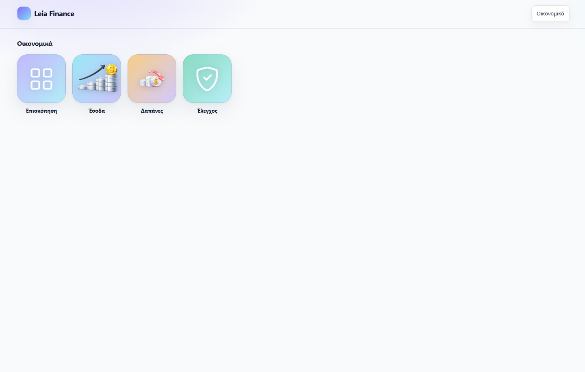

Screen role
Core entry navigation που οργανώνει την εφαρμογή σε ρόλους/loops με tile-based, deterministic transitions.

Related subflow(s)
O-01 — Revenue signal drilldown
O-02 — Spend signal drilldown
O-03 — Control signal drilldown

Why this screen exists
Να επιτρέπει γρήγορο προσανατολισμό χωρίς search: ο χρήστης επιλέγει την ενότητα (Revenue/Expenses/Control/Overview) και μεταφέρεται στην αντίστοιχη monitoring ή operational ροή.
Τα shared top-level controls (π.χ. period/date context) προετοιμάζουν το επόμενο screen.

Entry from
App launch/login (ή επιστροφή από οποιαδήποτε ενότητα στην αρχική πλοήγηση).

Exit to
Κύρια: `SS-02 Finance Overview Dashboard` μέσω του tile `Επισκόπηση`.
Εναλλακτικά: `Revenue`/`Spend` sections και `Control/Έλεγχος` σε αντίστοιχα dashboards.

Primary question
Ποια ενότητα πρέπει να ανοίξει ο χρήστης για το επόμενο βήμα εργασίας;

Primary action
Click στο επιλεγμένο tile (π.χ. `Επισκόπηση`) για μετάβαση στο αντίστοιχο dashboard.

Must-visible fields
Ονομασία εφαρμογής/επικεφαλίδα, grid από core tiles (π.χ. `Επισκόπηση`, `Έσοδα`, `Δαπάνες`, `Έλεγχος`), και top date/period controls (όπου εμφανίζονται στο screenshot).

Screenshot note
Use a non-empty landing με visible tiles για όλες τις core περιοχές και ξεκάθαρη ανάδειξη του entry προς Overview.

Key callouts
Τα tiles είναι τα primary navigation targets (όχι διακοσμητικά).
Το “Overview tile” πρέπει να οδηγεί απευθείας στο `Finance Overview Dashboard`.
Οι top-level period/date selectors είναι ορατοί ώστε να “κουβαλάνε” το context στο επόμενο screen.
Η διάταξη χωρίζει καθαρά Monitoring (Overview) από τους υπόλοιπους βρόχους/controls.

User flow note
From here, the user continues by clicking the appropriate tile and lands on the next dashboard with consistent date context.

### SS-02 — Finance Overview Dashboard

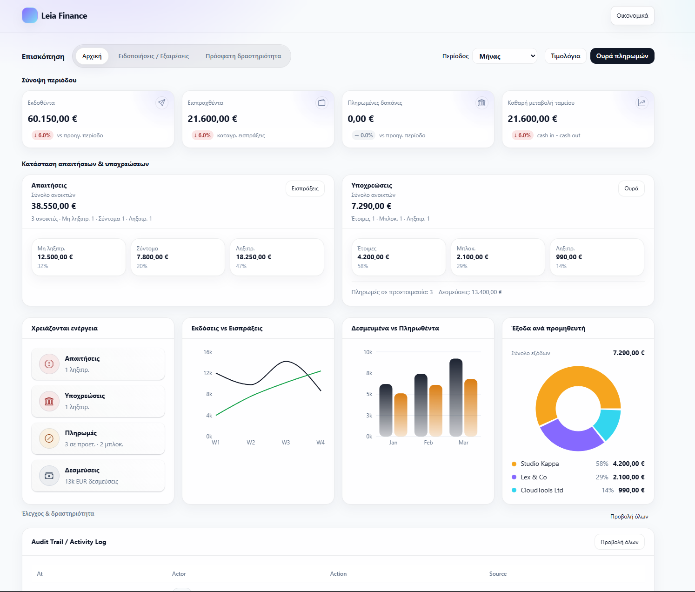

Screen role
Monitoring shell που δείχνει KPIs και exposure signals και “δείχνει πού υπάρχει πρόβλημα” για άμεση μετάβαση σε operational worklists.

Related subflow(s)
O-01 — Revenue signal drilldown
O-02 — Spend signal drilldown
O-03 — Control signal drilldown

Why this screen exists
Να προσφέρει γρήγορη, scannable εικόνα εκτέλεσης για το επιλεγμένο date range: τι έχει εκδοθεί/εισπραχθεί, τι έχει πληρωθεί, τι μένει ως outstanding και ποιο κομμάτι είναι overdue/blocked.
Δεν είναι workspace execution· είναι πρώτη γραμμή παρακολούθησης με deterministic drilldowns.

Entry from
App launch/home navigation ή πλοήγηση από `SS-02` με επιλογή της ενότητας `Επισκόπηση`.

Exit to
`Invoices List`, `Collections / Receivables`, `Supplier Bills / Expenses List`, `Payments Queue`, `Budget Overview` (όλα με προ-φιλτρα).

Primary question
Τι απαιτεί άμεση προσοχή στο revenue/spend exposure για την επιλεγμένη περίοδο;

Primary action
Click σε KPI card ή drilldown shortcut ώστε να ανοίξει η αντίστοιχη operational λίστα.

Must-visible fields
KPI strip, exposure/overdue signals, τουλάχιστον ένα blocked ή overdue signal, deterministic drilldown cues, και ορατό date range στην κορυφή.

Screenshot note
Το Overview δείχνει πού υπάρχει πρόβλημα και πού πρέπει να πάει ο χρήστης μετά. Δεν είναι execution screen.
Use a non-empty state: ενεργό KPI strip, ορατό overdue focus panel με aging/risks, και εμφανείς clickable drilldown cues προς λίστες.

Key callouts
Το Overview πρέπει να φαίνεται monitoring-first (όχι execution controls).
Το date range και τα βασικά filters πρέπει να είναι ξεκάθαρα και “μαζί” με το τι απεικονίζεται.
Τα overdue/exposure blocks πρέπει να ξεχωρίζουν οπτικά και να οδηγούν σε συγκεκριμένο next screen.
Τα KPI cards/shortcuts πρέπει να δίνουν σαφές information scent για το drilldown target.
Υπάρχει τουλάχιστον ένα explicit “problem signal” (overdue/blocked) με ποσό και context.

User flow note
Από εδώ ο χρήστης κάνει triage στα alerts και συνεχίζει με drilldown στην αντίστοιχη λίστα για να αναλάβει επόμενη ενέργεια.

### SS-03 — Invoice Drafts List

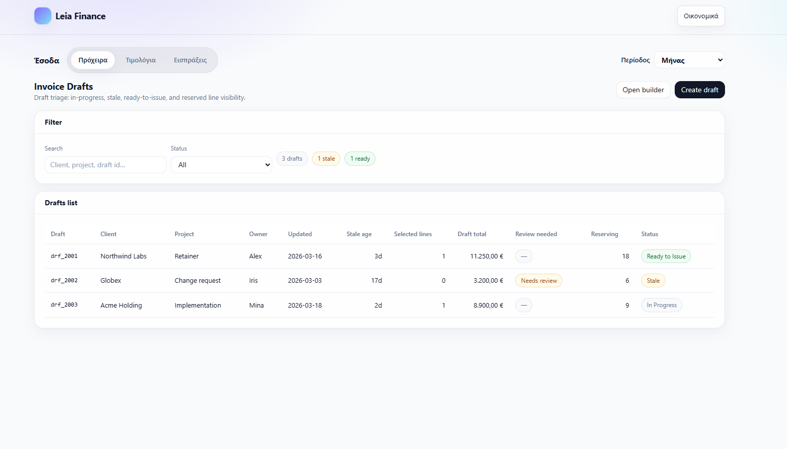

Screen role
Revenue core loop worklist για operational διαχείριση invoice drafts (συνέχιση/review/cleanup) με ορατό stale/έλεγχο και reservation safety.

Related subflow(s)
R-01 — Draft discovery and continuation

Why this screen exists
Τα drafts είναι “ζωντανά” objects που χρειάζονται συνέχεια, review και καθαρισμό πριν περάσουν σε έκδοση.
Εξασφαλίζει ότι ο χρήστης βλέπει τι είναι stale, πόσες lines έχουν επιλεγεί, και ποιοι drafts δεσμεύουν source entries.

Entry from
`Finance Core Home Menu` (tile προς τα Έσοδα) ή resume/edit από `Invoice Draft Builder` (αν συνεχίζει ένα draft).

Exit to
`Invoice Draft Builder` (resume/edit) για να ολοκληρωθεί το draft και να γίνει review/totals πριν την έκδοση.

Primary question
Ποια invoice drafts χρειάζονται άμεση συνέχεια ή review για να αποφευχθεί “κρυφό lock” σε reserved source lines;

Primary action
Click σε row για να ανοίξει το side panel preview και να ακολουθήσει το CTA για “Open in Draft Builder”.

Must-visible fields
draft reference, owner, stale age, selected lines count, reserved-lines indicator, review-needed flag (αν υπάρχει),
και side panel preview ανοιχτό (όπου φαίνεται στο screenshot).

Screenshot note
Use a non-empty state με ορατές draft lines/rows, εμφανές stale age και reserved-lines indicator, και side panel preview ανοιχτό ώστε να μη χάνεται context κατά το triage.

Key callouts
Τα drafts είναι ορατά operational objects, όχι κρυφές προσωρινές καταστάσεις.
Το stale age δίνει άμεση ένδειξη προτεραιότητας (τι χρειάζεται δράση τώρα).
Το selected lines count δείχνει “πόσο κοντά” είναι το draft στην έκδοση και τι έχει δεσμευτεί.
Το reserved-lines indicator κάνει το lock safety scannable (αποφεύγεται το “έκανα edit αλλά δεν πιάνει τίποτα”).
Το review-needed flag/σήμανση εξηγεί το επόμενο βήμα χωρίς να χρειάζεται deep navigation.

User flow note
From here, the user continues by reviewing the draft in the side panel and then resumes it in `Invoice Draft Builder` to finalize before issuing.

### SS-04 — Invoice Draft Builder

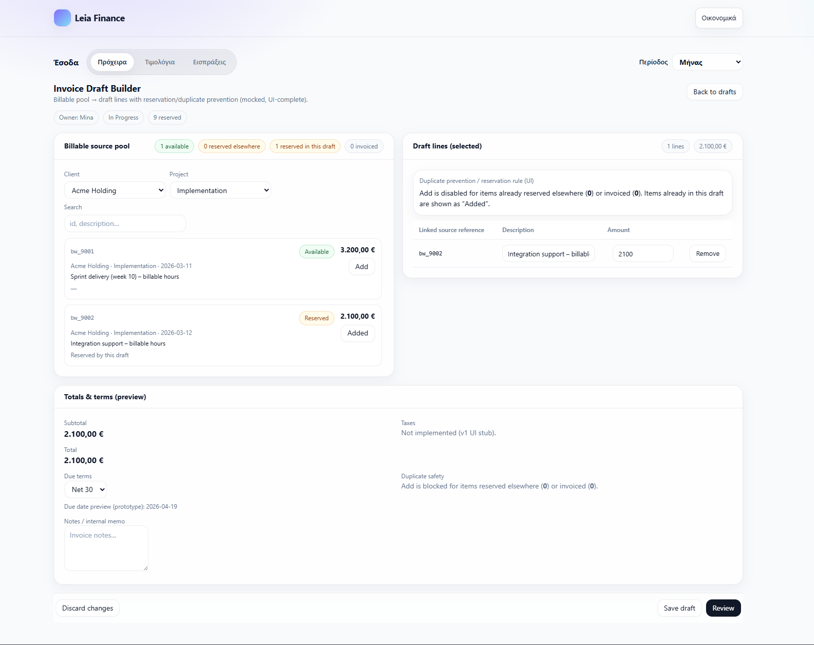

Screen role
Execution draft builder workbench για να μετατρέψει ο χρήστης επιλεγμένο billable work σε invoice draft με duplicate prevention.

Related subflow(s)
R-02 — Draft composition from billable work

Why this screen exists
Να διαχωρίζει καθαρά το candidate source billable work από τις selected draft lines, ώστε να αποτρέπεται “λάθος/διπλό” τιμολόγημα.
Ταυτόχρονα δίνει totals/terms/notes preview πριν το επόμενο βήμα (review).

Entry from
`SS-03 — Invoice Drafts List` (resume/edit) ή `Drafts List → Open in Draft Builder`.

Exit to
`Review` (side panel/step) με πρόοδο προς έκδοση ή επιστροφή στο edit state για αλλαγές.

Primary question
Ποιο billable work θα προστεθεί στο invoice draft και ποια σημεία δείχνουν ότι υπάρχει reservation conflict ή ήδη invoiced περιεχόμενο;

Primary action
Click `Add` για selected source entries και μετά `Review` από το bottom bar.

Must-visible fields
Left: source billable entries (description + client/project + date + amount + status).
Ένα τουλάχιστον explicit reserved / already invoiced state (chip/label + disabled add state) στο left.
Center: selected lines (draft content) με δυνατότητα remove (και edit όπου υποστηρίζεται).
Right: totals / terms / notes (subtotal/total preview, due terms + due date preview, internal notes).
Bottom bar: `Save draft`, `Discard changes`, `Review`.

Screenshot note
Non-empty builder state με ορατό source pool, τουλάχιστον 1 reserved/ already invoiced item (disabled Add), τουλάχιστον 1 selected line, ορατά totals/terms/notes, και sticky bottom actions.

Key callouts
Διαχωρισμός candidate source vs selected draft content (καμία αμφιβολία για το τι θα τιμολογηθεί).
Reservation safety: το reserved/already invoiced περιεχόμενο πρέπει να αποτρέπει το duplicate invoicing (disabled CTA + σαφής λόγος).
Totals/terms/notes update as the user edits selected lines (ώστε ο χρήστης να κάνει γρήγορο “sanity check”).
Sticky bottom bar επιτρέπει recovery: review ή discard χωρίς scroll hunting.

User flow note
From here, the user finalizes selection, checks totals/notes, and continues to `Review` για να προχωρήσει σε έκδοση ή να επιστρέψει για διορθώσεις.

Προτεινόμενη screenshot σειρά
Αυτό είναι το αμέσως επόμενο κρίσιμο screenshot μετά το `SS-03` (draft triage → builder).
Next screenshot: `SS-05 — Invoices List`.

### SS-05 — Invoices List

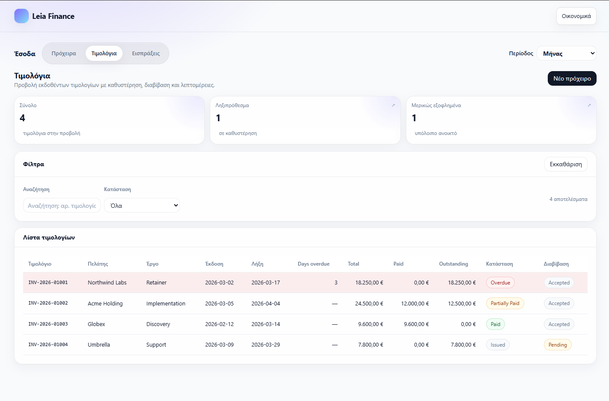

Screen role
Operational ledger για issued receivables (issued invoices): searchable triage και entry point σε detail/follow-up.

Related subflow(s)
R-03 — Issued invoice visibility

Why this screen exists
Να επιτρέπει γρήγορη αναζήτηση και scannable ορατότητα σε issue/due semantics και overdue/priority.
Είναι operational ledger of issued receivables, όχι collections workspace.

Entry from
`SS-04 — Invoice Draft Builder` (post review/issue) ή drilldown από `Finance Overview Dashboard`.

Exit to
`Invoice Detail View` (row emphasis/side panel) ή `Collections / Receivables` για follow-up.

Primary question
Ποιες issued invoices απαιτούν άμεση ενέργεια τώρα, με βάση due/overdue και την επιλεγμένη περίοδο/filters;

Primary action
Click σε invoice row για άνοιγμα side panel ή μετάβαση στο `Invoice Detail View`.

Must-visible fields
invoice reference, client, issue date, due date, total / paid / outstanding, payment status, days overdue, και transmission/fiscal status (αν υπάρχει).

Screenshot note
Non-empty state με ορατή αναζήτηση, ενεργό overdue treatment (row emphasis για overdue), και row/side panel next step.

Key callouts
Η οθόνη πρέπει να φαίνεται ledger/triage (όχι execution/collection form).
Τα overdue στοιχεία (days overdue + ποσά) πρέπει να είναι άμεσα αντιληπτά.
Το total/paid/outstanding δίνει “sanity check” πριν από οποιοδήποτε detail action.
Transmission/fiscal status πρέπει να είναι ορατό ως dimension (όχι tooltip-only).
Το side panel/row emphasis πρέπει να οδηγεί άμεσα στο επόμενο βήμα.

User flow note
From here, the user opens invoice details and continues with collection follow-up or jumps to `Collections / Receivables`.

Προτεινόμενη screenshot σειρά
Μετά το `SS-05`, ακολουθεί `SS-06 — Invoice Detail View` για την πρώτη triage ενέργεια στο συγκεκριμένο receivable.

### SS-06 — Invoice Detail View (Drawer + Full Detail)

Screen role
Canonical single-record truth για το συγκεκριμένο receivable (issued invoice) με read-only context και άμεση μετάβαση σε collection follow-up.

Related subflow(s)
R-04 — Receivable detail review

Why this screen exists
Το Invoice Detail συγκεντρώνει “όλα τα κρίσιμα” σε ένα σημείο: linked billable work, payments/history signals, collections notes/history και timeline.
Είναι το σημείο αλήθειας που επιτρέπει στον χρήστη να καταλάβει τι έχει τιμολογηθεί και γιατί/πότε, πριν το επόμενο action.

Entry from
`SS-05 — Invoices List` row click / side panel emphasis.

Exit to
`Collections / Receivables` (Go to Collections) για follow-up.

Primary question
Ποια είναι η τρέχουσα κατάσταση του receivable και ποια είναι η επόμενη ενέργεια collections;

Primary action
Click `Go to Collections` ή row/CTA action από το detail για άμεσο follow-up.

Must-visible fields
Header summary (invoice ref/number, client, amounts/status)
Linked billable work (read-only)
Payment/history block (ή placeholder όπου δεν υπάρχει ακόμα payment mock)
Collection notes/history (latest snippet + last note date όπου υποστηρίζεται)
Timeline / activity (at, actor, action, summary)
Transmission/fiscal section (αν υπάρχει για το συγκεκριμένο invoice)

Screenshot note
Invoice detail drawer view και full detail page σε 2 παραλλαγές: και στις δύο εμφανίζονται καθαρά τα blocks (linked work, collections notes/history, timeline, transmission/fiscal όπου υπάρχει).

Key callouts
Το detail πρέπει να είναι “single-record truth” (όχι worklist editing).
Τα linked billable work και collections notes/history δεν πρέπει να είναι κενά στο mock (να υποστηρίζουν τη narrative του receivable).
Το timeline δίνει traceability για transitions/critical events.
Το transmission/fiscal block είναι εμφανές μόνο όταν υπάρχει σχετικό status (διαφορετικά εμφανίζεται ως μη relevant state).

User flow note
Αφού γίνει sanity check στο receivable context, ο χρήστης συνεχίζει στο `Collections / Receivables` για την επόμενη follow-up ενέργεια.

Προτεινόμενη screenshot σειρά
Μετά από το `SS-06`, ακολουθεί `SS-07 — Collections / Receivables` για το πρώτο follow-up workstep.

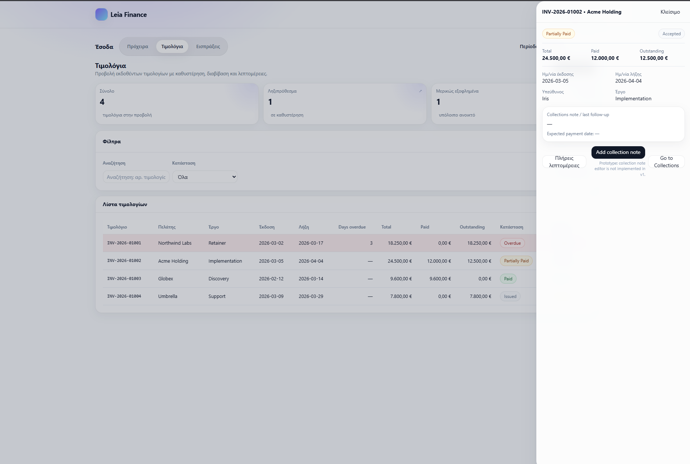
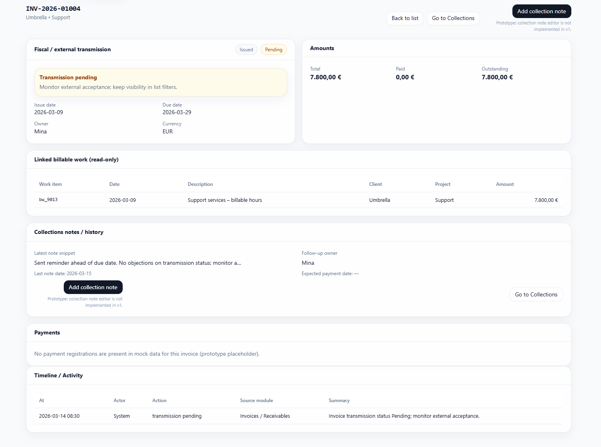

### SS-07 — Collections / Receivables View

Screen role
Central operational follow-up worklist για receivables με overdue-driven prioritization (όχι invoice list).

Related subflow(s)
R-05 — Collections follow-up

Why this screen exists
Να συγκεντρώνει την καθημερινή εργασία follow-up: sorting/grouping με βάση overdue και aging, προβολή outstanding, και γρήγορη πρόσβαση σε note snippet/next action.
Είναι το πραγματικό follow-up workspace για receivables, σύμφωνο με το πώς οι collections οργανώνονται ως κεντρική operational view.

Entry from
`SS-06 — Invoice Detail View` (Go to Collections) ή drilldown από dashboard overdue signals.

Exit to
`Invoice Detail View` (row emphasis/side panel) για περαιτέρω ενέργειες ή παραμονή στο same worklist μετά την καταχώρηση note.

Primary question
Ποια receivables πρέπει να αντιμετωπιστούν πρώτα με βάση overdue/aging και τι είναι το επόμενο βήμα για κάθε ένα;

Primary action
Click σε receivable row/side panel για να ανοίξει context (και να εκτελεστεί follow-up με notes/next action).

Must-visible fields
Overdue sorting ή grouping (π.χ. overdue buckets / pinned high-risk overdue).
Outstanding amount.
Expected payment date (όπου υπάρχει/είναι διαθέσιμη ως preview).
Owner.
Note snippet / next action (η πιο πρόσφατη ένδειξη/CTA για follow-up).
Ένα παράδειγμα υψηλού ρίσκου overdue (high-risk overdue pinned ή με ισχυρό visual treatment).

Screenshot note
Non-empty collections state με εμφανή grouping/sorting ανά overdue buckets, ξεκάθαρη ανάδειξη του high-risk overdue παραδείγματος, και ορατό note snippet/next action στο row ή στο side panel.

Key callouts
Collections είναι follow-up workspace: δεν λειτουργεί ως “ledger αναζήτησης” όπως η invoice list.
Το overdue signal πρέπει να επηρεάζει άμεσα τη διάταξη (grouping/pinning) και το user attention.
Outstanding + expected payment date συνδυάζονται για γρήγορο “sanity check” του risk.
Owner και note snippet δίνουν next-step information scent χωρίς να απαιτείται navigation.
Ο αναγνώστης πρέπει να βλέπει ξεκάθαρα ένα high-risk overdue παράδειγμα (π.χ. 60+ ή αντίστοιχο threshold).

User flow note
Από εδώ ο χρήστης επιλέγει το κορυφαίο overdue item, βλέπει το note/next action και προχωρά είτε σε invoice detail είτε σε note follow-up ενέργεια.
 
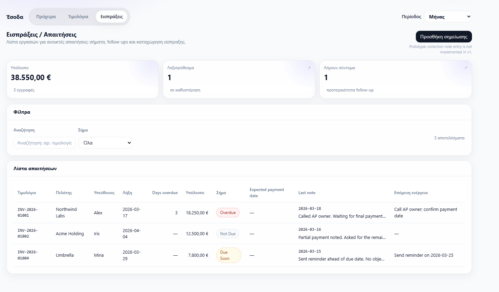
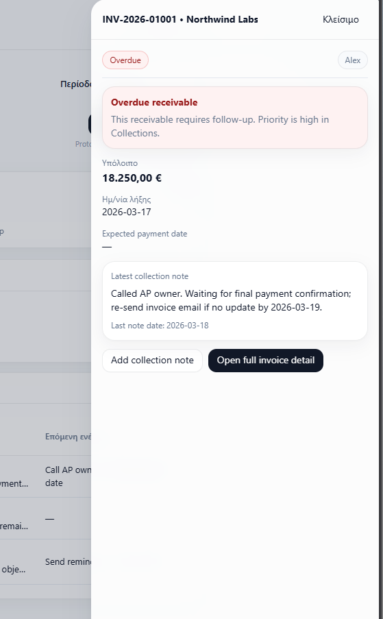

### SS-08 — Purchase Requests List

Screen role
Worklist layer για το Spend loop: συγκεντρώνει αιτήματα αγοράς προς triage και απόφαση έγκρισης.

Related subflow(s)
S-01 — Request intake and triage

Why this screen exists
Να οργανώνει την επιχειρησιακή ροή “request → approval/commitment” πριν υπάρξουν supplier bills.
Επιτρέπει στον χρήστη να φιλτράρει ανά urgency/status και να βλέπει κρίσιμα signals όπως attachment presence και budget impact.

Entry from
`SS-02 — Finance Overview Dashboard` (drilldown από “Committed Spend”/budget signals) ή `SS-13 — Budget Overview` (αν χρησιμοποιηθεί ως starting point).

Exit to
`SS-09 — Purchase Request Detail / Approval View` (άμεση έγκριση/απόρριψη ή request changes).

Primary question
Ποια purchase requests χρειάζονται απόφαση τώρα, με βάση urgency, status, attachments και budget signal;

Primary action
Click σε request row για άνοιγμα του approval detail view.

Must-visible fields
requester, supplier, amount, approver, urgency, attachment indicator, status, budget signal αν υπάρχει.

Screenshot note
Use a non-empty state με σαφές status/urgency chips, τουλάχιστον μία γραμμή με εμφανές attachment indicator και τουλάχιστον ένα budget-signal warning/breach παράδειγμα.

Key callouts
Το spend loop ξεκινά από request/approval layer, όχι από payable/worklist εκτέλεσης.
Το attachment indicator πρέπει να είναι άμεσα κατανοητό (όχι hidden σε tooltip).
Urgency και status πρέπει να επηρεάζουν το οπτικό priority (π.χ. pinned/ταξινόμηση).
Το budget signal πρέπει να “λέει την ιστορία” για το γιατί το request είναι κρίσιμο.
Οι row actions πρέπει να οδηγούν σε συγκεκριμένη next step (approval detail).

User flow note
Από εδώ ο χρήστης ανοίγει το detail, παίρνει απόφαση (approve/reject/request changes) και επιστρέφει σε ενημερωμένη λίστα με το νέο status.

Προτεινόμενη screenshot σειρά
Αμέσως μετά: `SS-08A — Purchase Request Create Form (Demo)`.

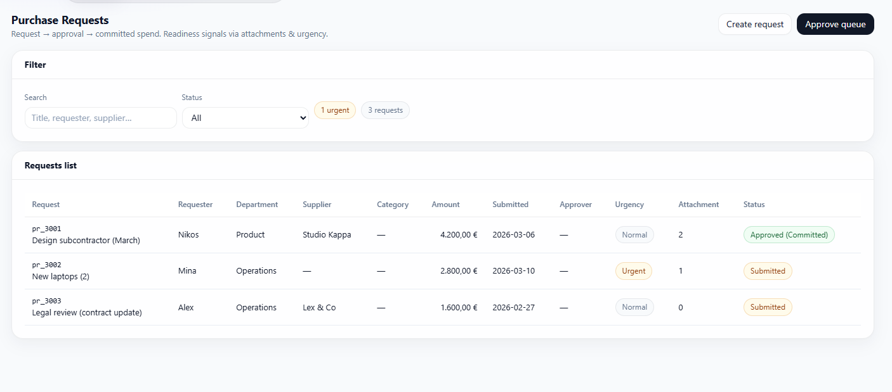

### SS-08A — Purchase Request Create Form (Demo)

Screen role
Demo create form για το spend loop: ξεκινά το workflow πριν υπάρξουν supplier bills.

Related subflow(s)
S-01 — Request intake and triage

Why this screen exists
Να δείξει πώς γίνεται capture των κρίσιμων inputs (request metadata + readiness signals όπως urgency και attachments) πριν το request περάσει στην approval/commitment φάση.
Είναι prototype-only: δημιουργεί dummy records και ενημερώνει άμεσα τη λίστα.

Entry from
`SS-08 — Purchase Requests List` (click `Create request`).

Exit to
`SS-08 — Purchase Requests List` (η νέα request εμφανίζεται στη λίστα και ανοίγει side panel).

Primary question
Ποια πεδία πρέπει να συμπληρωθούν για να δημιουργηθεί ένα valid request με σωστά readiness signals;

Primary action
Click στο `Create (demo)` ώστε να δημιουργηθεί η request και να εμφανιστεί στην λίστα.

Must-visible fields
request title, requester, department, supplier (optional), amount, urgency, attachment count/indicator.

Screenshot note
Use a non-empty form state με συμπληρωμένα fields (κατά προτίμηση με urgency=Urgent και attachments>0) και εμφανές CTAs `Create (demo)` και `Cancel`.

Key callouts
Η create form πρέπει να ευθυγραμμίζεται με το spend loop vocabulary (request → approval → committed spend).
Το attachments indicator επηρεάζει readiness και πρέπει να φαίνεται ως input που “κάνει unblock”.
Το urgency πρέπει να είναι σαφώς ορατό (π.χ. Normal vs Urgent).
Μετά το create, η λίστα ενημερώνεται άμεσα χωρίς να “χάνεται” το user context.

User flow note
Ο χρήστης συμπληρώνει τη φόρμα, δημιουργεί το draft request και συνεχίζει από την λίστα στο approval detail.

Next screenshot: `SS-09 — Purchase Request Detail / Approval View`.

### SS-09 — Purchase Request Detail / Approval View

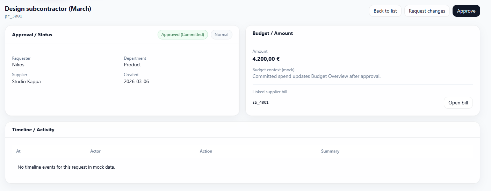

Screen role
Approval decision detail για την επιχειρησιακή τεκμηρίωση έγκρισης/απόρριψης ενός purchase request και μετάβασης σε committed spend.

Related subflow(s)
S-02 — Request decision / approval
S-03 — Commitment visibility

Why this screen exists
Να συγκεντρώνει όλο το context που απαιτείται για μια τεκμηριωμένη επιχειρησιακή απόφαση: request σύνοψη, budget context, attachments/readiness signals και προτεινόμενο link προς supplier bill.
Αποτρέπει την “τυφλή” έγκριση χωρίς reasons/attachments και δίνει ορατό path για request changes.

Entry from
`SS-08A — Purchase Request Create Form (Demo)` (after creation) ή `SS-08 — Purchase Requests List` (row click/selected side panel).

Exit to
`SS-08 — Purchase Requests List` (updated status) ή `Supplier Bills / Expenses List` / `Supplier Bill Detail View` όταν υπάρχει created/linked bill.

Primary question
Επιβεβαιώνεται η καταλληλότητα του request (budget + attachments + readiness) για έγκριση ή απαιτείται request changes / απόρριψη;

Primary action
Approve / Reject / Request changes με υποχρεωτικό reasoning (UI-level, prototype).

Must-visible fields
request summary (title, requester, department, supplier, urgency, amount)
budget context (available/remaining + budget impact signal)
attachments (count + status/readiness; missing attachments visible)
decision area (Approve/Reject/Request changes με reason/comment)
comments/history (decision comments + latest decision events / audit snippet)
link to supplier bill placeholder ή πραγματικό linked supplier bill (όπου υπάρχει σύνδεση)

Screenshot note
Η οθόνη πρέπει να δείχνει καθαρά ότι η έγκριση είναι τεκμηριωμένη επιχειρησιακή απόφαση, όχι ένα απλό κουμπί: το decision area περιλαμβάνει λόγο/τεκμηρίωση και τα attachments/budget signals είναι ορατά δίπλα στο decision.

Key callouts
Το budget context πρέπει να είναι readable και “actionable” (τι επηρεάζει/τι κινδυνεύει).
Τα attachments πρέπει να φαίνονται ως readiness signal (missing attachments = warning).
Οι decision buttons πρέπει να συνοδεύονται από υποχρεωτικό reason/comment για approval/reject/request changes.
Το supplier bill link πρέπει να είναι είτε placeholder (“not linked yet”) είτε πραγματική σύνδεση (χωρίς να αφήνει αμφιβολία).
Το timeline/comments πρέπει να δίνουν traceability: ποιος αποφάσισε τι και πότε.

User flow note
Αφού ο χρήστης τεκμηριώσει την απόφαση, επιστρέφει στη λίστα με ενημερωμένο status ή προχωρά στο supplier bill όταν δημιουργηθεί/συνδεθεί.

Προτεινόμενη screenshot σειρά
Επόμενο: `SS-10 — Supplier Bills / Expenses List` (ως committed spend → payables readiness συνέχεια).

### SS-10 — Supplier Bills / Expenses List

Screen role
Payables readiness list για committed spend: εμφανίζει supplier bill obligations και ξεχωρίζει readiness από execution.

Related subflow(s)
S-04 — Supplier bill intake and linkage
S-05 — Readiness and mismatch resolution

Why this screen exists
Να συγκεντρώνει όλες τις payable υποχρεώσεις (supplier bills) μετά το approval/commitment.
Να οδηγεί σε triage των bills με βάση match status και readiness (ready vs blocked) πριν την εκτέλεση πληρωμών.

Entry from
`SS-09 — Purchase Request Detail / Approval View` (μετά από creation/approval) ή drilldown από `Finance Overview Dashboard` (Outstanding/Overdue payables).

Exit to
`SS-11 — Supplier Bill Detail View` (side panel/full) για επίλυση mismatch/block ή handoff προς `Payments Queue`.

Primary question
Ποιες supplier bills είναι έτοιμες για πληρωμή και ποιες είναι blocked (λόγος) για την επιλεγμένη περίοδο;

Primary action
Click σε bill row για άνοιγμα detail/side panel ώστε να γίνει “Resolve” του readiness blocker.

Must-visible fields
supplier
bill reference
due date
amount
match status
readiness
blocked reason
τουλάχιστον ένα overdue payable παράδειγμα (days/visual overdue emphasis).

Screenshot note
Use a non-empty state με ορατό σαφή διαχωρισμό: status/match πληροφορία από readiness/blocked λόγο.
Να υπάρχει τουλάχιστον ένα item που είναι overdue (με overdue emphasis) και δείχνει blocked reason.

Key callouts
Readiness (Ready/Blocked) πρέπει να είναι το primary dimension για το next step, όχι το execution status.
Blocked reason πρέπει να είναι άμεσα ορατό στο list/context.
Match status και readiness λόγος δεν πρέπει να συγχέονται: ένα δείχνει “τι ταιριάζει”, το άλλο “τι εμποδίζει”.
Το due date/overdue indicator πρέπει να οδηγεί γρήγορα σε resolution order.

User flow note
Από εδώ ο χρήστης επιλύει blockers στα bills ή κάνει handoff σε `Payments Queue` όταν readiness=Ready.

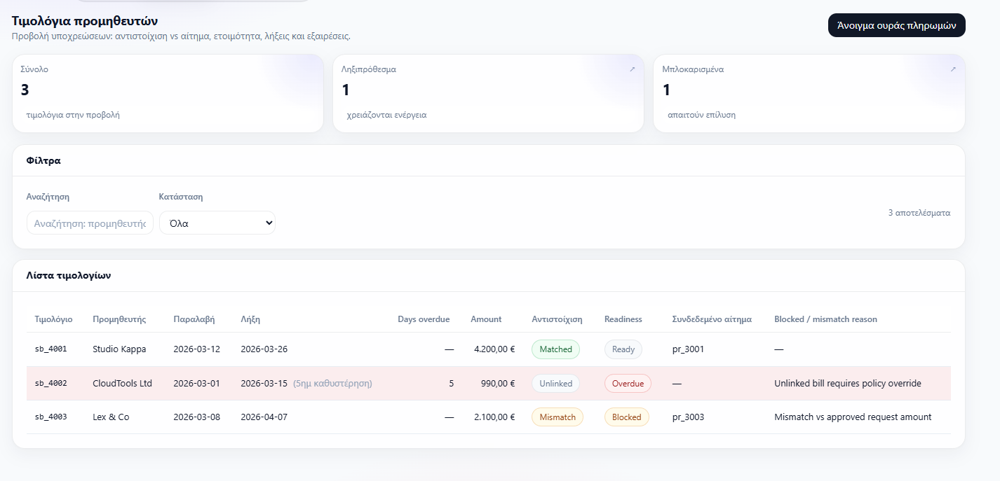

### SS-11 — Supplier Bill Detail View

Screen role
Readiness/mismatch detail for a single supplier bill that explains what blocks payment and what unblocks it.

Related subflow(s)
S-04 — Supplier bill intake and linkage
S-05 — Readiness and mismatch resolution

Why this screen exists
Να δείχνει γιατί ένα payable είναι έτοιμο ή μπλοκαρισμένο και τι χρειάζεται για να προχωρήσει (resolve mismatch/block → payments handoff).
Σπάει το “μυστήριο” του readiness λόγου σε συγκεκριμένες ενέργειες και ορατό evidence (attachments + linked request + discrepancy panel).

Entry from
`SS-10 — Supplier Bills / Expenses List` row click / side panel “Resolve”.

Exit to
`Payments Queue` (CTA) ή επιστροφή στη λίστα bills μετά την επίλυση.

Primary question
Τι προκαλεί το mismatch/block στο supplier bill και ποια ενέργεια το ξεμπλοκάρει για πληρωμή;

Primary action
Click resolution CTA (e.g. “Resolve”, “Send to payments queue”) ανάλογα με το readiness state.

Must-visible fields
linked request summary (αν υπάρχει σύνδεση)
mismatch panel (what differs + why blocked)
attachments (list + visible count, με prominent “missing” indication)
readiness reason (blocked reason) σε σαφή, μη-κρυφό format
payment history / placeholder (αν υπάρχει στο mock)
CTA προς `Payments Queue` (ή “Not ready” state με σαφή λόγο αν δεν γίνεται handoff)

Screenshot note
Non-empty state με mismatch/readiness reason ορατό, attachments block εμφανές (ιδιαίτερα για missing cases), και CTA προς `Payments Queue` που είτε είναι enabled με σωστό context είτε disabled με σαφή λόγο.

Key callouts
Το detail πρέπει να απαντά “γιατί blocked” με συγκεκριμένο mismatch evidence, όχι γενικό warning.
Το attachments block πρέπει να είναι το proof της readiness (missing attachments = warning).
Το “Resolve”/handoff CTA πρέπει να είναι το επόμενο βήμα για το συγκεκριμένο bill.
Το payment history block πρέπει να φαίνεται είτε με πραγματικά entries είτε με placeholder text που δηλώνει ότι δεν υπάρχουν ακόμη.
Το linked request summary πρέπει να υποστηρίζει το mismatch panel (context-first).

User flow note
Αφού ο χρήστης δει mismatch + readiness reason και (όπου απαιτείται) attachments, κάνει handoff στο `Payments Queue` ή επιστρέφει στη λίστα για να συνεχίσει το triage.

Προτεινόμενη screenshot σειρά
Επόμενο: `SS-12 — Payments Queue` για την εκτέλεση/hand-off των ready bills.

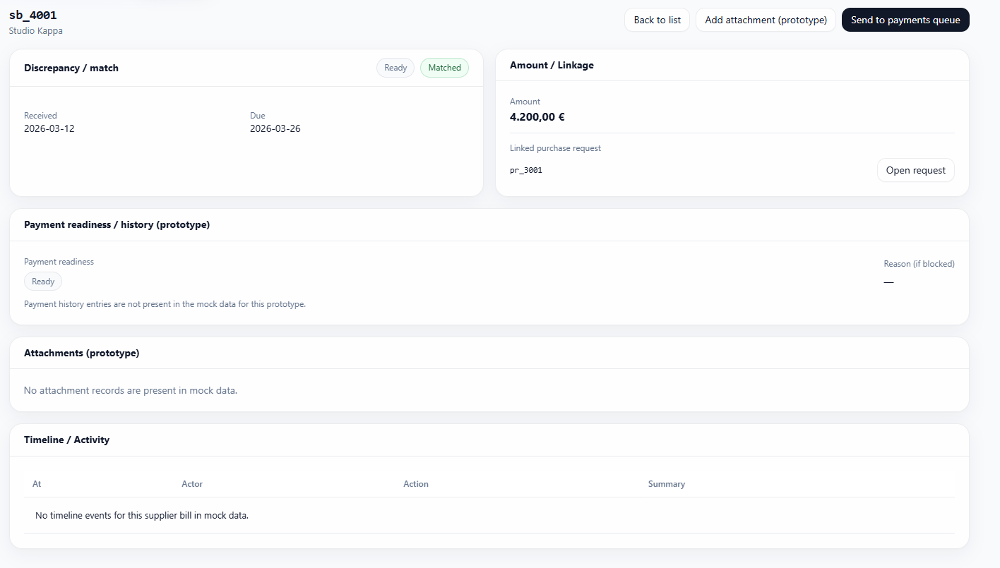

### SS-12 — Payments Queue

Screen role
Execution / handoff workspace για supplier bills: “εκτελεί με βάση readiness”, όχι matching decisions.

Related subflow(s)
S-06 — Payment queue triage
S-07 — Payment execution / handoff visibility

Why this screen exists
Να συγκεντρώνει bills προς πληρωμή σε actionable segments (ready/blocked/due soon/overdue).
Να δίνει ένα batch workbench για επιλογή items και εκτέλεση/προετοιμασία πληρωμής, με σαφή blocked reasons για τα μη-ready.

Entry from
`SS-11 — Supplier Bill Detail View` (CTA προς Payments Queue) ή `SS-10 — Supplier Bills / Expenses List` (drilldown από ready/overdue signals).

Exit to
`SS-11 — Supplier Bill Detail View` (για resolve blocked) ή παραμονή στο queue με ενημερωμένο status μετά την εκτέλεση.

Primary question
Ποια bills μπορούν να προχωρήσουν τώρα σε πληρωμή (ready) και ποια blockers πρέπει να λυθούν πρώτα;

Primary action
Checkbox selection σε ready items και click στη sticky batch bar action (“Execute/Handoff”).

Must-visible fields
ready / blocked / due soon / overdue segmentation,
checkbox selection,
sticky batch bar,
blocked reason,
due context (due date + due/overdue indicator),
τουλάχιστον ένα επιλεγμένο prepared item (όπου φαίνεται στο screenshot).

Screenshot note
Non-empty queue state με ορατά tabs/segments (έστω ένα έτοιμο/selected prepared item και ένα blocked item με σαφή blocked reason),
και sticky batch bar ορατή στο κάτω μέρος με disabled/enabled states ανάλογα με το selection.

Key callouts
Το Payments Queue είναι execution/handoff workspace: δεν αποφασίζει matching — εκτελεί με βάση readiness.
Το blocked reason πρέπει να είναι άμεσα ορατό μέσα στο row/side context, ώστε να μην “χαθεί” η αιτία.
Η due context (due date + overdue indicator) πρέπει να επηρεάζει την προτεραιότητα στο UI.
Η sticky batch bar πρέπει να δείχνει totals/selection summary και να αντιδρά ανάλογα με το checkbox state.
Η επιλογή πρέπει να ξεχωρίζει τα “selected prepared” items από τα “blocked” items.

User flow note
Από εδώ ο χρήστης επιλέγει έτοιμα items, εκτελεί/κάνει handoff, και όπου υπάρχει blocker επιστρέφει στο bill detail για resolve.

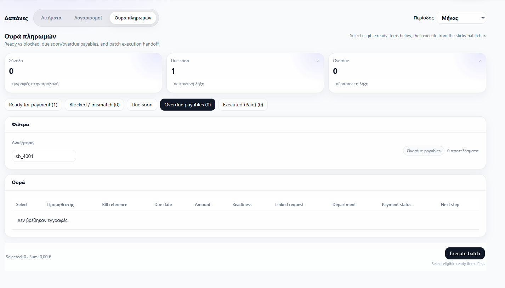
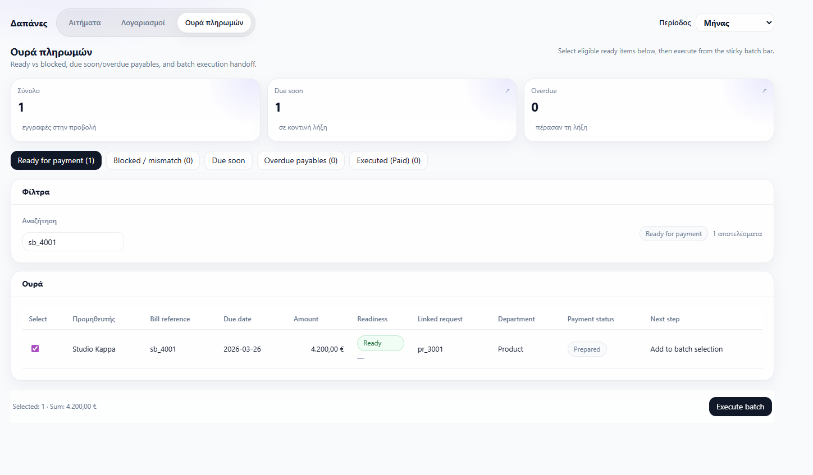

### SS-13 — Budget Overview

Screen role
Control surface για budget pressure και variance (απόκλιση/σήμα), όχι execution workspace.

Related subflow(s)
C-01 — Budget variance monitoring

Why this screen exists
Να δείχνει budgeted vs committed vs actual paid, να αποτυπώνει remaining πίεση και να αναδεικνύει variance/signal ώστε ο χρήστης να ξέρει πού “χρειάζεται προσοχή”.
Είναι ξεκάθαρα supporting control layer: δεν εκτελεί πληρωμές ούτε matching — δίνει οδηγίες για drilldown/ενημέρωση upstream.

Entry from
`SS-09 — Purchase Request Detail / Approval View` ή `SS-10 — Supplier Bills / Expenses List` drilldowns από budget signals.

Exit to
`SS-08 — Purchase Requests List` (committed spend drilldown) ή `SS-10 — Supplier Bills / Expenses List` (actual paid context).

Primary question
Πού υπάρχει variance/budget pressure για την επιλεγμένη περίοδο και ποια dimensions οδηγούν το signal;

Primary action
Click σε variance row / breakdown row για drilldown.

Must-visible fields
budgeted
committed
actual paid
remaining
variance / signal
maybe drilldown row (clickable breakdown line)

Screenshot note
Use a non-empty budget state with clear columns (budgeted/committed/actual paid), a visible variance/signal indicator, and at least one clickable breakdown row.

Key callouts
Το Budget είναι control surface: δείχνει αποκλίσεις και πίεση, όχι execution.
Οι αριθμοί πρέπει να είναι visually separated (στήλες + legend) ώστε να μη συγχέονται budget stages.
Το variance/signal πρέπει να “τραβάει το βλέμμα” και να οδηγεί στο επόμενο drilldown.

User flow note
Από εδώ ο χρήστης κάνει drilldown στην αιτία της απόκλισης (requests/ bills/actuals) και επιστρέφει σε monitoring με ενημερωμένο context.

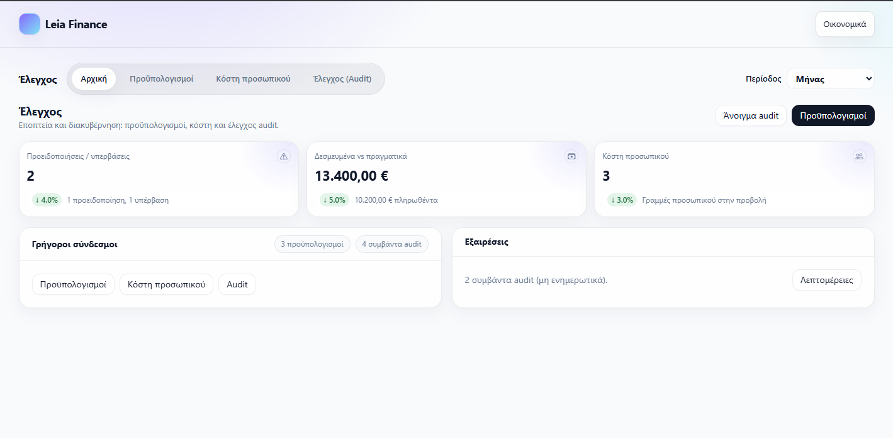

### SS-14 — Audit Trail / Activity Log

Screen role
Evidence layer για traceability: ποιος έκανε τι/πότε/σε ποιο record, για investigation και accountability.

Related subflow(s)
C-02 — Audit investigation

Why this screen exists
Να προσφέρει κεντρικό χρονολόγιο ενεργειών (activity log) με filtering και δυνατότητα γρήγορης μετάβασης στο target record.
Υποστηρίζει τόσο “investigation mode” (τι άλλαξε) όσο και “auditability mode” (πότε/από ποιον).

Entry from
`SS-08 — Purchase Requests List`, `SS-11 — Supplier Bill Detail View`, ή drilldown από οποιαδήποτε module action.

Exit to
Το target record (Invoice Detail / Supplier Bill Detail / Request Detail) μετά από click σε event, ή παραμονή στο log με νέο filter.

Primary question
Ποια events σχετίζονται με συγκεκριμένο record/module και ποιο είναι το πριν/μετά όπου εφαρμόζεται;

Primary action
Click σε log entry για event detail και πλοήγηση στο target record.

Must-visible fields
actor
action
target
source module
timestamp
event detail panel / before-after if available

Screenshot note
Use a non-empty state με ορατή chronological list και ανοικτό event detail panel για τουλάχιστον 1 επιλεγμένο event.

Key callouts
Το Audit πρέπει να φαίνεται ως evidence layer (όχι ως worklist/execute UI).
Το before-after (όπου υπάρχει) πρέπει να είναι ορατό και να “δένει” το story του change.
Κάθε event πρέπει να έχει ξεκάθαρο actor, action, source module και target reference.
Οι timestamps πρέπει να είναι σαφείς και consistent.
Το event detail panel πρέπει να οδηγεί άμεσα στο target record (click-through).

User flow note
Από εδώ ο χρήστης κάνει investigation και συνεχίζει στο target record για resolution/next step.

Προτεινόμενη screenshot σειρά
Μετά από το Audit, ακολουθεί `SS-15 — Employee Cost View` (ή το επόμενο supporting control layer).

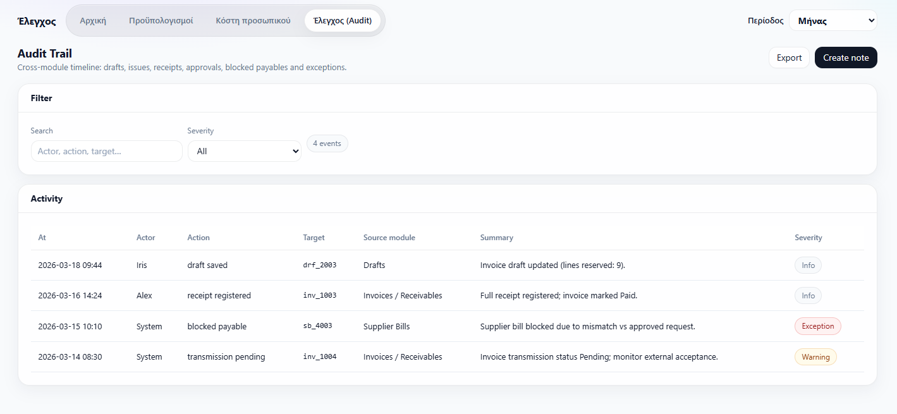
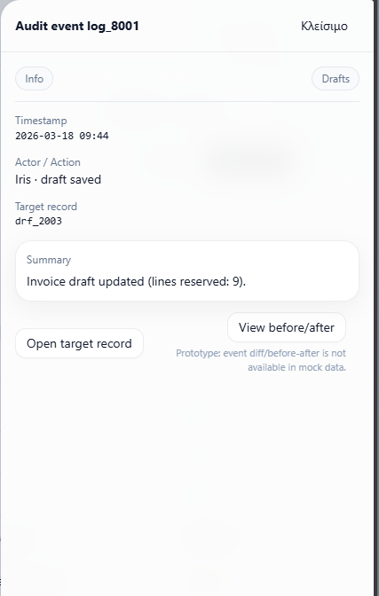

### SS-15 — Employee Cost View

Screen role
Supporting control / insight screen για operational έλεγχο κόστους με role-based ορατότητα. Δεν είναι execution core.

Related subflow(s)
C-03 — Employee cost visibility

Why this screen exists
Να επιτρέψει στους χρήστες να εντοπίσουν πού συγκεντρώνεται το κόστος (team/department), τι μέρος είναι billable vs non-billable, και ποιες περιοχές δημιουργούν margin-relevant risk ή περιορισμένη visibility.

Entry from
`SS-14 — Audit Trail / Activity Log` (drilldown από events) ή `Finance Overview Dashboard` widgets (employee cost insights) ή `Control` menu.

Exit to
Εντός `Employee Cost View` drilldown/panel (allocations/projects/trend) ή επιστροφή στη supporting control layer.

Primary question
Πού συγκεντρώνεται το employee cost και ποιες signals δείχνουν operational κίνδυνο ή περιορισμένη visibility;

Primary action
Click σε group (team/department) ή σε trend/allocations για να ανοίξει drilldown.

Must-visible fields
aggregated cost view (σύνολο ανά group),
billable / non-billable split,
restricted/visibility banner αν σχετίζεται με ρόλους,
grouping by team/department,
allocation insight (όπου υπάρχει),

Screenshot note
Use a non-empty aggregated cost state με εμφανές billable vs non-billable split, grouping by team/department, και (αν ισχύει) ένα visibility-restricted banner. Allocation insight και μια σαφής next drilldown cue πρέπει να φαίνονται.

Key callouts
Το Employee Cost είναι supporting insight screen, όχι third execution core.
Role-based redaction/visibility banner πρέπει να είναι ορατό και να εξηγεί τι κρύβεται/τι επιτρέπεται.
Η κατανομή (allocation insight) βοηθά να βρεθεί “πού” και “γιατί” (αν υπάρχει στα δεδομένα).
Το billable split είναι το operational “margin-relevant” signal.

User flow note
Από εδώ ο χρήστης συνεχίζει είτε σε allocations/trend drilldown είτε επιστρέφει στο overview για next monitoring step.

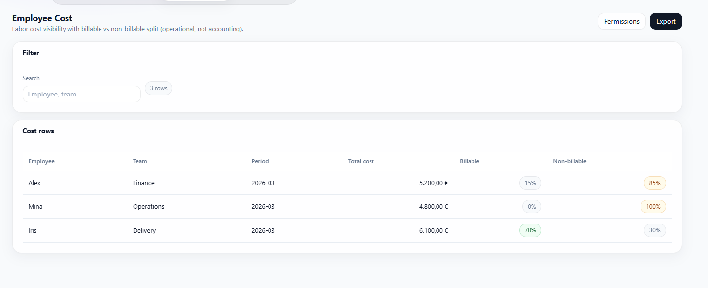

## 9. User Flow Summary

Revenue flow: `Overview` → `Invoices List` / `Invoice Detail` → `Collections / Receivables`, με focus σε overdue signals και γρήγορη καταγραφή/ενημέρωση collection context.

Spend flow: `Overview` → `Purchase Requests List` → `Purchase Request Detail / Approval` → `Supplier Bills / Expenses List` → `Payments Queue`, με readiness-based handoffs (δεν υπάρχει matching decision στο queue).

Control visibility: `Budget Overview` (variance/signal drilldowns) + `Audit Trail / Activity Log` (evidence layer) + `Employee Cost View` (supporting insight με visibility constraints).

---

## 10. Exceptions and Operational Signals
Ο παρακάτω πίνακας είναι reference για frontend/UI. Δεν ορίζει backend states, αλλά ορίζει **τι πρέπει να εμφανίζεται** και **πώς επηρεάζει UI actions**.

#### 10.1 Invoice-related statuses
- **Draft**: Πρόχειρο/μη εκδοθέν. Εμφανίζεται σε Draft Builder και (αν υπάρχει) draft list. UI: neutral chip. Actions: edit, discard, review.
- **Issued**: Εκδοθέν receivable. UI: primary chip. Actions: view detail, add collection note.
- **Partially Paid**: allocated payment amount > 0 και outstanding amount > 0. UI: warning chip + show paid/outstanding. Actions: view payments, add note.
- **Paid**: outstanding=0. UI: success chip. Actions: view history (read-only).
- **Overdue**: due date passed και outstanding>0. UI: danger chip + days overdue. Actions: prioritize follow-up.
- **Cancelled / Credited**: δεν θεωρείται ενεργό receivable. UI: muted chip + banner. Actions: read-only, view audit.

#### 10.2 Collection-related statuses (signals)
- **Not Due**: due in future. UI: neutral.
- **Due Soon**: due within configured window (e.g. 7 days). UI: warning.
- **Overdue**: due passed. UI: danger, pinned in lists.
- **High Risk Overdue (60+)**: overdue beyond threshold. UI: danger+emphasis; escalations suggested.

#### 10.3 Purchase request statuses
- **Draft**: μη υποβληθέν. UI: neutral. Actions: edit/submit.
- **Submitted**: αναμένει έγκριση. UI: primary. Actions (approver): approve/reject/request changes.
- **Approved (Committed)**: δημιουργεί/αντιστοιχεί commitment. UI: success + budget impact visible. Actions: link/create supplier bill.
- **Rejected**: UI: danger + reason visible. Actions: read-only, resubmit.
- **Cancelled**: UI: muted. Actions: read-only.

#### 10.4 Supplier bill statuses
- **Received / Open**: καταγεγραμμένη υποχρέωση. UI: primary.
- **Matched**: ταιριάζει με approved request. UI: success.
- **Mismatch**: αποκλίσεις σε ποσό/κατηγορία/supplier. UI: danger + blocked for payment by default.
- **Unlinked**: δεν υπάρχει request. UI: warning + blocked-by-default for payment in v1.
- **Overdue Payable**: due passed και unpaid. UI: danger.
- **Paid**: UI: success.

#### 10.5 Payment statuses (payables execution)
- **Ready for Payment**: πληροί readiness criteria. UI: success / ready badge.
- **Blocked**: δεν μπορεί να πληρωθεί λόγω missing info / mismatch / no due date. UI: danger + reason.
- **Scheduled**: έχει μπει σε batch / προγραμματισμό. UI: primary.
- **Executed / Paid**: ολοκληρώθηκε cash-out μέσω payment execution record. UI: success.
Important distinction:
- “Selected for batch” or “Prepared” may exist as UI-only temporary selection state
- it is not a persisted business lifecycle status unless explicitly defined later by architect/product decision

#### 10.6 Budget signal states
- **Healthy**: committed+actual εντός budget. UI: success.
- **Warning**: πλησιάζει όριο (threshold). UI: warning + “approaching”.
- **Breach**: committed ή actual υπερβαίνει budget. UI: danger + escalation guidance.

---

### 10Α. Exceptions and Operational Signals — Edge Cases
Το v1 πρέπει να είναι “operationally safe”: κάθε edge case να επισημαίνεται καθαρά και να οδηγεί σε επόμενη ενέργεια.

- **No billable entries available** (Draft Builder):
  - UI: empty state στο source pane με αιτιολογία (period/client filters) και CTA “Change period” / “Clear filters”.
  - Προτείνεται link σε Invoices List για έλεγχο αν η περίοδος έχει ήδη τιμολογηθεί.

- **All billable entries already invoiced**:
  - UI: informational banner “Όλες οι εγγραφές έχουν ήδη τιμολογηθεί” + link σε Invoices filtered.
  - Source entries εμφανίζονται προαιρετικά read-only με status “Already invoiced” (χωρίς “Add”).

- **Invoice partially paid**:
  - UI: στο Invoice Detail εμφανίζει breakdown πληρωμών και outstanding banner.
  - Στις λίστες: “Partially paid” chip + columns paid/outstanding.

- **Invoice overdue**:
  - UI: overdue banner (detail) και έντονη επισήμανση row (list).
  - Στο Collections: pinned priority και default sort.

- **Supplier bill amount does not match approved request**:
  - UI: mismatch banner (detail) + blocked badge (list/queue).
  - Discrepancy panel δείχνει: Approved vs Billed amounts, και απαιτούμενη ενέργεια (“Escalate” / “Request correction”).

- **Missing supplier attachment**:
  - UI: warning ή blocking ανά policy. Στο Payments Queue: blocked reason “Missing attachment”.
  - CTA: “Add attachment” οδηγεί στο Bill Detail στην attachments ενότητα.

- **Approved request exceeds available budget**:
  - UI: στο Approval view blocking banner “Υπέρβαση διαθέσιμου budget” + escalation path (π.χ. “Request budget override”).
  - Δεν πρέπει να “εγκρίνεται σιωπηρά” χωρίς ορατότητα.

- **Payment registered without full allocation** (Invoice Detail):
  - UI: warning banner + “unallocated amount” display + request to allocate (architect decision).

- **Stale draft invoice**:
  - UI: banner “Draft παλιότερο από Χ ημέρες” + CTA “Review before issuing”.

- **Cancelled or credited invoice**:
  - UI: read-only state, muted styling, εμφανές reason και audit trail. Δεν εμφανίζεται στα collections worklists (εκτός αν ζητηθεί).

- **Rejected purchase request**:
  - UI: εμφανές reason, read-only, CTA “Create new request” (όχι silent edit).

- **Open payable with missing due date**:
  - UI: critical badge σε lists/queue, και blocking reason στο Payments Queue.
  - Bill Detail: banner + CTA “Add due date” (backend decision).

- **No data in selected filter range**:
  - UI: empty state με “Reset date range” και υπενθύμιση των ενεργών φίλτρων.

---

## 11. Dashboard Metric Definitions (Summary Layer)
Αυτή η ενότητα είναι σύντομος index (UI labels + intent). Τα πλήρη business meanings/ownership rules ορίζονται στα `00A` και στα module docs.

- **Gross Invoiced**: Το σύνολο των **issued invoices** (εκδοθέντα receivables) εντός της επιλεγμένης περιόδου (με βάση **issue date**). Δεν ισούται με εισπραχθέν.
- **Income Collected**: Το σύνολο των **cash-in** (καταγεγραμμένες εισπράξεις) εντός της περιόδου (με βάση **payment date**). Μπορεί να αφορά invoices προηγούμενων περιόδων.
- **Expenses Paid**: Το σύνολο των **cash-out** (καταγεγραμμένες πληρωμές προμηθευτών/δαπανών) εντός της περιόδου (με βάση **payment date**).
- **Net Cash Movement**: Net Cash Movement = Income Collected - Expenses Paid (cash basis). Δεν είναι “profit”.
- **Outstanding Receivables**: Το τρέχον σύνολο **outstanding amount** για issued invoices (as of today).
- **Outstanding Payables**: Το τρέχον σύνολο **open payables** για supplier bills (όχι paid).
- **Committed Spend**: Το σύνολο των **approved commitments** (π.χ. approved purchase requests) εντός της περιόδου/έκδοσης (ορισμός περιόδου: approval date).
- **Budget Utilization**: Budget Utilization εφαρμόζει canonical anti-overlap discipline και στη v1 baseline διατυπώνεται με ρητό component view (`Committed`, `Actual Paid`, `Budgeted`) χωρίς να επιτρέπεται διπλομέτρηση linked commitment/bill/payment layers.

> **Warning note:** Η ακριβής decomposition formula του `Budget Utilization` μπορεί να παραμένει controlled area, αλλά ο canonical κανόνας commitment relief και anti-overlap είναι ήδη κλειδωμένος. Η UI πρέπει να εμφανίζει τα components (`Budgeted`, `Committed`, `Actual Paid`) με σαφή οπτικό διαχωρισμό και χωρίς semantic διπλομέτρηση.
- **Overdue Receivables**: Outstanding receivables όπου due date < σήμερα, με sum outstanding και count.
- **Overdue Payables**: Open payables όπου due date < σήμερα, με sum amount και count.

---

## 11A. v1 Date Semantics Lock

To keep dashboard metrics and worklists consistent, v1 uses the following default date semantics unless a later architect decision explicitly overrides them.

- Gross Invoiced → based on invoice issue date
- Income Collected → based on payment date
- Expenses Paid → based on payment date
- Net Cash Movement → based on payment date for both inflow and outflow
- Committed Spend → based on approval date
- Outstanding Receivables → point-in-time, as of today
- Outstanding Payables → point-in-time, as of today
- Overdue Receivables → due date < today and outstanding > 0
- Overdue Payables → due date < today and unpaid/open > 0
- Aging buckets → calculated using due date versus today

If a custom historical “as-of end of period” mode is later introduced, it must be explicitly labeled and must not silently replace the default today-based operational view.

---

## 12. KPI Contract Notes (UI Blueprint Layer)

Το Blueprint δεν είναι πηγή semantic law. Για κάθε KPI/widget ισχύει:
- **Source**: η UI δηλώνει ρητά το primary source screen (worklist/detail) που τροφοδοτεί το widget.
- **Date semantics**: χρησιμοποιείται το v1 default από το `11A` (εκτός αν υπάρξει ρητή απόφαση αλλαγής).
- **Unresolved definitions**: αν κάτι εξαρτάται από architect/product decision, η UI δείχνει “Definition pending” και κρατά consistency μεταξύ dashboard, list και detail (χωρίς να αλλάζει business meaning).

---

## 12A. Pending Meeting Decision Matrix

The following topics are intentionally left open for meeting discussion.
Until formally decided, the locked v1 defaults described earlier remain in force.

| Topic | Decision Needed | Proposed Safe Default | Options to Discuss | Impacted Screens / KPIs | Final Owner | Status |
|---|---|---|---|---|---|---|
| Fiscal / transmission status vocabulary | Which statuses are exposed to UI users? | Pending / Unknown / Failed / Submitted | Minimal operational set vs fuller external lifecycle | Invoices List, Invoice Detail, Dashboard | Product + Architect | To decide |
| Payment allocation granularity | Can one payment be allocated across multiple records? | Yes, manually | Single-record only / multi-record / staged allocation | Invoice Detail, Supplier Bill Detail, payment panels | Product + Architect | To decide |
| Register payment UX | Where can payments be registered? | Detail-first manual registration | Queue only / detail only / both | Payments Queue, Invoice Detail, Supplier Bill Detail | Product + Architect | To decide |
| Purchase request approvals | Which roles can approve by amount / department? | Not locked | Flat approver / threshold approver / department approver | Purchase Requests List, Purchase Request Detail | Management | To decide |
| Employee cost visibility | Which roles see exact rates vs aggregates? | Aggregates-only for non-privileged users | Exact / banded / aggregate-only | Employee Cost View | Management | To decide |
| Budget version management | Read-only or editable? | Read-only | Read-only / create-only / editable | Budget Overview | Product + Architect | To decide |
| Collection ownership | Who can assign or change follow-up owner? | Not locked | Finance only / account managers too / managers only | Collections View, Invoice Detail | Management | To decide |
| Fiscal reference visibility | Which external references are visible and where? | Minimal operational visibility | Hidden / summary only / full visible references | Invoice Detail, Invoices List | Product + Architect | To decide |

---

## 13. Εκκρεμείς τυπικές επιβεβαιώσεις / defaults που μπορούν να αναθεωρηθούν
Τα παρακάτω πρέπει να απαντηθούν/οριστούν από product owner/architect. Το report **δεν** τα “εφευρίσκει”.

1. **Missing source docs**: Πού βρίσκονται/ποιο είναι το canonical περιεχόμενο των `finance-system-blueprint-v1.md` και `finance-master-workflow.md`; απαιτείται validation και ενδεχόμενη προσαρμογή ορολογίας/κανόνων.
2. **Fiscal / external transmission flow (Greece)**: Ποιες καταστάσεις εκτίθενται, ποια references εμφανίζονται, και αν είναι manual update ή imported status.
3. **Payment registration mode (manual / imported / hybrid)**: Τι σημαίνει UI payment registration, και τι ακριβώς υποστηρίζεται από το σύστημα.
4. **Canonical “paid” source (Expenses Paid / Paid states)**: Τι είναι το truth source για “Paid”/“Expenses Paid”.
5. **Permissions model**: Ποιος approve requests, βλέπει employee rates, εκτελεί payments και βλέπει fiscal statuses.
6. **Budget versions editability**: Read-only ή επιτρέπεται create/edit από UI.
7. **Commitment definition**: Πότε μετράγεται το “committed amount” και πώς αποφεύγεται διπλομέτρηση.
8. **Handling of unlinked supplier bills**: Αν είναι επιτρεπτά και ποια policy καθορίζει readiness.

### 13A. Αποφάσεις ευαίσθητες για το UI που καλύπτονται προσωρινά από τα v1 defaults
Τα παρακάτω πρέπει να κλειδώσουν πριν ξεκινήσει build, γιατί επηρεάζουν άμεσα UI actions και consistency.

1. **Canonical “paid” source** (Open Question #4)
   - Κλειδώνει “Paid/Executed” και το KPI “Expenses Paid”.
   - Fallback (UI): “Paid/Executed” εμφανίζεται μόνο όταν υπάρχει ρητό execution record (manual v1), ποτέ από selection/batch UI state.
2. **Payment registration mode** (Open Question #3)
   - Κλειδώνει αν υπάρχει/τι μορφή έχει “register payment” και πώς ενημερώνονται τα statuses.
   - Fallback: minimal manual registration στο v1 (χωρίς banking inference).
3. **Partial payment allocation behavior**
    Κλειδώνει “Partially Paid”, “Unallocated amount” και outstanding visibility.
    Fallback (UI):
    - επιτρέπεται manual registration,
    - η UI δεν “μαντεύει” paid από ύπαρξη payment record,
    - όπου υπάρχει unallocated remainder, εμφανίζεται ρητά ως warning,
    - οι ακριβείς derivation κανόνες για outstanding/paid/partial ακολουθούν `00A` και τα module docs (no redefinition εδώ).
4. **Fiscal / transmission status vocabulary** (Open Question #2)
   - Κλειδώνει status chips, banners και drilldown semantics.
   - Fallback: Pending/Unknown vocabulary μέχρι να οριστούν οι τελικές καταστάσεις.
5. **Employee cost visibility (non-privileged roles)** (Open Question #5)
   - Κλειδώνει redaction vs aggregates στο Employee Cost View.
   - Fallback: aggregates μόνο, κρύβεις exact rates (“Visibility restricted”).
6. **Budget versions editability** (Open Question #6)
   - Κλειδώνει αν το UI προσφέρει manage/edit ή απλώς selector.
   - Fallback: read-only versions με selector.
7. **Unlinked supplier bills readiness policy** (Open Question #8)
   - Κλειδώνει match/unlinked handling σε readiness και Payments Queue.
   - Fallback: unlinked bills ως Warning και blocked-by-default για πληρωμή.
8. **Date semantics per KPI**
   - Κλειδώνει τη συνέπεια σε date-range basis και dashboard widgets.
   - Fallback: cash metrics = payment date, invoicing metrics = issue date, overdue/exposure = due date vs today, commitments = approval date.

## Appendix A. Authoring / Internal Reference Notes

### A.1 Example of one fully written screenshot section

SS-07 — Collections / Receivables View

Screen role
Revenue core — centralized follow-up workspace για issued receivables.

Why this screen exists
Η οθόνη οργανώνει την εργασία είσπραξης με βάση aging/overdue, ownership και follow-up cadence.
Λειτουργεί ως prioritised collection worklist και δεν αντικαθιστά την γενική invoice list.

Entry from
Overview drilldown ή Invoices List / Invoice Detail navigation.

Exit to
Invoice Detail ή in-place follow-up updates μέσα στο ίδιο worklist.

Primary question
Ποια receivables πρέπει να αντιμετωπιστούν πρώτα με βάση overdue/aging και owner/follow-up;

Primary action
Add collection note / update follow-up context / open invoice detail.

Must-visible fields
Invoice reference, client, outstanding amount, due date, days overdue, owner, expected payment date, last note snippet, next action.

Screenshot note
Use a non-empty state με τουλάχιστον ένα overdue item, ένα high-risk overdue παράδειγμα, και ορατό owner / expected date / note snippet χωρίς να απαιτείται πλήρες άνοιγμα detail.

Key callouts
Overdue prioritisation is visible.
Follow-up context is visible without opening full detail.
Η view είναι διακριτή από την general invoice list.

User flow note
Από εδώ ο χρήστης κάνει γρήγορες ενημερώσεις στο collections context ή ανοίγει invoice detail για deeper review.

### A.2 The key discipline

Οι οθόνες υπάρχουν επειδή καλύπτουν διαφορετικό operational role (monitoring shell, worklist, single-record detail, evidence layer, control surfaces), όχι επειδή “χρειαζόμαστε πολλές οθόνες”.
Αν το discipline αυτό είναι σαφές, τότε το screenshot document παύει να είναι gallery και γίνεται πραγματική functional documentation.

---

 

