# Invoicing Module v1

> **Κατάσταση εγγράφου**: v1 skeleton (1ο πέρασμα)  
> **Στόχος**: canonical, αυτοτελής τεκμηρίωση του invoicing module (εσωτερική).  
> **Κανόνας**: δεν παρουσιάζουμε demo συμπεριφορές ως κλειδωμένο v1 προϊόν.

---

## 1. Σκοπός εγγράφου

- **Τι είναι**: Αυτοτελής τεκμηρίωση της ενότητας `invoicing` ως canonical v1 functional brief, με ρητή διάκριση μεταξύ **στόχου v1** και του **τρέχοντος demo**.
- **Για ποιον**: Product/Engineering/QA που χρειάζονται κοινό λεξιλόγιο, χάρτη οθονών/ροών, οντότητες, ownership κανόνες, και γνωστά gaps/ασυνέπειες.
- **Τι ΔΕΝ είναι**:
  - **Δεν είναι accounting engine**: δεν υπάρχει general ledger, journal postings, διπλογραφία.
  - **Δεν είναι compliance automation**: δεν υπάρχει end-to-end myData/provider workflow, ούτε “νομική/φορολογική μηχανή”.
  - **Δεν είναι persistence spec**: δεν ορίζει storage architecture. Περιγράφει όμως καθαρά τι απαιτείται λειτουργικά σε επίπεδο v1 (π.χ. drafts/invoices να είναι ανακτήσιμα) και τι ισχύει σήμερα στο demo.
- **Αρχή τεκμηρίωσης**: κάθε section ξεκινά από **υλοποιημένη πραγματικότητα** και μετά ξεχωρίζει **intended operational role** και **open decisions** (χωρίς “εξομάλυνση” ασυνεπειών).

**Documentation reading rule (locked για v1)**  
Εκτός αν δηλώνεται ρητά το αντίθετο, οι περιγραφές εδώ είναι **functional/v1‑level**. Όπου αναφερόμαστε σε περιορισμούς runtime/in‑memory, αυτό αφορά **το τρέχον demo** και όχι απαραίτητα τον στόχο του v1 προϊόντος.

---

## 2. Πλαίσιο και όρια της ενότητας invoicing

### 2.1 Τι περιλαμβάνεται

- **Revenue / Receivables (Order-to-Cash)**: Billable Work → Invoice Draft → Issued Invoice / Receivable → Collections → Collected Cash.
- **Invoicing UI**: drafts list, draft builder, invoices list, invoice detail, (και σχετικές views για receivables/collections).
- **Persistence (στόχος v1)**: τα drafts, τα issued records και το receivable context πρέπει να είναι ανακτήσιμα/σταθερά (όχι “χάνονται σε refresh”).
- **Demo limitation (σήμερα)**: στο τρέχον demo η αποθήκευση είναι runtime/in‑memory, άρα refresh/reload μπορεί να χάνει δεδομένα.

**Indicative v1 συμπεριφορά**
- **Draft**: δημιουργία/συνέχιση, σύνθεση γραμμών και αποθήκευση.
- **Issue**: λειτουργική μετάβαση από draft σε minimal issued record + linked receivable (βλ. locked wording στο §3.1).
- **Collections follow-up**: worklist + notes πάνω σε receivables (χωρίς να υπονοείται πλήρης payment registration engine).

**Intended operational role (blueprint)**
- Το invoicing λειτουργεί ως **operational loop** (worklist→detail→actions), όχι ως monitoring.
- Το `Overview` είναι monitoring shell που οδηγεί σε worklists (`Drafts`, `Invoices`, `Collections`) χωρίς να είναι execution workspace.

### 2.2 Τι εξαιρείται

- **Spend / Payables (Procure-to-Pay)**: Purchase Request → Approval / Commitment → Supplier Bill → Payment Readiness → Paid Cash Out.
- **Overview monitoring shell** (KPIs/exposure/overdue deterministic drilldowns) ως ξεχωριστό layer.
- **Budget / Audit Trail / Employee Cost** ως υποστηρικτικό επίπεδο κόστους/ιχνηλασιμότητας.
- **Persistence / Backend / Integrations**: δεν τεκμηριώνονται ως υλοποιημένα αν δεν υπάρχουν (π.χ. export, myData provider, API).

**Explicit boundaries (v1 stance)**
- **v1 δεν είναι λογιστικό σύστημα**: δεν παράγει λογιστικές εγγραφές και δεν κάνει reconciliation engine.
- **v1 δεν αυτοματοποιεί συμμόρφωση**: E3/ΣΤ.9/myData-like πεδία υπάρχουν ως UI/types, αλλά δεν υπάρχει end-to-end mapping/export.
- **v1 δεν αντικαθιστά monitoring shell**: το monitoring shell είναι “σήμα/δρομολόγηση”, όχι εκτέλεση.

### 2.3 Σχέση με το ευρύτερο Finance Management & Monitoring System

- **Θέση στο συνολικό μοντέλο**:
  - 1) Κύκλος Εσόδων / Απαιτήσεων
  - 2) Κύκλος Δαπανών / Υποχρεώσεων
  - 3) Προϋπολογισμός / Audit Trail / Κόστος Προσωπικού

**Σχέση με monitoring shell (Overview)**
- Το `Finance Overview Dashboard` παρουσιάζει KPIs/exposure/overdue και κάνει drilldown προς invoicing worklists (`Invoice Drafts`, `Invoices`, `Collections`). Δεν είναι “χώρος έκδοσης”.
- Η αξιοπιστία των KPIs για receivables εξαρτάται από καθαρή σημασιολογία ποσών. Στο v1 υπάρχει γνωστό mismatch (UI gross preview vs net-only issued totals). Αυτό τεκμηριώνεται ρητά στο §9 και στο §12.

---

## 3. Λειτουργικός ρόλος του invoicing module

### 3.1 Revenue loop position

- **Έννοια**: το invoicing είναι ο “document & receivable generator” κόμβος στον κύκλο Revenue/Receivables.
- **Demo συμπεριφορά (σήμερα)**: “issue” = λειτουργική μετάβαση εντός του module (στο demo), όχι πραγματική διαβίβαση/λογιστική καταχώρηση.

#### 3.1.1 Διάγραμμα — Overall invoicing loop (v1)



Το διάγραμμα συνοψίζει τη θέση του invoicing μέσα στο revenue loop: από “billable work” σε draft, σε issued invoice/receivable, σε collections follow-up και (ενδεχόμενα) σε collected cash.  
Στο **στόχο v1** αυτό πρέπει να υποστηρίζεται με persistence ώστε drafts/invoices/receivables να είναι ανακτήσιμα. Στο **τρέχον demo** η αποθήκευση είναι runtime/in‑memory.

Σημείωση: Το “Collected Cash” εδώ είναι **conceptual end-state**. Στο v1 δεν τεκμηριώνει από μόνο του πλήρως υλοποιημένο payment registration workflow ή accounting cash truth.

**Τι σημαίνει “Issue” σήμερα (canonical phrasing)**
- **Implemented (demo)**: “Μετατροπή draft σε minimal issued record + linked receivable μέσα στο runtime storage του app”.
- **Placeholder**: `TransmissionStatus`/διαβίβαση ως label/state field χωρίς backend workflow.
- **Open decision**: αν/πότε το “Issue” θα σημαίνει immutable παραστατικό με πλήρες snapshot (header+lines) και εξωτερικά identifiers.

**Κρίσιμος περιορισμός (locked wording για v1)**  
Στο v1 (στο demo σήμερα), το “Issue” είναι **λειτουργική μετάβαση** που δημιουργεί ένα minimal issued record και ένα linked receivable. **Δεν** πρέπει να ερμηνεύεται ως νόμιμη έκδοση παραστατικού, immutable finalization, διαβίβαση (provider/myData), λογιστική καταχώρηση ή compliance completion.

### 3.2 Navigation discipline

- **Canonical navigation paths**:
  - Drafts: `/finance/revenue/drafts`
  - Draft builder: `/finance/revenue/drafts/:draftId/builder`
  - Invoices: `/finance/revenue/invoices`
  - Invoice detail: `/finance/revenue/invoices/:invoiceId`
  - Collections: `/finance/revenue/collections`

**Navigation discipline (v1)**
- Μοντέλο πλοήγησης: `Overview → Worklist → Detail → Action → Back`.
- Τα παραπάνω routes λειτουργούν ως canonical entry points του revenue loop (drafts/invoices/collections).

### 3.3 Operational role του module

- **Τι δίνει στους χρήστες**: δημιουργία/σύνθεση draft, issue μετάβαση σε issued invoice/receivable context (με τους v1 περιορισμούς), παρακολούθηση invoice & receivable, βασικά operational signals.
- **Τι ΔΕΝ δίνει**: πραγματική διαβίβαση, πλήρη immutable invoice document snapshot, canonical rounding/tax policy (αν δεν έχει οριστεί).

**Διάκριση**
- **v1 scope**: Draft → Save/Issue → Invoices list/detail → Receivables/Collections follow-up.
- **UI scaffold / placeholders**: transmission statuses, compliance-like fields, “πλήρες παραστατικό” preview χωρίς persisted snapshot.
- **Open decisions**: canonical semantics ποσών (net/gross), numbering policy, persistence layer, compliance workflow/state machine.

---

## 4. Χάρτης οθονών και πλοήγησης

Η ενότητα invoicing οργανώνεται ως worklists (Drafts/Invoices/Collections) + builder (Action) + single-record detail (Invoice Detail). Παρακάτω τεκμηριώνεται ο λειτουργικός ρόλος κάθε οθόνης, με έμφαση σε “primary question” και “primary action”.

**Πίνακας 1 — Screen map table**

| Οθόνη | Ρόλος | Κύριο ερώτημα | Κύρια ενέργεια | Κύρια έξοδος |
|---|---|---|---|---|
| Invoice Drafts List | Worklist για drafts (triage/συνέχιση/καθαρισμός) | Ποια drafts χρειάζονται συνέχεια/review/καθάρισμα; | Open draft → “Open in Draft Builder” | Draft προς επεξεργασία |
| Invoice Draft Builder | Action workspace σύνθεσης draft | Τι τιμολογώ και υπό ποιους όρους (header/terms); | Add billable work / add custom line / edit header / save / issue | Saved draft ή issued invoice context |
| Invoices List | Worklist issued invoices/receivables | Ποια invoices είναι open/overdue/με transmission status; | Open detail ή jump to Collections | Επιλεγμένο invoice/receivable για review |
| Invoice Detail View | Single-record view (fidelity constraints) | Ποια είναι η κατάσταση αυτού του receivable; | Add collection note / go to Collections | Ενημερωμένο follow-up context |
| Collections / Receivables | Worklist follow-up/aging | Ποιες απαιτήσεις χρειάζονται follow-up τώρα; | Add note / drilldown σε invoice | Follow-up notes & triage context |

### 4.1 Invoice Drafts List

- **Σκοπός οθόνης**: λίστα drafts + επιλογή/συνέχιση.
- **v1 πλαίσιο**: source δεδομένων από runtime/in-memory αποθήκευση εντός του app.
- **Open**: filtering/sorting semantics, pagination.

**Screen role (blueprint)**: επιχειρησιακή “ουρά drafts” ώστε τα draft invoices να είναι ανακαλύψιμα, να συνεχίζονται/ελέγχονται/καθαρίζονται και να αποφεύγεται το φαινόμενο “drafts που χάνονται μέσα στον builder”.

**v1 συμπεριφορά (ενδεικτικά)**
- Παρέχει worklist για drafts με σήματα προτεραιότητας (π.χ. stale/review-needed όπου εφαρμόζεται ως policy).
- Οδηγεί με συνέπεια στο draft builder για συνέχεια/επεξεργασία.

### 4.2 Invoice Draft Builder

- **Σκοπός οθόνης**: σύνθεση invoice draft (header + lines + preview).
- **Πλαίσιο v1**: σημαντικό editing context + explicit save/issue.
- **Known caveat**: totals/VAT preview vs net-only issued totals (βλ. §9).

**Primary question**: “Τι ακριβώς εκδίδω (γραμμές) και υπό ποιους όρους (header/terms);”

**Primary actions**
- Επιλογή billable work (drawer) → δημιουργία `DraftLine` με `sourceId`.
- Προσθήκη custom line (`sourceId: custom_*`).
- Επεξεργασία header (series/number, dates, payment terms, notes, related document, movement).
- `Save` (runtime draft save) και `Issue` (v1 module transition).

**v1 συμπεριφορά (ενδεικτικά)**
- Η αποθήκευση draft είναι explicit ενέργεια “αποθήκευση μέσα στο app” (runtime).
- Το issue είναι διαθέσιμο μόνο όταν το draft είναι βασικά “έτοιμο” (γραμμές + βασική εγκυρότητα + permission gating).
- Known mismatch: VAT/gross totals στο UI preview vs net-only issued totals (βλ. §9).

### 4.3 Invoices List

- **Σκοπός οθόνης**: ολική προβολή & παρακολούθηση issued invoices (με v1 limitations). Διαθέσιμα τα φίλτρα και ταξινόμηση.
- **Πραγματικότητα**: minimal issued invoice model + transmission placeholder.

**Screen role (blueprint)**: επιχειρησιακή λίστα τιμολογίων/receivables με φίλτρα, aging/overdue και transmission status.

**v1 συμπεριφορά (indicative)**
- Worklist για issued records και receivables context (status/aging/overdue).
- Transmission εμφανίζεται ως status label, αλλά χωρίς end-to-end workflow (placeholder).

### 4.4 Invoice Detail View

- **Σκοπός οθόνης**: detail view invoice + linked work + audit timeline/notes (αν υπάρχουν).
- **Πραγματικότητα**: “γραμμές παραστατικού" ανακτώνται έμμεσα μέσω linked billable work (όχι stored invoice lines).

**Screen role (blueprint)**: single-record review page (fidelity constraints) για ένα receivable (linked work, payments/collections history, fiscal/transmission status, timeline).

**v1 συμπεριφορά (indicative)**
- Single-record review page για ένα issued record + receivable context.
- Fidelity constraint (product-level): το v1 δεν παρέχει πλήρες immutable invoice snapshot· το detail δείχνει review context/συνδέσεις και όχι “canonical invoice document truth”.

### 4.5 Collections / Receivables

- **Σκοπός οθόνης**: tracking receivables/outstanding + follow-up notes.
- **Known caveat**: αν outstanding βασίζεται σε net-only totals, το collections ποσό μπορεί να είναι λάθος (προς τεκμηρίωση).

**Screen role (blueprint)**: εξειδικευμένη worklist είσπραξης με prioritization βάσει aging/overdue, owner/follow-up και collection notes.

**v1 συμπεριφορά (indicative)**
- Worklist για follow-up/triage receivables (aging/overdue/ownership context).
- Notes/follow-up context υποστηρίζονται ως v1 λειτουργικότητα.
- Gap: expected payment date και πλήρης “payment progress” engine είναι open decision/μη end-to-end στο v1.

### 4.6 Entry points και transitions μεταξύ οθονών

- **Entry**: dashboard/app launcher → drafts/invoices/collections.
- **Transitions**: drafts list → builder; builder issue → invoice detail; invoices list → detail; collections → invoice.

**Canonical transitions (v1)**
- Drafts list → Draft builder: συνέχιση/επεξεργασία draft.
- Draft builder → Save: αποθήκευση draft “μέσα στο app” (με confirmation).
- Draft builder → Issue: μετάβαση σε issued record και άνοιγμα invoice detail.
- Invoices list → Detail: single-record review.
- Collections → Invoice detail: drilldown από receivable record.

**Gating υψηλού επιπέδου (v1)**
- Το Issue είναι gated από permissions και βασική πληρότητα/εγκυρότητα draft (π.χ. ύπαρξη γραμμών, εγκυρότητα custom lines).

---

## 5. Screenshot walkthrough

> Σημείωση: Τα screenshots παρατίθενται **μόνο** όπου υποστηρίζουν ουσιαστικά την κατανόηση ροής/συμπεριφοράς.  
> Τα callouts/annotations (οπτικές σημάνσεις πάνω στην εικόνα) θα προστεθούν σε επόμενο πέρασμα.

### 5.1 Dashboard / entry screen

#### 5.1.1 Entry point προς Revenue/Invoicing

*Σχήμα 1. Entry screen (apps) ως σημείο εκκίνησης προς worklists Revenue (Drafts / Invoices / Collections).*

Η εικόνα δείχνει το “launcher”/entry πλαίσιο από όπου ο χρήστης μπαίνει στις operational οθόνες. Στο v1, το `Overview`/monitoring λειτουργεί ως shell για drilldowns, ενώ η εκτέλεση συμβαίνει στα worklists και στα detail pages.

**Τι πρέπει να παρατηρηθεί**
- **Πειθαρχία πλοήγησης**: “entry → worklist → detail → action → back”.
- **Όρια ρόλου**: το entry/overview δεν είναι workspace έκδοσης — οδηγεί σε οθόνες εκτέλεσης.
- **Εννοιολογική ομαδοποίηση**: revenue loop ως ξεχωριστός operational χώρος.

### 5.2 Drafts list

#### 5.2.1 Λίστα drafts ως operational ουρά (triage)

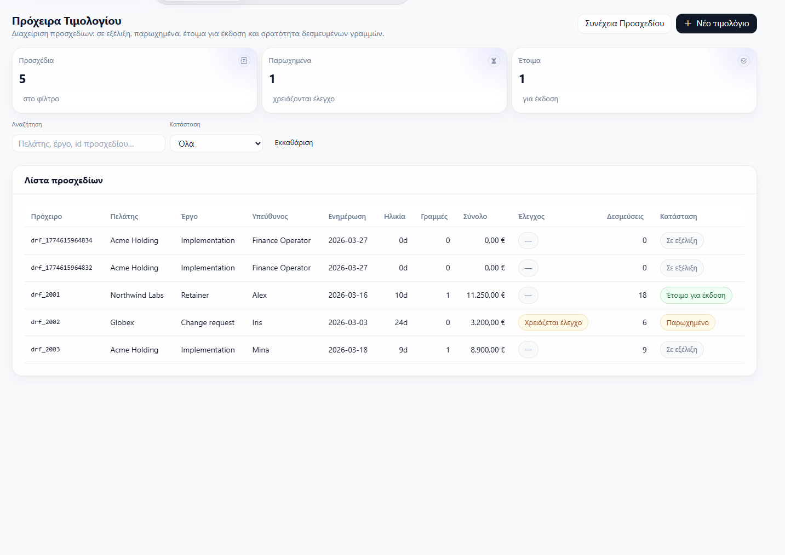

*Σχήμα 2. Λίστα invoice drafts με operational triage και context για συνέχιση στο builder.*

Η οθόνη λειτουργεί ως worklist για να εντοπίζονται drafts που χρειάζονται συνέχεια/έλεγχο/καθαρισμό. Στο v1 η αποθήκευση είναι runtime/in-memory, αλλά το UI pattern είναι worklist-first: ο χρήστης δεν “ψάχνει” μέσα στον builder.

**Τι πρέπει να παρατηρηθεί**
- **Row selection → συνέχεια**: το draft ανοίγει/προβάλλεται και οδηγεί σε builder.
- **Signals**: status/updatedAt και “triage cues” (π.χ. stale) ως ένδειξη προτεραιότητας.
- **Draft ≠ issued**: εδώ μιλάμε για work-in-progress records, όχι παραστατικά.

### 5.3 Draft builder — main

#### 5.3.1 Κύρια επιφάνεια σύνθεσης draft (compact view)

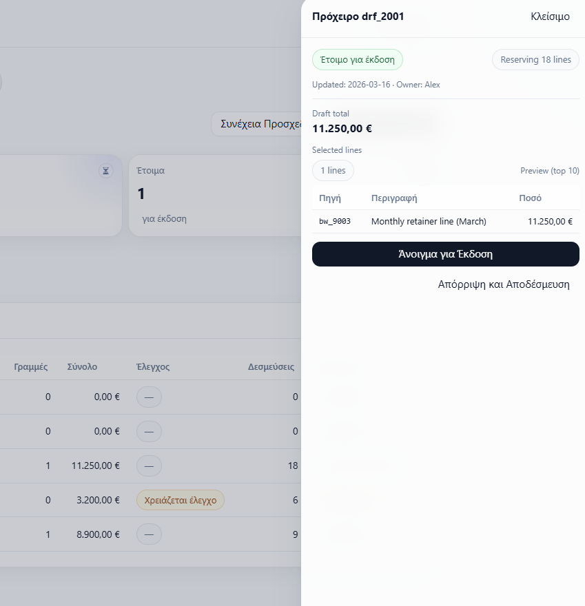

*Σχήμα 3. Κύρια επιφάνεια σύνθεσης invoice draft: header + γραμμές + actions.*

Η εικόνα δείχνει το βασικό “workspace” όπου συντίθεται το draft: επιλογή/διαχείριση γραμμών, βασικές πληροφορίες, και ενέργειες (save/issue). Στο v1 οι υπολογισμοί (π.χ. VAT) είναι UI preview, ενώ το issued record που δημιουργείται αργότερα είναι minimal (βλ. §9, §12).

**Τι πρέπει να παρατηρηθεί**
- **Διάκριση περιοχών**: header πεδία vs πίνακας γραμμών vs actions.
- **Τύποι γραμμών**: source-derived vs custom (διαφορετική “συμπεριφορά”/επεξεργασιμότητα).
- **Preview vs canonical**: η UI μπορεί να δείχνει preview totals που δεν ταυτίζονται με net-only issued totals.

#### 5.3.2 Κύρια επιφάνεια σύνθεσης draft (full view)

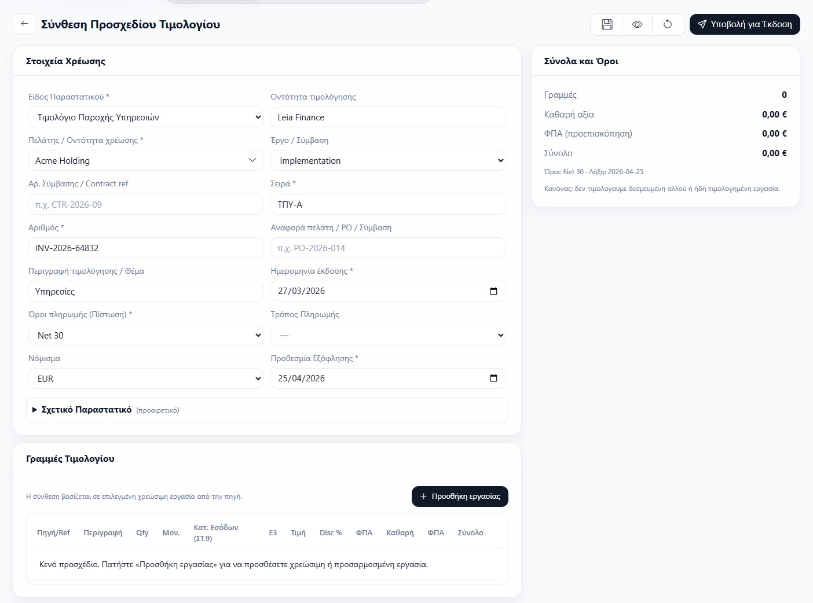

*Σχήμα 4. Πλήρης προβολή builder (full) για πλήρη ορατότητα πεδίων/στηλών και action area.*

Παρατίθεται και full εκδοχή, επειδή σε v1 υπάρχουν πολλά πεδία/στήλες (μερικά compliance-like) που είναι ορατά στο UI αλλά **δεν** έχουν end-to-end downstream υλοποίηση. Η full εικόνα βοηθά στον έλεγχο πληρότητας και στο “τι πραγματικά εκτίθεται στον χρήστη”.

**Τι πρέπει να παρατηρηθεί**
- **Compliance-like πεδία**: υπάρχουν ως UI fields, αλλά τεκμηριώνονται ως placeholder αν δεν υπάρχει exporter/state machine.
- **Action gating**: πότε είναι διαθέσιμο/disabled το issue (βλ. §10).
- **Σημεία drift**: editing context vs saved draft (save/issue).

### 5.4 Draft builder — add billable work

#### 5.4.1 Drawer επιλογής billable work (source pool)

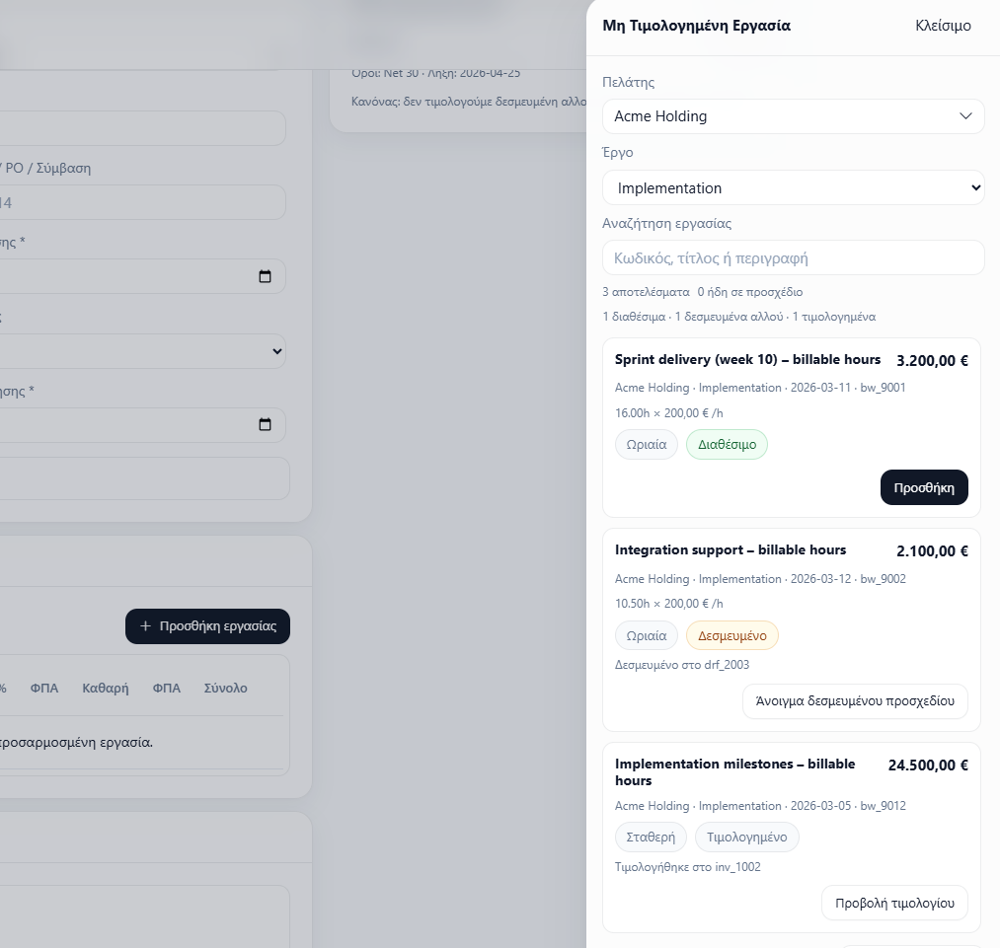

*Σχήμα 5. Drawer επιλογής billable work για προσθήκη στο draft.*

Ο drawer δείχνει το source pool (billable work) από όπου προκύπτουν draft lines. Στο v1 υπάρχει gating που αποτρέπει duplicate invoicing (π.χ. διαθέσιμη εργασία vs εργασία ήδη “δεσμευμένη/σε χρήση” από άλλο draft).

**Τι πρέπει να παρατηρηθεί**
- **Source-of-lines**: οι περισσότερες γραμμές “πηγάζουν” από billable work, όχι από χειροκίνητη καταχώρηση.
- **Gating/κανόνες επιλογής**: διακριτότητα `Available`/`Reserved` και γιατί αυτό υπάρχει.
- **Στόχος**: ασφαλής σύνθεση draft χωρίς διπλοτιμολόγηση.

#### 5.4.2 Προσθήκη custom line (χειροκίνητη γραμμή)

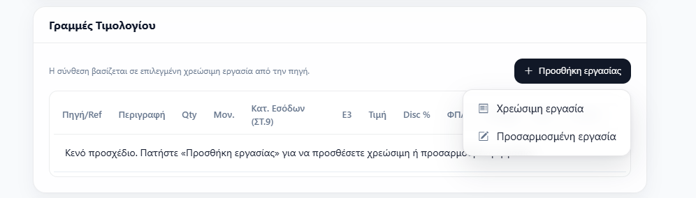

*Σχήμα 6. Προσθήκη/επεξεργασία custom γραμμής στο draft.*

Η custom γραμμή χρησιμοποιείται όταν δεν υπάρχει αντίστοιχο billable work record ή όταν απαιτείται ειδική γραμμή. Στο demo, αυτή η ροή έχει validation (π.χ. invalid custom rows μπλοκάρουν save/issue).

**Τι πρέπει να παρατηρηθεί**
- **Custom vs source-derived**: διαφορετικές παραδοχές για editability και validation.
- **Validation gating**: invalid γραμμές μπλοκάρουν save/issue (UI gating).
- **Semantics**: τα ποσά εδώ τροφοδοτούν UI preview totals, όχι απαραίτητα canonical issued totals.

#### 5.4.3 Κατάσταση draft μετά την προσθήκη εργασιών/γραμμών

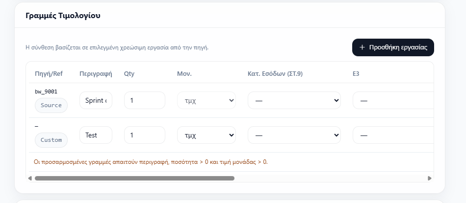

*Σχήμα 7. Draft με προστιθέμενες εργασίες/γραμμές — έλεγχος mapping και συνοχής.*

Η εικόνα δείχνει το “μετά”: οι επιλεγμένες εργασίες εμφανίζονται ως γραμμές μέσα στο draft. Αυτό βοηθά να γίνει κατανοητή η σχέση billable work → draft lines και ο τρόπος που συγκεντρώνεται το draft.

**Τι πρέπει να παρατηρηθεί**
- **Linkage**: `sourceId`/περιγραφή/τιμή μεταφέρονται στη γραμμή.
- **VAT category defaults**: οι γραμμές συνήθως ξεκινούν με default VAT category (preview).
- **Readiness cue**: ύπαρξη γραμμών είναι βασικό prerequisite για issue (v1).

### 5.5 Draft builder — bill-to / details

#### 5.5.1 Bill-to και header πεδία παραστατικού (draft-level)

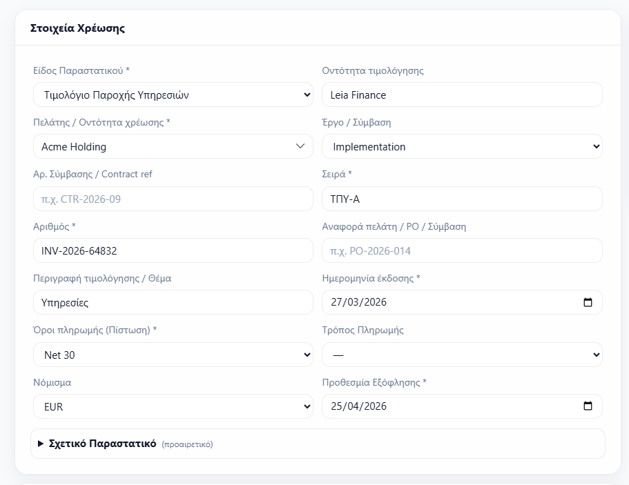

*Σχήμα 8. Bill-to και draft header fields (σειρά/αριθμός/ημερομηνίες/όροι).*

Αυτή η ενότητα αφορά τα header fields που χαρακτηρίζουν το draft παραστατικό. Στο v1, αυτά τα στοιχεία “κλειδώνουν” λειτουργικά όταν ο χρήστης κάνει explicit αποθήκευση draft (στο demo σήμερα: runtime/in‑memory).

**Τι πρέπει να παρατηρηθεί**
- **Draft-level δεδομένα**: series/number, dates, terms και notes ως μέρος `InvoiceDraft`.
- **State ownership**: editing context → runtime draft save (βλ. §8).
- **Issue readiness gap**: UI μπορεί να δείχνει required, αλλά οι κανόνες ετοιμότητας δεν είναι πλήρως κλειδωμένοι/επιβεβλημένοι ως v1 policy (βλ. §10, §12).

### 5.6 Draft builder — preview

#### 5.6.1 Preview/Review πριν από Save/Issue

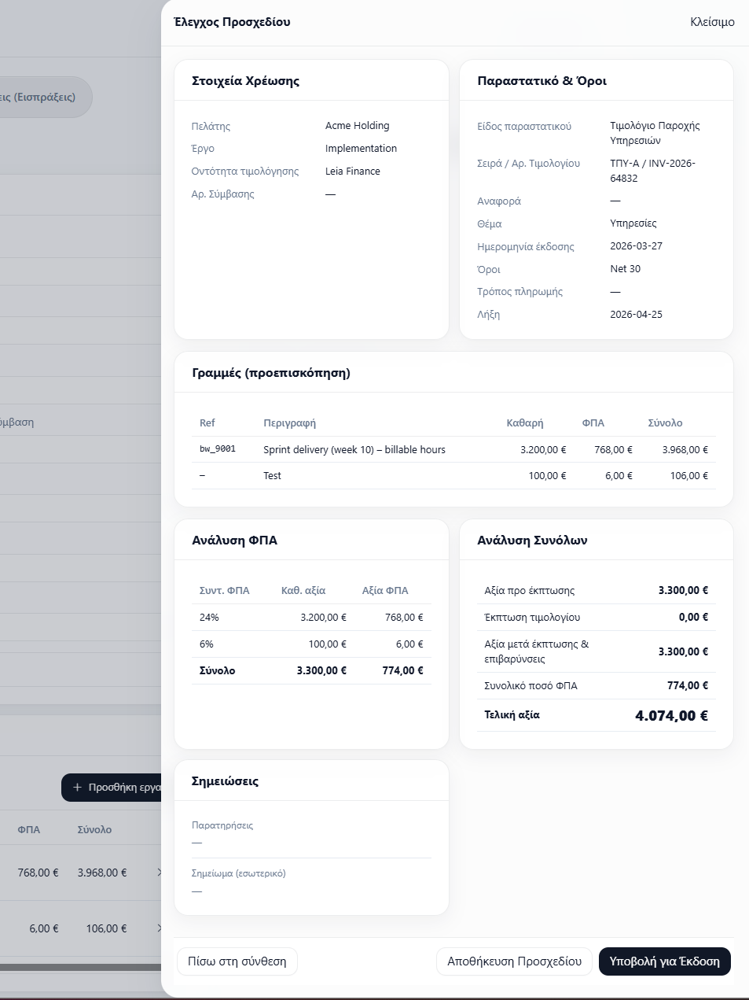

*Σχήμα 9. Preview draft παραστατικού (UI scaffold) πριν την έκδοση.*

Το preview δίνει στον χρήστη “document-like” αναπαράσταση πριν από save/issue. Πρέπει να διαβάζεται ως UI preview: στο v1 δεν υπάρχει canonical persisted invoice document snapshot (limitation).

**Τι πρέπει να παρατηρηθεί**
- **Preview-only χαρακτήρας**: δεν ισοδυναμεί με persisted issued document snapshot.
- **Totals display**: μπορεί να δείχνει VAT-inclusive σύνολα που δεν ευθυγραμμίζονται με net-only issued totals.
- **Auditability gap**: μετά το issue δεν υπάρχει πλήρης ανακατασκευή “ακριβώς αυτού” του preview.

### 5.7 Draft builder — save confirmation

#### 5.7.1 Επιβεβαίωση αποθήκευσης draft

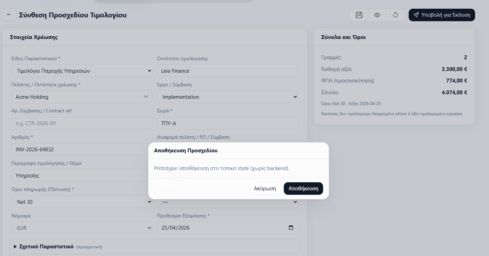

*Σχήμα 10. Επιβεβαίωση save draft (explicit runtime save).*

Η επιβεβαίωση αποτυπώνει ότι το save είναι explicit action. Στο demo σήμερα το “save” γράφει σε runtime/in-memory αποθήκευση και δεν αντιστοιχεί σε backend persistence.

**Τι πρέπει να παρατηρηθεί**
- **Explicit sync point**: η αποθήκευση είναι “όριο” μεταξύ editing context και saved draft.
- **Demo boundary**: δεν υπονοείται server-side αποθήκευση.
- **Risk**: αλλαγές πριν το save μπορούν να χαθούν (navigation/refresh).

### 5.8 Draft builder — discard confirmation

#### 5.8.1 Επιβεβαίωση απόρριψης/εξόδου χωρίς αποθήκευση

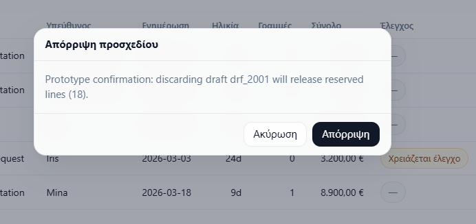

*Σχήμα 11. Επιβεβαίωση discard/exit χωρίς save — προστασία από απώλεια αλλαγών.*

Το discard confirmation υπάρχει για να μειώνει ακούσια απώλεια αλλαγών, ειδικά επειδή υπάρχει dual state (editing context vs saved draft) και το v1 δεν έχει backend persistence.

**Τι πρέπει να παρατηρηθεί**
- **Διαχείριση ρίσκου drift**: το UI αναγνωρίζει ότι μπορεί να υπάρχουν unsaved changes.
- **Operational discipline**: σαφές “save ή discard” πριν την έξοδο.
- **Σχέση με reservations**: πολιτικές release reserved lines είναι open decision (όχι end-to-end κανόνας εδώ).

### 5.9 Invoices list

#### 5.9.1 Worklist issued invoices/receivables

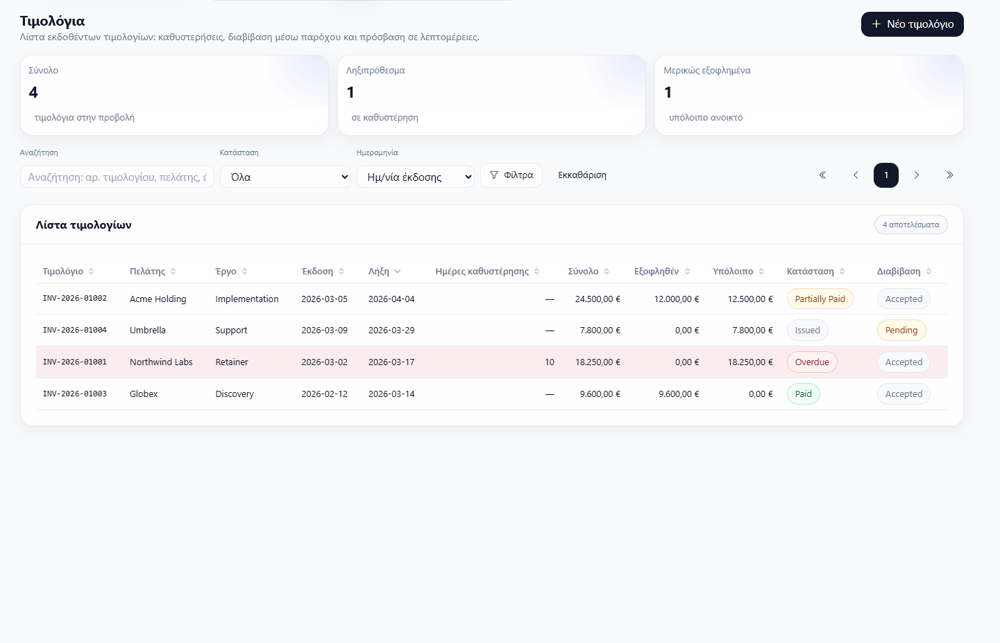

*Σχήμα 12. Λίστα issued invoices με status signals και γρήγορο drilldown σε detail/collections.*

Η οθόνη συγκεντρώνει τα issued records ως operational worklist. Στο v1, το transmission εμφανίζεται ως status label, αλλά είναι placeholder χωρίς end-to-end workflow.

**Τι πρέπει να παρατηρηθεί**
- **Status chips/signals**: χρησιμοποιούνται για triage, όχι ως “διακοσμητικά”.
- **Transmission ως placeholder**: `Pending/Accepted/Rejected` δεν προκύπτουν από πραγματική διαβίβαση.
- **Drilldown**: worklist → detail για single-record review.

### 5.10 Invoice detail

#### 5.10.1 Invoice detail (compact) — single-record review

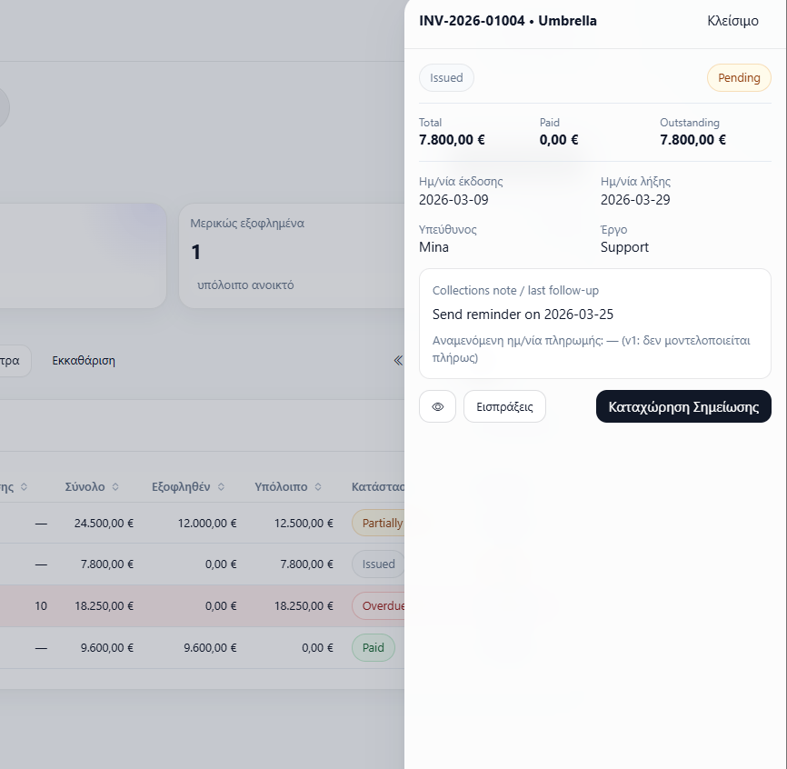

*Σχήμα 13. Invoice detail ως single-record review page (fidelity constraints) για ένα issued record.*

Το invoice detail είναι single-record review page (fidelity constraints) για ένα invoice/receivable. Στο v1 δεν παρουσιάζεται ως “canonical invoice document truth”· λειτουργεί ως review context με συνδέσεις/σήματα/notes.

**Τι πρέπει να παρατηρηθεί**
- **Linked work vs invoice lines**: εμφανίζεται εργασία συνδεδεμένη με invoiceId, όχι persisted invoice lines.
- **Collections adjacency**: notes/follow-up εμφανίζονται ως operational context.
- **Transmission block**: status πεδίο υπάρχει, αλλά δεν υποστηρίζεται από workflow.

#### 5.10.2 Invoice detail (full) — πλήρης αποτύπωση της τρέχουσας UI αλήθειας

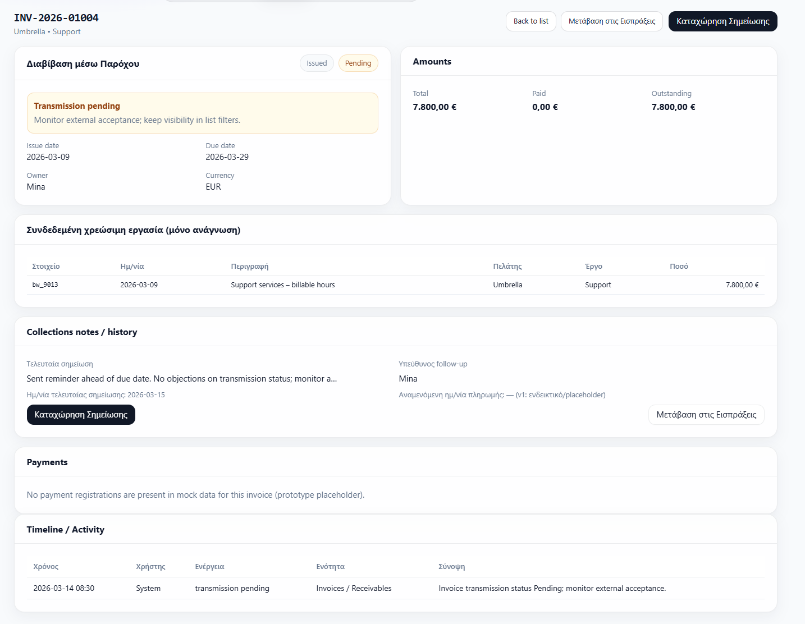

*Σχήμα 14. Πλήρης detail οθόνη (full) για να καταγράφονται όλα τα sections που εκτίθενται στον χρήστη.*

Παρατίθεται η full εκδοχή ώστε να είναι σαφές τι εμφανίζει σήμερα το UI (sections, signals, notes). Είναι χρήσιμη για QA/engineering alignment, ειδικά επειδή κάποια blocks (π.χ. transmission/compliance-like) είναι placeholders.

**Τι πρέπει να παρατηρηθεί**
- **Τι “υπάρχει” οπτικά**: sections που φαίνονται ακόμα κι αν δεν έχουν backend λειτουργικότητα.
- **Audit/notes**: τι υπάρχει ως timeline και τι ως follow-up note.
- **Fidelity constraints**: τι δεν μπορεί να εμφανιστεί (π.χ. πραγματικό invoice document snapshot).

### 5.11 Revenue views

#### 5.11.1 Revenue list — ευρύτερο revenue context (adjacent)

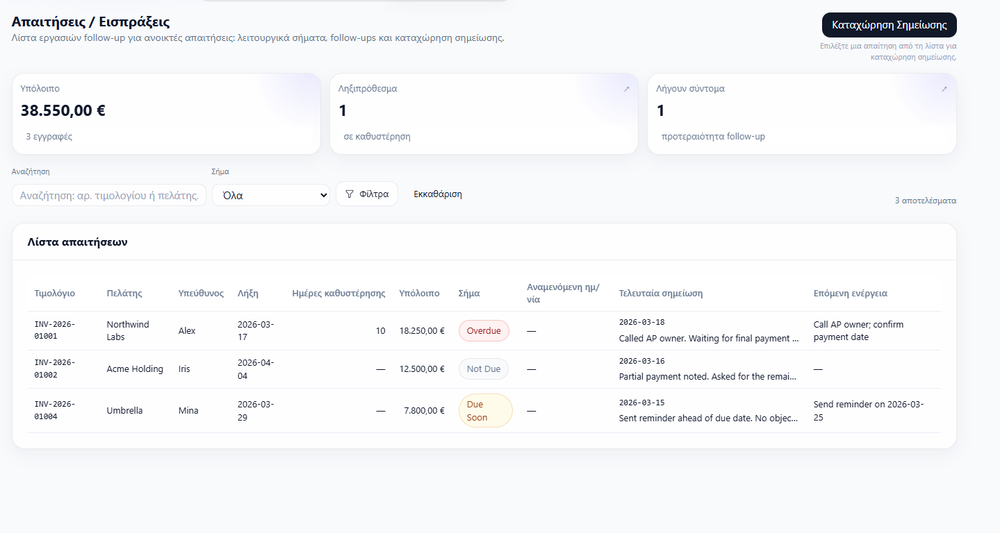

*Σχήμα 15. Revenue list ως adjacent context του revenue loop (όχι αντικατάσταση του invoicing worklist).*

Η revenue list δίνει ευρύτερο πλαίσιο “revenue items” γύρω από το invoicing/receivables. Δεν αντικαθιστά τις οθόνες invoicing, αλλά βοηθά στη σύνδεση του “τι τιμολογώ” με το “τι παρακολουθώ/εισπράττω”.

Στο παρόν brief παρατίθεται **μόνο** ως adjacent context (επειδή εμφανίζεται στο demo UI και βοηθά να μην παρερμηνευτεί το invoicing ως “γενικό revenue dashboard”). Δεν προσθέτει επιπλέον invoicing actions.

**Τι πρέπει να παρατηρηθεί**
- **Adjacency**: πώς συμπληρώνει (όχι αντικαθιστά) τα invoicing worklists.
- **Drilldown discipline**: από λίστα σε detail για context.
- **Όρια**: δεν υπονοεί λογιστική/GL λειτουργικότητα.

#### 5.11.2 Revenue detail — adjacent UI context only (non-canonical for invoicing v1)

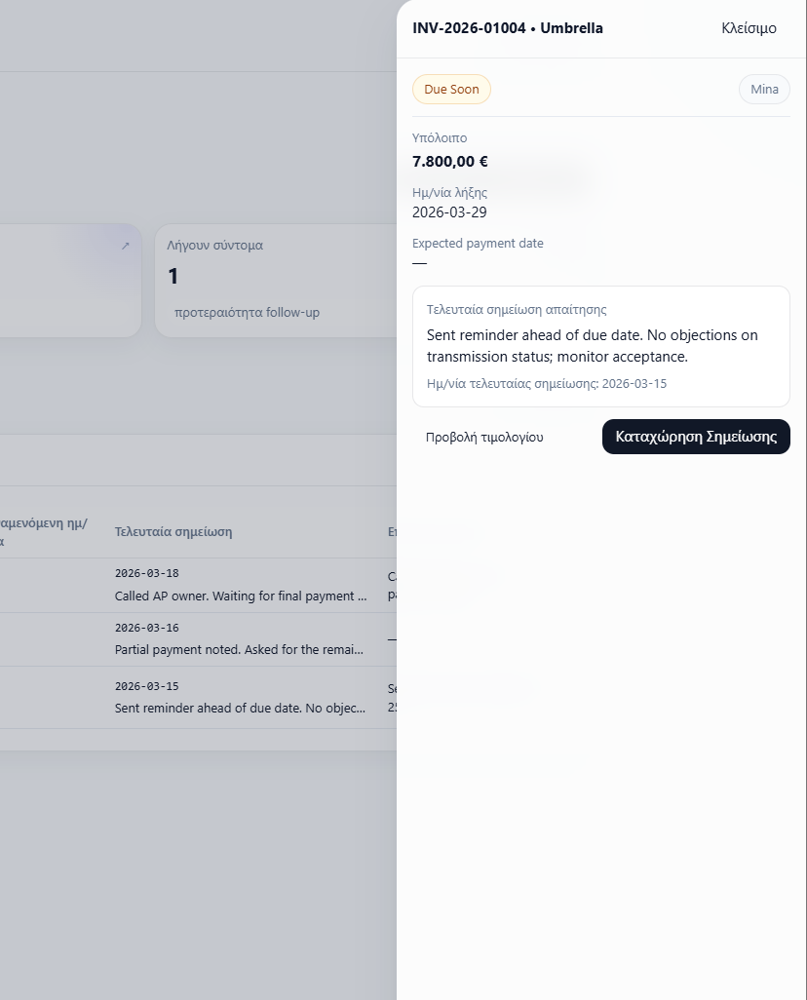

*Σχήμα 16. Revenue detail ως adjacent UI context (non-canonical για invoicing v1).*

Το revenue detail λειτουργεί ως drilldown σε ένα revenue αντικείμενο. Στο παρόν έγγραφο παρατίθεται **μόνο** ως adjacent UI context και **δεν** αποτελεί canonical μέρος του invoicing v1 brief.

**Τι πρέπει να παρατηρηθεί**
- **Σύνδεση εννοιών**: revenue item ↔ invoicing/receivables (conceptual adjacency).
- **Operational focus**: οι ενέργειες invoicing παραμένουν στο draft builder / invoices / collections.
- **Note**: η έκταση end-to-end linkage είναι open decision.

---

## 6. Βασικές ροές χρήστη

Οι ροές παρακάτω περιγράφονται με σειρά “v1 συμπεριφορά → intended operational role → open decisions”. Όπου αναφέρεται απώλεια δεδομένων σε refresh/reload, αυτό αφορά **το τρέχον demo**.

#### 6.0.1 Διάγραμμα — Draft lifecycle (v1)



Το διάγραμμα αποτυπώνει τον κύκλο ζωής ενός draft στο v1: δημιουργία, επιλογή γραμμών, συμπλήρωση header, save/review και τελικά issue ή discard. Οι έλεγχοι “issue readiness” δεν επιβάλλονται πλήρως ως κλειδωμένη v1 policy (βλ. §10/§12).

#### 6.0.2 Διάγραμμα — Issue flow (v1 demo transitions)

Το διάγραμμα δείχνει τι σημαίνει “Issue” σήμερα: save draft, δημιουργία minimal issued invoice context (`Invoice`), δημιουργία receivable context (`ReceivableWorkItem`), linkage με billable work (`BillableWorkItem`) και audit/notes context. Δεν υπάρχει end-to-end transmission/compliance workflow.

#### 6.0.3 Διάγραμμα — Collections follow-up flow (v1)



Το διάγραμμα δείχνει τη λογική follow-up στο v1: review aging/overdue, καταγραφή notes/owner context και (όπου/όσο υποστηρίζεται) πρόοδος πληρωμής μέχρι paid/collected. Το v1 δεν περιλαμβάνει πλήρες payment registration workflow.
Το “paid/collected” πρέπει να διαβάζεται ως **conceptual end-state** (ενδεικτικό όπου εφαρμόζεται στο v1), όχι ως εγγύηση accounting cash truth.

### 6.1 Flow A — Ανακάλυψη / συνέχιση draft

**Στόχος χρήστη**
- Να εντοπίσει ένα draft που έχει μείνει σε εκκρεμότητα και να το συνεχίσει.

**Indicative v1 βήματα**
- Από το worklist των drafts επιλέγει draft και ανοίγει τον draft builder.
- Συνεχίζει από το σημείο που είχε μείνει (στο demo σήμερα: runtime/in‑memory).

**Intended operational role**
- Να λειτουργεί ως triage queue για drafts (π.χ. stale/needs review/reserved lines warning) ώστε να μην “χάνονται” μέσα στο builder.

**Open decision**
- Τυπικός κανόνας “stale draft” (σήμερα εμφανίζεται ως σήμα/label, όχι ως πλήρως κλειδωμένος κανόνας μετάβασης).

### 6.2 Flow B — Σύνθεση draft από billable work

**v1 συμπεριφορά**
- Υπάρχει source pool billable work.
- UI gating αποτρέπει duplicate invoicing: επιτρέπει add όταν item είναι `Available` ή `Reserved` από το ίδιο draft.
- Add δημιουργεί `DraftLine` με default τιμές: `quantity:1`, `unit:"ea"`, `discountPct:0`, `vatCategory:"Standard 24%"` (UI preview defaults).

**Intended operational role**
- “Ασφαλής” μετατροπή billable work σε τιμολογήσιμες γραμμές, με ορατότητα για reservations.

**Open decisions**
- Grouping/aggregation κανόνες (π.χ. 1 work item = 1 line ή aggregation ανά project/service).

### 6.3 Flow C — Επεξεργασία invoice header

**Στόχος χρήστη**
- Να συμπληρώσει/διορθώσει τα header στοιχεία (bill-to, series/number, ημερομηνίες, όροι πληρωμής, notes).

**Indicative v1 συμπεριφορά**
- Οι αλλαγές γίνονται στον draft builder και “καταγράφονται” με explicit αποθήκευση draft (στο demo σήμερα: runtime/in‑memory).

**Known caveat**
- UI μπορεί να δείχνει `*` required, αλλά η “ετοιμότητα για issue” δεν είναι πλήρως κλειδωμένη/επιβεβλημένη ως v1 policy.

**Open decision**
- Canonical required fields policy πριν issue.

### 6.4 Flow D — Save draft

**Στόχος χρήστη**
- Να καταγράψει την πρόοδο του draft (ώστε να μπορεί να το συνεχίσει/κάνει review).

**Indicative v1 βήματα**
- Επιλέγει “Save” και επιβεβαιώνει την αποθήκευση.
- Το draft εμφανίζεται/παραμένει διαθέσιμο στη λίστα drafts (στο demo σήμερα: runtime/in‑memory).

**Known limitation**
- (Demo) Χωρίς persistence στο demo, refresh/reload χάνει drafts και in-progress αλλαγές.

**Open decision**
- Μελλοντικό persistence (backend vs local) και conflict/locking μοντέλο.

### 6.5 Flow E — Issue draft

**Στόχος χρήστη**
- Να μετατρέψει ένα draft σε issued invoice context ώστε να ξεκινήσει παρακολούθηση/είσπραξη (receivable follow-up).

**Indicative v1 βήματα**
- Κάνει issue από τον draft builder (μετά από save).
- Δημιουργείται minimal issued record και linked receivable (στο demo σήμερα: runtime/in‑memory).

**Enforced today**
- Το issue δεν είναι διαθέσιμο/δεν ολοκληρώνεται αν το draft δεν έχει γραμμές.

**Known caveats**
- **Data truncation**: issued `Invoice` δεν κρατά header/lines snapshot.
- **Totals mismatch**: UI δείχνει VAT-inclusive preview totals, αλλά το issued invoice context κρατά net-only totals (βλ. §9).
- **Transmission**: `TransmissionStatus: "Pending"` χωρίς workflow (placeholder).

**Κρίσιμος περιορισμός (υπενθύμιση)**  
Το “Issue” στο v1 **δεν** είναι νομική/αμετάβλητη έκδοση παραστατικού, ούτε ολοκλήρωση διαβίβασης/συμμόρφωσης ή λογιστική καταχώρηση. Είναι module transition (στο demo σήμερα: runtime/in‑memory).

**Open decisions**
- Τι σημαίνει “Issue” ως immutable παραστατικό σε v1/v2 (approval/transmission/credit notes).

### 6.6 Flow F — Παρακολούθηση issued invoice

**Στόχος χρήστη**
- Να εντοπίσει και να κάνει review ένα issued record (status/aging/notes) και να κινηθεί προς collections follow-up.

**Indicative v1 βήματα**
- Από τη λίστα invoices ανοίγει το invoice detail.
- Προσθέτει follow-up context (π.χ. note) ή μεταβαίνει στο collections worklist.

**Note**
- Transmission status υπάρχει ως UI signal (`TransmissionStatus`), χωρίς end-to-end διαβίβαση.

**Open decisions**
- Immutable audit model, cancel/credit note flows, payments registration semantics.

### 6.7 Flow G — Collections follow-up

**Στόχος χρήστη**
- Να οργανώσει την εργασία είσπραξης πάνω σε ανοικτές απαιτήσεις (receivables).

**Indicative v1 βήματα**
- Από το collections worklist φιλτράρει/προτεραιοποιεί με βάση aging/overdue.
- Προσθέτει follow-up note/owner context και κάνει drilldown σε invoice detail όταν χρειάζεται.

**Known caveat**
- Το collections amount/outstanding κληρονομεί `Invoice.total` → άρα επηρεάζεται από το net-only vs gross mismatch (βλ. §9.4, §9.6).

**Open decisions**
- Partial payments, allocation, reconciliation, dunning/escalations.

---

## 7. Οντότητες και δεδομένα

Οι οντότητες παρακάτω είναι τα βασικά data concepts του invoicing module στο v1. Η βασική διαφοροποίηση είναι ότι το issued `Invoice` είναι minimal και **δεν** λειτουργεί ως πλήρες document snapshot.

**Πίνακας 2 — Entity ownership table**

| Οντότητα | Ρόλος | Canonical source | Χρησιμοποιείται σε | Παρατηρήσεις |
|---|---|---|---|---|
| `InvoiceDraft` | Draft header + metadata | v1 persistence target (demo σήμερα: runtime/in‑memory) | Drafts list, Draft builder | Τα header fields “κλειδώνουν” λειτουργικά με explicit save |
| `DraftLine` | Draft γραμμή (source-derived ή custom) | v1 persistence target (demo σήμερα: runtime/in‑memory) | Draft builder, draft preview | Περιέχει preview/tax/compliance-like fields που δεν είναι end-to-end |
| `Invoice` | Issued record (minimal) | v1 persistence target (demo σήμερα: runtime/in‑memory) | Invoices list, Invoice detail | **Δεν** κρατά lines/header snapshot |
| `ReceivableWorkItem` | Απαίτηση/collections unit | v1 persistence target (demo σήμερα: runtime/in‑memory) | Collections, Invoice detail | `outstanding` συνδέεται με `Invoice.total` (semantics risk) |
| `BillableWorkItem` | Πηγή τιμολόγησης | v1 persistence target (demo σήμερα: runtime/in‑memory) | Draft builder, Invoice detail | Χρησιμοποιείται για line sourcing και για linkage μετά το issue |
| `AuditEvent` / notes | Traceability & follow-up | v1 persistence target (demo σήμερα: runtime/in‑memory) | Invoice detail, Collections | Timeline/notes context· όχι immutable ledger |

### 7.1 InvoiceDraft

- **Τι είναι**: draft entity με header fields + draft metadata.
- **Πού αποθηκεύεται**: v1 persistence target (στο demo σήμερα: runtime/in‑memory).
- **Open**: canonical required fields & mapping σε issued invoice snapshot.

**Σημερινή χρήση (demo)**
- Κρατά payment terms/dates, series/number (UI-level), notes, related document, movement, κ.λπ.
- Δεν μεταφέρεται ως πλήρες snapshot στο issued `Invoice` entity (limitation).

### 7.2 DraftLine

- **Τι είναι**: γραμμή draft με qty/unitPrice/discount/VAT category + classifications placeholders.
- **Πού αποθηκεύεται**: v1 persistence target (στο demo σήμερα: runtime/in‑memory, ανά draft).
- **Known caveat**: line-level calculations γίνονται σε builder (UI), όχι canonical shared engine.

**Origins**
- **Source-derived**: από `BillableWorkItem` (`sourceId`).
- **Custom**: `sourceId: custom_*` (editable line semantics).

### 7.3 Invoice

- **Τι είναι**: minimal issued invoice record (v1 context, με περιορισμούς).
- **Known limitation**: δεν κρατά lines/header snapshot.

**Συνέπεια**
- Στο v1, το issued invoice context δεν διατηρεί πλήρες snapshot γραμμών. Ως αποτέλεσμα, το detail view λειτουργεί ως review context με linked work και όχι ως πλήρης αναπαράσταση invoice document lines.

**Canonical interpretation (v1)**
- Το issued `Invoice` στο v1 είναι **minimal operational record** που δημιουργείται από το issue transition.
- Δεν αποτελεί πλήρες “document artifact” και δεν τεκμηριώνει immutable invoice snapshot.

### 7.4 ReceivableWorkItem

- **Τι είναι**: αντικείμενο απαίτησης (outstanding/paid) συνδεδεμένο με invoice.
- **Known caveat**: `ReceivableWorkItem.outstanding` βασίζεται σε net-only issued totals (v1 mismatch risk).

**v1 συμπεριφορά**
- Δημιουργείται κατά issue, με `outstanding = Invoice.total` (net-only στο v1).

### 7.5 BillableWorkItem

- **Τι είναι**: “πηγή” για draft lines (work to bill).
- **Linkage**: draft line `sourceId` και μετά το issue συνδέεται με issued invoice (ώστε να φαίνεται “τι τιμολογήθηκε” ως work context).

### 7.6 Audit / notes / related operational data

**v1 συμπεριφορά**
- `AuditEvent` χρησιμοποιείται ως timeline για invoice detail (context, όχι immutable ledger).
- Collection notes συσχετίζονται με `invoiceId` (follow-up context).

**Open decision**
- Αν/πότε το audit γίνεται immutable/compliance-grade trail.

---

## 8. Κανόνες δεδομένων και πηγές αλήθειας

### 8.1 Runtime storage ownership

**v1 scope**
- **v1 στόχος**: persistence για drafts/invoices/receivables (ανακτήσιμα records).
- **Demo σήμερα**: runtime/in‑memory αποθήκευση, άρα refresh/reload δεν πρέπει να θεωρείται ότι διατηρεί δεδομένα.

#### 8.0.1 Διάγραμμα — State ownership map (v1)



Το διάγραμμα χαρτογραφεί ποια δεδομένα ζουν στον builder (editing context), ποια “αποθηκεύονται” ως saved draft, και πώς προκύπτει το issued invoice/receivable context. Επισημαίνεται επίσης το drift σημείο: UI preview totals (VAT-inclusive) vs net-only issued totals.

### 8.2 Editing context vs saved draft

**Στόχος (functional)**: να μην μπερδεύεται ο χρήστης μεταξύ “αυτό που βλέπω τώρα στον builder” και “αυτό που έχει αποθηκευτεί ως draft”.

**Indicative v1 συμπεριφορά**
- Υπάρχει διακριτό “editing context” στον builder και διακριτό “saved draft”.
- Το save λειτουργεί ως σαφές σημείο συγχρονισμού: ό,τι έχει σωθεί θεωρείται το draft που θα εμφανιστεί στη λίστα drafts (εντός v1 scope).
- Μετά το issue, ο χρήστης μεταφέρεται σε issued invoice/receivable context (single-record review + collections adjacency).

### 8.3 Persisted vs derived vs preview-only values

**v1 ορισμοί (product-level)**
- **Stored**: values που κρατιούνται ως saved draft ή ως issued record (target: persisted· στο demo σήμερα: runtime/in‑memory).
- **Derived**: values που προκύπτουν ως υπολογισμός/προβολή (π.χ. VAT preview, gross preview totals).
- **Preview-only / placeholder**: values/labels που υπάρχουν για UI completeness αλλά δεν έχουν end-to-end λειτουργική κάλυψη (π.χ. transmission/compliance-like).

### 8.4 Ready-made / demo data

**v1 note**
- Το demo μπορεί να περιλαμβάνει “έτοιμα” δείγματα δεδομένων και ενδεικτικά statuses για να υποστηρίζεται walkthrough.
- Οποιαδήποτε σημασιολογία status που δεν παράγεται από κανόνες v1 θεωρείται **ενδεικτική** και όχι canonical rule.

---

## 9. Υπολογισμοί και financial semantics

> Κανόνας: εδώ πρέπει να υπάρχει αυστηρός διαχωρισμός “UI preview calc” vs “issued totals semantics” και οι caveats να είναι ρητές.

### 9.1 Line-level calculations

**UI preview (v1)**
- \(net = qty \times unitPrice \times (1 - discountPct/100)\) με defaults/fallbacks.
- \(vat = net \times rate(vatCategory)\).
- Default VAT για νέα lines: `"Standard 24%"`.

**Open decision**
- Rounding policy (ανά γραμμή ή ανά σύνολο) και precision ανά νόμισμα.

### 9.2 VAT / taxes

- **UI preview**: VAT categories/rates ως επιλογές UI.
**Not end-to-end implemented**
- Δεν υπάρχει canonical tax engine ούτε downstream χρήση των fields `withholdingPct`, `stampDutyPct`, `otherTaxesAmount`.

### 9.3 Draft totals

**v1 συμπεριφορά**
- Το draft διατηρεί “stored” total που σήμερα λειτουργεί ως **net-only**.
- Το UI δείχνει net + VAT + gross/grand totals ως **preview**.

### 9.4 Issued invoice totals

**v1 συμπεριφορά (known inconsistency)**
- Το issued invoice context διατηρεί total που σήμερα λειτουργεί ως **net-only**.
- Το UI στο builder εμφανίζει VAT-inclusive totals ως preview.

**Συνέπεια**
- Η έννοια “total” δεν είναι σταθερή σήμερα μεταξύ builder και issued record, επηρεάζοντας receivables/collections.

### 9.5 Receivable amounts

**v1 συμπεριφορά**
- Το receivable “outstanding” συνδέεται με το issued invoice total.
- Δεν υπάρχει end-to-end payment registration workflow ως canonical λειτουργία v1 (η “πρόοδος πληρωμής” μπορεί να είναι ενδεικτική/μη πλήρως υλοποιημένη).

**Open decisions**
- Partial payments, allocation rules, reconciliation boundaries.

### 9.6 Known mismatches / caveats

**Known mismatches (v1)**
- **Totals mismatch**: UI VAT-inclusive preview vs net-only issued totals.
- **Model truncation**: issued `Invoice` δεν διατηρεί lines/header snapshot.
- **Transmission placeholder**: `TransmissionStatus` υπάρχει αλλά χωρίς state machine/API.
- **Numbering mismatch**: draft `series/invoiceNumber` vs issued `Invoice.number` χωρίς σύνδεση.

**Πίνακας 3 — Value semantics table**

| Τιμή / ποσό | Πού υπολογίζεται | Πού εμφανίζεται | Αν αποθηκεύεται | Παρατήρηση |
|---|---|---|---|---|
| Line net (preview) | Draft builder (UI preview) | Draft builder | Όχι (ως canonical calc) | JS numbers, χωρίς locked rounding policy |
| Line VAT (preview) | Draft builder (UI preview) | Draft builder (VAT preview) | Όχι | UI-only preview |
| Draft total (stored) | v1 stored draft total | Drafts list / draft record | Ναι (`InvoiceDraft.draftTotal`) | Net-only |
| Invoice total (issued) | v1 issue transition | Invoices list/detail | Ναι (`Invoice.total`) | Net-only (known mismatch vs UI preview) |
| Receivable outstanding | v1 receivable linkage | Collections/Invoice detail | Ναι (`ReceivableWorkItem.outstanding`) | Κληρονομεί net-only semantics → risk |
| Gross/grand total (preview) | Draft builder totals (net+VAT+extras) | Draft builder preview | Όχι | Μπορεί να διαφέρει από issued `Invoice.total` |

---

## 10. Permissions και action gating

### 10.1 UI gating

**v1 συμπεριφορά**
- `Issue` γίνεται disabled αν:
  - δεν υπάρχουν γραμμές στο draft, ή
  - υπάρχουν μη έγκυρες custom γραμμές, ή
  - ο χρήστης δεν έχει δικαίωμα issue.
- `Save` είναι implemented UI→runtime sync action (runtime draft save), όχι backend persistence action.
- Η εγκυρότητα custom lines επηρεάζει τη διαθεσιμότητα `Save/Issue` μέσω implemented UI validation gating (invalid custom rows → disabled).

**Intended (blueprint)**
- Permission-dependent actions να εμφανίζονται disabled/hidden με reason (χωρίς να κρύβεται το record).

### 10.2 v1 issue preconditions

**v1 συμπεριφορά**
- Το v1 issue transition απαιτεί να υπάρχει draft και να υπάρχουν γραμμές (σε επίπεδο βασικών προϋποθέσεων).

**Gap**
- Δεν υπάρχει canonical enforcement για required header fields πριν issue (π.χ. series/number/issueDate), πέρα από UI hints.

### 10.3 Current gaps

**Gaps (v1)**
- Mismatch μεταξύ UI required indicators και των ελάχιστων προϋποθέσεων issue στο v1.
- Δεν υπάρχει ενιαίος “issue readiness ruleset” σε ένα canonical σημείο.

**Open decisions**
- Permission matrix (roles → actions) και audit requirements για sensitive actions.

---

## 11. Καταστάσεις και lifecycle

### 11.1 Draft statuses

**v1 συμπεριφορά**
- Draft status ενημερώνεται με βάση την ύπαρξη γραμμών (π.χ. “In Progress”, “Ready to Issue”) και το issue transition (“Issued”).
- “Stale Draft” εμφανίζεται ως status/label, χωρίς κλειδωμένο κανόνα μετάβασης.

**Open decision**
- Canonical lifecycle transitions/invariants.

### 11.2 Invoice statuses

**v1 vocabulary**
- Υπάρχει vocabulary για invoice statuses (π.χ. Issued / Partially Paid / Paid / Overdue / Cancelled), αλλά τα end-to-end transitions δεν είναι κλειδωμένα ως πλήρες v1 workflow.

**Open decisions**
- Cancel/void/credit note flows και invariants.

### 11.3 Transmission statuses

**v1 placeholder**
- Το v1 αρχικοποιεί `TransmissionStatus` ως `Pending` κατά issue.
- Δεν υπάρχει state machine/API που να οδηγεί σε `Accepted/Rejected`.

**Doc rule**
- Κάθε αναφορά σε transmission πρέπει να χαρακτηρίζεται ως **placeholder** μέχρι να υπάρξει end-to-end υλοποίηση.

### 11.4 Operational signals

**v1 συμπεριφορά**
- Η due date προκύπτει από τους όρους πληρωμής ή από default fallback rule όπου απαιτείται στο v1 context.
- “Overdue”/aging εμφανίζεται ως UI concept, αλλά δεν τεκμηριώνεται ως πλήρες end-to-end rule engine στο v1.

**Intended operational role (blueprint)**
- Overdue highlighting και status chips να οδηγούν triage/filtering και drilldowns.

**Open decisions**
- Canonical aging buckets/overdue rule set και alignment με KPI drilldowns του monitoring shell.

---

## 12. Σημερινά όρια, ασυνέπειες και γνωστά κενά

Τα παρακάτω είναι τα canonical “known gaps” όπως προκύπτουν από την τρέχουσα υλοποίηση και τα audit findings. Δεν επιχειρούμε να τα “διορθώσουμε” σε prose· τα καταγράφουμε για stabilization/decisions.

**Πίνακας 4 — Limitation table**

| Θέμα | Τρέχουσα κατάσταση | Επιπτώσεις | Κατηγορία (Implemented / Placeholder / Open decision) |
|---|---|---|---|
| Missing persistence (demo) | Στο demo η αποθήκευση είναι runtime/in-memory | Δεδομένα χάνονται σε refresh· δεν υπάρχει shared source of truth | Implemented (demo limitation) |
| Totals semantic mismatch (net vs gross) | Builder δείχνει VAT-inclusive preview, issued totals είναι net-only | Λάθος/ασυνεπείς απαιτήσεις (`outstanding`), confusion σε invoices/collections/KPIs | Implemented (inconsistency) |
| Issued invoice truncation | `Invoice` entity δεν κρατά header/lines snapshot | Δεν υπάρχει auditability “τι εκδόθηκε”· invoice detail fidelity περιορισμένη | Implemented (limitation) / Open decision (fix) |
| Dual state (editing vs saved) | Builder κρατά editing context και συγχρονίζει σε explicit save/issue | Drift/απώλεια αλλαγών αν γίνει navigation χωρίς save | Implemented (gap) |
| Transmission semantics | `TransmissionStatus` υπάρχει, αρχικοποιείται `Pending`, χωρίς state machine | Κίνδυνος να εκληφθεί ως compliance feature | Placeholder |
| Compliance-like fields without downstream | E3/ΣΤ.9/myData-like fields υπάρχουν σε UI/types, χωρίς exporter/mapping | False sense of readiness· δεν επηρεάζουν issued invoice | Placeholder / Open decision |
| Issue-readiness validation | Οι προϋποθέσεις issue στο v1 είναι ελάχιστες (draft exists, lines non-empty) | Μπορεί να εκδοθεί record με “ελλιπή” header policy | Implemented (gap) |
| Numbering policy mismatch | Draft `series/invoiceNumber` vs issued `Invoice.number` ασύνδετα | Ασάφεια “νόμιμου αριθμού” και consistency σε exports | Open decision |
| Draft stale semantics | “Stale” εμφανίζεται ως status/label χωρίς κλειδωμένο rule | Αβεβαιότητα triage/policy | Open decision |

---

## 13. Ανοικτές αποφάσεις

> Placeholder: λίστα “decisions needed” με owner/impact/links (να συμπληρωθεί από `docs/analysis/invoicing_open_questions.md` χωρίς να απαιτείται ανάγνωσή του).

- **Canonical invoice document snapshot**: πότε/πού αποθηκεύονται header+lines για issued invoice.
- **Totals policy**: net vs gross ως canonical amount, και rounding rules.
- **VAT/compliance scope**: τι υποστηρίζεται (myData/E3/ΣΤ.9) και σε ποιο stage.
- **Transmission workflow**: state machine, retries, errors, audit.
- **Collections model**: partial payments, reconciliation, allocation.
- **Permissions matrix**: ρόλοι, action gating, audit requirements.

**Σύνδεση με σημερινά ευρήματα (για prioritization)**
- Η απόφαση για **totals semantics (net vs gross)** επηρεάζει άμεσα `ReceivableWorkItem.outstanding`, collections prioritization και KPI drilldowns.
- Η απόφαση για **issued invoice snapshot** είναι προαπαιτούμενο για “serious” invoice detail, audit trail και οποιαδήποτε compliance αφήγηση.
- Η απόφαση για **transmission/myData scope** πρέπει να δηλωθεί ως product boundary μέχρι να υπάρξει adapter/state machine.

---

## 14. Appendix

### 14.1 Screenshot asset list

> Όλα τα assets είναι στο `docs/invoices_app/`. Σε αυτό το pass, τα screenshots έχουν ενσωματωθεί στο §5.

- `home_apps_screen.png`
- `invoice_drafts_list.png`
- `invoice_draft_details.png`
- `invoice_draft_details_full.png`
- `invoice_draft_add_billable_work_drawer.png`
- `invoice_draft_add_line.png`
- `invoice_draft_works_added.png`
- `invoice_draft_bill_to.png`
- `invoice_draft_preview.png`
- `invoice_draft_save_confirm.png`
- `invoice_draft_discard_confirm.png`
- `invoices_list.png`
- `invoice_details.png`
- `invoice_details_full.png`
- `revenue_list.png`
- `revenue_details.png`

**Πίνακας — Screenshot χρήση (file → section → purpose)**

| Screenshot file | Section used in | Purpose |
|---|---|---|
| `home_apps_screen.png` | §5.1 | Entry point / navigation context προς Revenue worklists |
| `invoice_drafts_list.png` | §5.2 | Drafts triage queue και συνέχεια προς builder |
| `invoice_draft_details.png` | §5.3 | Main draft composition workspace (compact) |
| `invoice_draft_details_full.png` | §5.3 | Πλήρης αποτύπωση πεδίων/στηλών και action area (full) |
| `invoice_draft_add_billable_work_drawer.png` | §5.4 | Επιλογή billable work (source pool) |
| `invoice_draft_add_line.png` | §5.4 | Προσθήκη/επεξεργασία custom line και validation cues |
| `invoice_draft_works_added.png` | §5.4 | Κατάσταση draft μετά την προσθήκη εργασιών/γραμμών (mapping) |
| `invoice_draft_bill_to.png` | §5.5 | Bill-to και header fields (draft-level) |
| `invoice_draft_preview.png` | §5.6 | Preview/review πριν από Save/Issue (UI scaffold) |
| `invoice_draft_save_confirm.png` | §5.7 | Save confirmation ως explicit runtime sync point |
| `invoice_draft_discard_confirm.png` | §5.8 | Discard confirmation για αποφυγή απώλειας αλλαγών |
| `invoices_list.png` | §5.9 | Worklist issued invoices/receivables + status/transmission signals |
| `invoice_details.png` | §5.10 | Invoice detail (compact) για single-record review |
| `invoice_details_full.png` | §5.10 | Invoice detail (full) για πλήρη αποτύπωση sections/signals |
| `revenue_list.png` | §5.11 | Adjacent revenue context (list) |
| `revenue_details.png` | §5.11 | Adjacent revenue context (detail) |

### 14.2 Diagram asset list

Τα παρακάτω διαγράμματα διατηρούνται ως Mermaid sources (για συντηρησιμότητα) και ως rendered SVG assets (για ενσωμάτωση στο markdown).

- **Overall invoicing loop**
  - source: `docs/finance/invoicing/diagrams/src/invoicing-loop.mmd`
  - asset: `docs/finance/invoicing/diagrams/assets/invoicing-loop.svg`
- **Draft lifecycle**
  - source: `docs/finance/invoicing/diagrams/src/draft-lifecycle.mmd`
  - asset: `docs/finance/invoicing/diagrams/assets/draft-lifecycle.svg`
- **Issue flow**
  - source: `docs/finance/invoicing/diagrams/src/issue-flow.mmd`
  - asset: `docs/finance/invoicing/diagrams/assets/issue-flow.svg`
- **Collections follow-up flow**
  - source: `docs/finance/invoicing/diagrams/src/collections-flow.mmd`
  - asset: `docs/finance/invoicing/diagrams/assets/collections-flow.svg`
- **State ownership map**
  - source: `docs/finance/invoicing/diagrams/src/state-ownership-map.mmd`
  - asset: `docs/finance/invoicing/diagrams/assets/state-ownership-map.svg`

### 14.3 Engineering references (traceability)

> Placeholder: canonical “sources of truth” για επιβεβαίωση υλοποίησης (κώδικας) και για findings (analysis docs).  
> Σημείωση: αυτό το έγγραφο παραμένει αυτοτελές· οι παραπομπές είναι για traceability, όχι προαπαιτούμενη ανάγνωση.

- (Engineering) `src/router/router.tsx`
- (Engineering) `src/state/FinancePrototypeState.tsx`
- (Engineering) `src/state/permissions.tsx`
- (Engineering) `src/domain/types.ts`
- (Engineering) `src/views/drafts/*`
- (Engineering) `src/views/invoices/*`
- (Engineering) `src/views/collections/*`
- **Analysis docs (audit findings)**:
  - `docs/analysis/invoicing_system_map.md`
  - `docs/analysis/invoicing_consistency_audit.md`
  - `docs/analysis/invoicing_domain_and_calculations.md`

### 14.4 Canonical vocabulary (Terms & definitions)

> Στόχος: να “κλειδώσει” η σημασία βασικών όρων ώστε να μη δημιουργούνται διαφορετικές ερμηνείες από stakeholders.

| Όρος | Canonical meaning (v1) | Κατηγορία |
|---|---|---|
| **Billable Work** | `BillableWorkItem`: πηγή τιμολόγησης που μπορεί να μετατραπεί σε draft lines. | Implemented |
| **Invoice Draft / Draft** | `InvoiceDraft` + `DraftLine[]` σε runtime/in-memory αποθήκευση: editable record πριν το issue. | Implemented |
| **Draft line** | `DraftLine`: γραμμή draft (source-derived ή custom) με preview calc πεδία και optional compliance-like fields. | Implemented (με placeholders) |
| **Preview** | UI-only document-like αναπαράσταση πριν από issue. Δεν είναι persisted “issued document snapshot”. | UI-only |
| **Issued Invoice** | `Invoice`: minimal issued record που δημιουργείται από το issue transition. Δεν κρατά lines/header snapshot. | Implemented (limitation) |
| **Receivable** | `ReceivableWorkItem`: collections-facing work item linked σε issued invoice (`invoiceId`). | Implemented |
| **Collections follow-up** | Notes/triage στο `CollectionsPage` πάνω σε receivables, με `addCollectionNote`. | Implemented |
| **Transmission** | `TransmissionStatus` field/labels (π.χ. Pending) χωρίς end-to-end workflow. | Placeholder |
| **Draft total** | `InvoiceDraft.draftTotal`: net-only total που διατηρείται ως stored value στο v1. | Implemented |
| **Invoice total (issued)** | `Invoice.total`: net-only total που ορίζεται κατά issue. | Implemented (inconsistency vs UI) |
| **Outstanding** | `ReceivableWorkItem.outstanding`: αρχικοποιείται από `Invoice.total`. | Implemented (semantics risk) |
| **Collected Cash** | Conceptual end-state του revenue loop. Στο v1 **δεν** πρέπει να διαβάζεται ως απόδειξη πλήρους payment registration workflow ή accounting cash truth, εκτός αν αυτό δηλωθεί/επαληθευτεί ρητά ως κλειδωμένη v1 λειτουργία. | Conceptual |
| **Revenue item** | Adjacent UI concept (π.χ. revenue list/detail). Δεν αποτελεί canonical invoicing entity στο v1 brief. | Adjacent / non-canonical |

### 14.5 Field matrix — Invoice header (draft-level)

> Στόχος: να ξεχωρίσουμε “canonical draft fields” από “visible UI fields”, και τι (αν) μεταφέρεται σε issued invoice στο v1.

| key | UI label (ενδεικτικό) | Owner | Visible | Editable | Stored in draft | Carried into issued `Invoice` | Affects totals | Affects issue readiness | Compliance relevance | Notes |
|---|---|---|---|---|---|---|---|---|---|---|
| `client` | Πελάτης | `InvoiceDraft` | Ναι | Ναι | Ναι | Ναι | Έμμεσα | De facto | — | Χρησιμοποιείται στο issue payload |
| `project` | Έργο | `InvoiceDraft` | Ναι | Ναι | Ναι | Ναι | Έμμεσα | Open | — | Optional |
| `owner` | Owner | `InvoiceDraft` | Ναι | Ναι | Ναι | Ναι | — | Open | — | Operational ownership |
| `currency` | Νόμισμα | `InvoiceDraft` | Ναι | Ναι/locked* | Ναι | Ναι | Ναι | — | — | *Lock όταν υπάρχουν source lines (UI rule) |
| `issueDate` | Ημ/νία έκδοσης | `InvoiceDraft` | Ναι | Ναι | Ναι | Ναι | Aging | Open | — | Fallback σε today αν λείπει |
| `paymentTerms` | Όροι πληρωμής | `InvoiceDraft` | Ναι | Ναι | Ναι | Όχι (direct) | Due date | Open | — | Used κυρίως για UI due date derivation |
| `dueDate` | Ημ/νία λήξης | `InvoiceDraft` | Ναι | Ναι | Ναι | Ναι | Aging | Open | — | Default fallback rule όταν λείπει (policy TBD) |
| `series` | Σειρά | `InvoiceDraft` | Ναι | Ναι | Ναι | Όχι | — | UI-only | Potential | Draft numbering ≠ issued `Invoice.number` |
| `invoiceNumber` | Αριθμός | `InvoiceDraft` | Ναι | Ναι | Ναι | Όχι | — | UI-only | Potential | Draft numbering ≠ issued `Invoice.number` |
| `billingEntity` | Οντότητα τιμολόγησης | `InvoiceDraft` | Ναι | Ναι | Ναι | Όχι | — | Open | Potential | Visible στο UI, όχι στο issued model |
| `subject` | Θέμα | `InvoiceDraft` | Ναι | Ναι | Ναι | Όχι | — | Open | — | UI/document-like |
| `externalNote` | Σημείωση (external) | `InvoiceDraft` | Ναι | Ναι | Ναι | Όχι | — | — | — | Draft-only στο v1 |
| `internalNote` | Σημείωση (internal) | `InvoiceDraft` | Ναι | Ναι | Ναι | Όχι | — | — | — | Visibility policy = open decision |
| `relatedDocument.*` | Σχετικό παραστατικό/MARK | `InvoiceDraft` | Ναι | Ναι | Ναι | Όχι | — | — | Placeholder | Field exists, no exporter/workflow |
| `movement.*` | Διακίνηση | `InvoiceDraft` | Ναι | Ναι | Ναι | Όχι | — | — | Placeholder | UI scaffold στο v1 |

### 14.6 Field matrix — Draft line (line-level)

> Στόχος: τι είναι πραγματικά canonical για issue totals, και τι είναι preview/compliance placeholder.

| key | Meaning | Source-derived / custom | Required | Stored | Computed | Used in issue | Preview-only | Compliance placeholder | Notes |
|---|---|---:|---:|---:|---:|---:|---:|---:|---|
| `sourceId` | Link προς billable work ή custom id | Και τα δύο | Ναι | Ναι | — | Έμμεσα (mark work invoiced) | — | — | Source-derived lines το χρησιμοποιούν για linkage |
| `description` | Περιγραφή γραμμής | Και τα δύο | Ναι | Ναι | — | Όχι (στο issued model) | Ναι | — | Issued invoice δεν κρατά lines |
| `quantity` | Ποσότητα | Και τα δύο | Όχι | Ναι | — | Ναι (net calc) | Ναι | — | Fallbacks υπάρχουν |
| `unitPrice` | Τιμή μονάδας | Και τα δύο | Όχι | Ναι | — | Ναι (net calc) | Ναι | — | Used σε net-only issued total |
| `discountPct` | Έκπτωση % | Και τα δύο | Όχι | Ναι | — | Ναι (net calc) | Ναι | — | Clamped 0..100 στο UI |
| `amount` | Net amount fallback | Και τα δύο | Ναι | Ναι | — | Ναι (fallback net calc) | — | — | Used όταν λείπουν qty/unitPrice |
| `vatCategory` | VAT category | Και τα δύο | Όχι | Ναι | UI preview | Όχι | Ναι | Potential | Δεν επηρεάζει issued totals στο v1 |
| `st9IncomeCategory` | ΣΤ.9 κατηγορία | Και τα δύο | Όχι | Ναι | — | Όχι | — | Placeholder | Visible, no downstream use |
| `e3IncomeClassification` | Ε3 classification | Και τα δύο | Όχι | Ναι | — | Όχι | — | Placeholder | Visible, no downstream use |
| `withholdingPct` / `stampDutyPct` / `otherTaxesAmount` | Extra tax fields | Και τα δύο | Όχι | Ναι | — | Όχι | Possible | Placeholder | Fields exist, no calc engine |
| `mydataExtra` | Arbitrary myData extras | Και τα δύο | Όχι | Ναι | — | Όχι | — | Placeholder | No adapter/exporter in v1 |

### 14.7 Role & permission matrix (v1: implemented vs intended)

> Στόχος: QA/engineering να ξέρουν τι μπλοκάρει σήμερα και τι είναι policy στόχος.

**Legend**
- **Implemented gating**: επιβεβαιωμένο στο demo UI.
- **Intended policy**: τι θα θεωρούμε canonical μέχρι νεωτέρας (pending backend/roles).
- **Open**: δεν υπάρχει ακόμα policy/υλοποίηση.

| Action | Implemented gating (v1) | Intended policy (canonical until changed) | Open gaps |
|---|---|---|---|
| Create draft | Δεν υπάρχει explicit permission gate | Επιτρέπεται σε “Revenue/Finance operator” roles | Ρόλοι δεν είναι fully modeled |
| Edit header | Δεν υπάρχει explicit permission gate | Επιτρέπεται σε draft owners/operators μέχρι issue | Lock-after-issue policy |
| Add billable work line | UI gating από availability/reservation rules | Επιτρέπεται σε draft editors | Reservation release policy |
| Add/delete custom line | UI validation blocks invalid rows | Επιτρέπεται σε draft editors, με validation | Line-level approval rules |
| Save draft | Επιτρέπεται αν δεν υπάρχουν invalid custom rows | Επιτρέπεται σε draft editors | Validation parity (UI vs v1 preconditions) |
| Issue draft | UI: permission gating + γραμμές + εγκυρότητα custom lines | Μόνο roles με “Issue” permission | Required fields readiness rules |
| Add collection note | Δεν υπάρχει explicit permission gate | Επιτρέπεται σε Collections users/operators | Visibility/ownership model |
| View compliance/transmission fields | UI shows fields/status | Read-only visibility by role | Need explicit “placeholder” badge rules |
| View internal vs external notes | Υπάρχουν fields | Internal notes μόνο σε internal roles | Role-based visibility not implemented |

### 14.8 Invariants (canonical μέχρι νεωτέρας)

Οι παρακάτω κανόνες είναι οι “σταθερές” που πρέπει να ισχύουν/ελέγχονται, ακόμα κι αν το τρέχον demo είναι περιορισμένο:

- **Preview is not persisted**: Το preview δεν είναι ποτέ canonical persisted document artifact.
- **Issued invoice has at least one line origin**: Ένα issue πρέπει να προκύπτει από draft με τουλάχιστον μία γραμμή.
- **Receivable always linked**: Κάθε `ReceivableWorkItem` πρέπει να συνδέεται με ένα issued `Invoice` (`invoiceId`).
- **Issue ≠ compliance/accounting**: Transmission/compliance/accounting completion δεν μπορεί να συναχθεί από “Issue” στο v1.
- **Outstanding semantics must be explicit**: Ό,τι χρησιμοποιείται ως `outstanding` πρέπει να έχει ρητή σημασιολογία (net vs gross) και να ευθυγραμμίζεται με UI.

### 14.9 Adjacent αλλά μη-canonical concepts (v1)

Τα παρακάτω εμφανίζονται ως UI/types/labels αλλά δεν είναι canonical “υλοποιημένες λειτουργίες” του v1 invoicing:

- **Transmission workflow**: status labels χωρίς end-to-end state machine.
- **myData/E3/ΣΤ.9 compliance**: fields χωρίς exporter/mapping/calc engine.
- **Rounding policy**: δεν υπάρχει locked rounding spec.
- **Stale rules**: stale status χωρίς deterministic transition rule.
- **Numbering policy**: draft numbering (series/number) δεν ταυτίζεται με issued `Invoice.number`.
